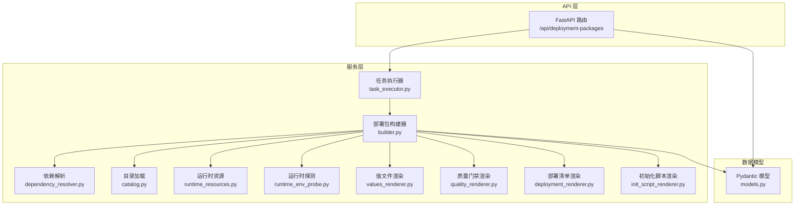
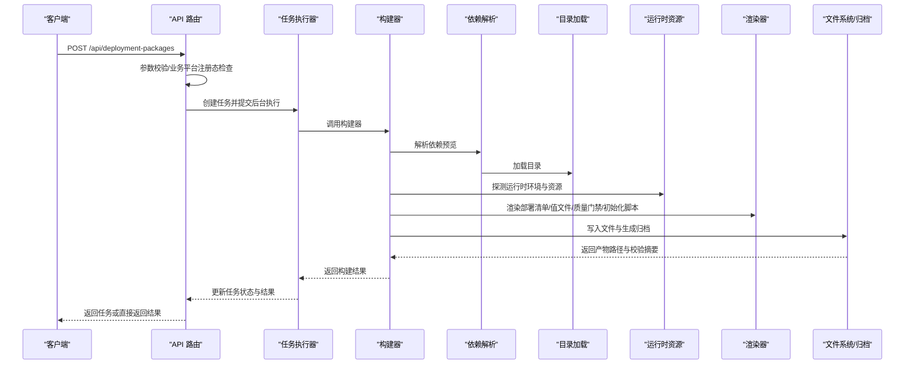
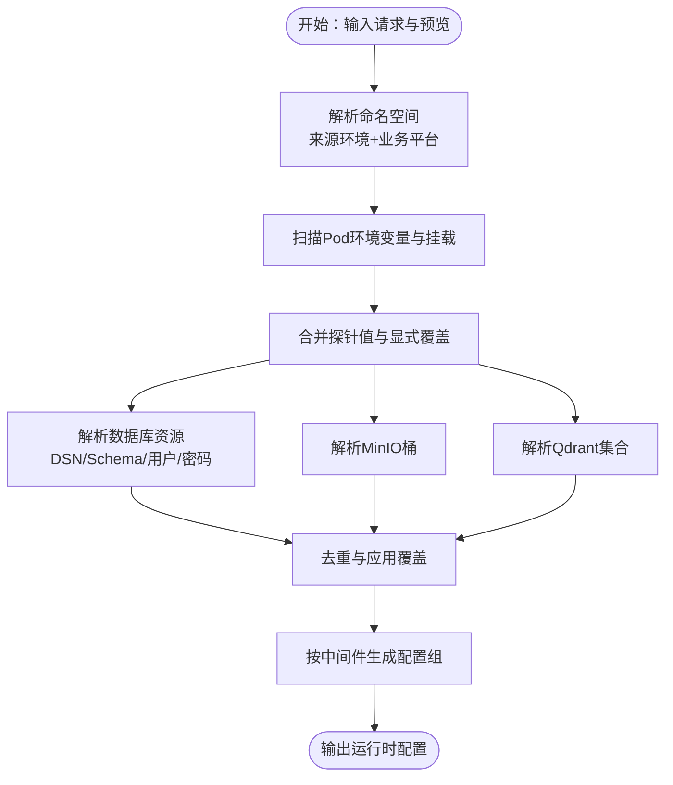
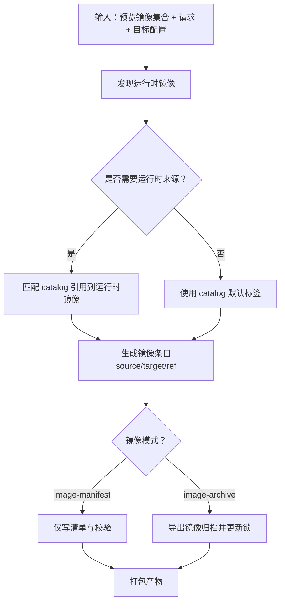
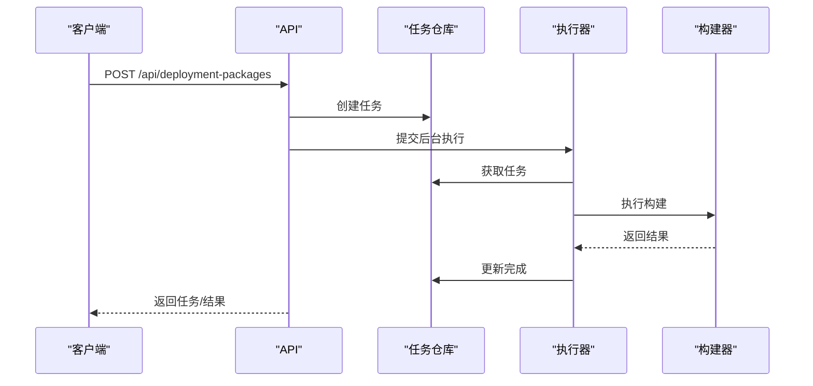
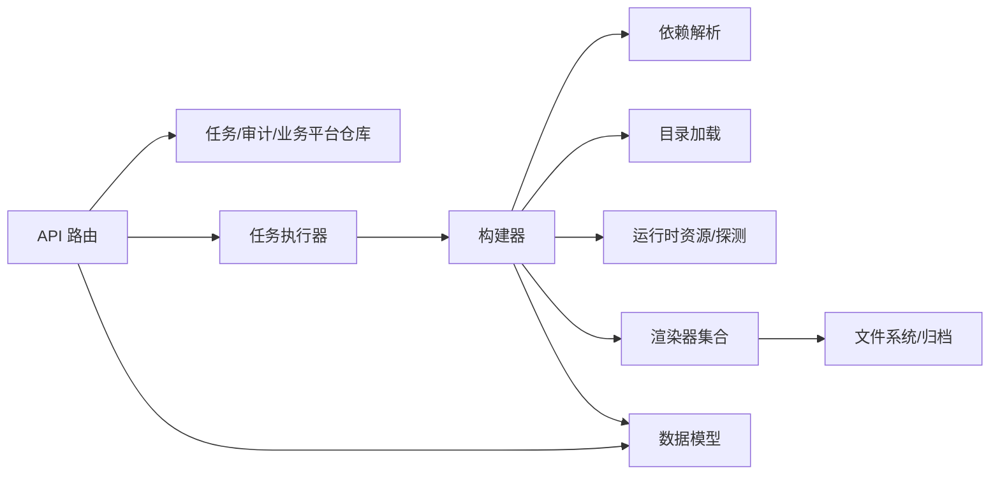

# 部署包生成

<cite>
**本文引用的文件**
- [backend/deployment_package_factory/services/deployment_packages/models.py](file://backend/deployment_package_factory/services/deployment_packages/models.py)
- [backend/deployment_package_factory/services/deployment_packages/catalog.py](file://backend/deployment_package_factory/services/deployment_packages/catalog.py)
- [backend/deployment_package_factory/services/deployment_packages/dependency_resolver.py](file://backend/deployment_package_factory/services/deployment_packages/dependency_resolver.py)
- [backend/deployment_package_factory/services/deployment_packages/builder.py](file://backend/deployment_package_factory/services/deployment_packages/builder.py)
- [backend/deployment_package_factory/services/deployment_packages/runtime_resources.py](file://backend/deployment_package_factory/services/deployment_packages/runtime_resources.py)
- [backend/deployment_package_factory/services/deployment_packages/runtime_env_probe.py](file://backend/deployment_package_factory/services/deployment_packages/runtime_env_probe.py)
- [backend/deployment_package_factory/services/deployment_packages/values_renderer.py](file://backend/deployment_package_factory/services/deployment_packages/values_renderer.py)
- [backend/deployment_package_factory/services/deployment_packages/quality_renderer.py](file://backend/deployment_package_factory/services/deployment_packages/quality_renderer.py)
- [backend/deployment_package_factory/services/deployment_packages/deployment_renderer.py](file://backend/deployment_package_factory/services/deployment_packages/deployment_renderer.py)
- [backend/deployment_package_factory/services/deployment_packages/init_script_renderer.py](file://backend/deployment_package_factory/services/deployment_packages/init_script_renderer.py)
- [backend/deployment_package_factory/api/deployment_packages.py](file://backend/deployment_package_factory/api/deployment_packages.py)
- [backend/deployment_package_factory/services/deployment_packages/task_executor.py](file://backend/deployment_package_factory/services/deployment_packages/task_executor.py)
</cite>

## 目录
1. [简介](#简介)
2. [项目结构](#项目结构)
3. [核心组件](#核心组件)
4. [架构总览](#架构总览)
5. [详细组件分析](#详细组件分析)
6. [依赖关系分析](#依赖关系分析)
7. [性能考虑](#性能考虑)
8. [故障排查指南](#故障排查指南)
9. [结论](#结论)
10. [附录](#附录)

## 简介
本技术文档围绕“部署包生成”功能，系统性阐述从请求到产物的完整流程，包括模板选择机制、依赖解析算法、镜像导出策略、文件渲染系统、运行时环境探测、中间件配置解析与质量门禁检查机制。文档同时给出 PackageBuildRequest 数据模型、ProjectProfile 配置与 PackageBuildResult 结果结构的权威说明，并提供配置项、性能优化建议、错误处理策略与调试技巧，以及调用构建器 API 与处理结果的实际示例路径。

## 项目结构
后端采用分层与职责分离的设计：
- API 层：FastAPI 路由，负责鉴权、参数校验、任务编排与下载接口
- 服务层：部署包构建器、依赖解析、运行时资源探测、渲染器、质量门禁、任务执行器
- 数据模型层：Pydantic 模型定义请求、预览、构建结果与审计事件
- 渲染层：Kubernetes 与 Docker Compose 渲染、初始化脚本、值文件、质量门禁脚本

图表来源
- [backend/deployment_package_factory/api/deployment_packages.py](file://backend/deployment_package_factory/api/deployment_packages.py)
- [backend/deployment_package_factory/services/deployment_packages/builder.py](file://backend/deployment_package_factory/services/deployment_packages/builder.py)
- [backend/deployment_package_factory/services/deployment_packages/dependency_resolver.py](file://backend/deployment_package_factory/services/deployment_packages/dependency_resolver.py)
- [backend/deployment_package_factory/services/deployment_packages/catalog.py](file://backend/deployment_package_factory/services/deployment_packages/catalog.py)
- [backend/deployment_package_factory/services/deployment_packages/runtime_resources.py](file://backend/deployment_package_factory/services/deployment_packages/runtime_resources.py)
- [backend/deployment_package_factory/services/deployment_packages/runtime_env_probe.py](file://backend/deployment_package_factory/services/deployment_packages/runtime_env_probe.py)
- [backend/deployment_package_factory/services/deployment_packages/values_renderer.py](file://backend/deployment_package_factory/services/deployment_packages/values_renderer.py)
- [backend/deployment_package_factory/services/deployment_packages/quality_renderer.py](file://backend/deployment_package_factory/services/deployment_packages/quality_renderer.py)
- [backend/deployment_package_factory/services/deployment_packages/deployment_renderer.py](file://backend/deployment_package_factory/services/deployment_packages/deployment_renderer.py)
- [backend/deployment_package_factory/services/deployment_packages/init_script_renderer.py](file://backend/deployment_package_factory/services/deployment_packages/init_script_renderer.py)
- [backend/deployment_package_factory/services/deployment_packages/task_executor.py](file://backend/deployment_package_factory/services/deployment_packages/task_executor.py)
- [backend/deployment_package_factory/services/deployment_packages/models.py](file://backend/deployment_package_factory/services/deployment_packages/models.py)

章节来源
- [backend/deployment_package_factory/api/deployment_packages.py](file://backend/deployment_package_factory/api/deployment_packages.py)
- [backend/deployment_package_factory/services/deployment_packages/builder.py](file://backend/deployment_package_factory/services/deployment_packages/builder.py)

## 核心组件
- PackageBuildRequest：构建请求模型，包含项目键、产品版本、来源环境、部署模式、平台/业务服务、数据库、目标配置、镜像模式与运行时覆盖等
- ProjectProfile：项目配置，含默认源环境、默认部署模式、默认平台/业务服务、默认数据库、镜像仓库、命名空间前缀、域名、存储类、镜像标签与覆盖层
- PackageBuildResult：构建结果，包含包 ID、工作目录、产物路径、校验摘要、SHA256、公开清单等
- PackagePreview：预览结果，包含平台/业务/中间件依赖、数据库、镜像集合、镜像条目、运行时配置与告警
- TargetProfile：目标环境配置，含环境、域名、源/目标镜像仓库、命名空间前缀、存储类与导出镜像开关

章节来源
- [backend/deployment_package_factory/services/deployment_packages/models.py](file://backend/deployment_package_factory/services/deployment_packages/models.py)

## 架构总览
部署包生成的端到端流程如下：

图表来源
- [backend/deployment_package_factory/api/deployment_packages.py](file://backend/deployment_package_factory/api/deployment_packages.py)
- [backend/deployment_package_factory/services/deployment_packages/task_executor.py](file://backend/deployment_package_factory/services/deployment_packages/task_executor.py)
- [backend/deployment_package_factory/services/deployment_packages/builder.py](file://backend/deployment_package_factory/services/deployment_packages/builder.py)
- [backend/deployment_package_factory/services/deployment_packages/dependency_resolver.py](file://backend/deployment_package_factory/services/deployment_packages/dependency_resolver.py)
- [backend/deployment_package_factory/services/deployment_packages/catalog.py](file://backend/deployment_package_factory/services/deployment_packages/catalog.py)
- [backend/deployment_package_factory/services/deployment_packages/runtime_resources.py](file://backend/deployment_package_factory/services/deployment_packages/runtime_resources.py)
- [backend/deployment_package_factory/services/deployment_packages/deployment_renderer.py](file://backend/deployment_package_factory/services/deployment_packages/deployment_renderer.py)
- [backend/deployment_package_factory/services/deployment_packages/values_renderer.py](file://backend/deployment_package_factory/services/deployment_packages/values_renderer.py)
- [backend/deployment_package_factory/services/deployment_packages/quality_renderer.py](file://backend/deployment_package_factory/services/deployment_packages/quality_renderer.py)
- [backend/deployment_package_factory/services/deployment_packages/init_script_renderer.py](file://backend/deployment_package_factory/services/deployment_packages/init_script_renderer.py)

## 详细组件分析

### 组件一：模板选择与目录加载（Catalog）
- 目录文件组织：platform.yaml、business.yaml、middleware.yaml、dependency-rules.yaml、projects.yaml
- 校验规则：平台与业务键不重叠、数据库选项非空、依赖键合法、项目默认值与允许集约束
- 运行时项目注入：通过 with_runtime_projects 将业务平台注册态合并入目录

章节来源
- [backend/deployment_package_factory/services/deployment_packages/catalog.py](file://backend/deployment_package_factory/services/deployment_packages/catalog.py)

### 组件二：依赖解析算法（DependencyResolver）
- 输入：PackagePreviewRequest + DeploymentCatalog
- 步骤：
  - 应用项目默认值与产品版本约束
  - 校验数据库选项与依赖规则
  - 收集用户选择的业务服务，扩展其依赖平台与中间件
  - 广度优先扩展平台依赖链
  - 扩展中间件依赖（递归）
  - 将数据库键映射为具体数据库选项
  - 计算镜像集合（平台/业务/中间件/支持镜像）
  - 生成告警（如未选择核心业务、国产化数据库提示）
- 输出：PackagePreview（含依赖列表、镜像字典、运行时配置占位）

复杂度分析
- 时间复杂度：O(B + P + M + R)，B/P/M/R 分别为业务、平台、中间件、依赖关系数量；主要瓶颈在依赖闭包扩展
- 空间复杂度：O(B + P + M + R)

章节来源
- [backend/deployment_package_factory/services/deployment_packages/dependency_resolver.py](file://backend/deployment_package_factory/services/deployment_packages/dependency_resolver.py)

### 组件三：运行时环境探测与资源解析（RuntimeResources + RuntimeEnvProbe）
- 探测来源环境命名空间与业务平台命名空间
- 从 Pod 的 envFrom/env/volumeMounts 解析运行时环境变量与挂载
- 合并探针值、显式覆盖与目录模板，生成运行时配置组与资源清单
- 自动推断数据库 Schema、MinIO Bucket、Qdrant Collection 等资源

图表来源
- [backend/deployment_package_factory/services/deployment_packages/runtime_env_probe.py](file://backend/deployment_package_factory/services/deployment_packages/runtime_env_probe.py)
- [backend/deployment_package_factory/services/deployment_packages/runtime_resources.py](file://backend/deployment_package_factory/services/deployment_packages/runtime_resources.py)

章节来源
- [backend/deployment_package_factory/services/deployment_packages/runtime_env_probe.py](file://backend/deployment_package_factory/services/deployment_packages/runtime_env_probe.py)
- [backend/deployment_package_factory/services/deployment_packages/runtime_resources.py](file://backend/deployment_package_factory/services/deployment_packages/runtime_resources.py)

### 组件四：镜像导出策略（Builder）
- 镜像模式：
  - image-manifest：仅生成清单与校验文件，不导出镜像
  - image-archive：导出镜像归档并写入安全锁文件
- 导出环境检测：优先 skopeo（daemonless），其次 Docker CLI（需 daemon）
- 运行时镜像发现：基于 Kubernetes ServiceAccount Token 列举 Pod，匹配 catalog 引用
- 镜像条目生成：计算 sourceRef/sourceExportRef/targetRef，生成 images.txt 与归档锁
- 归档导出：保存/加载/拉取脚本生成，支持离线部署

图表来源
- [backend/deployment_package_factory/services/deployment_packages/builder.py](file://backend/deployment_package_factory/services/deployment_packages/builder.py)

章节来源
- [backend/deployment_package_factory/services/deployment_packages/builder.py](file://backend/deployment_package_factory/services/deployment_packages/builder.py)

### 组件五：文件渲染系统（多渲染器）
- 值文件渲染（deploy-values.json）：封装命名空间、K8s 层、服务、中间件、镜像与验证摘要
- 部署清单渲染（K8s/Docker Compose）：按层生成资源清单、安装/卸载/干跑脚本、健康检查、前置条件检查
- 初始化脚本渲染：根据数据库与中间件生成幂等初始化脚本与项目级 overlay
- 质量门禁渲染：跨平台质量门禁脚本与报告

章节来源
- [backend/deployment_package_factory/services/deployment_packages/values_renderer.py](file://backend/deployment_package_factory/services/deployment_packages/values_renderer.py)
- [backend/deployment_package_factory/services/deployment_packages/deployment_renderer.py](file://backend/deployment_package_factory/services/deployment_packages/deployment_renderer.py)
- [backend/deployment_package_factory/services/deployment_packages/init_script_renderer.py](file://backend/deployment_package_factory/services/deployment_packages/init_script_renderer.py)
- [backend/deployment_package_factory/services/deployment_packages/quality_renderer.py](file://backend/deployment_package_factory/services/deployment_packages/quality_renderer.py)

### 组件六：API 与任务执行（API + TaskExecutor）
- API 提供：
  - GET /options：返回可用选项（环境、部署模式、平台/业务服务、数据库、中间件、微服务、项目）
  - POST /preview：返回预览（含镜像条目与运行时配置）
  - POST /：创建构建任务（支持后台执行）
  - GET /tasks、GET /tasks/{task_id}、POST /tasks/{task_id}/cancel、POST /tasks/{task_id}/retry
  - 下载与校验：/download、/checksum、/download-script.*
- 任务执行器：并发控制、心跳、异常兜底、取消处理

图表来源
- [backend/deployment_package_factory/api/deployment_packages.py](file://backend/deployment_package_factory/api/deployment_packages.py)
- [backend/deployment_package_factory/services/deployment_packages/task_executor.py](file://backend/deployment_package_factory/services/deployment_packages/task_executor.py)

章节来源
- [backend/deployment_package_factory/api/deployment_packages.py](file://backend/deployment_package_factory/api/deployment_packages.py)
- [backend/deployment_package_factory/services/deployment_packages/task_executor.py](file://backend/deployment_package_factory/services/deployment_packages/task_executor.py)

## 依赖关系分析
- 模块耦合
  - API 依赖任务仓库、审计仓库、业务平台仓库与微服务仓库
  - 构建器依赖目录、依赖解析、运行时资源、渲染器与 Kubernetes 运行时工具
  - 渲染器彼此独立，但共享 manifest 元数据
- 外部依赖
  - Kubernetes API（ServiceAccount Token、Pod/Secret/ConfigMap 读取）
  - Docker/skopeo（镜像导出）
  - 文件系统（临时目录、归档打包）

图表来源
- [backend/deployment_package_factory/api/deployment_packages.py](file://backend/deployment_package_factory/api/deployment_packages.py)
- [backend/deployment_package_factory/services/deployment_packages/builder.py](file://backend/deployment_package_factory/services/deployment_packages/builder.py)
- [backend/deployment_package_factory/services/deployment_packages/dependency_resolver.py](file://backend/deployment_package_factory/services/deployment_packages/dependency_resolver.py)
- [backend/deployment_package_factory/services/deployment_packages/catalog.py](file://backend/deployment_package_factory/services/deployment_packages/catalog.py)
- [backend/deployment_package_factory/services/deployment_packages/runtime_resources.py](file://backend/deployment_package_factory/services/deployment_packages/runtime_resources.py)
- [backend/deployment_package_factory/services/deployment_packages/deployment_renderer.py](file://backend/deployment_package_factory/services/deployment_packages/deployment_renderer.py)
- [backend/deployment_package_factory/services/deployment_packages/values_renderer.py](file://backend/deployment_package_factory/services/deployment_packages/values_renderer.py)
- [backend/deployment_package_factory/services/deployment_packages/quality_renderer.py](file://backend/deployment_package_factory/services/deployment_packages/quality_renderer.py)
- [backend/deployment_package_factory/services/deployment_packages/init_script_renderer.py](file://backend/deployment_package_factory/services/deployment_packages/init_script_renderer.py)
- [backend/deployment_package_factory/services/deployment_packages/models.py](file://backend/deployment_package_factory/services/deployment_packages/models.py)

## 性能考虑
- 并发与限流
  - 使用信号量限制并发构建数，避免资源争抢
  - 心跳机制保障长时间任务可观测性
- I/O 优化
  - 仅在需要时导出镜像归档，减少磁盘与网络压力
  - 生成 images.txt 与归档锁，便于离线部署与一致性校验
- 渲染与打包
  - 渲染阶段避免重复内容，使用公共模板与去重逻辑
  - 打包阶段过滤元数据，减少无关文件进入归档
- 磁盘空间预检
  - 前置脚本检查镜像归档是否存在与空间是否充足

## 故障排查指南
- 常见错误类型
  - CatalogError：目录校验失败（键冲突、未知依赖、数据库不允许）
  - PackageBuildError：构建期错误（如镜像引用为空、未知项目/版本）
  - KubernetesRuntimeError：K8s 资源读取失败（Token 缺失、权限不足）
- 错误处理策略
  - API 层统一捕获并返回 400/404/409 状态码
  - 任务执行器对异常进行标记失败或取消
  - 质量门禁脚本输出详细报告，定位失败原因
- 调试技巧
  - 查看任务日志与心跳记录
  - 使用质量门禁脚本逐项验证
  - 校验 images.txt 与归档锁一致性
  - 检查前置条件脚本输出与磁盘空间

章节来源
- [backend/deployment_package_factory/api/deployment_packages.py](file://backend/deployment_package_factory/api/deployment_packages.py)
- [backend/deployment_package_factory/services/deployment_packages/task_executor.py](file://backend/deployment_package_factory/services/deployment_packages/task_executor.py)
- [backend/deployment_package_factory/services/deployment_packages/quality_renderer.py](file://backend/deployment_package_factory/services/deployment_packages/quality_renderer.py)

## 结论
部署包生成以“目录—依赖—运行时—渲染—导出”的流水线为核心，通过严格的目录校验、完备的运行时探测与多渲染器体系，确保产物在不同部署模式下的一致性与可审计性。配合质量门禁与任务执行器，实现可观察、可回滚、可并行的工程化交付。

## 附录

### 数据模型与字段说明
- PackageBuildRequest
  - 关键字段：projectKey、productVersion、sourceEnv、deployModes、platformServices、businessServices、database、targetProfile、imageMode、runtimeConfigOverrides
  - 规范化：normalized_for_create 与 with_image_archive 控制镜像模式
- ProjectProfile
  - 关键字段：defaultSourceEnv、defaultDeployModes、defaultPlatformServices、defaultBusinessServices、defaultDatabase、registry、namespacePrefix、domain、storageClass、imageTag、overlays
- PackageBuildResult
  - 关键字段：packageId、workDir、artifactPath、checksumPath、artifactSize、validationSummary、sha256、manifest
- PackagePreview
  - 关键字段：platformServices、businessServices、middleware、database、images、imageEntries、runtimeConfig、warnings
- TargetProfile
  - 关键字段：env、domain、sourceRegistry、sourceRegistryInsecure、registry、namespacePrefix、storageClass、exportImages

章节来源
- [backend/deployment_package_factory/services/deployment_packages/models.py](file://backend/deployment_package_factory/services/deployment_packages/models.py)

### 配置选项与行为
- 镜像模式
  - image-manifest：仅生成清单与校验文件
  - image-archive：导出镜像归档并写入安全锁
- 目标配置
  - exportImages：强制导出镜像归档
  - sourceRegistry/sourceRegistryInsecure：影响镜像引用与 TLS 校验
- 并发与保留策略
  - max_concurrent_builds：最大并发构建数
  - retention_days/max_total_gb：清理保留策略

章节来源
- [backend/deployment_package_factory/api/deployment_packages.py](file://backend/deployment_package_factory/api/deployment_packages.py)
- [backend/deployment_package_factory/services/deployment_packages/models.py](file://backend/deployment_package_factory/services/deployment_packages/models.py)

### 实际调用示例（示例路径）
- 预览部署包
  - POST /api/deployment-packages/preview
  - 请求体：PackagePreviewRequest
  - 响应体：PackagePreview
- 创建部署包（后台）
  - POST /api/deployment-packages
  - 请求体：PackageBuildRequest
  - 响应体：PackageTask
- 查询任务
  - GET /api/deployment-packages/tasks/{task_id}
- 下载产物
  - GET /api/deployment-packages/{package_id}/download
  - HEAD /api/deployment-packages/{package_id}/download
  - GET /api/deployment-packages/{package_id}/checksum
- 下载脚本
  - GET /api/deployment-packages/{package_id}/download-script.sh
  - GET /api/deployment-packages/{package_id}/download-script.ps1

章节来源
- [backend/deployment_package_factory/api/deployment_packages.py](file://backend/deployment_package_factory/api/deployment_packages.py)