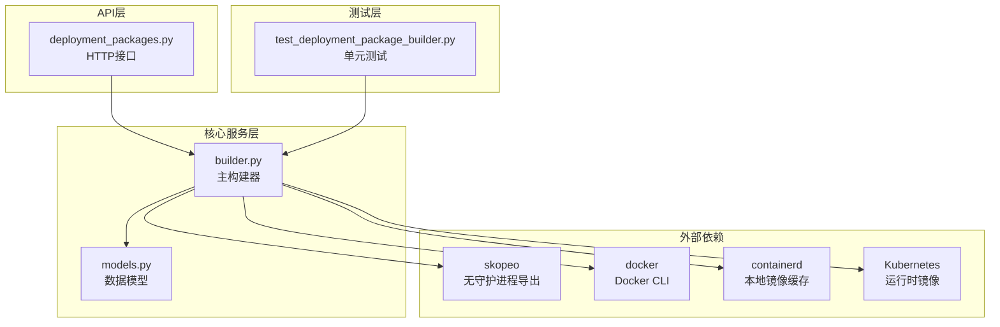
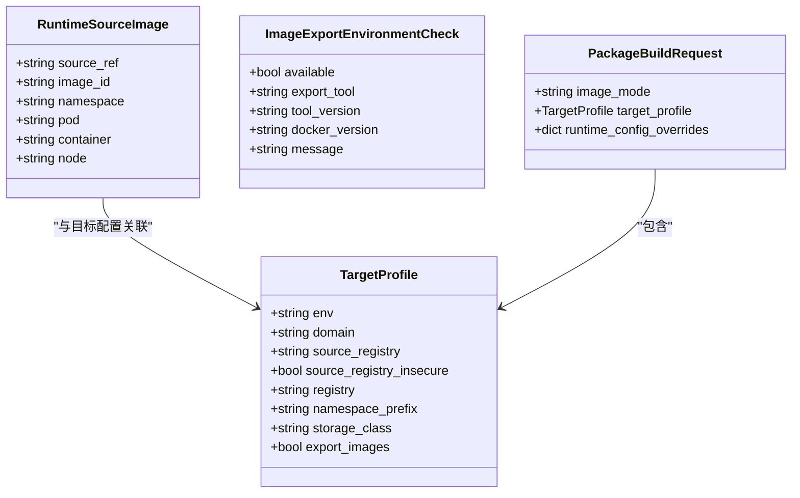
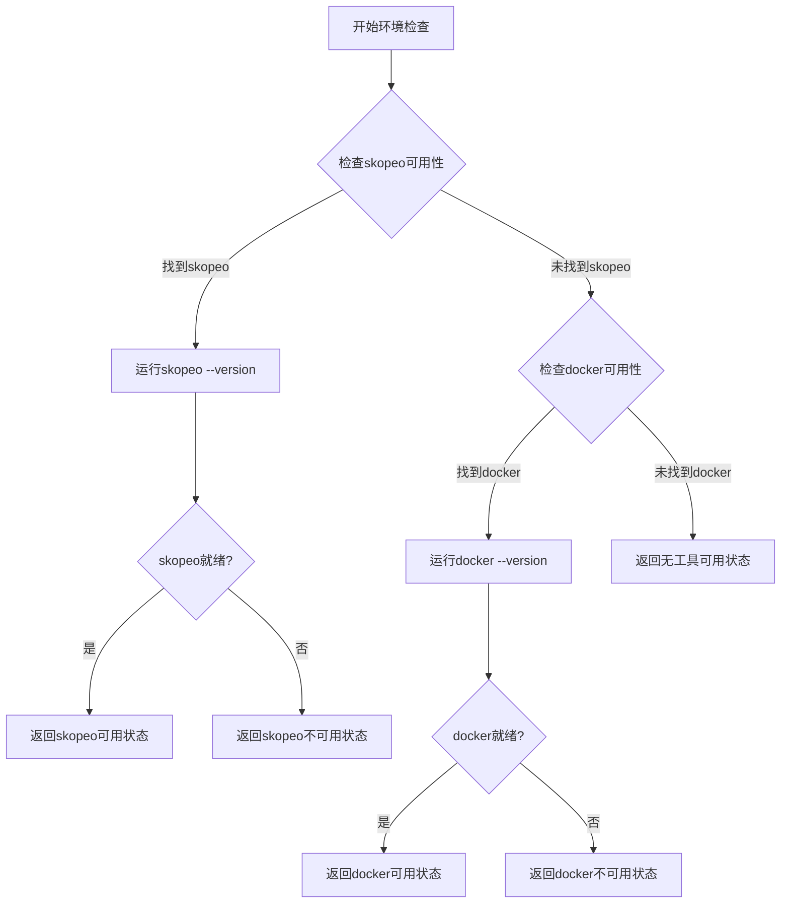
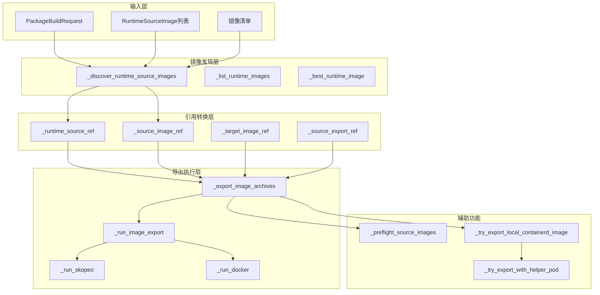
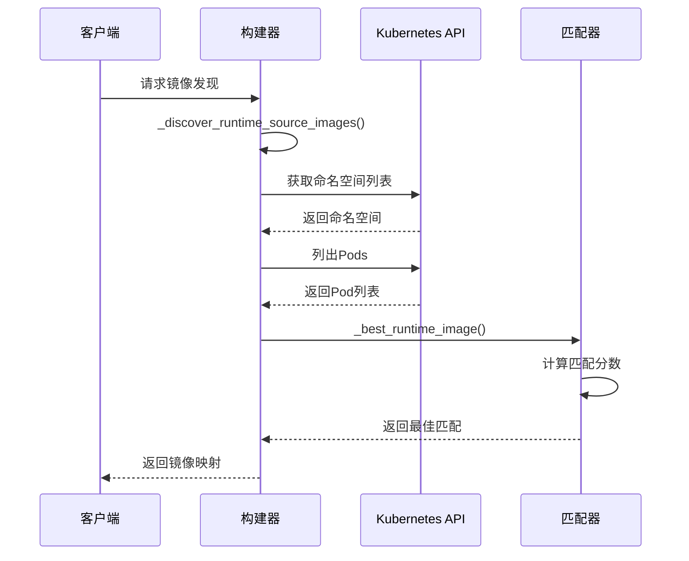
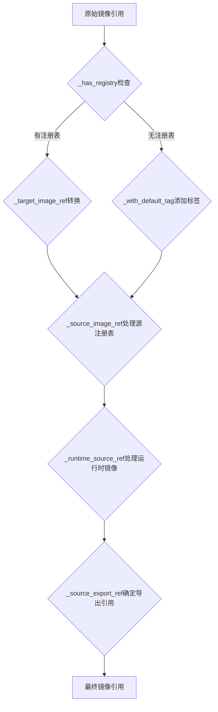
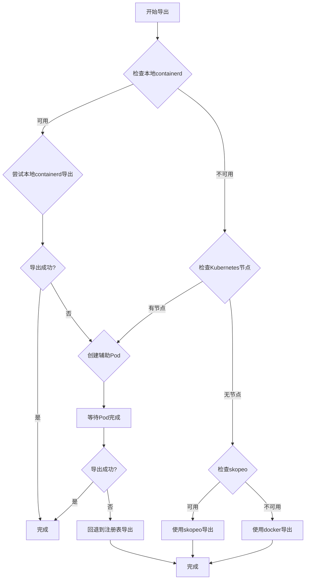
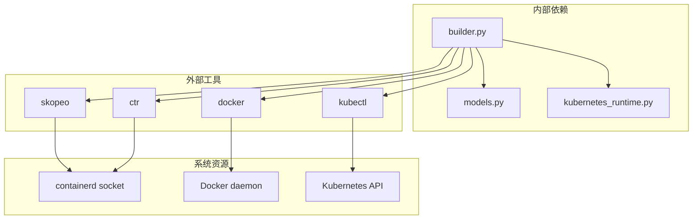

# 镜像导出机制

<cite>
**本文档引用的文件**
- [builder.py](file://backend/deployment_package_factory/services/deployment_packages/builder.py)
- [models.py](file://backend/deployment_package_factory/services/deployment_packages/models.py)
- [deployment_packages.py](file://backend/deployment_package_factory/api/deployment_packages.py)
- [test_deployment_package_builder.py](file://backend/tests/test_deployment_package_builder.py)
</cite>

## 目录
1. [简介](#简介)
2. [项目结构](#项目结构)
3. [核心组件](#核心组件)
4. [架构概览](#架构概览)
5. [详细组件分析](#详细组件分析)
6. [依赖关系分析](#依赖关系分析)
7. [性能考虑](#性能考虑)
8. [故障排除指南](#故障排除指南)
9. [结论](#结论)
10. [附录](#附录)

## 简介

部署包工厂的镜像导出机制是一个复杂的多阶段系统，负责从生产环境提取容器镜像并生成可部署的打包文件。该机制支持两种主要的镜像导出模式：镜像清单模式和镜像归档模式，并提供了智能的镜像发现和最佳匹配策略。

该系统的核心目标是在不直接访问源环境的情况下，通过多种途径获取所需的容器镜像，包括：
- Kubernetes运行时镜像的直接导出
- 私有注册表的镜像复制
- Docker守护进程的镜像保存
- 本地containerd缓存的镜像导出

## 项目结构

镜像导出机制主要分布在以下文件中：



**图表来源**
- [builder.py:146-246](file://backend/deployment_package_factory/services/deployment_packages/builder.py#L146-L246)
- [models.py:135-143](file://backend/deployment_package_factory/services/deployment_packages/models.py#L135-L143)

**章节来源**
- [builder.py:1-800](file://backend/deployment_package_factory/services/deployment_packages/builder.py#L1-L800)
- [models.py:1-251](file://backend/deployment_package_factory/services/deployment_packages/models.py#L1-L251)

## 核心组件

### RuntimeSourceImage 数据结构

RuntimeSourceImage 是镜像导出机制的核心数据结构，用于描述从Kubernetes运行时环境中发现的镜像信息：



**图表来源**
- [builder.py:95-103](file://backend/deployment_package_factory/services/deployment_packages/builder.py#L95-L103)
- [models.py:135-143](file://backend/deployment_package_factory/services/deployment_packages/models.py#L135-L143)
- [models.py:91-101](file://backend/deployment_package_factory/services/deployment_packages/models.py#L91-L101)
- [models.py:115-133](file://backend/deployment_package_factory/services/deployment_packages/models.py#L115-L133)

### 镜像导出环境检查

check_image_export_environment 函数负责检测可用的镜像导出工具：



**图表来源**
- [builder.py:105-143](file://backend/deployment_package_factory/services/deployment_packages/builder.py#L105-L143)

**章节来源**
- [builder.py:95-143](file://backend/deployment_package_factory/services/deployment_packages/builder.py#L95-L143)
- [models.py:135-143](file://backend/deployment_package_factory/services/deployment_packages/models.py#L135-L143)

## 架构概览

镜像导出机制采用分层架构设计，支持多种导出策略：



**图表来源**
- [builder.py:494-517](file://backend/deployment_package_factory/services/deployment_packages/builder.py#L494-L517)
- [builder.py:618-655](file://backend/deployment_package_factory/services/deployment_packages/builder.py#L618-L655)
- [builder.py:669-679](file://backend/deployment_package_factory/services/deployment_packages/builder.py#L669-L679)
- [builder.py:719-747](file://backend/deployment_package_factory/services/deployment_packages/builder.py#L719-L747)
- [builder.py:837-874](file://backend/deployment_package_factory/services/deployment_packages/builder.py#L837-L874)

## 详细组件分析

### 镜像发现算法

镜像发现算法采用智能匹配策略，优先从Kubernetes运行时环境中发现镜像：



**图表来源**
- [builder.py:494-517](file://backend/deployment_package_factory/services/deployment_packages/builder.py#L494-L517)
- [builder.py:618-655](file://backend/deployment_package_factory/services/deployment_packages/builder.py#L618-L655)
- [builder.py:669-679](file://backend/deployment_package_factory/services/deployment_packages/builder.py#L669-L679)

#### 最佳匹配策略

最佳匹配策略基于多级评分机制：

| 匹配级别 | 条件 | 分数 | 描述 |
|---------|------|------|------|
| 100分 | 完全路径匹配 | 100 | 完整镜像路径完全相同 |
| 80分 | 基础名称匹配 | 80 | 镜像基础名称相同 |
| 70分 | 前缀本地AI匹配 | 70 | 运行时镜像带有local-ai前缀 |
| 60分 | 反向前缀匹配 | 60 | catalog镜像带有local-ai前缀 |

**章节来源**
- [builder.py:669-695](file://backend/deployment_package_factory/services/deployment_packages/builder.py#L669-L695)

### 镜像引用转换机制

镜像引用转换机制确保镜像在不同环境间的正确映射：



**图表来源**
- [builder.py:719-779](file://backend/deployment_package_factory/services/deployment_packages/builder.py#L719-L779)

#### 关键转换函数

1. **_runtime_source_ref**: 处理运行时镜像的源引用
2. **_source_image_ref**: 处理源注册表的镜像引用  
3. **_target_image_ref**: 处理目标注册表的镜像引用
4. **_source_export_ref**: 确定实际导出使用的镜像引用

**章节来源**
- [builder.py:719-779](file://backend/deployment_package_factory/services/deployment_packages/builder.py#L719-L779)

### 导出策略执行

导出策略采用多层次优先级：



**图表来源**
- [builder.py:837-874](file://backend/deployment_package_factory/services/deployment_packages/builder.py#L837-L874)
- [builder.py:983-1057](file://backend/deployment_package_factory/services/deployment_packages/builder.py#L983-L1057)

**章节来源**
- [builder.py:837-1057](file://backend/deployment_package_factory/services/deployment_packages/builder.py#L837-L1057)

## 依赖关系分析

镜像导出机制的依赖关系复杂且层次分明：



**图表来源**
- [builder.py:36-46](file://backend/deployment_package_factory/services/deployment_packages/builder.py#L36-L46)
- [builder.py:105-143](file://backend/deployment_package_factory/services/deployment_packages/builder.py#L105-L143)

**章节来源**
- [builder.py:1-800](file://backend/deployment_package_factory/services/deployment_packages/builder.py#L1-L800)

## 性能考虑

### 导出策略优化

1. **本地优先策略**: 优先使用本地containerd缓存，避免网络传输
2. **并行导出**: 支持多个镜像同时导出以提高效率
3. **预检机制**: 在导出前验证镜像可用性，避免失败重试
4. **缓存利用**: 充分利用运行时环境中的现有镜像

### 内存和存储优化

- 使用流式处理避免大镜像占用过多内存
- 临时文件清理机制防止磁盘空间浪费
- 增量导出避免重复下载相同镜像

### 网络优化

- 智能TLS验证配置减少不必要的证书验证
- 支持私有网络自动识别和安全处理
- 注册表认证文件的安全管理

## 故障排除指南

### 常见问题诊断

1. **工具不可用错误**
   - 检查skopeo或docker是否正确安装
   - 验证工具版本兼容性
   - 确认必要的权限设置

2. **Kubernetes连接问题**
   - 验证kubeconfig配置
   - 检查RBAC权限设置
   - 确认集群可达性

3. **镜像导出失败**
   - 检查镜像是否存在且可访问
   - 验证网络连接和防火墙设置
   - 确认目标存储空间充足

### 调试技巧

- 启用详细日志记录
- 使用预检功能验证环境
- 检查临时文件和清理状态
- 验证镜像完整性校验

**章节来源**
- [test_deployment_package_builder.py:1102-1156](file://backend/tests/test_deployment_package_builder.py#L1102-L1156)
- [test_deployment_package_builder.py:1337-1375](file://backend/tests/test_deployment_package_builder.py#L1337-L1375)

## 结论

部署包工厂的镜像导出机制是一个高度成熟和可靠的系统，具有以下特点：

1. **多策略支持**: 提供多种镜像导出策略以适应不同的部署场景
2. **智能发现**: 自动发现和匹配运行时环境中的镜像
3. **灵活配置**: 支持丰富的配置选项以满足各种需求
4. **高可靠性**: 完善的错误处理和故障恢复机制
5. **性能优化**: 多层次的性能优化策略确保高效运行

该机制为部署包工厂提供了强大的镜像管理能力，能够有效支持各种复杂的部署场景和要求。

## 附录

### API使用示例

以下是如何调用镜像导出API的示例：

**检查导出环境**
```python
# GET /api/deployment-packages/image-export-environment
response = requests.get(f"{BASE_URL}/api/deployment-packages/image-export-environment")
environment_status = response.json()
```

**创建部署包（包含镜像归档）**
```python
# POST /api/deployment-packages
payload = {
    "sourceEnv": "production",
    "deployModes": ["k8s"],
    "businessServices": [],
    "database": "postgres",
    "imageMode": "image-archive",
    "targetProfile": {
        "registry": "harbor.company.com/local-ai",
        "sourceRegistry": "internal.company.com/local-ai"
    }
}

response = requests.post(f"{BASE_URL}/api/deployment-packages", json=payload)
task_info = response.json()
```

**获取导出结果**
```python
# GET /api/deployment-packages/{package_id}
response = requests.get(f"{BASE_URL}/api/deployment-packages/{package_id}")
result = response.json()

# 下载打包文件
download_response = requests.get(f"{BASE_URL}/api/deployment-packages/{package_id}/download")
with open("deployment-package.tar.gz", "wb") as f:
    f.write(download_response.content)
```

### 配置选项详解

| 配置项 | 类型 | 默认值 | 描述 |
|--------|------|--------|------|
| DEPLOYMENT_PACKAGE_LOCAL_IMAGE_EXPORT | string | "true" | 是否启用本地镜像导出 |
| DEPLOYMENT_PACKAGE_CONTAINERD_SOCKET | string | "/run/containerd/containerd.sock" | containerd套接字路径 |
| DEPLOYMENT_PACKAGE_IMAGE_EXPORT_HELPER_IMAGE | string | "" | 辅助Pod镜像 |
| DEPLOYMENT_PACKAGE_NAMESPACE | string | "deployment-package-factory" | 默认命名空间 |
| DEPLOYMENT_PACKAGE_DATA_DIR | string | "/app/data" | 数据目录挂载点 |
| DEPLOYMENT_PACKAGE_DATA_CLAIM | string | "deployment-package-factory-data" | PVC名称 |
| DEPLOYMENT_PACKAGE_SOURCE_REGISTRY_USERNAME | string | "" | 源注册表用户名 |
| DEPLOYMENT_PACKAGE_SOURCE_REGISTRY_PASSWORD | string | "" | 源注册表密码 |
| DEPLOYMENT_PACKAGE_INSECURE_REGISTRIES | string | "192.168.10.210" | 不安全注册表列表 |
| DEPLOYMENT_PACKAGE_IMAGE_EXPORT_HELPER_TIMEOUT_SECONDS | int | 300 | 辅助Pod超时时间 |

### 安全考虑

1. **认证安全**: 使用临时认证文件避免明文密码存储
2. **网络隔离**: 支持私有网络自动识别和安全处理
3. **权限控制**: 最小权限原则确保操作安全性
4. **审计日志**: 完整的操作记录便于安全审计
5. **数据加密**: 传输过程中的数据保护