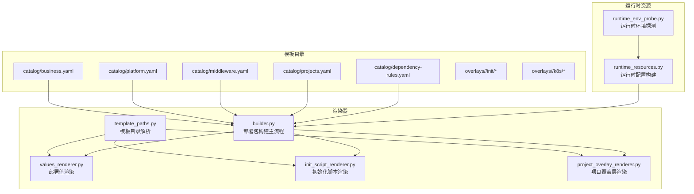
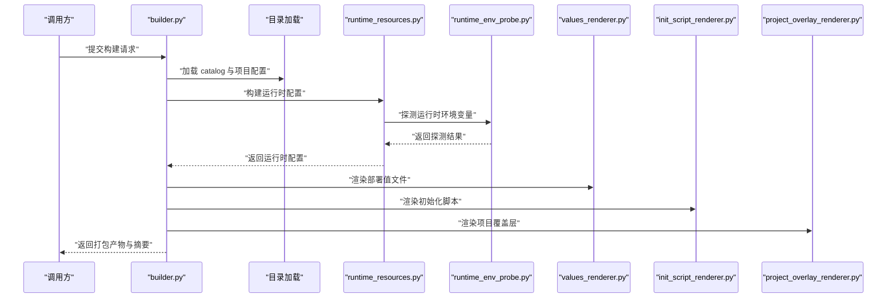
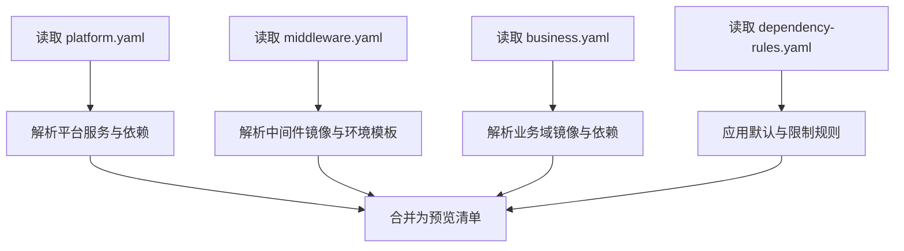
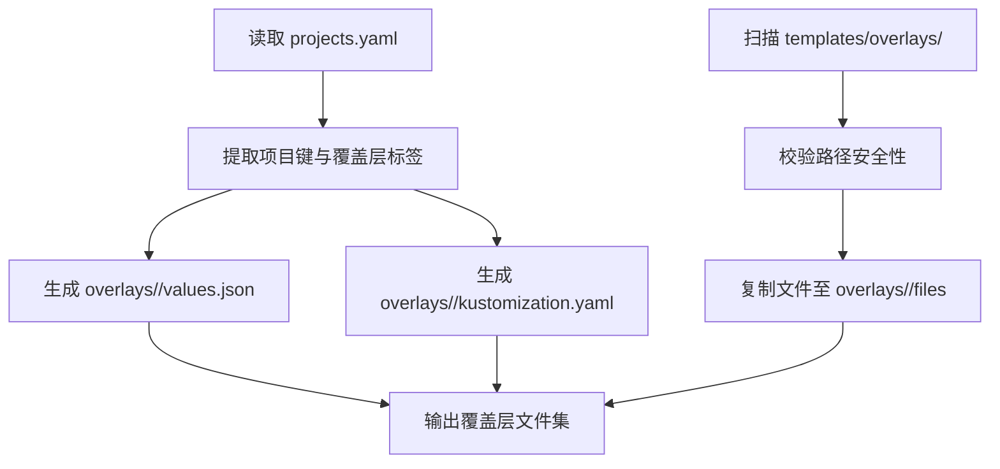
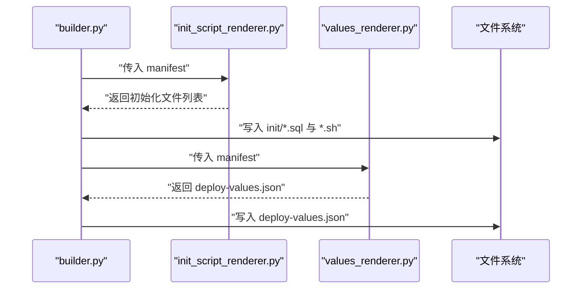
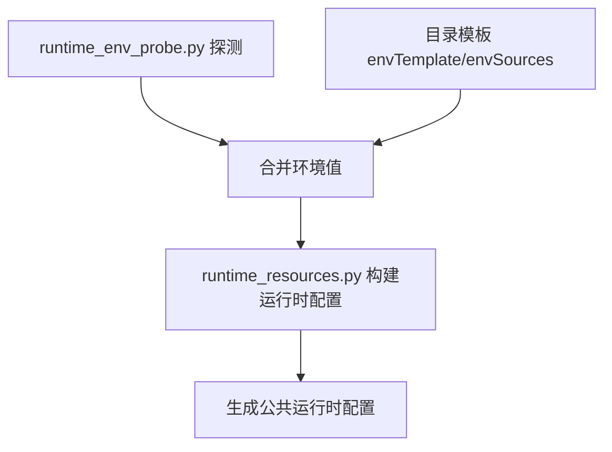
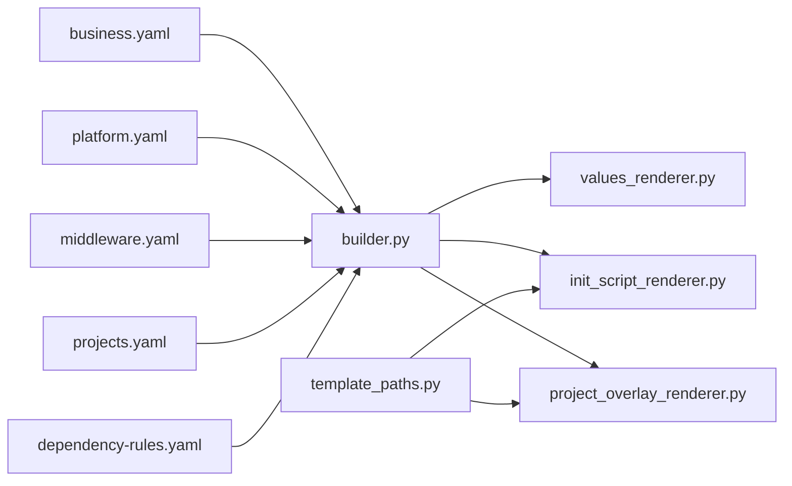

# 模板与目录系统

<cite>
**本文引用的文件**
- [business.yaml](file://templates/catalog/business.yaml)
- [middleware.yaml](file://templates/catalog/middleware.yaml)
- [platform.yaml](file://templates/catalog/platform.yaml)
- [projects.yaml](file://templates/catalog/projects.yaml)
- [dependency-rules.yaml](file://templates/catalog/dependency-rules.yaml)
- [builder.py](file://backend/deployment_package_factory/services/deployment_packages/builder.py)
- [template_paths.py](file://backend/deployment_package_factory/services/deployment_packages/template_paths.py)
- [project_overlay_renderer.py](file://backend/deployment_package_factory/services/deployment_packages/project_overlay_renderer.py)
- [values_renderer.py](file://backend/deployment_package_factory/services/deployment_packages/values_renderer.py)
- [init_script_renderer.py](file://backend/deployment_package_factory/services/deployment_packages/init_script_renderer.py)
- [runtime_resources.py](file://backend/deployment_package_factory/services/deployment_packages/runtime_resources.py)
- [runtime_env_probe.py](file://backend/deployment_package_factory/services/deployment_packages/runtime_env_probe.py)
- [scaffold.py](file://backend/deployment_package_factory/services/microservices/scaffold.py)
- [templates.py](file://backend/deployment_package_factory/services/microservices/templates.py)
- [templates_common.py](file://backend/deployment_package_factory/services/microservices/templates_common.py)
</cite>

## 目录
1. [简介](#简介)
2. [项目结构](#项目结构)
3. [核心组件](#核心组件)
4. [架构总览](#架构总览)
5. [详细组件分析](#详细组件分析)
6. [依赖关系分析](#依赖关系分析)
7. [性能考量](#性能考量)
8. [故障排查指南](#故障排查指南)
9. [结论](#结论)
10. [附录](#附录)

## 简介
本文件面向“部署包工厂”的模板与目录系统，系统性阐述模板结构设计、变量替换机制、覆盖层支持体系，以及业务平台目录、中间件目录与依赖规则的定义与使用。文档同时解释项目特定覆盖层（标准覆盖层与项目级覆盖层）的差异与场景，初始化脚本系统、模板渲染流程与文件生成策略，并给出模板开发指南、最佳实践与扩展方法。

## 项目结构
模板与目录系统由三部分组成：
- 模板目录：templates/catalog 与 templates/overlays
- 渲染器：部署包构建器与各类渲染器（值渲染、初始化脚本、项目覆盖层）
- 运行时资源探测：从源环境动态收集运行时配置与资源

图示来源
- [builder.py:146-246](file://backend/deployment_package_factory/services/deployment_packages/builder.py#L146-L246)
- [values_renderer.py:15-45](file://backend/deployment_package_factory/services/deployment_packages/values_renderer.py#L15-L45)
- [init_script_renderer.py:28-49](file://backend/deployment_package_factory/services/deployment_packages/init_script_renderer.py#L28-L49)
- [project_overlay_renderer.py:17-28](file://backend/deployment_package_factory/services/deployment_packages/project_overlay_renderer.py#L17-L28)
- [template_paths.py:7-30](file://backend/deployment_package_factory/services/deployment_packages/template_paths.py#L7-L30)
- [runtime_resources.py:25-52](file://backend/deployment_package_factory/services/deployment_packages/runtime_resources.py#L25-L52)
- [runtime_env_probe.py:14-39](file://backend/deployment_package_factory/services/deployment_packages/runtime_env_probe.py#L14-L39)

章节来源
- [business.yaml:1-60](file://templates/catalog/business.yaml#L1-L60)
- [platform.yaml:1-66](file://templates/catalog/platform.yaml#L1-L66)
- [middleware.yaml:1-283](file://templates/catalog/middleware.yaml#L1-L283)
- [projects.yaml:1-54](file://templates/catalog/projects.yaml#L1-L54)
- [dependency-rules.yaml:1-9](file://templates/catalog/dependency-rules.yaml#L1-L9)
- [builder.py:146-246](file://backend/deployment_package_factory/services/deployment_packages/builder.py#L146-L246)
- [template_paths.py:7-30](file://backend/deployment_package_factory/services/deployment_packages/template_paths.py#L7-L30)

## 核心组件
- 业务平台目录（platform.yaml）：定义平台服务（如 IAM、网关、文件文档、工作流、可观测性、审计）及其依赖与命名空间分组。
- 中间件目录（middleware.yaml）：定义数据库、Redis、MinIO、Qdrant、Camunda、IoTDB、Prometheus/Grafana 等中间件的镜像、端口、数据卷路径、环境模板与来源、健康检查等。
- 业务域目录（business.yaml）：定义业务域（如 EAM、MES、ERP、APS）的名称、命名空间组、profile、镜像列表、依赖与中间件。
- 项目目录（projects.yaml）：定义项目模板（如标准 EAM、MES 轻量），包含默认版本、默认部署模式、默认平台/业务服务、默认数据库、命名空间前缀、域名、存储类、镜像标签、覆盖层等。
- 依赖规则（dependency-rules.yaml）：定义默认平台服务与数据库允许项。
- 部署包构建器（builder.py）：加载目录、解析请求、计算预览、发现运行时镜像与业务镜像、构建运行时配置、渲染各类文件并打包。
- 值渲染器（values_renderer.py）：输出 deploy-values.json，组织命名空间、K8s 层、服务、中间件、镜像等信息。
- 初始化脚本渲染器（init_script_renderer.py）：根据数据库与中间件生成初始化脚本与入口脚本，并合并项目级 init 资产。
- 项目覆盖层渲染器（project_overlay_renderer.py）：输出 overlays/<project> 下的 README、values.json、kustomization.yaml 与模板文件。
- 模板目录解析（template_paths.py）：解析模板根目录、目录清单与覆盖层模板目录。
- 运行时资源（runtime_resources.py）：从探测结果与目录模板构建运行时配置与资源清单。
- 运行时环境探测（runtime_env_probe.py）：从 Pod、Secret、ConfigMap 提取环境变量，形成探测集合。

章节来源
- [platform.yaml:1-66](file://templates/catalog/platform.yaml#L1-L66)
- [middleware.yaml:1-283](file://templates/catalog/middleware.yaml#L1-L283)
- [business.yaml:1-60](file://templates/catalog/business.yaml#L1-L60)
- [projects.yaml:1-54](file://templates/catalog/projects.yaml#L1-L54)
- [dependency-rules.yaml:1-9](file://templates/catalog/dependency-rules.yaml#L1-L9)
- [builder.py:146-246](file://backend/deployment_package_factory/services/deployment_packages/builder.py#L146-L246)
- [values_renderer.py:15-45](file://backend/deployment_package_factory/services/deployment_packages/values_renderer.py#L15-L45)
- [init_script_renderer.py:28-49](file://backend/deployment_package_factory/services/deployment_packages/init_script_renderer.py#L28-L49)
- [project_overlay_renderer.py:17-28](file://backend/deployment_package_factory/services/deployment_packages/project_overlay_renderer.py#L17-L28)
- [template_paths.py:7-30](file://backend/deployment_package_factory/services/deployment_packages/template_paths.py#L7-L30)
- [runtime_resources.py:25-52](file://backend/deployment_package_factory/services/deployment_packages/runtime_resources.py#L25-L52)
- [runtime_env_probe.py:14-39](file://backend/deployment_package_factory/services/deployment_packages/runtime_env_probe.py#L14-L39)

## 架构总览
部署包构建流程以“目录定义 + 运行时探测 + 渲染输出”为核心，贯穿模板解析、变量替换、文件生成与打包。

图示来源
- [builder.py:146-246](file://backend/deployment_package_factory/services/deployment_packages/builder.py#L146-L246)
- [runtime_resources.py:25-52](file://backend/deployment_package_factory/services/deployment_packages/runtime_resources.py#L25-L52)
- [runtime_env_probe.py:14-39](file://backend/deployment_package_factory/services/deployment_packages/runtime_env_probe.py#L14-L39)
- [values_renderer.py:15-45](file://backend/deployment_package_factory/services/deployment_packages/values_renderer.py#L15-L45)
- [init_script_renderer.py:28-49](file://backend/deployment_package_factory/services/deployment_packages/init_script_renderer.py#L28-L49)
- [project_overlay_renderer.py:17-28](file://backend/deployment_package_factory/services/deployment_packages/project_overlay_renderer.py#L17-L28)

## 详细组件分析

### 业务平台目录与中间件目录
- 平台服务（platform.yaml）：定义必需平台服务（如 IAM、网关前端）与可选服务（如 AI-Agent、文件文档、工作流、审计、可观测性），并指定命名空间组与依赖关系。
- 中间件（middleware.yaml）：集中定义各中间件的镜像、端口、数据卷、环境模板与来源、健康检查、命令参数等；还包含数据库选项（dm/postgres）与默认密钥别名映射。
- 业务域（business.yaml）：定义业务域的 profile、镜像列表、依赖与中间件，用于组合部署。
- 依赖规则（dependency-rules.yaml）：约束默认平台服务与数据库选择范围。

图示来源
- [platform.yaml:1-66](file://templates/catalog/platform.yaml#L1-L66)
- [middleware.yaml:1-283](file://templates/catalog/middleware.yaml#L1-L283)
- [business.yaml:1-60](file://templates/catalog/business.yaml#L1-L60)
- [dependency-rules.yaml:1-9](file://templates/catalog/dependency-rules.yaml#L1-L9)

章节来源
- [platform.yaml:1-66](file://templates/catalog/platform.yaml#L1-L66)
- [middleware.yaml:1-283](file://templates/catalog/middleware.yaml#L1-L283)
- [business.yaml:1-60](file://templates/catalog/business.yaml#L1-L60)
- [dependency-rules.yaml:1-9](file://templates/catalog/dependency-rules.yaml#L1-L9)

### 项目模板与覆盖层
- 项目模板（projects.yaml）：定义项目键、默认版本、默认部署模式、默认平台/业务服务、默认数据库、命名空间前缀、域名、存储类、镜像标签与覆盖层标签。
- 标准覆盖层 vs 项目级覆盖层：
  - 标准覆盖层：通过项目模板中的 overlays 字段声明，作为 Kustomize 标签注入，用于通用增强（如标准 EAM 的 “standard”、MES 轻量的 “lite”）。
  - 项目级覆盖层：在 templates/overlays/<project> 下提供 init 脚本、K8s 补丁与业务资产，构建器将其复制到 overlays/<project>/files 并生成 values.json 与 kustomization.yaml。
- 覆盖层渲染器（project_overlay_renderer.py）：负责生成 README、values.json、kustomization.yaml 与模板文件列表，确保路径安全与相对模板根的约束。

图示来源
- [projects.yaml:1-54](file://templates/catalog/projects.yaml#L1-L54)
- [project_overlay_renderer.py:17-28](file://backend/deployment_package_factory/services/deployment_packages/project_overlay_renderer.py#L17-L28)
- [project_overlay_renderer.py:78-100](file://backend/deployment_package_factory/services/deployment_packages/project_overlay_renderer.py#L78-L100)

章节来源
- [projects.yaml:1-54](file://templates/catalog/projects.yaml#L1-L54)
- [project_overlay_renderer.py:17-28](file://backend/deployment_package_factory/services/deployment_packages/project_overlay_renderer.py#L17-L28)
- [project_overlay_renderer.py:78-100](file://backend/deployment_package_factory/services/deployment_packages/project_overlay_renderer.py#L78-L100)

### 初始化脚本系统与模板渲染
- 初始化脚本渲染器（init_script_renderer.py）：
  - 根据数据库类型生成占位 SQL（PostgreSQL/Dm）。
  - 根据中间件生成初始化脚本（MinIO 桶、Qdrant 集合、Camunda BPMN/DMN 部署）。
  - 生成统一入口脚本，按模式调度数据库/中间件初始化与项目级资产处理。
  - 支持从 templates/overlays/<project>/init 复制项目级 init 资产。
- 值渲染器（values_renderer.py）：输出 deploy-values.json，包含命名空间、K8s 层、服务、中间件、镜像与初始化路径等。

图示来源
- [init_script_renderer.py:28-49](file://backend/deployment_package_factory/services/deployment_packages/init_script_renderer.py#L28-L49)
- [values_renderer.py:15-45](file://backend/deployment_package_factory/services/deployment_packages/values_renderer.py#L15-L45)
- [builder.py:196-204](file://backend/deployment_package_factory/services/deployment_packages/builder.py#L196-L204)

章节来源
- [init_script_renderer.py:28-49](file://backend/deployment_package_factory/services/deployment_packages/init_script_renderer.py#L28-L49)
- [init_script_renderer.py:28-127](file://backend/deployment_package_factory/services/deployment_packages/init_script_renderer.py#L28-L127)
- [values_renderer.py:15-45](file://backend/deployment_package_factory/services/deployment_packages/values_renderer.py#L15-L45)

### 运行时资源与变量替换
- 运行时资源（runtime_resources.py）：
  - 从探测结果与目录模板合并环境值，构建数据库、桶、集合等资源清单。
  - 将敏感值标记为机密，生成公共视图供展示。
- 运行时环境探测（runtime_env_probe.py）：
  - 遍历命名空间下的 Pod，解析容器 envFrom、env、挂载的 Secret/ConfigMap，提取环境变量。
  - 依据标签推断服务键，形成探测集合供配置构建使用。

图示来源
- [runtime_env_probe.py:14-39](file://backend/deployment_package_factory/services/deployment_packages/runtime_env_probe.py#L14-L39)
- [runtime_resources.py:25-52](file://backend/deployment_package_factory/services/deployment_packages/runtime_resources.py#L25-L52)

章节来源
- [runtime_resources.py:25-52](file://backend/deployment_package_factory/services/deployment_packages/runtime_resources.py#L25-L52)
- [runtime_env_probe.py:14-39](file://backend/deployment_package_factory/services/deployment_packages/runtime_env_probe.py#L14-L39)

### 微服务模板系统（扩展阅读）
- 微服务脚手架（scaffold.py）：根据技术栈与中间件生成标准化工程骨架，包含 Dockerfile、Helm Chart、Kubernetes YAML、CI/CD 脚本与测试文件。
- 通用模板（templates.py）：封装不同技术栈的文件生成逻辑，统一输出公共文件与特定文件。
- 模板文件模型（templates_common.py）：定义模板文件的数据结构。

章节来源
- [scaffold.py:231-288](file://backend/deployment_package_factory/services/microservices/scaffold.py#L231-L288)
- [templates.py:41-53](file://backend/deployment_package_factory/services/microservices/templates.py#L41-L53)
- [templates_common.py:7-11](file://backend/deployment_package_factory/services/microservices/templates_common.py#L7-L11)

## 依赖关系分析
- 目录依赖：platform.yaml 与 business.yaml 决定服务与镜像集合；middleware.yaml 提供中间件镜像与环境模板；dependency-rules.yaml 限定默认与允许项。
- 构建依赖：builder.py 依赖目录与运行时探测结果，生成 manifest；随后依赖各渲染器输出文件。
- 模板目录解析：template_paths.py 提供模板根目录解析，避免硬编码路径。

图示来源
- [business.yaml:1-60](file://templates/catalog/business.yaml#L1-L60)
- [platform.yaml:1-66](file://templates/catalog/platform.yaml#L1-L66)
- [middleware.yaml:1-283](file://templates/catalog/middleware.yaml#L1-L283)
- [projects.yaml:1-54](file://templates/catalog/projects.yaml#L1-L54)
- [dependency-rules.yaml:1-9](file://templates/catalog/dependency-rules.yaml#L1-L9)
- [builder.py:146-246](file://backend/deployment_package_factory/services/deployment_packages/builder.py#L146-L246)
- [values_renderer.py:15-45](file://backend/deployment_package_factory/services/deployment_packages/values_renderer.py#L15-L45)
- [init_script_renderer.py:28-49](file://backend/deployment_package_factory/services/deployment_packages/init_script_renderer.py#L28-L49)
- [project_overlay_renderer.py:17-28](file://backend/deployment_package_factory/services/deployment_packages/project_overlay_renderer.py#L17-L28)
- [template_paths.py:7-30](file://backend/deployment_package_factory/services/deployment_packages/template_paths.py#L7-L30)

章节来源
- [builder.py:146-246](file://backend/deployment_package_factory/services/deployment_packages/builder.py#L146-L246)
- [template_paths.py:7-30](file://backend/deployment_package_factory/services/deployment_packages/template_paths.py#L7-L30)

## 性能考量
- 镜像匹配与归档：构建器对运行时镜像进行评分匹配，优先选择同仓库或同基础镜像名的镜像，减少拉取与转换成本。
- 运行时环境探测：仅在存在服务账号令牌时启用，避免无意义的 API 访问。
- 文件生成：按需渲染，避免重复写入；使用归档锁与 SHA256 校验保证一致性与可追溯性。
- 资源去重：运行时资源配置与资源项去重，降低冗余与渲染复杂度。

## 故障排查指南
- 模板路径安全：覆盖层与项目 init 路径必须位于模板根下且不包含危险片段（如空段、当前/父目录），否则抛出异常。
- 环境变量来源：若目录模板未提供 envSources 或环境变量缺失，将回退到目录模板 envTemplate 的占位符，最终导致运行时缺失值。
- 数据库与中间件：若未在源环境中找到对应 Pod/Secret/ConfigMap，运行时探测为空，需手动补充或调整目录模板。
- 镜像导出工具：若缺少 skopeo 或 Docker，将影响镜像归档导出，需在工作节点安装相应工具。

章节来源
- [project_overlay_renderer.py:85-92](file://backend/deployment_package_factory/services/deployment_packages/project_overlay_renderer.py#L85-L92)
- [init_script_renderer.py:326-350](file://backend/deployment_package_factory/services/deployment_packages/init_script_renderer.py#L326-L350)
- [builder.py:105-143](file://backend/deployment_package_factory/services/deployment_packages/builder.py#L105-L143)
- [runtime_env_probe.py:14-39](file://backend/deployment_package_factory/services/deployment_packages/runtime_env_probe.py#L14-L39)

## 结论
模板与目录系统通过“目录定义 + 运行时探测 + 渲染输出”的闭环，实现了可配置、可扩展、可审计的部署包生成能力。项目级覆盖层与标准覆盖层协同，满足通用增强与定制化需求；初始化脚本与值渲染器确保交付物的可用性与一致性；运行时资源探测保障了配置的真实与可追溯。

## 附录

### 模板配置语法与变量定义规则
- 目录文件采用 YAML 结构，字段语义清晰：
  - 平台服务：name、required、namespaceGroup、images、dependsOn、middleware 等。
  - 中间件：name、image、port、dataPath、envTemplate、envSources、composeEnvironment、composeHealthcheck、k8sCommand/k8sArgs 等。
  - 业务域：name、namespaceGroup、profile、images、dependsOn、middleware 等。
  - 项目：name、description、defaultVersion、versions、defaultSourceEnv、defaultDeployModes、defaultPlatformServices、defaultBusinessServices、defaultDatabase、registry、namespacePrefix、domain、storageClass、imageTag、overlays 等。
  - 依赖规则：defaults.platform、database.allowed。
- 变量来源优先级：运行时探测 > 目录模板 envSources > 目录模板 envTemplate > 环境变量。
- 路径与安全：覆盖层与项目 init 路径必须相对模板根，且不得包含空段、当前/父目录。

章节来源
- [platform.yaml:1-66](file://templates/catalog/platform.yaml#L1-L66)
- [middleware.yaml:1-283](file://templates/catalog/middleware.yaml#L1-L283)
- [business.yaml:1-60](file://templates/catalog/business.yaml#L1-L60)
- [projects.yaml:1-54](file://templates/catalog/projects.yaml#L1-L54)
- [dependency-rules.yaml:1-9](file://templates/catalog/dependency-rules.yaml#L1-L9)
- [project_overlay_renderer.py:85-92](file://backend/deployment_package_factory/services/deployment_packages/project_overlay_renderer.py#L85-L92)
- [init_script_renderer.py:326-350](file://backend/deployment_package_factory/services/deployment_packages/init_script_renderer.py#L326-L350)

### 条件渲染与继承机制
- 条件渲染：根据数据库与中间件键选择性生成初始化脚本与值文件；K8s 层按中间件类型自动分层。
- 继承机制：项目模板继承目录定义，未显式设置的字段采用项目模板默认值；依赖规则限制默认平台与数据库选择。

章节来源
- [values_renderer.py:91-109](file://backend/deployment_package_factory/services/deployment_packages/values_renderer.py#L91-L109)
- [init_script_renderer.py:28-49](file://backend/deployment_package_factory/services/deployment_packages/init_script_renderer.py#L28-L49)
- [projects.yaml:1-54](file://templates/catalog/projects.yaml#L1-L54)
- [dependency-rules.yaml:1-9](file://templates/catalog/dependency-rules.yaml#L1-L9)

### 开发指南与最佳实践
- 创建新项目模板：在 projects.yaml 中新增条目，设置默认版本、部署模式、平台/业务服务、默认数据库与覆盖层标签。
- 定义中间件：在 middleware.yaml 中完善镜像、端口、数据卷、环境模板与来源、健康检查；必要时扩展 envSources 与别名映射。
- 使用覆盖层：在 templates/overlays/<project> 下添加 init 脚本、K8s 补丁与业务资产；通过 overlays 列表注入标准覆盖层标签。
- 变量管理：优先通过 envSources 指定密钥来源，避免在目录模板中直接暴露敏感值；利用运行时探测自动发现真实值。
- 扩展模板：遵循模板根目录规范，确保路径安全；在渲染器中增加必要的条件分支与文件生成逻辑。

章节来源
- [projects.yaml:1-54](file://templates/catalog/projects.yaml#L1-L54)
- [middleware.yaml:1-283](file://templates/catalog/middleware.yaml#L1-L283)
- [project_overlay_renderer.py:17-28](file://backend/deployment_package_factory/services/deployment_packages/project_overlay_renderer.py#L17-L28)
- [values_renderer.py:15-45](file://backend/deployment_package_factory/services/deployment_packages/values_renderer.py#L15-L45)
- [init_script_renderer.py:28-49](file://backend/deployment_package_factory/services/deployment_packages/init_script_renderer.py#L28-L49)