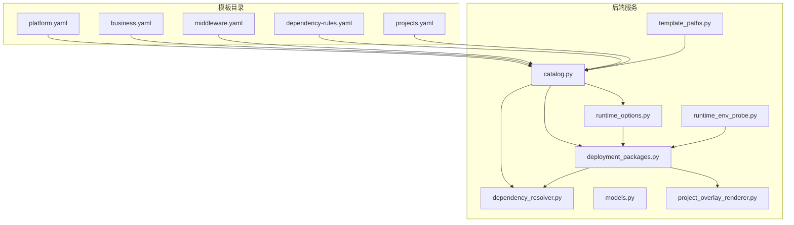
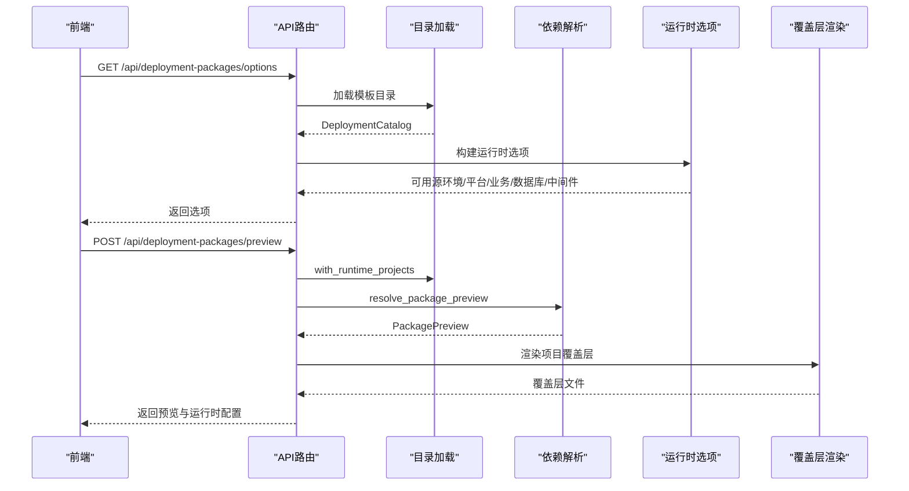
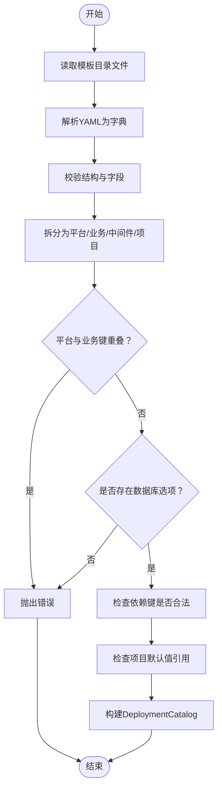
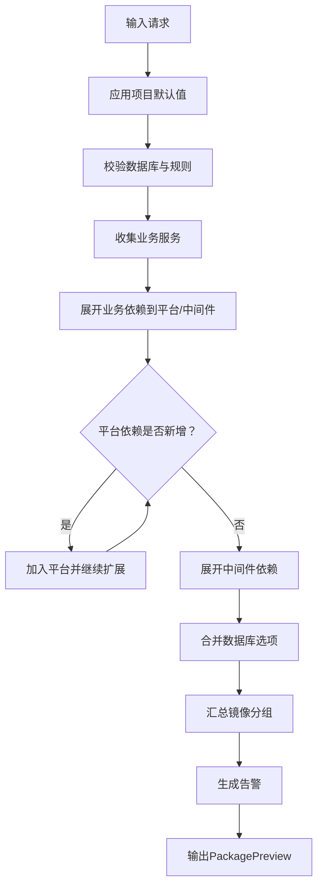
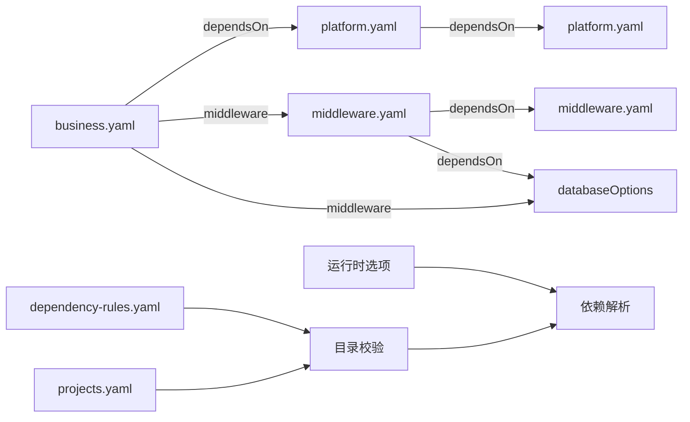

# 目录管理系统

<cite>
**本文档引用的文件**
- [catalog.py](file://backend/deployment_package_factory/services/deployment_packages/catalog.py)
- [dependency_resolver.py](file://backend/deployment_package_factory/services/deployment_packages/dependency_resolver.py)
- [models.py](file://backend/deployment_package_factory/services/deployment_packages/models.py)
- [platform.yaml](file://templates/catalog/platform.yaml)
- [business.yaml](file://templates/catalog/business.yaml)
- [middleware.yaml](file://templates/catalog/middleware.yaml)
- [dependency-rules.yaml](file://templates/catalog/dependency-rules.yaml)
- [projects.yaml](file://templates/catalog/projects.yaml)
- [template_paths.py](file://backend/deployment_package_factory/services/deployment_packages/template_paths.py)
- [deployment_packages.py](file://backend/deployment_package_factory/api/deployment_packages.py)
- [runtime_options.py](file://backend/deployment_package_factory/services/deployment_packages/runtime_options.py)
- [runtime_env_probe.py](file://backend/deployment_package_factory/services/deployment_packages/runtime_env_probe.py)
- [project_overlay_renderer.py](file://backend/deployment_package_factory/services/deployment_packages/project_overlay_renderer.py)
- [test_deployment_package_dependency_resolver.py](file://backend/tests/test_deployment_package_dependency_resolver.py)
</cite>

## 目录
1. [简介](#简介)
2. [项目结构](#项目结构)
3. [核心组件](#核心组件)
4. [架构总览](#架构总览)
5. [详细组件分析](#详细组件分析)
6. [依赖关系分析](#依赖关系分析)
7. [性能考虑](#性能考虑)
8. [故障排除指南](#故障排除指南)
9. [结论](#结论)
10. [附录](#附录)

## 简介
本文件面向部署包工厂目录管理系统，系统通过“平台目录”“业务目录”“中间件目录”三类目录定义可组合的部署能力，并以“依赖规则”约束服务间依赖、冲突与兼容性。系统支持从模板目录加载目录数据，进行校验与缓存；在构建前进行依赖解析与预览，确保所选平台、业务与中间件满足运行时要求；同时提供项目级配置与覆盖层渲染能力，便于按项目定制交付物。

## 项目结构
目录管理相关的核心代码位于后端服务模块中，模板目录位于 templates/catalog 下，前端通过 API 路由调用后端能力。

**图表来源**
- [template_paths.py:24-30](file://backend/deployment_package_factory/services/deployment_packages/template_paths.py#L24-L30)
- [catalog.py:44-79](file://backend/deployment_package_factory/services/deployment_packages/catalog.py#L44-L79)
- [dependency_resolver.py:14-94](file://backend/deployment_package_factory/services/deployment_packages/dependency_resolver.py#L14-L94)
- [models.py:56-65](file://backend/deployment_package_factory/services/deployment_packages/models.py#L56-L65)
- [deployment_packages.py:110-163](file://backend/deployment_package_factory/api/deployment_packages.py#L110-L163)
- [runtime_options.py:26-85](file://backend/deployment_package_factory/services/deployment_packages/runtime_options.py#L26-L85)
- [runtime_env_probe.py:14-39](file://backend/deployment_package_factory/services/deployment_packages/runtime_env_probe.py#L14-L39)
- [project_overlay_renderer.py:17-28](file://backend/deployment_package_factory/services/deployment_packages/project_overlay_renderer.py#L17-L28)

**章节来源**
- [template_paths.py:7-30](file://backend/deployment_package_factory/services/deployment_packages/template_paths.py#L7-L30)
- [catalog.py:44-79](file://backend/deployment_package_factory/services/deployment_packages/catalog.py#L44-L79)

## 核心组件
- 目录加载与校验：从模板目录读取 YAML 文件，解析为模型对象，执行完整性与一致性校验。
- 依赖解析：根据用户请求与项目默认值，计算应启用的平台、业务与中间件集合，展开传递依赖。
- 数据模型：统一描述目录项、项目配置、预览结果等数据结构。
- 运行时选项：基于实际运行环境动态生成可用的源环境、平台、业务、数据库与中间件选项。
- API 接口：提供目录选项查询、部署包预览、构建任务创建等接口。

**章节来源**
- [catalog.py:44-121](file://backend/deployment_package_factory/services/deployment_packages/catalog.py#L44-L121)
- [dependency_resolver.py:14-216](file://backend/deployment_package_factory/services/deployment_packages/dependency_resolver.py#L14-L216)
- [models.py:8-251](file://backend/deployment_package_factory/services/deployment_packages/models.py#L8-L251)
- [runtime_options.py:26-160](file://backend/deployment_package_factory/services/deployment_packages/runtime_options.py#L26-L160)
- [deployment_packages.py:110-163](file://backend/deployment_package_factory/api/deployment_packages.py#L110-L163)

## 架构总览
系统采用“模板驱动 + 运行时探测”的双轨模式：模板定义静态能力边界，运行时探测动态补充可用能力，最终形成可构建的部署包预览与清单。

**图表来源**
- [deployment_packages.py:110-163](file://backend/deployment_package_factory/api/deployment_packages.py#L110-L163)
- [catalog.py:44-79](file://backend/deployment_package_factory/services/deployment_packages/catalog.py#L44-L79)
- [dependency_resolver.py:14-94](file://backend/deployment_package_factory/services/deployment_packages/dependency_resolver.py#L14-L94)
- [runtime_options.py:26-85](file://backend/deployment_package_factory/services/deployment_packages/runtime_options.py#L26-L85)
- [project_overlay_renderer.py:17-28](file://backend/deployment_package_factory/services/deployment_packages/project_overlay_renderer.py#L17-L28)

## 详细组件分析

### 目录加载与校验（catalog）
- 模板目录定位：支持通过环境变量或默认路径定位模板根目录，默认从项目根或容器内 /app/templates 查找。
- YAML 解析：逐个读取 platform.yaml、business.yaml、middleware.yaml、dependency-rules.yaml、projects.yaml。
- 类型校验：使用 Pydantic 模型校验字段类型与必填项，保证目录结构一致。
- 一致性校验：
  - 平台与业务键不重叠
  - 至少存在一个数据库选项
  - 所有依赖键必须存在于已定义集合（平台、中间件、数据库）
  - 项目默认值引用的键必须存在

**图表来源**
- [catalog.py:44-121](file://backend/deployment_package_factory/services/deployment_packages/catalog.py#L44-L121)

**章节来源**
- [template_paths.py:24-30](file://backend/deployment_package_factory/services/deployment_packages/template_paths.py#L24-L30)
- [catalog.py:22-121](file://backend/deployment_package_factory/services/deployment_packages/catalog.py#L22-L121)
- [platform.yaml:1-66](file://templates/catalog/platform.yaml#L1-L66)
- [business.yaml:1-60](file://templates/catalog/business.yaml#L1-L60)
- [middleware.yaml:1-283](file://templates/catalog/middleware.yaml#L1-L283)
- [dependency-rules.yaml:1-9](file://templates/catalog/dependency-rules.yaml#L1-L9)
- [projects.yaml:1-54](file://templates/catalog/projects.yaml#L1-L54)

### 依赖解析（dependency_resolver）
- 输入：PackagePreviewRequest（含项目键、产品版本、源环境、部署模式、平台/业务服务、数据库、目标配置等）。
- 步骤：
  1) 应用项目默认值（若存在项目键）
  2) 校验数据库合法性与规则允许范围
  3) 收集用户选择的业务服务，展开其依赖到平台与中间件
  4) 基于平台能力的 dependsOn 递归扩展平台依赖
  5) 展开中间件依赖（排除数据库选项）
  6) 合并数据库选项（将数据库键映射为具体数据库）
  7) 计算镜像集合与告警信息
- 输出：PackagePreview（包含平台/业务/中间件条目、数据库、镜像分组、告警）

**图表来源**
- [dependency_resolver.py:14-94](file://backend/deployment_package_factory/services/deployment_packages/dependency_resolver.py#L14-L94)
- [dependency_resolver.py:97-177](file://backend/deployment_package_factory/services/deployment_packages/dependency_resolver.py#L97-L177)

**章节来源**
- [dependency_resolver.py:14-216](file://backend/deployment_package_factory/services/deployment_packages/dependency_resolver.py#L14-L216)
- [models.py:104-154](file://backend/deployment_package_factory/services/deployment_packages/models.py#L104-L154)

### 数据模型（models）
- Capability：平台/业务能力的通用模型，包含键、名称、命名空间组、镜像、支持镜像、依赖的平台/中间件、是否必选、配置文件等。
- DatabaseOption/MiddlewareOption：数据库与中间件选项模型，包含镜像、端口、数据目录、环境模板与来源、Compose/K8s命令与健康检查等。
- DeploymentCatalog：目录聚合模型，包含平台、业务、数据库选项、中间件、项目、默认平台与允许数据库列表。
- PackagePreviewRequest/PackageBuildRequest：请求模型，支持项目键、版本、源环境、部署模式、平台/业务服务、数据库、目标配置与运行时覆盖。
- PackagePreview/ResolvedDependency：预览结果模型，包含各类型依赖的解析结果与锁定状态、原因、命名空间、源环境、状态等。
- ProjectProfile：项目配置模型，包含默认版本、版本列表、默认源环境、默认部署模式、默认平台/业务服务、默认数据库、命名空间前缀、域名、存储类、镜像标签、覆盖层等。

**章节来源**
- [models.py:8-251](file://backend/deployment_package_factory/services/deployment_packages/models.py#L8-L251)

### 运行时选项与环境探测（runtime_options, runtime_env_probe）
- 运行时选项：
  - 基于注册的业务平台与候选源环境，扫描命名空间中的镜像，推导可用的源环境、平台服务、业务服务、数据库与中间件。
  - 将运行时发现的项目注入目录，实现“从运行时导出项目”的能力。
  - 校验请求与运行时的一致性：源环境、业务平台、平台服务、数据库、中间件均需在运行时存在。
- 环境探测：
  - 从 Pod 规格中提取容器环境变量来源（envFrom、env、挂载的 Secret/ConfigMap），解析为运行时环境值，用于构建运行时配置。

**章节来源**
- [runtime_options.py:26-160](file://backend/deployment_package_factory/services/deployment_packages/runtime_options.py#L26-L160)
- [runtime_env_probe.py:14-166](file://backend/deployment_package_factory/services/deployment_packages/runtime_env_probe.py#L14-L166)

### API 接口（deployment_packages）
- GET /api/deployment-packages/options：返回源环境、部署模式、平台/业务/数据库/中间件选项与微服务列表。
- POST /api/deployment-packages/preview：生成部署包预览，包含镜像条目、运行时配置、告警等。
- POST /api/deployment-packages：提交构建任务，支持后台执行与审计记录。
- 其他：业务平台注册/禁用、清理、下载、校验和、下载脚本等。

**章节来源**
- [deployment_packages.py:110-491](file://backend/deployment_package_factory/api/deployment_packages.py#L110-L491)

### 项目覆盖层渲染（project_overlay_renderer）
- 根据清单内容渲染项目级覆盖层文件（README、values.json、kustomization.yaml）以及项目模板目录下的文件。
- 支持安全路径校验，防止模板路径逃逸。

**章节来源**
- [project_overlay_renderer.py:17-104](file://backend/deployment_package_factory/services/deployment_packages/project_overlay_renderer.py#L17-L104)

## 依赖关系分析
- 目录文件间依赖：
  - platform.yaml 与 business.yaml 的 dependsOn 必须指向 platform.yaml 中存在的键。
  - business.yaml 的 middleware 必须指向 middleware.yaml 或 databaseOptions 中存在的键。
  - dependency-rules.yaml 决定默认平台与允许数据库集合。
  - projects.yaml 的默认值引用必须存在于对应目录。
- 运行时依赖：
  - 业务平台注册状态影响可用业务服务与默认项目生成。
  - 请求中的平台/业务/数据库/中间件必须在运行时环境中存在。

**图表来源**
- [business.yaml:10-19](file://templates/catalog/business.yaml#L10-L19)
- [platform.yaml:16-18](file://templates/catalog/platform.yaml#L16-L18)
- [middleware.yaml:178-179](file://templates/catalog/middleware.yaml#L178-L179)
- [dependency-rules.yaml:1-9](file://templates/catalog/dependency-rules.yaml#L1-L9)
- [projects.yaml:13-22](file://templates/catalog/projects.yaml#L13-L22)
- [catalog.py:82-121](file://backend/deployment_package_factory/services/deployment_packages/catalog.py#L82-L121)
- [dependency_resolver.py:14-94](file://backend/deployment_package_factory/services/deployment_packages/dependency_resolver.py#L14-L94)
- [runtime_options.py:96-160](file://backend/deployment_package_factory/services/deployment_packages/runtime_options.py#L96-L160)

**章节来源**
- [catalog.py:82-121](file://backend/deployment_package_factory/services/deployment_packages/catalog.py#L82-L121)
- [dependency_resolver.py:14-94](file://backend/deployment_package_factory/services/deployment_packages/dependency_resolver.py#L14-L94)
- [runtime_options.py:96-160](file://backend/deployment_package_factory/services/deployment_packages/runtime_options.py#L96-L160)

## 性能考虑
- 目录加载：YAML 解析与模型校验为 O(N) 级别，N 为目录项数量；建议将模板目录置于本地磁盘或容器内，避免网络延迟。
- 依赖解析：依赖展开采用迭代扩展，最坏情况下为 O(P + B + M)，P/B/M 分别为平台、业务、中间件数量；合理设置默认平台与规则可减少不必要的展开。
- 运行时探测：命名空间扫描与镜像匹配为 O(K×T)，K 为命名空间数，T 为容器/镜像数；可通过限制候选源环境与命名空间集合提升性能。
- 预览与构建：镜像匹配与覆盖层渲染为 O(I)，I 为镜像/文件数；建议缓存运行时镜像列表与覆盖层模板。

## 故障排除指南
- 目录错误（CatalogError）：
  - 平台与业务键重叠、缺少数据库选项、未知依赖键、项目默认值引用不存在的键等。
- 依赖解析错误：
  - 不支持的数据库、数据库不在规则允许范围内、未知项目、无核心业务服务等。
- 运行时不匹配：
  - 源环境不存在、业务平台未注册、平台/中间件未运行、解析后的依赖缺失等。
- 测试用例参考：
  - 项目默认值驱动预览、未知数据库拒绝、规则不允许的数据库拒绝、无业务服务告警、未知项目拒绝等。

**章节来源**
- [catalog.py:82-121](file://backend/deployment_package_factory/services/deployment_packages/catalog.py#L82-L121)
- [dependency_resolver.py:14-94](file://backend/deployment_package_factory/services/deployment_packages/dependency_resolver.py#L14-L94)
- [runtime_options.py:96-160](file://backend/deployment_package_factory/services/deployment_packages/runtime_options.py#L96-L160)
- [test_deployment_package_dependency_resolver.py:10-109](file://backend/tests/test_deployment_package_dependency_resolver.py#L10-L109)

## 结论
该目录管理系统通过模板化的“平台/业务/中间件”三元目录与“依赖规则”，实现了可组合、可验证、可扩展的部署包能力编排。结合运行时探测与覆盖层渲染，系统既能保证构建的正确性，又能灵活适配不同项目的交付需求。建议在生产环境中：
- 明确依赖规则与默认平台，减少解析复杂度；
- 定期校验模板目录与运行时一致性；
- 使用测试用例覆盖关键场景，保障变更质量。

## 附录

### 目录项结构与属性定义
- 平台/业务能力（Capability）：键、名称、命名空间组、镜像、支持镜像、依赖的平台/中间件、是否必选、配置文件等。
- 数据库选项（DatabaseOption）：键、名称、是否国产化、镜像、初始化路径、端口、数据目录、环境模板与来源、Compose/K8s命令与健康检查等。
- 中间件选项（MiddlewareOption）：键、名称、镜像、端口、数据目录、依赖的中间件、环境模板与来源、Compose/K8s命令与健康检查等。
- 项目配置（ProjectProfile）：键、名称、描述、默认版本、版本列表、默认源环境、默认部署模式、默认平台/业务服务、默认数据库、镜像仓库、命名空间前缀、域名、存储类、镜像标签、覆盖层等。

**章节来源**
- [models.py:8-251](file://backend/deployment_package_factory/services/deployment_packages/models.py#L8-L251)

### 依赖规则定义系统
- 默认平台：在 dependency-rules.yaml 的 defaults.platform 中声明。
- 允许数据库：在 dependency-rules.yaml 的 database.allowed 中声明。
- 业务/平台依赖：在 platform.yaml/business.yaml 的 dependsOn 中声明。
- 中间件依赖：在 business.yaml/middleware.yaml 的 middleware/dependsOn 中声明。

**章节来源**
- [dependency-rules.yaml:1-9](file://templates/catalog/dependency-rules.yaml#L1-L9)
- [platform.yaml:16-18](file://templates/catalog/platform.yaml#L16-L18)
- [business.yaml:10-19](file://templates/catalog/business.yaml#L10-L19)
- [middleware.yaml:178-179](file://templates/catalog/middleware.yaml#L178-L179)

### 目录数据加载、解析与缓存策略
- 加载：通过 template_paths.default_catalog_dir 定位模板目录，逐文件读取并解析。
- 解析：使用 Pydantic 模型进行类型校验与字段补全。
- 缓存：当前实现为按请求重新加载与解析；建议在高频访问场景下引入内存缓存与失效策略。

**章节来源**
- [template_paths.py:24-30](file://backend/deployment_package_factory/services/deployment_packages/template_paths.py#L24-L30)
- [catalog.py:44-79](file://backend/deployment_package_factory/services/deployment_packages/catalog.py#L44-L79)

### 目录扩展方法与自定义
- 新增平台/业务能力：在 platform.yaml/business.yaml 中添加新键，确保 namespaceGroup、dependsOn、middleware 等字段完整。
- 新增中间件：在 middleware.yaml 的 middleware 下添加新键，或新增数据库选项至 databaseOptions。
- 新增项目：在 projects.yaml 中添加新项目，设置默认值与覆盖层。
- 自定义依赖规则：调整 dependency-rules.yaml 的 defaults 与 database.allowed。

**章节来源**
- [platform.yaml:1-66](file://templates/catalog/platform.yaml#L1-L66)
- [business.yaml:1-60](file://templates/catalog/business.yaml#L1-L60)
- [middleware.yaml:1-283](file://templates/catalog/middleware.yaml#L1-L283)
- [dependency-rules.yaml:1-9](file://templates/catalog/dependency-rules.yaml#L1-L9)
- [projects.yaml:1-54](file://templates/catalog/projects.yaml#L1-L54)

### 目录配置示例与使用场景
- 示例：标准 EAM 项目与 MES 轻量项目，分别定义默认平台、业务、数据库、命名空间前缀、域名、存储类与镜像标签。
- 场景：根据源环境自动导出项目，生成预览与运行时配置，渲染覆盖层文件，支持 k8s 与 docker-compose 部署。

**章节来源**
- [projects.yaml:1-54](file://templates/catalog/projects.yaml#L1-L54)
- [runtime_options.py:203-240](file://backend/deployment_package_factory/services/deployment_packages/runtime_options.py#L203-L240)
- [project_overlay_renderer.py:17-28](file://backend/deployment_package_factory/services/deployment_packages/project_overlay_renderer.py#L17-L28)

### 维护指南
- 定期校验模板目录语法与字段完整性。
- 在变更依赖规则或新增目录项后，运行测试用例确保解析与预览行为符合预期。
- 关注运行时环境变化，及时更新注册的业务平台与默认项目。

**章节来源**
- [test_deployment_package_dependency_resolver.py:10-109](file://backend/tests/test_deployment_package_dependency_resolver.py#L10-L109)
- [runtime_options.py:96-160](file://backend/deployment_package_factory/services/deployment_packages/runtime_options.py#L96-L160)