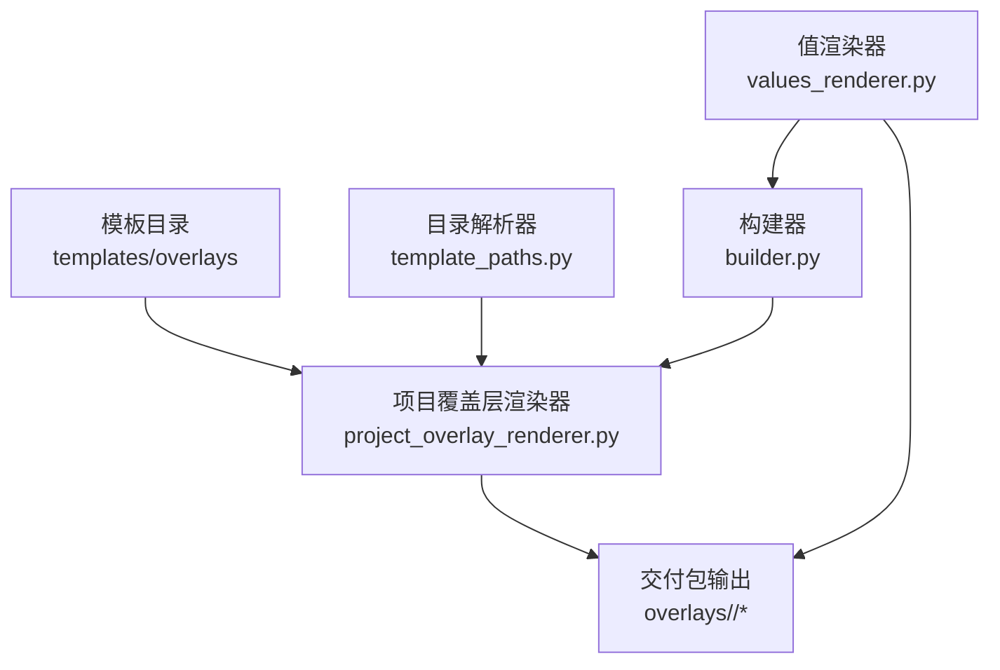
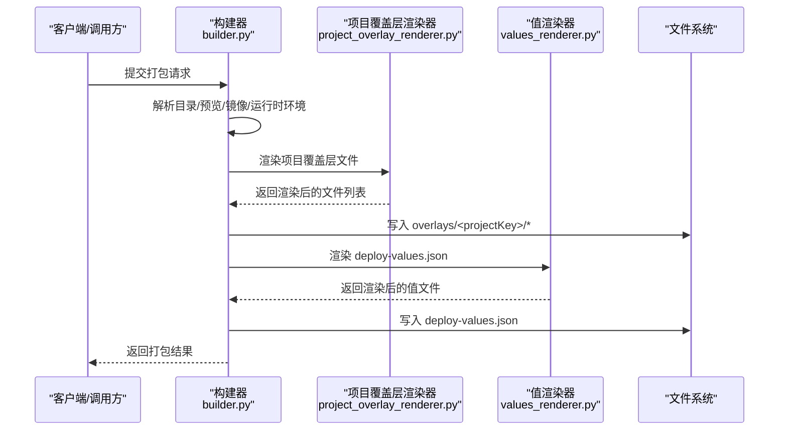
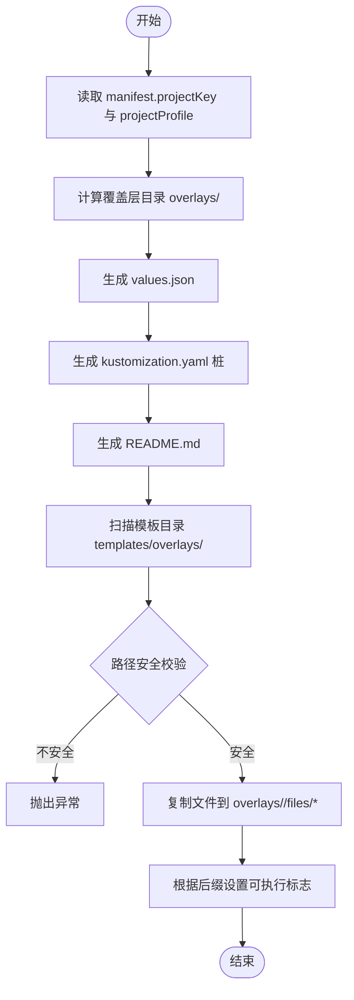
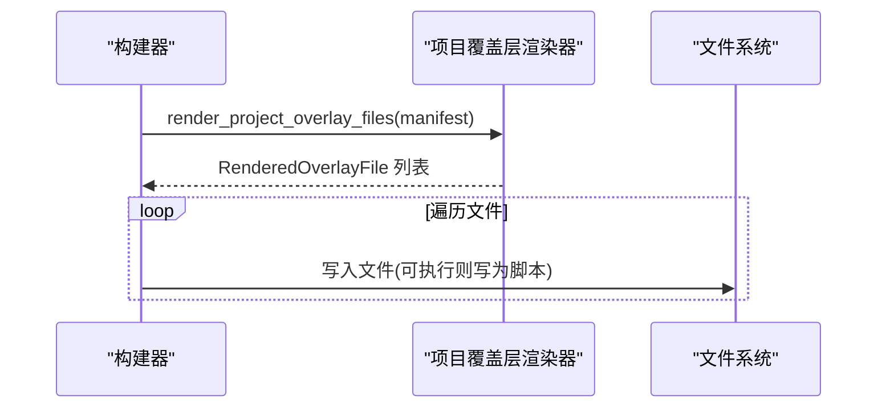
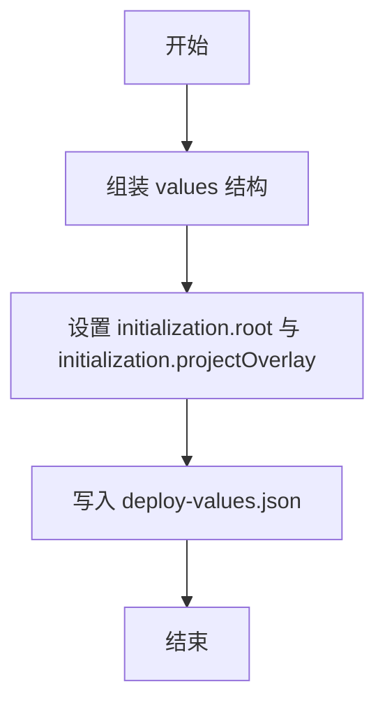
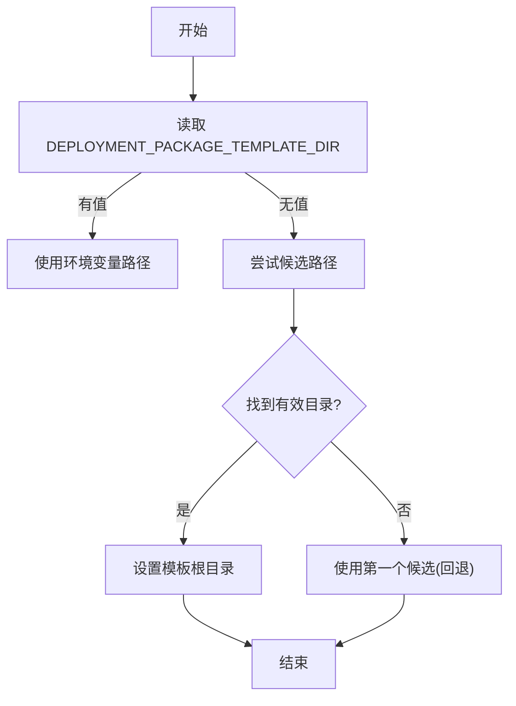
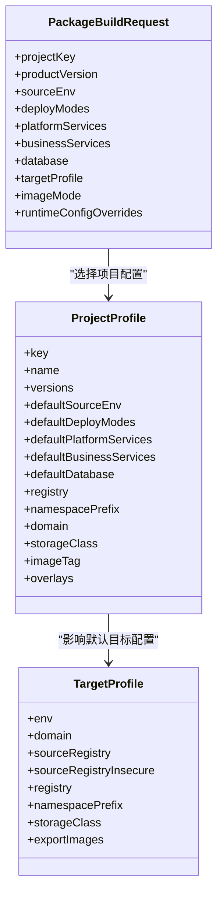
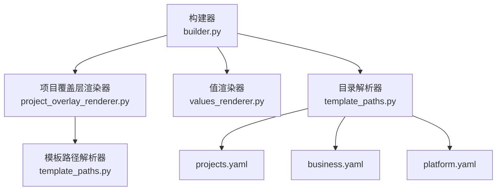

# 覆盖层系统

<cite>
**本文引用的文件**
- [project_overlay_renderer.py](file://backend/deployment_package_factory/services/deployment_packages/project_overlay_renderer.py)
- [builder.py](file://backend/deployment_package_factory/services/deployment_packages/builder.py)
- [models.py](file://backend/deployment_package_factory/services/deployment_packages/models.py)
- [template_paths.py](file://backend/deployment_package_factory/services/deployment_packages/template_paths.py)
- [values_renderer.py](file://backend/deployment_package_factory/services/deployment_packages/values_renderer.py)
- [catalog.py](file://backend/deployment_package_factory/services/deployment_packages/catalog.py)
- [projects.yaml](file://templates/catalog/projects.yaml)
- [business.yaml](file://templates/catalog/business.yaml)
- [platform.yaml](file://templates/catalog/platform.yaml)
- [buckets.txt](file://templates/overlays/standard-eam/init/minio/buckets.txt)
- [eam-repair.bpmn](file://templates/overlays/standard-eam/init/camunda/eam-repair.bpmn)
- [010_mes_lite_schema.sql](file://templates/overlays/mes-lite/init/dm/010_mes_lite_schema.sql)
- [collections.json](file://templates/overlays/mes-lite/init/qdrant/collections.json)
- [mes-lite-resources.yaml](file://templates/overlays/mes-lite/k8s/patches/mes-lite-resources.yaml)
</cite>

## 目录
1. [简介](#简介)
2. [项目结构](#项目结构)
3. [核心组件](#核心组件)
4. [架构总览](#架构总览)
5. [详细组件分析](#详细组件分析)
6. [依赖分析](#依赖分析)
7. [性能考虑](#性能考虑)
8. [故障排查指南](#故障排查指南)
9. [结论](#结论)
10. [附录](#附录)

## 简介
本文件面向“部署包工厂”中的“覆盖层系统”，系统性阐述覆盖层的设计理念、实现机制与应用场景。覆盖层用于在生成交付包时，按项目维度注入或替换初始化资源（如数据库初始化脚本、BPMN 流程、对象存储桶清单、Kustomize 补丁等），以及生成项目级的 Kustomization 及 values 文件，从而实现“标准模板 + 项目定制”的灵活组合。

覆盖层分为两类：
- 标准覆盖层：由平台/项目模板提供，作为默认基线，通常包含通用初始化脚本、流程定义、基础补丁等。
- 项目特定覆盖层：根据项目键（projectKey）从模板目录中选择对应子目录，渲染到交付包的 overlays/<projectKey>/files 下，供项目按需扩展或覆盖。

优先级与合并策略：
- 项目特定覆盖层优先于标准覆盖层生效；当两者同名时，以项目覆盖层为准。
- 渲染顺序：先生成项目覆盖层的 README/values/kustomization，再将模板目录中的文件递归复制到 overlays/<projectKey>/files 下，确保项目文件可覆盖模板文件。

## 项目结构
覆盖层系统涉及以下关键位置：
- 模板目录 templates/overlays：存放标准覆盖层模板，按项目键分目录组织。
- 构建器：在打包过程中调用覆盖层渲染器，生成覆盖层文件并写入交付包根目录。
- 值渲染器：在 deploy-values.json 中声明初始化路径，指向 init/ 与 project overlay 的 init 路径。
- 目录解析：通过模板路径解析器确定模板根目录与 catalog/overlays 子目录。

图表来源
- [project_overlay_renderer.py:17-28](file://backend/deployment_package_factory/services/deployment_packages/project_overlay_renderer.py#L17-L28)
- [builder.py:202-204](file://backend/deployment_package_factory/services/deployment_packages/builder.py#L202-L204)
- [values_renderer.py:38-41](file://backend/deployment_package_factory/services/deployment_packages/values_renderer.py#L38-L41)
- [template_paths.py:28](file://backend/deployment_package_factory/services/deployment_packages/template_paths.py#L28)

章节来源
- [project_overlay_renderer.py:17-28](file://backend/deployment_package_factory/services/deployment_packages/project_overlay_renderer.py#L17-L28)
- [builder.py:202-204](file://backend/deployment_package_factory/services/deployment_packages/builder.py#L202-L204)
- [values_renderer.py:38-41](file://backend/deployment_package_factory/services/deployment_packages/values_renderer.py#L38-L41)
- [template_paths.py:28](file://backend/deployment_package_factory/services/deployment_packages/template_paths.py#L28)

## 核心组件
- 项目覆盖层渲染器：负责生成项目覆盖层的 README、values.json、kustomization.yaml，并递归复制模板目录中的文件到交付包。
- 构建器：在打包主流程中调用覆盖层渲染器，将渲染结果写入交付包根目录。
- 值渲染器：在 deploy-values.json 中声明初始化路径，包括根 init 与 project overlay 的 init 路径。
- 目录解析器：提供默认模板根目录、catalog 目录与 overlays 目录的定位逻辑。
- 目录校验：对模板路径进行安全检查，防止路径逃逸与非法段。

章节来源
- [project_overlay_renderer.py:17-28](file://backend/deployment_package_factory/services/deployment_packages/project_overlay_renderer.py#L17-L28)
- [builder.py:202-204](file://backend/deployment_package_factory/services/deployment_packages/builder.py#L202-L204)
- [values_renderer.py:38-41](file://backend/deployment_package_factory/services/deployment_packages/values_renderer.py#L38-L41)
- [template_paths.py:28](file://backend/deployment_package_factory/services/deployment_packages/template_paths.py#L28)

## 架构总览
覆盖层系统在构建流程中的位置如下：

图表来源
- [builder.py:146-246](file://backend/deployment_package_factory/services/deployment_packages/builder.py#L146-L246)
- [project_overlay_renderer.py:17-28](file://backend/deployment_package_factory/services/deployment_packages/project_overlay_renderer.py#L17-L28)
- [values_renderer.py:15-45](file://backend/deployment_package_factory/services/deployment_packages/values_renderer.py#L15-L45)

## 详细组件分析

### 项目覆盖层渲染器
职责与行为：
- 生成项目覆盖层的三类基础文件：README.md、values.json、kustomization.yaml。
- 递归扫描模板目录中与项目键对应的子目录，将文件内容复制到交付包的 overlays/<projectKey>/files 下，并根据后缀设置可执行标志。
- 对模板路径进行安全校验，避免路径逃逸与非法段。

图表来源
- [project_overlay_renderer.py:17-28](file://backend/deployment_package_factory/services/deployment_packages/project_overlay_renderer.py#L17-L28)
- [project_overlay_renderer.py:78-100](file://backend/deployment_package_factory/services/deployment_packages/project_overlay_renderer.py#L78-L100)
- [project_overlay_renderer.py:103-104](file://backend/deployment_package_factory/services/deployment_packages/project_overlay_renderer.py#L103-L104)

章节来源
- [project_overlay_renderer.py:17-28](file://backend/deployment_package_factory/services/deployment_packages/project_overlay_renderer.py#L17-L28)
- [project_overlay_renderer.py:78-100](file://backend/deployment_package_factory/services/deployment_packages/project_overlay_renderer.py#L78-L100)
- [project_overlay_renderer.py:103-104](file://backend/deployment_package_factory/services/deployment_packages/project_overlay_renderer.py#L103-L104)

### 构建器中的覆盖层集成
- 在构建主流程中，构建器调用项目覆盖层渲染器，将返回的文件逐个写入交付包根目录。
- 写入策略：若文件可执行则写为脚本，否则写为文本文件。
- 与值渲染器协同：值渲染器在 deploy-values.json 中声明初始化路径，覆盖层文件最终被 Kustomize 或安装脚本消费。

图表来源
- [builder.py:202-204](file://backend/deployment_package_factory/services/deployment_packages/builder.py#L202-L204)
- [project_overlay_renderer.py:17-28](file://backend/deployment_package_factory/services/deployment_packages/project_overlay_renderer.py#L17-L28)

章节来源
- [builder.py:202-204](file://backend/deployment_package_factory/services/deployment_packages/builder.py#L202-L204)

### 值渲染器与初始化路径
- 值渲染器在 deploy-values.json 中声明 initialization 字段，包含 root 与 projectOverlay 两个路径，分别指向 init/ 与 init/project/<projectKey>。
- 这使得安装脚本或 Kustomize 可以按需加载根初始化资源与项目覆盖层初始化资源。

图表来源
- [values_renderer.py:15-45](file://backend/deployment_package_factory/services/deployment_packages/values_renderer.py#L15-L45)

章节来源
- [values_renderer.py:15-45](file://backend/deployment_package_factory/services/deployment_packages/values_renderer.py#L15-L45)

### 目录解析与模板定位
- 默认模板根目录可通过环境变量指定，否则按候选路径查找，最终回退到固定路径。
- overlays 目录位于模板根下，用于存放各项目的覆盖层模板。

图表来源
- [template_paths.py:7-21](file://backend/deployment_package_factory/services/deployment_packages/template_paths.py#L7-L21)
- [template_paths.py:28](file://backend/deployment_package_factory/services/deployment_packages/template_paths.py#L28)

章节来源
- [template_paths.py:7-21](file://backend/deployment_package_factory/services/deployment_packages/template_paths.py#L7-L21)
- [template_paths.py:28](file://backend/deployment_package_factory/services/deployment_packages/template_paths.py#L28)

### 目录与模型
- 模型定义了项目配置（ProjectProfile）、目标环境（TargetProfile）、打包请求（PackageBuildRequest）等，这些字段影响覆盖层渲染与初始化路径。
- catalog 目录下的 YAML 文件定义了平台能力、业务能力、数据库与中间件选项及项目配置，用于驱动构建与覆盖层选择。

图表来源
- [models.py:70-88](file://backend/deployment_package_factory/services/deployment_packages/models.py#L70-L88)
- [models.py:90-100](file://backend/deployment_package_factory/services/deployment_packages/models.py#L90-L100)
- [models.py:114-132](file://backend/deployment_package_factory/services/deployment_packages/models.py#L114-L132)

章节来源
- [models.py:70-88](file://backend/deployment_package_factory/services/deployment_packages/models.py#L70-L88)
- [models.py:90-100](file://backend/deployment_package_factory/services/deployment_packages/models.py#L90-L100)
- [models.py:114-132](file://backend/deployment_package_factory/services/deployment_packages/models.py#L114-L132)

## 依赖分析
- 构建器依赖项目覆盖层渲染器与值渲染器，以生成覆盖层文件与 deploy-values.json。
- 项目覆盖层渲染器依赖模板路径解析器，以定位 overlays 模板目录。
- catalog 与模板目录共同决定项目默认配置与可用覆盖层标签。

图表来源
- [builder.py:47-57](file://backend/deployment_package_factory/services/deployment_packages/builder.py#L47-L57)
- [project_overlay_renderer.py:7](file://backend/deployment_package_factory/services/deployment_packages/project_overlay_renderer.py#L7)
- [template_paths.py:28](file://backend/deployment_package_factory/services/deployment_packages/template_paths.py#L28)
- [projects.yaml:1-54](file://templates/catalog/projects.yaml#L1-L54)
- [business.yaml:1-60](file://templates/catalog/business.yaml#L1-L60)
- [platform.yaml:1-66](file://templates/catalog/platform.yaml#L1-L66)

章节来源
- [builder.py:47-57](file://backend/deployment_package_factory/services/deployment_packages/builder.py#L47-L57)
- [project_overlay_renderer.py:7](file://backend/deployment_package_factory/services/deployment_packages/project_overlay_renderer.py#L7)
- [template_paths.py:28](file://backend/deployment_package_factory/services/deployment_packages/template_paths.py#L28)
- [projects.yaml:1-54](file://templates/catalog/projects.yaml#L1-L54)
- [business.yaml:1-60](file://templates/catalog/business.yaml#L1-L60)
- [platform.yaml:1-66](file://templates/catalog/platform.yaml#L1-L66)

## 性能考虑
- 覆盖层文件数量与大小直接影响打包时间。建议：
  - 控制模板目录规模，仅保留必要文件。
  - 将大型二进制文件或大体积脚本拆分为独立归档，在安装阶段按需下载。
  - 使用可执行标志区分脚本与纯文本，减少不必要的编码转换。
- 路径扫描采用递归遍历，建议限制模板目录层级深度与文件总数。

## 故障排查指南
常见问题与处理：
- 模板路径异常
  - 现象：抛出“模板路径必须为目录”或“模板路径逃逸模板根”异常。
  - 处理：确认模板目录存在且位于模板根内，避免使用相对路径段。
- 不安全路径段
  - 现象：抛出“不安全覆盖层模板路径”异常。
  - 处理：检查模板文件路径是否包含空串、当前目录或父目录段。
- 项目键缺失或无效
  - 现象：构建时提示未知项目或不支持的产品版本。
  - 处理：核对 manifest 中的 projectKey 与 productVersion，确保其在 catalog 中已定义。
- 初始化路径未生效
  - 现象：安装脚本无法找到 init 资源。
  - 处理：确认 deploy-values.json 中 initialization.projectOverlay 已正确指向 init/project/<projectKey>。

章节来源
- [project_overlay_renderer.py:81-86](file://backend/deployment_package_factory/services/deployment_packages/project_overlay_renderer.py#L81-L86)
- [project_overlay_renderer.py:91-92](file://backend/deployment_package_factory/services/deployment_packages/project_overlay_renderer.py#L91-L92)
- [builder.py:384-412](file://backend/deployment_package_factory/services/deployment_packages/builder.py#L384-L412)
- [values_renderer.py:38-41](file://backend/deployment_package_factory/services/deployment_packages/values_renderer.py#L38-L41)

## 结论
覆盖层系统通过“标准模板 + 项目定制”的双轨设计，实现了交付包的高可扩展性与可维护性。构建器在打包流程中统一调度覆盖层渲染与写入，值渲染器明确初始化路径，目录解析器保障模板定位的灵活性与安全性。遵循本文的文件结构、命名规范与开发实践，可快速构建稳定可靠的项目覆盖层方案。

## 附录

### 文件结构与命名规范
- 模板目录
  - 根目录：templates/overlays
  - 子目录：按项目键命名，例如 standard-eam、mes-lite
  - 子目录下可包含 init 与 k8s/patches 等资源
- 交付包输出
  - overlays/<projectKey>/README.md
  - overlays/<projectKey>/values.json
  - overlays/<projectKey>/kustomization.yaml
  - overlays/<projectKey>/files/**（模板文件复制结果）
- 值文件
  - deploy-values.json 中的 initialization 字段：
    - root: "init/"
    - projectOverlay: "init/project/<projectKey>"

章节来源
- [project_overlay_renderer.py:22-26](file://backend/deployment_package_factory/services/deployment_packages/project_overlay_renderer.py#L22-L26)
- [project_overlay_renderer.py:78-100](file://backend/deployment_package_factory/services/deployment_packages/project_overlay_renderer.py#L78-L100)
- [values_renderer.py:38-41](file://backend/deployment_package_factory/services/deployment_packages/values_renderer.py#L38-L41)

### 应用场景示例
- 标准 EAM 项目
  - 模板：templates/overlays/standard-eam
  - 初始化资源：minio 桶清单、Camunda BPMN 流程
- MES 轻量项目
  - 模板：templates/overlays/mes-lite
  - 初始化资源：DM 初始化脚本、Qdrant 集合定义、K8s 资源补丁

章节来源
- [buckets.txt:1-4](file://templates/overlays/standard-eam/init/minio/buckets.txt#L1-L4)
- [eam-repair.bpmn:1-8](file://templates/overlays/standard-eam/init/camunda/eam-repair.bpmn#L1-L8)
- [010_mes_lite_schema.sql:1-4](file://templates/overlays/mes-lite/init/dm/010_mes_lite_schema.sql#L1-L4)
- [collections.json:1-10](file://templates/overlays/mes-lite/init/qdrant/collections.json#L1-L10)
- [mes-lite-resources.yaml:1-17](file://templates/overlays/mes-lite/k8s/patches/mes-lite-resources.yaml#L1-L17)

### 开发指南与最佳实践
- 组织方式
  - 按项目键建立子目录，子目录内按功能划分 init 与 k8s/patches。
  - 保持文件名简洁、语义清晰，避免特殊字符。
- 安全性
  - 严格遵守路径安全校验，禁止使用空段、当前目录或父目录段。
  - 对可执行脚本使用 .sh 后缀，便于运行时识别。
- 版本控制
  - 将模板纳入版本管理，变更时记录变更日志。
  - 通过 projects.yaml 的 versions 字段管理多版本覆盖层。
- 动态加载与条件应用
  - 通过 kustomization.yaml 的 labels 实现条件启用，例如 local-ai/overlay-<label>: "true"。
  - 在 deploy-values.json 中按需引用 projectOverlay 路径，实现条件初始化。

章节来源
- [project_overlay_renderer.py:62-75](file://backend/deployment_package_factory/services/deployment_packages/project_overlay_renderer.py#L62-L75)
- [values_renderer.py:38-41](file://backend/deployment_package_factory/services/deployment_packages/values_renderer.py#L38-L41)
- [projects.yaml:28-30](file://templates/catalog/projects.yaml#L28-L30)
- [projects.yaml:52-53](file://templates/catalog/projects.yaml#L52-L53)