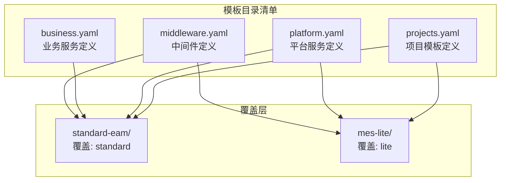
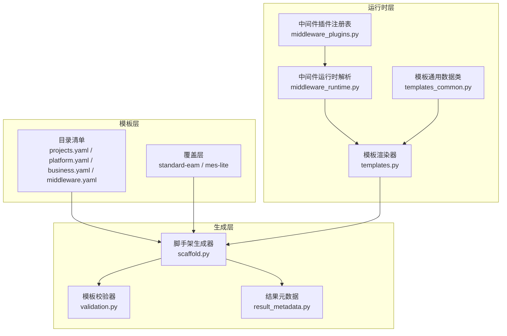
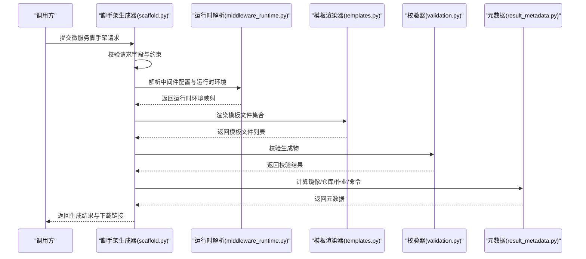
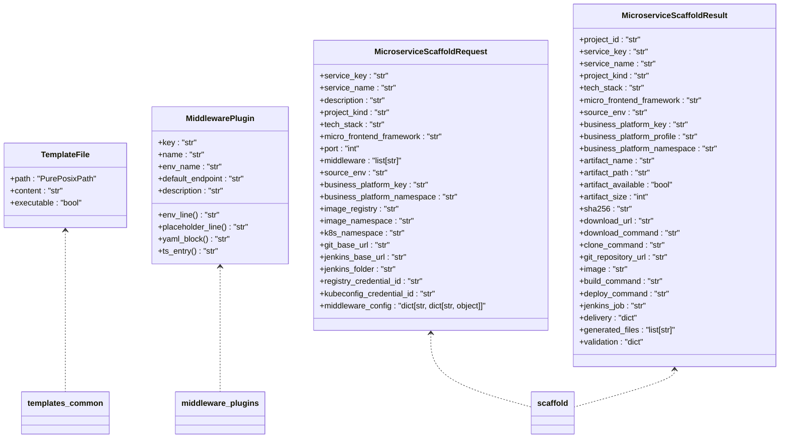
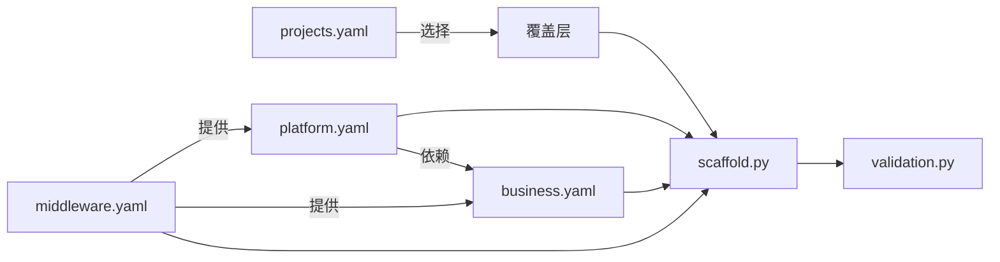

# 项目模板系统

<cite>
**本文引用的文件**
- [projects.yaml](file://templates/catalog/projects.yaml)
- [platform.yaml](file://templates/catalog/platform.yaml)
- [middleware.yaml](file://templates/catalog/middleware.yaml)
- [business.yaml](file://templates/catalog/business.yaml)
- [mes-lite 资源补丁](file://templates/overlays/mes-lite/k8s/patches/mes-lite-resources.yaml)
- [EAM MinIO 存储桶](file://templates/overlays/standard-eam/init/minio/buckets.txt)
- [EAM Camunda BPMN](file://templates/overlays/standard-eam/init/camunda/eam-repair.bpmn)
- [MES Lite DM 初始化脚本](file://templates/overlays/mes-lite/init/dm/010_mes_lite_schema.sql)
- [模板通用数据类](file://backend/deployment_package_factory/services/microservices/templates_common.py)
- [微服务模板渲染器](file://backend/deployment_package_factory/services/microservices/templates.py)
- [中间件运行时解析](file://backend/deployment_package_factory/services/microservices/middleware_runtime.py)
- [中间件插件注册表](file://backend/deployment_package_factory/services/microservices/middleware_plugins.py)
- [微服务脚手架生成器](file://backend/deployment_package_factory/services/microservices/scaffold.py)
- [模板校验器](file://backend/deployment_package_factory/services/microservices/validation.py)
- [结果元数据工具](file://backend/deployment_package_factory/services/microservices/result_metadata.py)
</cite>

## 目录
1. [简介](#简介)
2. [项目结构](#项目结构)
3. [核心组件](#核心组件)
4. [架构总览](#架构总览)
5. [详细组件分析](#详细组件分析)
6. [依赖关系分析](#依赖关系分析)
7. [性能考量](#性能考量)
8. [故障排查指南](#故障排查指南)
9. [结论](#结论)
10. [附录](#附录)

## 简介
本文件面向“部署包工厂”项目模板系统，系统性阐述模板结构设计、配置参数与版本管理机制，详解标准 EAM 项目与 MES 轻量项目的模板配置（默认版本、部署模式、平台服务与业务服务定义），并说明模板继承机制、覆盖层应用与自定义配置选项。同时给出模板参数验证、默认值设置与环境适配策略，提供模板开发指南、配置示例与最佳实践，帮助用户理解并扩展模板系统。

## 项目结构
模板系统由“目录清单”和“覆盖层”两部分构成：
- 目录清单：定义项目模板、平台服务、业务服务与中间件的全局配置
- 覆盖层：针对特定项目模板提供差异化资源补丁与初始化脚本

图表来源
- [projects.yaml:1-54](file://templates/catalog/projects.yaml#L1-L54)
- [platform.yaml:1-66](file://templates/catalog/platform.yaml#L1-L66)
- [business.yaml:1-60](file://templates/catalog/business.yaml#L1-L60)
- [middleware.yaml:1-283](file://templates/catalog/middleware.yaml#L1-L283)
- [mes-lite 资源补丁:1-17](file://templates/overlays/mes-lite/k8s/patches/mes-lite-resources.yaml#L1-L17)
- [EAM MinIO 存储桶:1-4](file://templates/overlays/standard-eam/init/minio/buckets.txt#L1-L4)
- [EAM Camunda BPMN:1-8](file://templates/overlays/standard-eam/init/camunda/eam-repair.bpmn#L1-L8)
- [MES Lite DM 初始化脚本:1-4](file://templates/overlays/mes-lite/init/dm/010_mes_lite_schema.sql#L1-L4)

章节来源
- [projects.yaml:1-54](file://templates/catalog/projects.yaml#L1-L54)
- [platform.yaml:1-66](file://templates/catalog/platform.yaml#L1-L66)
- [business.yaml:1-60](file://templates/catalog/business.yaml#L1-L60)
- [middleware.yaml:1-283](file://templates/catalog/middleware.yaml#L1-L283)

## 核心组件
- 项目模板目录：集中定义各项目模板的默认版本、支持的部署模式、默认平台/业务服务、默认数据库、命名空间前缀、域名、存储类、镜像标签以及所应用的覆盖层
- 平台服务目录：定义平台级服务（如 IAM、网关、审计、工作流等）及其依赖、命名空间分组、镜像与中间件要求
- 业务服务目录：定义业务域服务（如 EAM、MES、ERP、APS）及其依赖、命名空间分组、镜像与中间件要求
- 中间件目录：定义数据库、缓存、对象存储、向量库、工作流引擎、时序库、监控等中间件的镜像、端口、初始化路径、环境变量模板与健康检查
- 覆盖层：按项目模板提供差异化资源补丁（如 MES 轻量版的资源请求/限制）与初始化脚本（如 EAM 的 MinIO 存储桶、Camunda BPMN；MES Lite 的 DM 初始化）

章节来源
- [projects.yaml:1-54](file://templates/catalog/projects.yaml#L1-L54)
- [platform.yaml:1-66](file://templates/catalog/platform.yaml#L1-L66)
- [business.yaml:1-60](file://templates/catalog/business.yaml#L1-L60)
- [middleware.yaml:1-283](file://templates/catalog/middleware.yaml#L1-L283)
- [mes-lite 资源补丁:1-17](file://templates/overlays/mes-lite/k8s/patches/mes-lite-resources.yaml#L1-L17)
- [EAM MinIO 存储桶:1-4](file://templates/overlays/standard-eam/init/minio/buckets.txt#L1-L4)
- [EAM Camunda BPMN:1-8](file://templates/overlays/standard-eam/init/camunda/eam-repair.bpmn#L1-L8)
- [MES Lite DM 初始化脚本:1-4](file://templates/overlays/mes-lite/init/dm/010_mes_lite_schema.sql#L1-L4)

## 架构总览
模板系统采用“目录清单 + 覆盖层”的双层结构：目录清单提供标准化配置，覆盖层在不修改基础模板的前提下注入差异化内容。平台服务与业务服务通过依赖声明形成拓扑关系，中间件提供统一的运行时环境与占位符，最终由脚手架生成器将模板渲染为可交付的项目制品。

图表来源
- [projects.yaml:1-54](file://templates/catalog/projects.yaml#L1-L54)
- [platform.yaml:1-66](file://templates/catalog/platform.yaml#L1-L66)
- [business.yaml:1-60](file://templates/catalog/business.yaml#L1-L60)
- [middleware.yaml:1-283](file://templates/catalog/middleware.yaml#L1-L283)
- [middleware_plugins.py:1-68](file://backend/deployment_package_factory/services/microservices/middleware_plugins.py#L1-L68)
- [middleware_runtime.py:1-203](file://backend/deployment_package_factory/services/microservices/middleware_runtime.py#L1-L203)
- [templates.py:1-339](file://backend/deployment_package_factory/services/microservices/templates.py#L1-L339)
- [templates_common.py:1-12](file://backend/deployment_package_factory/services/microservices/templates_common.py#L1-L12)
- [scaffold.py:1-800](file://backend/deployment_package_factory/services/microservices/scaffold.py#L1-L800)
- [validation.py:1-144](file://backend/deployment_package_factory/services/microservices/validation.py#L1-L144)
- [result_metadata.py:1-28](file://backend/deployment_package_factory/services/microservices/result_metadata.py#L1-L28)

## 详细组件分析

### 项目模板：标准 EAM 与 MES 轻量
- 标准 EAM 项目
  - 默认版本：2026.06
  - 支持部署模式：k8s、docker-compose
  - 默认平台服务：IAM、网关前端、文件/文档、Camunda 工作流、审计
  - 默认业务服务：eam（profile: 4x60）
  - 默认数据库：PostgreSQL
  - 域名：eam.example.com
  - 镜像标签：prod
  - 应用覆盖层：standard
- MES 轻量项目
  - 默认版本：2026.06
  - 支持部署模式：k8s
  - 默认平台服务：IAM、网关前端、审计
  - 默认业务服务：mes（profile: 4x3）
  - 默认数据库：达梦 DM
  - 域名：mes.example.com
  - 存储类：fast-ssd
  - 镜像标签：2026.06-lite
  - 应用覆盖层：lite

章节来源
- [projects.yaml:1-54](file://templates/catalog/projects.yaml#L1-L54)

### 平台服务与业务服务定义
- 平台服务（示例）
  - IAM：必需，命名空间组 base-public，依赖 redis/database
  - 网关前端：必需，命名空间组 base-public，支持静态资源镜像
  - 审计：命名空间组 base-public，依赖 database
  - 工作流（Camunda）：命名空间组 base-public，依赖 iam/audit，中间件 database/camunda 及其依赖 elasticsearch
  - 观测性：命名空间组 observability，中间件 monitoring
- 业务服务（示例）
  - EAM：命名空间组 business-eam，依赖 iam/gateway/audit/file-documents/workflow-camunda/audit，中间件 database/redis/minio/camunda/iotdb
  - MES：命名空间组 business-mes，依赖 iam/gateway/audit，中间件 database/redis
  - ERP/APS：命名空间组 business-erp/business-aps，依赖 iam/gateway/audit，中间件 database/redis

章节来源
- [platform.yaml:1-66](file://templates/catalog/platform.yaml#L1-L66)
- [business.yaml:1-60](file://templates/catalog/business.yaml#L1-L60)

### 中间件配置与运行时解析
- 数据库选项
  - 达梦 DM：镜像、初始化脚本路径、端口、数据卷路径、环境变量模板与密钥来源、compose 健康检查
  - PostgreSQL：镜像、初始化脚本路径、端口、数据卷路径、环境变量模板与密钥来源、compose 健康检查
- 缓存与存储
  - Redis：密码环境变量、命令行参数、健康检查
  - MinIO：根账号与密码、命令行参数、健康检查
  - Qdrant：API 密钥、健康检查
- 流式与时序
  - Camunda：主服务与 elasticsearch 依赖、管理员凭据、健康检查
  - IoTDB：用户与密码、启动参数、健康检查
- 运行时解析
  - 自动推导默认主机、端口、用户名、数据库名
  - 生成统一的运行时环境变量（含敏感信息标记）
  - 支持显式 endpoint 覆盖与集群内 FQDN 解析

章节来源
- [middleware.yaml:1-283](file://templates/catalog/middleware.yaml#L1-L283)
- [middleware_runtime.py:1-203](file://backend/deployment_package_factory/services/microservices/middleware_runtime.py#L1-L203)
- [middleware_plugins.py:1-68](file://backend/deployment_package_factory/services/microservices/middleware_plugins.py#L1-L68)

### 覆盖层应用与差异化资源
- MES 轻量资源补丁：为业务服务容器设置 CPU/内存请求与限制，适配轻量化部署
- EAM 覆盖层
  - MinIO 初始化：预置存储桶列表
  - Camunda BPMN：提供流程定义骨架
- MES Lite 覆盖层
  - DM 初始化：预留数据库初始化脚本占位

章节来源
- [mes-lite 资源补丁:1-17](file://templates/overlays/mes-lite/k8s/patches/mes-lite-resources.yaml#L1-L17)
- [EAM MinIO 存储桶:1-4](file://templates/overlays/standard-eam/init/minio/buckets.txt#L1-L4)
- [EAM Camunda BPMN:1-8](file://templates/overlays/standard-eam/init/camunda/eam-repair.bpmn#L1-L8)
- [MES Lite DM 初始化脚本:1-4](file://templates/overlays/mes-lite/init/dm/010_mes_lite_schema.sql#L1-L4)

### 模板渲染与生成流程
- 请求模型校验：对服务键、技术栈、端口、项目类型、中间件等进行格式与约束校验
- 上下文构建：组合服务键、名称、描述、技术栈、中间件、运行时环境、命名空间等
- 模板渲染：根据技术栈生成通用或专用模板文件（Dockerfile、部署清单、CI/CD 脚本、Helm Chart 等）
- 脚手架生成：写入文件、初始化 Git、打包归档、计算 SHA256
- 结果元数据：生成镜像引用、Git 仓库地址、Jenkins 作业链接、构建/部署命令
- 质量校验：检查关键文件、Python 语法、流水线片段、Helm 模板完整性、中间件占位符、归档有效性

图表来源
- [scaffold.py:1-800](file://backend/deployment_package_factory/services/microservices/scaffold.py#L1-L800)
- [middleware_runtime.py:1-203](file://backend/deployment_package_factory/services/microservices/middleware_runtime.py#L1-L203)
- [templates.py:1-339](file://backend/deployment_package_factory/services/microservices/templates.py#L1-L339)
- [validation.py:1-144](file://backend/deployment_package_factory/services/microservices/validation.py#L1-L144)
- [result_metadata.py:1-28](file://backend/deployment_package_factory/services/microservices/result_metadata.py#L1-L28)

章节来源
- [scaffold.py:1-800](file://backend/deployment_package_factory/services/microservices/scaffold.py#L1-L800)
- [templates.py:1-339](file://backend/deployment_package_factory/services/microservices/templates.py#L1-L339)
- [validation.py:1-144](file://backend/deployment_package_factory/services/microservices/validation.py#L1-L144)
- [result_metadata.py:1-28](file://backend/deployment_package_factory/services/microservices/result_metadata.py#L1-L28)

### 类与数据结构

图表来源
- [templates_common.py:1-12](file://backend/deployment_package_factory/services/microservices/templates_common.py#L1-L12)
- [middleware_plugins.py:1-68](file://backend/deployment_package_factory/services/microservices/middleware_plugins.py#L1-L68)
- [scaffold.py:1-800](file://backend/deployment_package_factory/services/microservices/scaffold.py#L1-L800)

章节来源
- [templates_common.py:1-12](file://backend/deployment_package_factory/services/microservices/templates_common.py#L1-L12)
- [middleware_plugins.py:1-68](file://backend/deployment_package_factory/services/microservices/middleware_plugins.py#L1-L68)
- [scaffold.py:1-800](file://backend/deployment_package_factory/services/microservices/scaffold.py#L1-L800)

### 参数验证与默认值策略
- 字段验证
  - 服务键：必须符合 Kubernetes 名称规范
  - 技术栈：仅支持白名单内的技术栈
  - 端口：1~65535
  - 项目类型：与技术栈匹配
  - 中间件：仅支持白名单内的中间件
  - Git 组、镜像仓库、命名空间：路径段小写且不含空格
- 默认值
  - 中间件配置：自动填充默认主机、端口、用户名、数据库名
  - 运行时环境：生成统一的环境变量键值，敏感项标记为密文
  - 命名空间：优先使用业务平台命名空间，否则回退到业务平台键或 k8s 命名空间
- 环境适配
  - 集群内服务通过 FQDN 解析
  - 显式 endpoint 可覆盖默认解析
  - 不同数据库的 DSN/URL 生成策略不同

章节来源
- [scaffold.py:52-170](file://backend/deployment_package_factory/services/microservices/scaffold.py#L52-L170)
- [middleware_runtime.py:128-143](file://backend/deployment_package_factory/services/microservices/middleware_runtime.py#L128-L143)
- [middleware_runtime.py:150-155](file://backend/deployment_package_factory/services/microservices/middleware_runtime.py#L150-L155)

### 版本管理与模板继承
- 版本管理
  - 项目模板在目录清单中声明默认版本与支持版本列表
  - 镜像标签随模板版本调整（如 EAM 使用 prod，MES Lite 使用带版本号的标签）
- 模板继承与覆盖
  - 通过覆盖层叠加差异化资源补丁与初始化脚本
  - 标准 EAM 与 MES Lite 分别应用 standard 与 lite 覆盖层
- 平台/业务服务依赖
  - 通过 dependsOn 声明拓扑依赖，确保部署顺序与运行时可达性

章节来源
- [projects.yaml:1-54](file://templates/catalog/projects.yaml#L1-L54)
- [platform.yaml:1-66](file://templates/catalog/platform.yaml#L1-L66)
- [business.yaml:1-60](file://templates/catalog/business.yaml#L1-L60)

## 依赖关系分析
- 目录清单与覆盖层
  - projects.yaml 决定默认平台/业务服务与覆盖层
  - platform.yaml/business.yaml/middleware.yaml 为所有模板提供公共依赖与中间件能力
- 运行时依赖
  - 平台服务依赖中间件（如 iam/audit 依赖 database）
  - 业务服务依赖平台服务与中间件（如 eam 依赖 iam/gateway/audit/file-documents/workflow-camunda/audit）
- 生成链路
  - 脚手架生成器依赖运行时解析与模板渲染器
  - 校验器贯穿生成过程，确保产物质量

图表来源
- [projects.yaml:1-54](file://templates/catalog/projects.yaml#L1-L54)
- [platform.yaml:1-66](file://templates/catalog/platform.yaml#L1-L66)
- [business.yaml:1-60](file://templates/catalog/business.yaml#L1-L60)
- [middleware.yaml:1-283](file://templates/catalog/middleware.yaml#L1-L283)
- [scaffold.py:1-800](file://backend/deployment_package_factory/services/microservices/scaffold.py#L1-L800)
- [validation.py:1-144](file://backend/deployment_package_factory/services/microservices/validation.py#L1-L144)

章节来源
- [projects.yaml:1-54](file://templates/catalog/projects.yaml#L1-L54)
- [platform.yaml:1-66](file://templates/catalog/platform.yaml#L1-L66)
- [business.yaml:1-60](file://templates/catalog/business.yaml#L1-L60)
- [middleware.yaml:1-283](file://templates/catalog/middleware.yaml#L1-L283)
- [scaffold.py:1-800](file://backend/deployment_package_factory/services/microservices/scaffold.py#L1-L800)
- [validation.py:1-144](file://backend/deployment_package_factory/services/microservices/validation.py#L1-L144)

## 性能考量
- 模板渲染与打包
  - 控制生成文件数量与大小，避免冗余 Helm 模板与重复资源
  - 合理设置中间件健康检查间隔与重试次数，减少无效探测
- 运行时解析
  - 优先使用显式 endpoint，减少 DNS 解析开销
  - 合理配置中间件资源请求/限制，避免过度分配
- 覆盖层最小化
  - 仅在必要处引入补丁与初始化脚本，降低维护成本与冲突风险

## 故障排查指南
- 生成物校验失败
  - 关注“缺失文件/内容”“Helm 模板问题”“中间件占位符缺失”“归档不可读取”等提示
  - 按提示定位具体文件与片段，补齐缺失内容或修正模板
- 中间件连接异常
  - 检查运行时环境变量是否正确生成（敏感项是否被标记）
  - 确认集群内 FQDN 是否可达，或使用显式 endpoint
- 技术栈契约不满足
  - 对照校验器对技术栈的期望文件与片段，补齐相应内容
- 归档损坏
  - 确认打包阶段未抛出异常，重新生成并校验

章节来源
- [validation.py:1-144](file://backend/deployment_package_factory/services/microservices/validation.py#L1-L144)
- [middleware_runtime.py:1-203](file://backend/deployment_package_factory/services/microservices/middleware_runtime.py#L1-L203)

## 结论
模板系统通过“目录清单 + 覆盖层”的双层结构实现标准化与差异化的平衡，配合严格的参数验证、默认值策略与运行时解析，确保生成物的一致性与可交付性。标准 EAM 与 MES 轻量模板分别覆盖了生产级与轻量化场景，平台/业务服务与中间件的依赖声明保障了部署拓扑的合理性。建议在扩展新模板时遵循现有契约，最小化覆盖层改动，并持续完善校验规则以提升质量。

## 附录

### 开发指南与最佳实践
- 新增项目模板
  - 在目录清单中新增模板条目，设置默认版本、支持版本、默认平台/业务服务、默认数据库与覆盖层
  - 如需差异化，创建对应覆盖层并在目录清单中引用
- 扩展平台/业务服务
  - 在 platform.yaml/business.yaml 中添加服务定义，明确命名空间组、依赖与中间件
  - 若涉及中间件变更，同步更新 middleware.yaml
- 中间件扩展
  - 在 middleware.yaml 中新增中间件条目，提供镜像、端口、初始化路径、环境模板与健康检查
  - 在 middleware_plugins.py 中注册插件，确保运行时解析与占位符生成
- 覆盖层策略
  - 优先使用资源补丁与初始化脚本实现差异化，避免直接修改基础模板
  - 保持覆盖层命名与模板一致，便于识别与维护
- 参数与环境
  - 严格遵守字段验证规则，避免非法输入导致生成失败
  - 利用显式 endpoint 覆盖默认解析，确保跨环境一致性
- 质量保证
  - 生成后执行校验，关注关键文件、Helm 模板与技术栈契约
  - 对 Python 项目执行语法检查，确保可运行性

### 配置示例与参考路径
- 项目模板默认配置
  - [标准 EAM 模板:2-29](file://templates/catalog/projects.yaml#L2-L29)
  - [MES 轻量模板:30-54](file://templates/catalog/projects.yaml#L30-L54)
- 平台/业务服务依赖
  - [平台服务定义:1-66](file://templates/catalog/platform.yaml#L1-L66)
  - [业务服务定义:1-60](file://templates/catalog/business.yaml#L1-L60)
- 中间件运行时
  - [中间件运行时解析:1-203](file://backend/deployment_package_factory/services/microservices/middleware_runtime.py#L1-L203)
  - [中间件插件注册表:1-68](file://backend/deployment_package_factory/services/microservices/middleware_plugins.py#L1-L68)
- 覆盖层资源
  - [MES 轻量资源补丁:1-17](file://templates/overlays/mes-lite/k8s/patches/mes-lite-resources.yaml#L1-L17)
  - [EAM MinIO 存储桶:1-4](file://templates/overlays/standard-eam/init/minio/buckets.txt#L1-L4)
  - [EAM Camunda BPMN:1-8](file://templates/overlays/standard-eam/init/camunda/eam-repair.bpmn#L1-L8)
  - [MES Lite DM 初始化脚本:1-4](file://templates/overlays/mes-lite/init/dm/010_mes_lite_schema.sql#L1-L4)
- 模板渲染与生成
  - [模板通用数据类:1-12](file://backend/deployment_package_factory/services/microservices/templates_common.py#L1-L12)
  - [微服务模板渲染器:1-339](file://backend/deployment_package_factory/services/microservices/templates.py#L1-L339)
  - [微服务脚手架生成器:1-800](file://backend/deployment_package_factory/services/microservices/scaffold.py#L1-L800)
  - [模板校验器:1-144](file://backend/deployment_package_factory/services/microservices/validation.py#L1-L144)
  - [结果元数据工具:1-28](file://backend/deployment_package_factory/services/microservices/result_metadata.py#L1-L28)