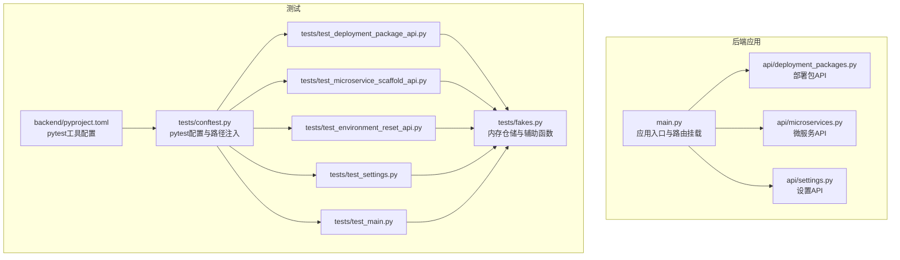
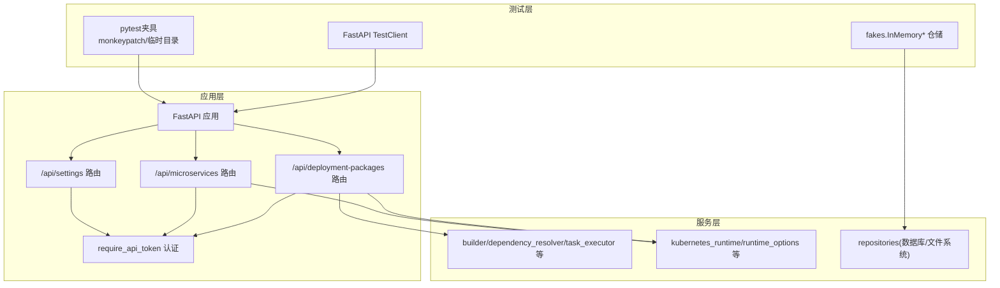
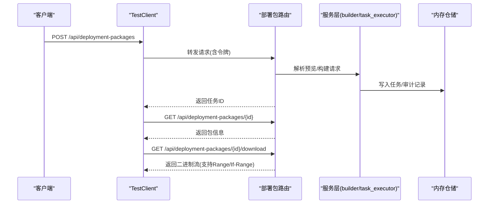
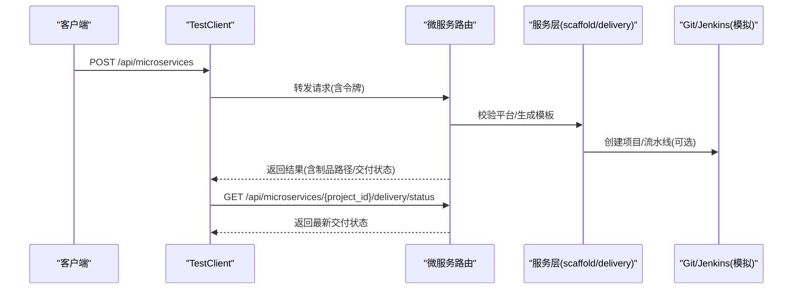
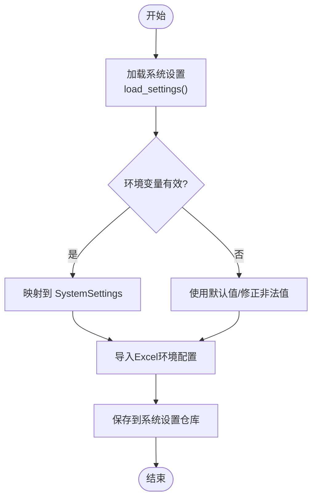
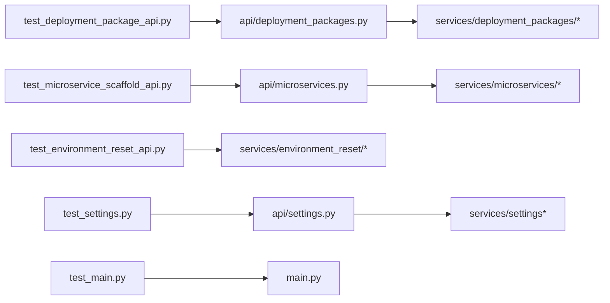

# 单元测试

<cite>
**本文引用的文件**
- [backend/tests/conftest.py](file://backend/tests/conftest.py)
- [backend/pyproject.toml](file://backend/pyproject.toml)
- [backend/deployment_package_factory/main.py](file://backend/deployment_package_factory/main.py)
- [backend/tests/fakes.py](file://backend/tests/fakes.py)
- [backend/tests/test_deployment_package_api.py](file://backend/tests/test_deployment_package_api.py)
- [backend/tests/test_environment_reset_api.py](file://backend/tests/test_environment_reset_api.py)
- [backend/tests/test_settings.py](file://backend/tests/test_settings.py)
- [backend/tests/test_microservice_scaffold_api.py](file://backend/tests/test_microservice_scaffold_api.py)
- [backend/tests/test_main.py](file://backend/tests/test_main.py)
- [backend/deployment_package_factory/api/deployment_packages.py](file://backend/deployment_package_factory/api/deployment_packages.py)
- [backend/deployment_package_factory/api/microservices.py](file://backend/deployment_package_factory/api/microservices.py)
- [backend/deployment_package_factory/api/settings.py](file://backend/deployment_package_factory/api/settings.py)
</cite>

## 目录
1. [简介](#简介)
2. [项目结构](#项目结构)
3. [核心组件](#核心组件)
4. [架构总览](#架构总览)
5. [详细组件分析](#详细组件分析)
6. [依赖关系分析](#依赖关系分析)
7. [性能考量](#性能考量)
8. [故障排查指南](#故障排查指南)
9. [结论](#结论)
10. [附录](#附录)

## 简介
本文件面向“部署包工厂”项目的单元测试体系，围绕 pytest 测试框架配置与测试用例设计原则，系统梳理并深入解析以下核心模块的单元测试实现：
- 部署包 API 测试
- 微服务 API 测试
- 设置 API 测试
- 环境重置 API 测试

文档同时阐述测试数据准备策略（模拟对象）、断言验证方法、异步与错误处理场景、边界条件测试，并给出测试覆盖率与测试报告生成的实践建议。

## 项目结构
后端采用 FastAPI 应用入口集中于主模块，各 API 路由按功能拆分在独立模块中；测试位于 backend/tests 目录，遵循按功能分文件的组织方式。pytest 通过 pyproject.toml 的工具配置指定测试路径与 Python 搜索路径，conftest.py 将仓库根目录注入 sys.path 以支持相对导入。

**图示来源**
- [backend/deployment_package_factory/main.py:23-68](file://backend/deployment_package_factory/main.py#L23-L68)
- [backend/deployment_package_factory/api/deployment_packages.py:50-124](file://backend/deployment_package_factory/api/deployment_packages.py#L50-L124)
- [backend/deployment_package_factory/api/microservices.py:29-67](file://backend/deployment_package_factory/api/microservices.py#L29-L67)
- [backend/deployment_package_factory/api/settings.py:17-49](file://backend/deployment_package_factory/api/settings.py#L17-L49)
- [backend/tests/conftest.py:1-10](file://backend/tests/conftest.py#L1-L10)
- [backend/pyproject.toml:27-30](file://backend/pyproject.toml#L27-L30)
- [backend/tests/fakes.py:1-401](file://backend/tests/fakes.py#L1-L401)

**章节来源**
- [backend/tests/conftest.py:1-10](file://backend/tests/conftest.py#L1-L10)
- [backend/pyproject.toml:27-30](file://backend/pyproject.toml#L27-L30)

## 核心组件
- pytest 配置与运行环境
  - 使用 pyproject.toml 的 tool.pytest.ini_options 指定 testpaths 与 pythonpath，确保测试发现与导入路径正确。
  - conftest.py 注入仓库根目录到 sys.path，便于从 tests 目录直接导入后端模块。
- 模拟对象与测试数据
  - fakes.py 提供 InMemoryTaskRepository、InMemoryAuditEventRepository、InMemoryBusinessPlatformRepository、InMemoryMicroserviceRepository 等内存仓储，用于隔离真实外部依赖。
  - 辅助函数如 _artifact_available、_parse_iso、_now_iso 确保时间与文件路径一致性。
- API 路由与认证
  - 各 API 均依赖 require_api_token 进行令牌校验，测试通过 headers 或查询参数注入令牌进行鉴权测试。
- 异常与错误处理
  - 大多数 API 在业务异常时抛出 HTTPException，状态码与 detail 字段用于断言。
- 异步与后台任务
  - 部署包构建在 worker 模式下以任务队列形式异步执行，测试通过等待任务状态或使用内存仓储模拟执行结果。

**章节来源**
- [backend/tests/fakes.py:20-401](file://backend/tests/fakes.py#L20-L401)
- [backend/deployment_package_factory/api/deployment_packages.py:11-54](file://backend/deployment_package_factory/api/deployment_packages.py#L11-L54)
- [backend/deployment_package_factory/api/microservices.py:8-33](file://backend/deployment_package_factory/api/microservices.py#L8-L33)
- [backend/deployment_package_factory/api/settings.py:9-21](file://backend/deployment_package_factory/api/settings.py#L9-L21)

## 架构总览
下图展示了测试对应用层与服务层的交互关系，以及测试夹具如何替换真实仓储与执行器，从而实现端到端的 API 行为验证。

**图示来源**
- [backend/tests/test_deployment_package_api.py:20-28](file://backend/tests/test_deployment_package_api.py#L20-L28)
- [backend/tests/test_microservice_scaffold_api.py:16-19](file://backend/tests/test_microservice_scaffold_api.py#L16-L19)
- [backend/tests/test_environment_reset_api.py:18-22](file://backend/tests/test_environment_reset_api.py#L18-L22)
- [backend/tests/test_settings.py:8-20](file://backend/tests/test_settings.py#L8-L20)
- [backend/deployment_package_factory/api/deployment_packages.py:50-103](file://backend/deployment_package_factory/api/deployment_packages.py#L50-L103)
- [backend/deployment_package_factory/api/microservices.py:29-45](file://backend/deployment_package_factory/api/microservices.py#L29-L45)
- [backend/deployment_package_factory/api/settings.py:17-39](file://backend/deployment_package_factory/api/settings.py#L17-L39)

## 详细组件分析

### 部署包 API 测试
- 测试目标
  - 选项接口、预览接口、注册/禁用业务平台、下载脚本与断点续传、令牌鉴权、错误处理与边界条件。
- 关键测试要点
  - 令牌鉴权：支持 Authorization: Bearer 与自定义 X-Deployment-Package-Token，拒绝查询参数令牌用于 JSON 接口。
  - 预览：解析依赖、合并运行时镜像、注册微服务、数据库配置来源与覆盖。
  - 下载：支持 Range、If-Range、HEAD 元数据返回、脚本模板参数与校验逻辑。
  - 任务执行：worker 模式下创建的任务应为 pending；默认 image-mode 为 image-archive。
  - 错误处理：未就绪的注册微服务阻止打包；镜像导出失败时任务标记为 failed。
- 测试夹具与模拟
  - 使用 monkeypatch 注入内存仓储与执行器；通过 _mock_runtime_environment 准备运行时环境。
  - 使用 _wait_for_task 等辅助方法轮询任务状态直至完成。
- 断言策略
  - 状态码与响应体字段；下载响应头（content-type、content-length、etag、content-range）；审计事件记录。

**图示来源**
- [backend/tests/test_deployment_package_api.py:400-462](file://backend/tests/test_deployment_package_api.py#L400-L462)
- [backend/tests/test_deployment_package_api.py:498-595](file://backend/tests/test_deployment_package_api.py#L498-L595)
- [backend/tests/test_deployment_package_api.py:670-774](file://backend/tests/test_deployment_package_api.py#L670-L774)

**章节来源**
- [backend/tests/test_deployment_package_api.py:36-146](file://backend/tests/test_deployment_package_api.py#L36-L146)
- [backend/tests/test_deployment_package_api.py:400-462](file://backend/tests/test_deployment_package_api.py#L400-L462)
- [backend/tests/test_deployment_package_api.py:498-595](file://backend/tests/test_deployment_package_api.py#L498-L595)
- [backend/tests/test_deployment_package_api.py:670-800](file://backend/tests/test_deployment_package_api.py#L670-L800)

### 微服务 API 测试
- 测试目标
  - 平台注册校验、模板生成、多技术栈与中间件扩展、前端微前端框架适配、系统设置默认值、Git/Jenkins 自动化交付、重试与状态刷新。
- 关键测试要点
  - 平台注册：未注册业务平台时返回 404；注册后可被部署包选项识别。
  - 模板生成：生成物包含预期文件集合并通过语法检查；镜像、Jenkins Job、部署命令等字段符合预期。
  - 技术栈与中间件：NodeJS/Java/Vue/React 及扩展中间件生成正确；微前端框架选择生效。
  - 系统设置默认值：当未显式提供时，使用 SystemSettings 默认值。
  - 自动化交付：存在凭据时自动创建 Git 项目与 Jenkins Job，并触发构建。
  - 重试与状态：缺失工程根目录时保留制品并仅重试 Git 步骤。
- 测试夹具与模拟
  - 通过 _register_platform 注册业务平台；使用 _system_settings 注入默认设置。
  - 使用 FakeGitLabClient/FakeGitHubClient 与 FakeJenkinsClient 替换真实客户端。
- 断言策略
  - 生成物存在性与内容校验；交付状态与步骤；系统设置字段规范化。

**图示来源**
- [backend/tests/test_microservice_scaffold_api.py:22-44](file://backend/tests/test_microservice_scaffold_api.py#L22-L44)
- [backend/tests/test_microservice_scaffold_api.py:46-179](file://backend/tests/test_microservice_scaffold_api.py#L46-L179)
- [backend/tests/test_microservice_scaffold_api.py:188-199](file://backend/tests/test_microservice_scaffold_api.py#L188-L199)
- [backend/tests/test_microservice_scaffold_api.py:201-261](file://backend/tests/test_microservice_scaffold_api.py#L201-L261)
- [backend/tests/test_microservice_scaffold_api.py:263-321](file://backend/tests/test_microservice_scaffold_api.py#L263-L321)
- [backend/tests/test_microservice_scaffold_api.py:322-407](file://backend/tests/test_microservice_scaffold_api.py#L322-L407)
- [backend/tests/test_microservice_scaffold_api.py:451-489](file://backend/tests/test_microservice_scaffold_api.py#L451-L489)
- [backend/tests/test_microservice_scaffold_api.py:533-577](file://backend/tests/test_microservice_scaffold_api.py#L533-L577)
- [backend/tests/test_microservice_scaffold_api.py:579-640](file://backend/tests/test_microservice_scaffold_api.py#L579-L640)
- [backend/tests/test_microservice_scaffold_api.py:642-693](file://backend/tests/test_microservice_scaffold_api.py#L642-L693)
- [backend/tests/test_microservice_scaffold_api.py:695-764](file://backend/tests/test_microservice_scaffold_api.py#L695-L764)
- [backend/tests/test_microservice_scaffold_api.py:766-807](file://backend/tests/test_microservice_scaffold_api.py#L766-L807)

**章节来源**
- [backend/tests/test_microservice_scaffold_api.py:1-1059](file://backend/tests/test_microservice_scaffold_api.py#L1-L1059)

### 设置 API 测试
- 测试目标
  - 加载系统设置并进行环境变量映射与默认值处理；导入 Excel 环境配置并更新系统设置。
- 关键测试要点
  - 环境变量映射：DEPLOYMENT_PACKAGE_* 系列变量映射到 SystemSettings 字段；并发数与执行模式边界值处理。
  - 导入 Excel：读取工作簿并提取关键配置，返回导入字段列表与警告。
- 测试夹具与模拟
  - 使用 monkeypatch.setenv 注入环境变量；使用临时目录隔离输出。
- 断言策略
  - 字段值与默认值；导入结果字段与警告。

**图示来源**
- [backend/tests/test_settings.py:8-50](file://backend/tests/test_settings.py#L8-L50)
- [backend/tests/test_settings.py:63-108](file://backend/tests/test_settings.py#L63-L108)
- [backend/deployment_package_factory/api/settings.py:42-68](file://backend/deployment_package_factory/api/settings.py#L42-L68)

**章节来源**
- [backend/tests/test_settings.py:1-108](file://backend/tests/test_settings.py#L1-L108)
- [backend/deployment_package_factory/api/settings.py:1-69](file://backend/deployment_package_factory/api/settings.py#L1-L69)

### 环境重置 API 测试
- 测试目标
  - 预览清理范围与统计；执行前确认词校验；执行后审计事件记录。
- 关键测试要点
  - 预览：根据选项统计表行数、文件数量与字节数；dry-run 与确认短语。
  - 执行：确认词不匹配时返回 400；成功执行后记录审计事件。
- 测试夹具与模拟
  - 使用内存仓储与 monkeypatch 注入预览/执行函数。
- 断言策略
  - 预览字段与统计；确认词提示；审计事件动作与元数据。

**章节来源**
- [backend/tests/test_environment_reset_api.py:1-97](file://backend/tests/test_environment_reset_api.py#L1-L97)

### 主应用与健康/指标测试
- 测试目标
  - /metrics Prometheus 文本导出；/health/ready 就绪检查与降级条件。
- 关键测试要点
  - 指标：任务总数、审计事件计数等指标文本片段断言。
  - 就绪：数据库 URL 缺失时 503；输出目录与镜像导出工具状态影响最终状态。
- 测试夹具与模拟
  - 注入内存仓储与镜像导出检查函数。
- 断言策略
  - 响应头与正文；就绪检查项状态。

**章节来源**
- [backend/tests/test_main.py:13-27](file://backend/tests/test_main.py#L13-L27)
- [backend/tests/test_main.py:29-40](file://backend/tests/test_main.py#L29-L40)
- [backend/tests/test_main.py:42-67](file://backend/tests/test_main.py#L42-L67)
- [backend/tests/test_main.py:69-89](file://backend/tests/test_main.py#L69-L89)
- [backend/tests/test_main.py:91-118](file://backend/tests/test_main.py#L91-L118)

## 依赖关系分析
- 测试对应用层的依赖
  - 各测试文件通过 FastAPI TestClient 直接调用路由，路由依赖 require_api_token 进行鉴权。
  - 路由内部依赖 settings.load_settings 与 repositories 工厂函数创建仓储实例。
- 测试对服务层的依赖
  - 部署包 API 依赖 builder、dependency_resolver、task_executor、kubernetes_runtime 等服务模块。
  - 微服务 API 依赖 scaffold、delivery、middleware_runtime 等服务模块。
- 测试隔离策略
  - 使用 monkeypatch 将全局仓储与执行器替换为内存实现，避免真实数据库与文件系统副作用。
  - 使用临时目录隔离输出文件，确保测试可重复与可清理。

**图示来源**
- [backend/tests/test_deployment_package_api.py:11-17](file://backend/tests/test_deployment_package_api.py#L11-L17)
- [backend/tests/test_microservice_scaffold_api.py:10-13](file://backend/tests/test_microservice_scaffold_api.py#L10-L13)
- [backend/tests/test_environment_reset_api.py:7-14](file://backend/tests/test_environment_reset_api.py#L7-L14)
- [backend/tests/test_settings.py:3-6](file://backend/tests/test_settings.py#L3-L6)
- [backend/tests/test_main.py:5-10](file://backend/tests/test_main.py#L5-L10)

**章节来源**
- [backend/tests/test_deployment_package_api.py:11-17](file://backend/tests/test_deployment_package_api.py#L11-L17)
- [backend/tests/test_microservice_scaffold_api.py:10-13](file://backend/tests/test_microservice_scaffold_api.py#L10-L13)
- [backend/tests/test_environment_reset_api.py:7-14](file://backend/tests/test_environment_reset_api.py#L7-L14)
- [backend/tests/test_settings.py:3-6](file://backend/tests/test_settings.py#L3-L6)
- [backend/tests/test_main.py:5-10](file://backend/tests/test_main.py#L5-L10)

## 性能考量
- 测试执行效率
  - 使用内存仓储替代真实数据库，避免 IO 开销；通过临时目录减少磁盘写入。
  - 对长耗时操作（如打包构建）使用 monkeypatch 替换为快速实现或直接返回预设结果。
- 并发与超时
  - 通过设置 worker 心跳与超时参数，验证长时间无心跳导致的任务失败路径。
- 指标与可观测性
  - /metrics 输出文本格式，便于快速断言关键指标计数，无需额外解析库。

[本节为通用指导，不涉及具体文件分析]

## 故障排查指南
- 令牌鉴权失败
  - 确认请求头中使用 Authorization: Bearer 或自定义 X-Deployment-Package-Token；查询参数令牌对 JSON 接口无效。
- 预览失败
  - 检查所选数据库、业务平台与项目键是否在运行时环境中可用；核对中间件与镜像来源解析。
- 下载失败或 Range 不生效
  - 校验 Range/If-Range 请求头与 ETag；确认资源存在且未被清理。
- 微服务交付异常
  - 检查 Git/Jenkins 凭据与网络连通性；查看交付步骤状态与重试行为。
- 就绪检查失败
  - 确认 DEPLOYMENT_PACKAGE_DATABASE_URL、输出目录权限与镜像导出工具状态。

**章节来源**
- [backend/tests/test_deployment_package_api.py:109-145](file://backend/tests/test_deployment_package_api.py#L109-L145)
- [backend/tests/test_deployment_package_api.py:670-696](file://backend/tests/test_deployment_package_api.py#L670-L696)
- [backend/tests/test_microservice_scaffold_api.py:579-640](file://backend/tests/test_microservice_scaffold_api.py#L579-L640)
- [backend/tests/test_main.py:29-40](file://backend/tests/test_main.py#L29-L40)

## 结论
本测试体系通过 pytest 工具链与内存仓储模拟，实现了对部署包、微服务、设置与环境重置四大 API 的全面覆盖。测试用例聚焦于鉴权、预览、下载、交付、错误处理与边界条件，配合断言策略与夹具隔离，确保了高可维护性与可重复性。建议在持续集成中引入覆盖率统计与报告生成，进一步提升质量保障水平。

[本节为总结性内容，不涉及具体文件分析]

## 附录
- 测试覆盖率与报告生成建议
  - 使用 pytest-cov 插件在 CI 中收集覆盖率并生成 HTML 报告，结合阈值限制保证关键路径覆盖。
  - 对高频变更模块（builder、dependency_resolver、task_executor、scaffold、delivery）设定更高覆盖率门槛。
  - 将 /metrics 与就绪检查纳入自动化巡检，作为健康基线的一部分。

[本节为通用指导，不涉及具体文件分析]