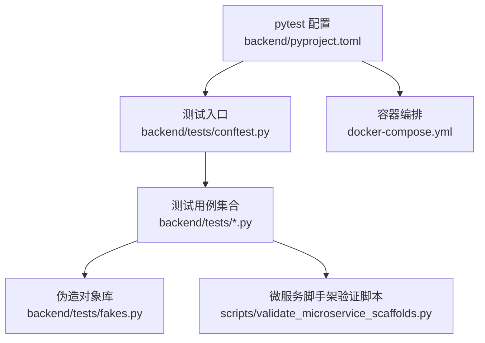
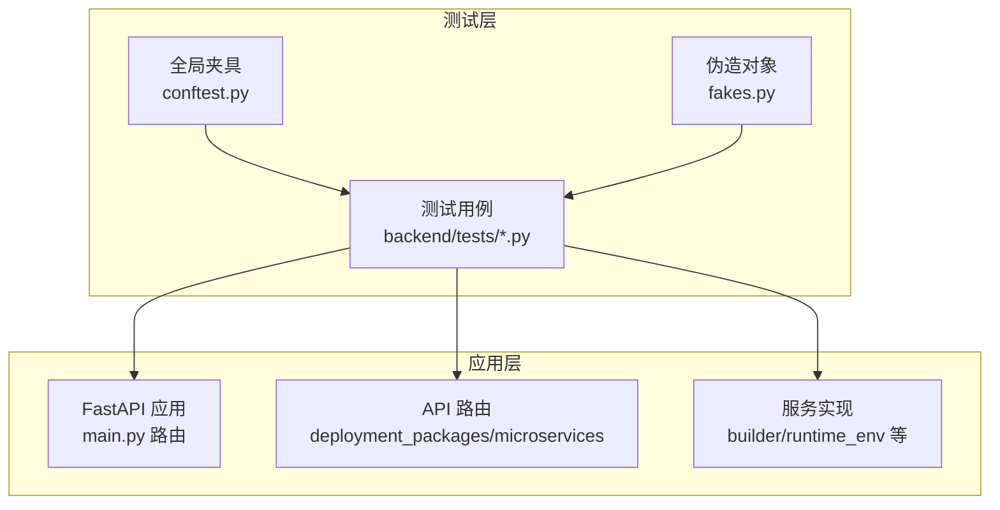
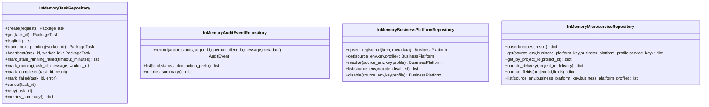
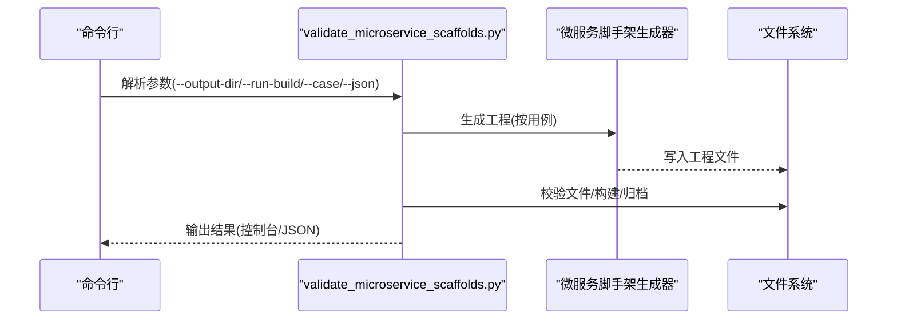
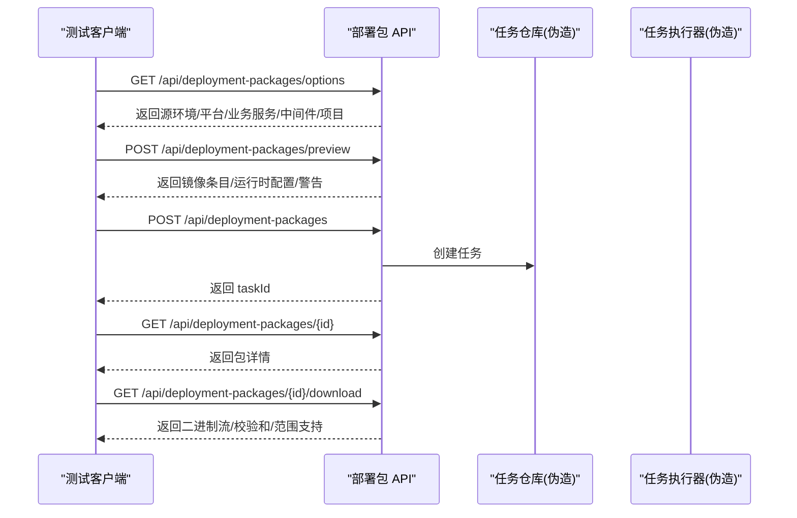
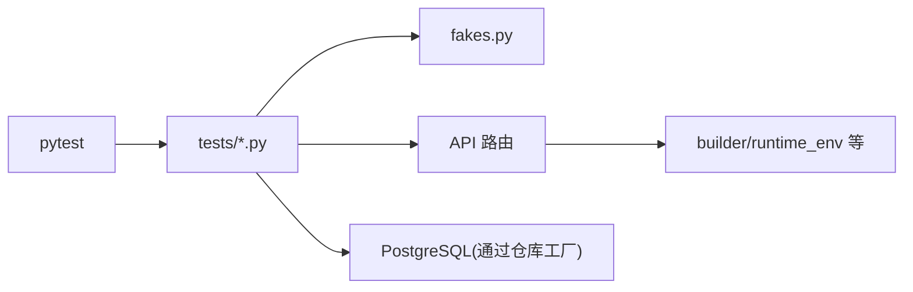

# 测试工具与辅助

<cite>
**本文引用的文件**
- [backend/tests/conftest.py](file://backend/tests/conftest.py)
- [backend/tests/fakes.py](file://backend/tests/fakes.py)
- [backend/pyproject.toml](file://backend/pyproject.toml)
- [docker-compose.yml](file://docker-compose.yml)
- [scripts/validate_microservice_scaffolds.py](file://scripts/validate_microservice_scaffolds.py)
- [backend/tests/test_main.py](file://backend/tests/test_main.py)
- [backend/tests/test_worker.py](file://backend/tests/test_worker.py)
- [backend/tests/test_deployment_package_api.py](file://backend/tests/test_deployment_package_api.py)
- [backend/tests/test_microservice_scaffold_api.py](file://backend/tests/test_microservice_scaffold_api.py)
- [backend/tests/test_deployment_package_builder.py](file://backend/tests/test_deployment_package_builder.py)
- [backend/tests/test_runtime_env_probe.py](file://backend/tests/test_runtime_env_probe.py)
- [backend/tests/test_runtime_resources.py](file://backend/tests/test_runtime_resources.py)
- [backend/tests/test_repositories.py](file://backend/tests/test_repositories.py)
- [backend/tests/test_settings.py](file://backend/tests/test_settings.py)
</cite>

## 目录
1. [简介](#简介)
2. [项目结构](#项目结构)
3. [核心组件](#核心组件)
4. [架构总览](#架构总览)
5. [详细组件分析](#详细组件分析)
6. [依赖分析](#依赖分析)
7. [性能考虑](#性能考虑)
8. [故障排查指南](#故障排查指南)
9. [结论](#结论)
10. [附录](#附录)

## 简介
本文件面向部署包工厂测试工具与辅助，提供从 pytest 配置、测试夹具（conftest）与测试数据伪造（fakes）到微服务脚手架验证脚本、测试环境与容器管理、测试脚本编写、测试报告与调试技巧，以及测试最佳实践与自动化流水线配置的完整使用指南。目标是帮助开发者快速上手并高质量地开展单元测试、集成测试与端到端验证。

## 项目结构
后端测试位于 backend/tests，核心文件包括：
- pytest 配置与入口：backend/pyproject.toml 中的 tool.pytest.ini_options
- 全局夹具：backend/tests/conftest.py
- 测试数据伪造：backend/tests/fakes.py
- 微服务脚手架验证脚本：scripts/validate_microservice_scaffolds.py
- 多类测试用例：覆盖 API、构建器、运行时资源探测、仓库与设置等

图示来源
- [backend/pyproject.toml:27-30](file://backend/pyproject.toml#L27-L30)
- [backend/tests/conftest.py:1-10](file://backend/tests/conftest.py#L1-L10)
- [docker-compose.yml:1-36](file://docker-compose.yml#L1-L36)
- [scripts/validate_microservice_scaffolds.py:1-280](file://scripts/validate_microservice_scaffolds.py#L1-L280)

章节来源
- [backend/pyproject.toml:27-30](file://backend/pyproject.toml#L27-L30)
- [backend/tests/conftest.py:1-10](file://backend/tests/conftest.py#L1-L10)
- [docker-compose.yml:1-36](file://docker-compose.yml#L1-L36)

## 核心组件
- pytest 配置与路径
  - testpaths 指向 tests 目录；pythonpath 包含根路径，确保模块导入正确。
- 全局夹具（conftest）
  - 将仓库根路径注入 sys.path，便于在测试中直接导入后端模块。
- 测试数据伪造（fakes）
  - 提供内存版任务、审计事件、业务平台与微服务仓库，支持任务生命周期、指标统计与状态变更模拟。
- 微服务脚手架验证脚本
  - 自动生成多技术栈微服务工程，执行文件存在性、构建与归档校验，并可输出 JSON 报告。
- 测试用例覆盖
  - API 行为、工作器执行、部署包构建器、运行时环境探测与资源编排、仓库工厂与设置加载等。

章节来源
- [backend/pyproject.toml:27-30](file://backend/pyproject.toml#L27-L30)
- [backend/tests/conftest.py:7-10](file://backend/tests/conftest.py#L7-L10)
- [backend/tests/fakes.py:20-226](file://backend/tests/fakes.py#L20-L226)
- [scripts/validate_microservice_scaffolds.py:60-129](file://scripts/validate_microservice_scaffolds.py#L60-L129)

## 架构总览
下图展示测试层与被测模块的关系：测试通过 TestClient 访问 FastAPI 路由，借助 monkeypatch 注入伪造仓库与设置，从而隔离外部依赖并稳定复现场景。

图示来源
- [backend/tests/test_deployment_package_api.py:20-33](file://backend/tests/test_deployment_package_api.py#L20-L33)
- [backend/tests/test_worker.py:11-38](file://backend/tests/test_worker.py#L11-L38)
- [backend/tests/test_main.py:13-27](file://backend/tests/test_main.py#L13-L27)

## 详细组件分析

### pytest 配置与运行
- 配置要点
  - testpaths 指定测试目录
  - pythonpath 包含根路径，保证导入 backend 子模块
- 运行方式
  - 使用 pytest 命令在仓库根目录执行，或在 IDE 中选择 backend/tests 目录作为测试根目录

章节来源
- [backend/pyproject.toml:27-30](file://backend/pyproject.toml#L27-L30)

### 全局夹具（conftest）
- 功能
  - 将仓库根路径插入 sys.path，使测试可直接导入后端模块
- 影响范围
  - 所有 tests 下的测试文件共享该夹具

章节来源
- [backend/tests/conftest.py:7-10](file://backend/tests/conftest.py#L7-L10)

### 测试数据伪造（fakes）
- InMemoryTaskRepository
  - 支持创建、查询、列表、心跳、超时标记失败、运行中更新、完成/失败/取消/重试等状态流转
  - 提供 metrics_summary 统计可用产物大小与数量
- InMemoryAuditEventRepository
  - 记录审计事件并按 action/status/action_prefix 过滤
  - 提供 byAction 统计
- InMemoryBusinessPlatformRepository
  - 支持 upsert_registered、resolve、list、disable 等业务平台元数据操作
- InMemoryMicroserviceRepository
  - upsert/get/get_by_project_id/update_delivery/update_fields/list
- 辅助函数
  - _artifact_available/_parse_iso/_now_iso

图示来源
- [backend/tests/fakes.py:20-226](file://backend/tests/fakes.py#L20-L226)
- [backend/tests/fakes.py:228-279](file://backend/tests/fakes.py#L228-L279)
- [backend/tests/fakes.py:281-333](file://backend/tests/fakes.py#L281-L333)
- [backend/tests/fakes.py:335-384](file://backend/tests/fakes.py#L335-L384)

章节来源
- [backend/tests/fakes.py:20-226](file://backend/tests/fakes.py#L20-L226)
- [backend/tests/fakes.py:228-279](file://backend/tests/fakes.py#L228-L279)
- [backend/tests/fakes.py:281-333](file://backend/tests/fakes.py#L281-L333)
- [backend/tests/fakes.py:335-384](file://backend/tests/fakes.py#L335-L384)

### 微服务脚手架验证脚本（validate_microservice_scaffolds.py）
- 功能概览
  - 生成多技术栈微服务工程（Python/Node/Java/Vue/React），校验关键文件、构建脚本、命名空间与归档完整性
  - 可选执行本地构建检查（当工具链可用时）
  - 输出 JSON 总结与保留临时输出目录
- 关键流程
  - 解析参数与输出目录
  - 逐用例生成并校验，记录通过/失败检查项
  - 可打印 JSON 结果用于 CI 分析

图示来源
- [scripts/validate_microservice_scaffolds.py:60-129](file://scripts/validate_microservice_scaffolds.py#L60-L129)
- [scripts/validate_microservice_scaffolds.py:102-129](file://scripts/validate_microservice_scaffolds.py#L102-L129)

章节来源
- [scripts/validate_microservice_scaffolds.py:60-129](file://scripts/validate_microservice_scaffolds.py#L60-L129)
- [scripts/validate_microservice_scaffolds.py:132-149](file://scripts/validate_microservice_scaffolds.py#L132-L149)
- [scripts/validate_microservice_scaffolds.py:152-221](file://scripts/validate_microservice_scaffolds.py#L152-L221)

### API 测试（以部署包 API 为例）
- 测试要点
  - 选项接口返回运行时服务与项目信息
  - 预览接口解析依赖、镜像与运行时配置
  - 创建部署包任务并下载产物，支持 Range 与 If-Range
  - 令牌鉴权与下载脚本生成
  - 工作器模式下任务保持 pending
- 关键断言
  - 状态码、响应体字段、下载头信息、校验和格式

图示来源
- [backend/tests/test_deployment_package_api.py:36-81](file://backend/tests/test_deployment_package_api.py#L36-L81)
- [backend/tests/test_deployment_package_api.py:147-178](file://backend/tests/test_deployment_package_api.py#L147-L178)
- [backend/tests/test_deployment_package_api.py:400-462](file://backend/tests/test_deployment_package_api.py#L400-L462)
- [backend/tests/test_deployment_package_api.py:498-561](file://backend/tests/test_deployment_package_api.py#L498-L561)

章节来源
- [backend/tests/test_deployment_package_api.py:36-81](file://backend/tests/test_deployment_package_api.py#L36-L81)
- [backend/tests/test_deployment_package_api.py:147-178](file://backend/tests/test_deployment_package_api.py#L147-L178)
- [backend/tests/test_deployment_package_api.py:400-462](file://backend/tests/test_deployment_package_api.py#L400-L462)
- [backend/tests/test_deployment_package_api.py:498-561](file://backend/tests/test_deployment_package_api.py#L498-L561)

### 工作器测试（worker）
- 测试要点
  - 单次执行 pending 任务并完成
  - 超时未心跳的任务标记失败
- 断言
  - 任务状态、worker_id、心跳时间、结果存在

章节来源
- [backend/tests/test_worker.py:11-38](file://backend/tests/test_worker.py#L11-L38)
- [backend/tests/test_worker.py:40-55](file://backend/tests/test_worker.py#L40-L55)

### 主进程健康与指标测试（main）
- 测试要点
  - 指标导出为 Prometheus 文本格式
  - 就绪检查包含数据库连接、输出目录与镜像导出环境
- 断言
  - 状态码、内容类型、指标文本片段、就绪详情

章节来源
- [backend/tests/test_main.py:13-27](file://backend/tests/test_main.py#L13-L27)
- [backend/tests/test_main.py:29-40](file://backend/tests/test_main.py#L29-L40)
- [backend/tests/test_main.py:42-67](file://backend/tests/test_main.py#L42-L67)
- [backend/tests/test_main.py:69-89](file://backend/tests/test_main.py#L69-L89)

### 微服务脚手架 API 测试
- 测试要点
  - 注册微服务前需已注册业务平台
  - 生成工程包含模板文件、构建与部署命令、制品归档
  - 支持系统设置默认值与凭据自动准备
  - 交付流程重试与项目根缺失处理
- 断言
  - 响应字段、制品路径存在、归档内文件清单、交付状态

章节来源
- [backend/tests/test_microservice_scaffold_api.py:22-44](file://backend/tests/test_microservice_scaffold_api.py#L22-L44)
- [backend/tests/test_microservice_scaffold_api.py:46-186](file://backend/tests/test_microservice_scaffold_api.py#L46-L186)
- [backend/tests/test_microservice_scaffold_api.py:579-640](file://backend/tests/test_microservice_scaffold_api.py#L579-L640)
- [backend/tests/test_microservice_scaffold_api.py:695-764](file://backend/tests/test_microservice_scaffold_api.py#L695-L764)

### 部署包构建器测试
- 测试要点
  - 生成 MVP 归档与校验和
  - 包含验证脚本、安装/卸载/诊断脚本、安全校验
  - 运行时环境变量解析与占位符处理
  - 目标配置覆盖与项目默认值驱动
- 断言
  - 归档文件存在、脚本可执行、manifest 字段、SHA256SUMS

章节来源
- [backend/tests/test_deployment_package_builder.py:24-120](file://backend/tests/test_deployment_package_builder.py#L24-L120)
- [backend/tests/test_deployment_package_builder.py:161-265](file://backend/tests/test_deployment_package_builder.py#L161-L265)
- [backend/tests/test_deployment_package_builder.py:319-406](file://backend/tests/test_deployment_package_builder.py#L319-L406)
- [backend/tests/test_deployment_package_builder.py:434-471](file://backend/tests/test_deployment_package_builder.py#L434-L471)
- [backend/tests/test_deployment_package_builder.py:608-669](file://backend/tests/test_deployment_package_builder.py#L608-L669)

### 运行时环境探测与资源编排测试
- 测试要点
  - 从 Pod/ConfigMap/Secret 读取环境变量与嵌套 YAML
  - 数据库 JDBC URL、桶与集合资源去重与作用域
  - 运行时配置组与覆盖项的来源与作用域
- 断言
  - 探测结果字段、资源去重、覆盖项生效

章节来源
- [backend/tests/test_runtime_env_probe.py:6-54](file://backend/tests/test_runtime_env_probe.py#L6-L54)
- [backend/tests/test_runtime_env_probe.py:176-215](file://backend/tests/test_runtime_env_probe.py#L176-L215)
- [backend/tests/test_runtime_resources.py:9-41](file://backend/tests/test_runtime_resources.py#L9-L41)
- [backend/tests/test_runtime_resources.py:43-65](file://backend/tests/test_runtime_resources.py#L43-L65)
- [backend/tests/test_runtime_resources.py:147-177](file://backend/tests/test_runtime_resources.py#L147-L177)

### 仓库工厂与设置测试
- 测试要点
  - 缺少数据库 URL 时抛出异常
  - 配置数据库 URL 后使用 PostgreSQL 实现
  - 审计仓库在缺少表时自动重建并重试
  - 设置加载对并发度与执行模式进行边界处理
- 断言
  - 异常消息、工厂返回实例、重试次数

章节来源
- [backend/tests/test_repositories.py:18-28](file://backend/tests/test_repositories.py#L18-L28)
- [backend/tests/test_repositories.py:30-46](file://backend/tests/test_repositories.py#L30-L46)
- [backend/tests/test_repositories.py:47-65](file://backend/tests/test_repositories.py#L47-L65)
- [backend/tests/test_settings.py:8-34](file://backend/tests/test_settings.py#L8-L34)
- [backend/tests/test_settings.py:36-50](file://backend/tests/test_settings.py#L36-L50)

## 依赖分析
- 测试对被测模块的耦合
  - 测试通过 monkeypatch 替换模块级全局仓库与执行器，降低对外部系统依赖
  - 伪造对象提供稳定的任务状态与审计事件序列
- 外部依赖
  - PostgreSQL（仓库工厂）、FastAPI（路由）、Pydantic（模型）
- 可能的循环依赖
  - 测试通过夹具注入路径避免直接导入导致的循环

图示来源
- [backend/tests/test_deployment_package_api.py:20-28](file://backend/tests/test_deployment_package_api.py#L20-L28)
- [backend/tests/test_repositories.py:30-46](file://backend/tests/test_repositories.py#L30-L46)

章节来源
- [backend/tests/test_deployment_package_api.py:20-28](file://backend/tests/test_deployment_package_api.py#L20-L28)
- [backend/tests/test_repositories.py:30-46](file://backend/tests/test_repositories.py#L30-L46)

## 性能考虑
- 测试并发与超时
  - 工作器超时阈值可通过环境变量配置，避免僵尸任务占用资源
- 仓库访问重试
  - 审计仓库在缺少表时自动重建并重试，减少初始化开销
- 构建产物校验
  - 通过 SHA256SUMS 与归档完整性校验，避免重复下载与无效传输

章节来源
- [backend/tests/test_worker.py:46-55](file://backend/tests/test_worker.py#L46-L55)
- [backend/tests/test_repositories.py:47-65](file://backend/tests/test_repositories.py#L47-L65)
- [backend/tests/test_deployment_package_builder.py:608-669](file://backend/tests/test_deployment_package_builder.py#L608-L669)

## 故障排查指南
- 数据库 URL 缺失
  - 现象：仓库工厂创建时报错提示需要数据库 URL
  - 处理：设置 DEPLOYMENT_PACKAGE_DATABASE_URL 或在测试中通过 monkeypatch 注入
- 就绪检查失败
  - 现象：/health/ready 返回 not_ready 或 degraded
  - 处理：检查数据库连接、输出目录权限、镜像导出工具可用性
- 任务超时
  - 现象：长时间无心跳的任务被标记失败
  - 处理：调整超时阈值或确保工作器正常心跳
- 下载范围错误
  - 现象：Range 请求返回 416
  - 处理：确认 Range 起止位置与文件大小匹配

章节来源
- [backend/tests/test_repositories.py:18-28](file://backend/tests/test_repositories.py#L18-L28)
- [backend/tests/test_main.py:29-40](file://backend/tests/test_main.py#L29-L40)
- [backend/tests/test_worker.py:40-55](file://backend/tests/test_worker.py#L40-L55)
- [backend/tests/test_deployment_package_api.py:670-696](file://backend/tests/test_deployment_package_api.py#L670-L696)

## 结论
本文档提供了部署包工厂测试工具与辅助的系统化使用指南，涵盖 pytest 配置、conftest 与 fakes 的使用、微服务脚手架验证脚本、测试环境与容器管理、测试脚本编写、报告分析与调试技巧，并总结了性能与最佳实践。建议在开发与 CI 中结合这些工具与流程，确保质量与效率。

## 附录
- 测试环境搭建
  - 使用 docker-compose 启动后端与前端服务，设置 DEPLOYMENT_PACKAGE_DATABASE_URL 等环境变量
- 测试数据库配置
  - 通过 DEPLOYMENT_PACKAGE_DATABASE_URL 指向 PostgreSQL；测试中可使用仓库工厂创建真实连接
- 测试容器管理策略
  - 使用 docker-compose 健康检查与依赖顺序，确保后端健康后再启动前端
- 测试脚本编写指南
  - 利用 monkeypatch 注入伪造仓库与设置；使用 TestClient 访问路由；断言状态码与响应体字段
- 测试报告分析方法
  - validate_microservice_scaffolds.py 支持 JSON 输出，便于 CI 聚合与可视化
- 测试调试技巧
  - 在测试中打印关键中间态（如 manifest、env 文件内容）；利用 Range 与 If-Range 验证下载逻辑
- 测试最佳实践
  - 优先使用伪造对象隔离外部依赖；为每个场景设计最小化前置条件；对关键路径添加边界与错误分支测试
- 自动化测试流水线配置
  - 在 CI 中设置 pytest 参数与环境变量，调用 validate_microservice_scaffolds.py 并收集 JSON 报告

章节来源
- [docker-compose.yml:8-22](file://docker-compose.yml#L8-L22)
- [backend/tests/test_settings.py:8-34](file://backend/tests/test_settings.py#L8-L34)
- [scripts/validate_microservice_scaffolds.py:60-99](file://scripts/validate_microservice_scaffolds.py#L60-L99)