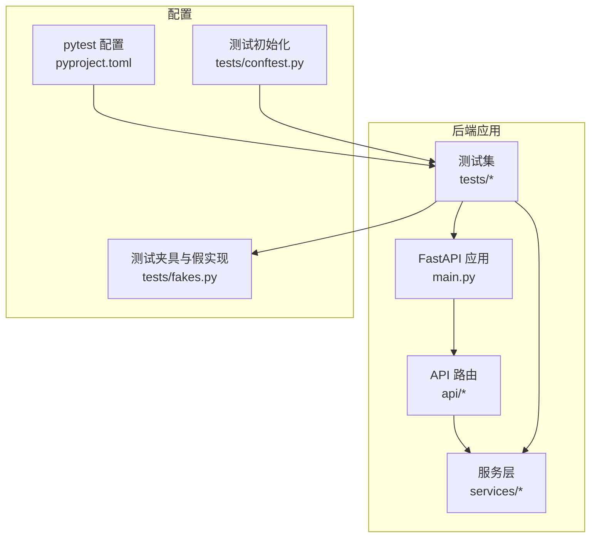
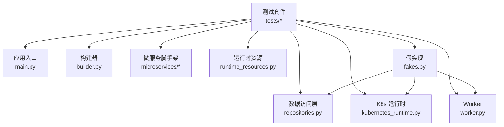
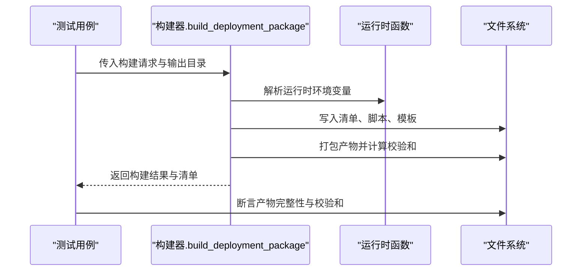
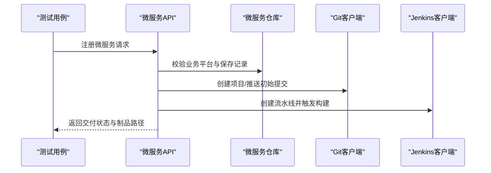
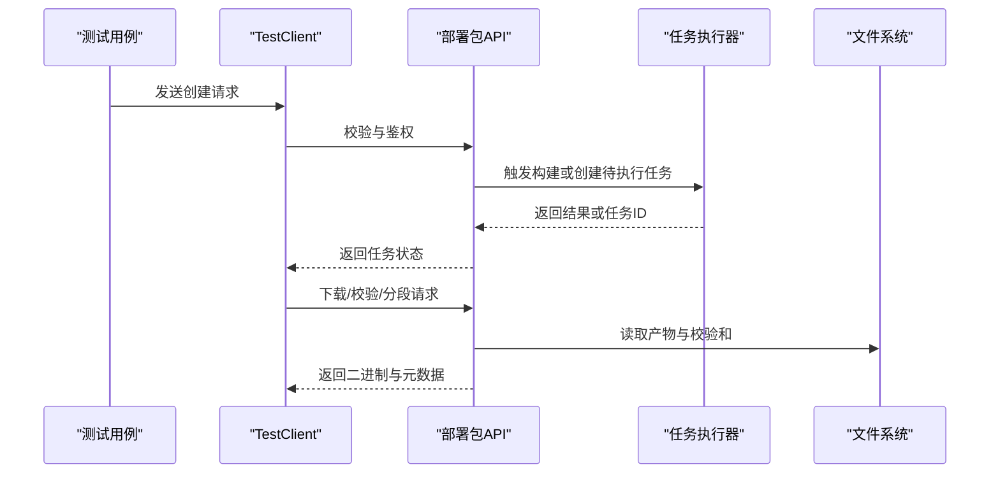
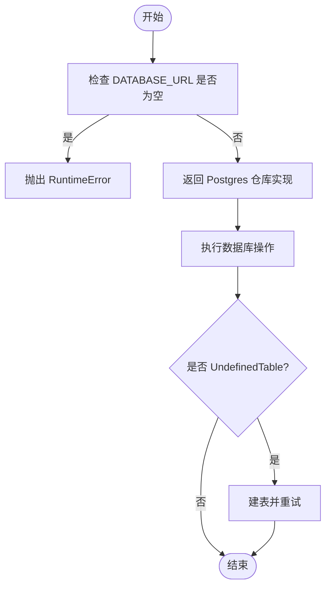
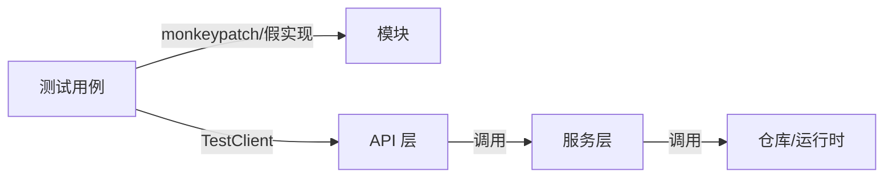

# 测试策略

<cite>
**本文引用的文件**
- [pyproject.toml](file://backend/pyproject.toml)
- [conftest.py](file://backend/tests/conftest.py)
- [fakes.py](file://backend/tests/fakes.py)
- [main.py](file://backend/deployment_package_factory/main.py)
- [builder.py](file://backend/deployment_package_factory/services/deployment_packages/builder.py)
- [test_deployment_package_builder.py](file://backend/tests/test_deployment_package_builder.py)
- [test_deployment_package_api.py](file://backend/tests/test_deployment_package_api.py)
- [test_repositories.py](file://backend/tests/test_repositories.py)
- [test_runtime_resources.py](file://backend/tests/test_runtime_resources.py)
- [test_kubernetes_runtime.py](file://backend/tests/test_kubernetes_runtime.py)
- [test_microservice_scaffold_api.py](file://backend/tests/test_microservice_scaffold_api.py)
- [test_settings.py](file://backend/tests/test_settings.py)
- [test_worker.py](file://backend/tests/test_worker.py)
- [test_metrics.py](file://backend/tests/test_metrics.py)
- [test_main.py](file://backend/tests/test_main.py)
</cite>

## 目录
1. [引言](#引言)
2. [项目结构](#项目结构)
3. [核心组件](#核心组件)
4. [架构总览](#架构总览)
5. [详细组件分析](#详细组件分析)
6. [依赖关系分析](#依赖关系分析)
7. [性能考量](#性能考量)
8. [故障排查指南](#故障排查指南)
9. [结论](#结论)
10. [附录](#附录)

## 引言
本测试策略面向"部署包工厂"后端服务，覆盖从单元测试到集成测试的完整测试体系，重点围绕以下方面展开：
- 单元测试框架配置与测试用例设计
- 核心功能模块测试策略（部署包构建器、微服务注册、API 接口、数据访问层）
- 集成测试方案（端到端、性能、回归）
- 测试工具使用（pytest 配置、测试数据准备、模拟对象）
- 测试脚本与验证工具、测试报告分析
- 最佳实践、持续集成测试与测试环境管理

## 项目结构
后端采用 FastAPI 应用，核心代码位于 deployment_package_factory 包内，测试集中于 backend/tests。pytest 通过 pyproject.toml 指定测试路径与 Python 路径，便于直接导入源码模块。

**图示来源**
- [main.py:1-68](file://backend/deployment_package_factory/main.py#L1-L68)
- [pyproject.toml:27-30](file://backend/pyproject.toml#L27-L30)
- [fakes.py:1-401](file://backend/tests/fakes.py#L1-L401)
- [conftest.py:1-10](file://backend/tests/conftest.py#L1-L10)

**章节来源**
- [pyproject.toml:1-30](file://backend/pyproject.toml#L1-L30)
- [conftest.py:1-10](file://backend/tests/conftest.py#L1-L10)

## 核心组件
- 应用入口与健康检查：FastAPI 应用创建、CORS、路由挂载、健康与就绪检查、指标导出。
- 部署包构建器：负责解析请求、发现运行时镜像、渲染部署清单、打包产物等。
- 数据访问层：任务、审计事件、业务平台、微服务等仓库抽象与 Postgres 实现。
- 微服务脚手架：根据业务平台生成微服务工程骨架与交付流程。
- 运行时资源：从运行时环境与配置映射中提取运行时配置与资源。
- Worker：后台任务拉取与执行，支持超时检测与心跳维护。
- 设置与度量：系统设置加载、Prometheus 文本格式指标导出。

**章节来源**
- [main.py:23-68](file://backend/deployment_package_factory/main.py#L23-L68)
- [builder.py:146-247](file://backend/deployment_package_factory/services/deployment_packages/builder.py#L146-L247)

## 架构总览
下图展示测试与被测模块之间的交互关系，强调测试对真实模块的隔离与可控注入。

**图示来源**
- [test_deployment_package_api.py:1-120](file://backend/tests/test_deployment_package_api.py#L1-L120)
- [test_deployment_package_builder.py:1-60](file://backend/tests/test_deployment_package_builder.py#L1-L60)
- [test_repositories.py:1-65](file://backend/tests/test_repositories.py#L1-L65)
- [test_kubernetes_runtime.py:1-156](file://backend/tests/test_kubernetes_runtime.py#L1-L156)
- [test_runtime_resources.py:1-298](file://backend/tests/test_runtime_resources.py#L1-L298)
- [test_worker.py:1-55](file://backend/tests/test_worker.py#L1-L55)
- [fakes.py:1-401](file://backend/tests/fakes.py#L1-L401)

## 详细组件分析

### 单元测试框架与配置
- pytest 配置：通过 pyproject.toml 指定 testpaths 与 pythonpath，确保测试可直接导入源码模块。
- 测试初始化：conftest.py 将仓库根目录加入 sys.path，统一测试环境。
- 假实现：fakes.py 提供内存版仓库与运行时模拟，避免外部依赖影响测试稳定性。

**章节来源**
- [pyproject.toml:27-30](file://backend/pyproject.toml#L27-L30)
- [conftest.py:1-10](file://backend/tests/conftest.py#L1-L10)
- [fakes.py:1-401](file://backend/tests/fakes.py#L1-L401)

### 部署包构建器测试策略
- 覆盖范围：构建产物完整性、注册微服务注入、运行时环境变量解析、镜像导出与校验脚本生成、项目默认参数、质量门禁与验收报告、PowerShell 验证器行为、K8s/Compose 渲染结果、包索引与 SHA256 签名校验等。
- 关键断言点：
  - 产物文件存在性与大小一致性、校验和文件格式正确。
  - 清单字段与镜像条目符合预期，包含注册微服务与业务中间件。
  - 运行时环境变量优先级（K8s Secret > 进程环境），占位符处理策略。
  - 质量门禁与验收报告文件生成，PowerShell 验证器对篡改敏感。
  - 包索引结构与文件清单一致，SHA256SUMS 覆盖除自身外所有文件。
- 测试数据与模拟：
  - 使用 monkeypatch 注入假仓库与运行时函数，控制环境变量与 Kubernetes 访问。
  - 通过临时目录输出构建产物，断言文件树与脚本权限。

**图示来源**
- [test_deployment_package_builder.py:24-120](file://backend/tests/test_deployment_package_builder.py#L24-L120)
- [builder.py:146-247](file://backend/deployment_package_factory/services/deployment_packages/builder.py#L146-L247)

**章节来源**
- [test_deployment_package_builder.py:1-800](file://backend/tests/test_deployment_package_builder.py#L1-L800)
- [builder.py:105-144](file://backend/deployment_package_factory/services/deployment_packages/builder.py#L105-L144)

### 微服务注册测试策略
- 覆盖范围：业务平台注册与禁用、微服务脚手架生成（Python/Node/Java/Vue/React）、多技术栈与微前端框架、系统设置默认值、Git/Jenkins 自动化交付、重试机制与制品保留。
- 关键断言点：
  - 未注册业务平台时拒绝注册微服务。
  - 生成工程骨架文件齐全，模板变量按业务平台命名空间与中间件配置填充。
  - 技术栈差异（TypeScript、Maven、Vite 等）与微前端适配正确。
  - 系统设置默认值生效，URL 与命名空间规范化。
  - Git/GitHub 与 Jenkins 凭据存在时自动创建项目与流水线，并触发构建。
  - 重试场景下保留制品，仅重新执行失败步骤。
- 测试数据与模拟：
  - 使用假业务平台与微服务仓库，模拟系统设置与外部服务客户端。

**图示来源**
- [test_microservice_scaffold_api.py:22-180](file://backend/tests/test_microservice_scaffold_api.py#L22-L180)
- [test_microservice_scaffold_api.py:579-640](file://backend/tests/test_microservice_scaffold_api.py#L579-L640)

**章节来源**
- [test_microservice_scaffold_api.py:1-1059](file://backend/tests/test_microservice_scaffold_api.py#L1-L1059)

### API 接口测试策略
- 覆盖范围：选项查询、预览依赖解析、下载脚本与分段下载、令牌鉴权、错误与阻塞条件、Worker 模式与默认镜像导出模式。
- 关键断言点：
  - 无运行时数据时返回空选项；有运行时数据时返回业务平台、数据库、中间件与项目列表。
  - 预览返回解析后的平台/业务服务、中间件与镜像条目，包含运行时镜像来源信息。
  - 下载支持 Range、If-Range、HEAD 元数据，下载脚本包含断点续传与哈希校验。
  - 令牌支持 Bearer 与自定义头，查询参数不生效。
  - Worker 模式下任务保持 pending，未执行实际构建。
  - 注册微服务未就绪时阻止创建部署包。
- 测试数据与模拟：
  - 使用 TestClient 直接调用路由，monkeypatch 注入假仓库与构建器。

**图示来源**
- [test_deployment_package_api.py:400-530](file://backend/tests/test_deployment_package_api.py#L400-L530)
- [test_deployment_package_api.py:597-638](file://backend/tests/test_deployment_package_api.py#L597-L638)

**章节来源**
- [test_deployment_package_api.py:1-1138](file://backend/tests/test_deployment_package_api.py#L1-L1138)

### 数据访问层测试策略
- 覆盖范围：仓库工厂函数在缺少数据库 URL 时抛错、Postgres 仓库可用性、表不存在时自动建表重试。
- 关键断言点：
  - 未配置数据库 URL 时，各仓库工厂均抛出 RuntimeError。
  - 配置数据库 URL 后，返回 Postgres 实现。
  - 首次操作遇到 UndefinedTable 时自动建表并重试成功。
- 测试数据与模拟：
  - 使用 monkeypatch 替换仓库类构造函数与内部方法，验证异常路径与重试逻辑。

**图示来源**
- [test_repositories.py:18-65](file://backend/tests/test_repositories.py#L18-L65)

**章节来源**
- [test_repositories.py:1-65](file://backend/tests/test_repositories.py#L1-L65)

### 运行时资源与 Kubernetes 运行时测试策略
- 运行时资源：
  - 资源去重（共享数据库、桶、集合）、配置覆盖、探针来源优先级、数据库 DSN 解析、集合向量维度与距离固定默认值。
- Kubernetes 运行时：
  - 业务平台注册注解与标签、命名空间发现（含本地标签与标准命名空间）、Secret/ConfigMap 解码、业务平台发现。

**章节来源**
- [test_runtime_resources.py:1-298](file://backend/tests/test_runtime_resources.py#L1-L298)
- [test_kubernetes_runtime.py:1-156](file://backend/tests/test_kubernetes_runtime.py#L1-L156)

### Worker 与度量测试策略
- Worker：
  - 仅拉取并执行一个待处理任务，更新状态、心跳与结果；长时间未心跳的任务标记失败。
- 度量：
  - 导出 Prometheus 文本格式指标，包含任务总数、按状态计数、可用制品数、审计事件按动作计数。

**章节来源**
- [test_worker.py:1-55](file://backend/tests/test_worker.py#L1-L55)
- [test_metrics.py:1-22](file://backend/tests/test_metrics.py#L1-L22)

### 主程序与设置测试策略
- 主程序：
  - /metrics 输出 Prometheus 文本格式；/health/ready 就绪检查包含数据库、输出目录、镜像导出工具状态。
- 设置：
  - 环境变量加载与边界值处理（并发限制、执行模式）、系统设置默认值、Excel 环境配置导入。

**章节来源**
- [test_main.py:13-146](file://backend/tests/test_main.py#L13-L146)
- [test_settings.py:1-108](file://backend/tests/test_settings.py#L1-L108)

## 依赖关系分析
- 测试耦合与内聚：
  - 测试通过 monkeypatch 与假实现隔离外部依赖，提升内聚与可维护性。
  - fakes 提供统一的内存存储，减少对真实数据库与集群的依赖。
- 外部依赖与集成点：
  - Kubernetes API（通过运行时函数封装）、Postgres、Docker/Skopeo（镜像导出）、Git/Jenkins（微服务交付）。
- 可能的循环依赖：
  - 测试通过注入避免直接依赖，未见明显循环。

**图示来源**
- [test_deployment_package_api.py:1-120](file://backend/tests/test_deployment_package_api.py#L1-L120)
- [fakes.py:1-401](file://backend/tests/fakes.py#L1-L401)

## 性能考量
- 测试性能：
  - 使用内存仓库与临时文件系统输出，避免磁盘与网络 IO 开销。
  - 通过最小化请求体与禁用真实镜像导出工具，缩短测试时长。
- 构建性能：
  - 通过测试断言构建产物大小与校验和一致性，间接验证打包效率。
- 并发与限流：
  - 设置最大并发构建数，避免测试期间资源争用。

## 故障排查指南
- 常见问题与定位：
  - 数据库连接失败：检查 DATABASE_URL 环境变量与 Postgres 可达性；确认仓库工厂在空 URL 时抛错。
  - 镜像导出不可用：检查 Docker/Skopeo 可用性；就绪检查允许警告降级。
  - 下载断点续传失败：核对 Range/If-Range 请求头与 ETag 一致性。
  - 微服务交付失败：检查 Git/Jenkins 凭据与项目创建状态，利用重试机制恢复。
- 日志与指标：
  - 通过 /metrics 查看任务与审计事件指标，辅助定位异常峰值与失败原因。

**章节来源**
- [test_repositories.py:47-65](file://backend/tests/test_repositories.py#L47-L65)
- [test_main.py:29-89](file://backend/tests/test_main.py#L29-L89)
- [test_deployment_package_api.py:563-595](file://backend/tests/test_deployment_package_api.py#L563-L595)

## 结论
本测试策略以 pytest 为核心，结合假实现与外部依赖隔离，覆盖了部署包构建、微服务注册、API 接口、数据访问层、运行时资源与 Kubernetes 运行时、Worker 与度量等关键模块。通过端到端测试与单元测试相结合，确保功能正确性与回归稳定性；通过设置与度量测试保障可观测性与运维需求。

## 附录

### 测试覆盖率要求
- 建议目标：
  - 语句覆盖率 ≥ 85%，分支覆盖率 ≥ 75%，函数/类覆盖率 ≥ 90%。
- 覆盖重点：
  - 构建器主流程与异常路径、API 错误码与鉴权、仓库工厂与重试逻辑、运行时资源解析与去重、K8s 运行时访问与解码、Worker 心跳与超时、度量导出格式。

### 测试工具使用指南
- pytest 配置：
  - testpaths 与 pythonpath 已在 pyproject.toml 中配置，确保测试可直接导入源码。
- 测试数据准备：
  - 使用 fakes 提供的内存仓库与运行时模拟，通过 monkeypatch 注入。
- 模拟对象创建：
  - 在测试夹具中注入假实现，避免真实外部依赖。
- 测试脚本与验证工具：
  - 使用 TestClient 直接调用路由进行端到端验证；PowerShell 验证器用于包完整性校验。
- 测试报告分析：
  - 通过 /metrics 与审计事件统计评估系统健康状况与异常趋势。

### 测试基础设施更新说明

**更新摘要**
- 全面更新测试基础设施，将所有 monkeypatch 更新从 deployment_packages 模块属性改为 _common 模块等价物
- 统一测试夹具中的依赖注入方式，提升测试一致性与可维护性

**更新详情**
- 部署包 API 测试：将 `_BUSINESS_PLATFORM_REPO`、`_MICROSERVICE_REPO`、`_TASK_REPO`、`_AUDIT_REPO`、`_TASK_EXECUTOR` 从 `deployment_packages` 模块属性更新为 `_common` 模块等价物
- 主程序测试：统一使用 `_common` 模块进行仓库属性替换
- 微服务 API 测试：更新业务平台与微服务仓库的 monkeypatch 注入方式
- Worker 测试：修正模块路径引用，使用正确的相对路径

**章节来源**
- [test_deployment_package_api.py:20-28](file://backend/tests/test_deployment_package_api.py#L20-L28)
- [test_main.py:18-19](file://backend/tests/test_main.py#L18-L19)
- [test_main.py:137-140](file://backend/tests/test_main.py#L137-L140)
- [test_microservice_scaffold_api.py:24-29](file://backend/tests/test_microservice_scaffold_api.py#L24-L29)
- [test_worker.py:18-27](file://backend/tests/test_worker.py#L18-L27)

**章节来源**
- [pyproject.toml:27-30](file://backend/pyproject.toml#L27-L30)
- [fakes.py:1-401](file://backend/tests/fakes.py#L1-L401)
- [test_metrics.py:1-22](file://backend/tests/test_metrics.py#L1-L22)