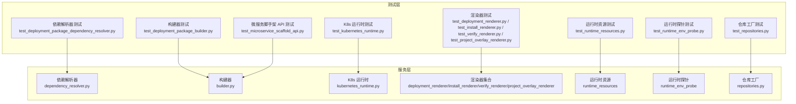
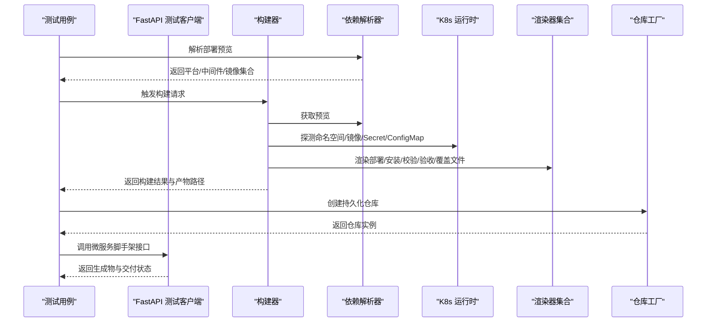
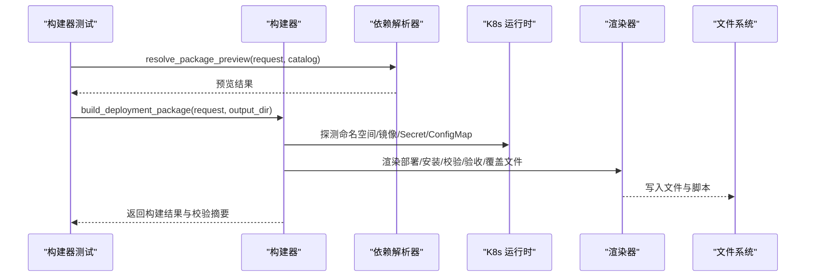
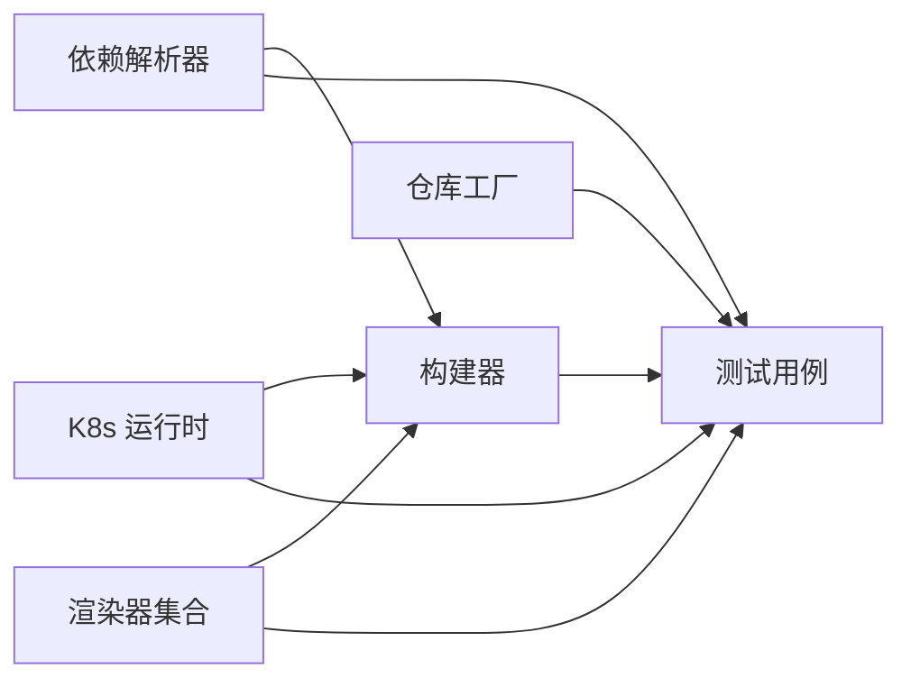

# 集成测试

<cite>
**本文档引用的文件**
- [backend/tests/conftest.py](file://backend/tests/conftest.py)
- [backend/tests/fakes.py](file://backend/tests/fakes.py)
- [backend/tests/test_deployment_package_builder.py](file://backend/tests/test_deployment_package_builder.py)
- [backend/tests/test_deployment_package_dependency_resolver.py](file://backend/tests/test_deployment_package_dependency_resolver.py)
- [backend/tests/test_kubernetes_runtime.py](file://backend/tests/test_kubernetes_runtime.py)
- [backend/tests/test_runtime_env_probe.py](file://backend/tests/test_runtime_env_probe.py)
- [backend/tests/test_runtime_resources.py](file://backend/tests/test_runtime_resources.py)
- [backend/tests/test_repositories.py](file://backend/tests/test_repositories.py)
- [backend/tests/test_deployment_renderer.py](file://backend/tests/test_deployment_renderer.py)
- [backend/tests/test_install_renderer.py](file://backend/tests/test_install_renderer.py)
- [backend/tests/test_verify_renderer.py](file://backend/tests/test_verify_renderer.py)
- [backend/tests/test_project_overlay_renderer.py](file://backend/tests/test_project_overlay_renderer.py)
- [backend/tests/test_microservice_scaffold_api.py](file://backend/tests/test_microservice_scaffold_api.py)
- [backend/deployment_package_factory/services/deployment_packages/builder.py](file://backend/deployment_package_factory/services/deployment_packages/builder.py)
- [backend/deployment_package_factory/services/deployment_packages/dependency_resolver.py](file://backend/deployment_package_factory/services/deployment_packages/dependency_resolver.py)
- [backend/deployment_package_factory/services/deployment_packages/kubernetes_runtime.py](file://backend/deployment_package_factory/services/deployment_packages/kubernetes_runtime.py)
- [backend/deployment_package_factory/services/deployment_packages/repositories.py](file://backend/deployment_package_factory/services/deployment_packages/repositories.py)
</cite>

## 目录
1. [引言](#引言)
2. [项目结构](#项目结构)
3. [核心组件](#核心组件)
4. [架构总览](#架构总览)
5. [详细组件分析](#详细组件分析)
6. [依赖分析](#依赖分析)
7. [性能考虑](#性能考虑)
8. [故障排查指南](#故障排查指南)
9. [结论](#结论)
10. [附录](#附录)

## 引言
本测试文档面向部署包工厂的集成测试，系统性阐述模块间集成测试的设计与实现方法，覆盖部署包构建器、依赖解析器、Kubernetes 运行时、数据库持久化、文件系统操作以及外部服务（Git/GitLab、Jenkins）集成等场景。文档同时提供端到端测试流程设计、测试环境配置与测试数据管理方法，并明确测试隔离策略、并发测试处理与测试结果验证标准。

## 项目结构
后端采用分层架构，测试集中在 backend/tests 目录，围绕服务层（services）中的部署包构建、依赖解析、Kubernetes 运行时、渲染器与仓库工厂等模块进行集成测试；前端通过 FastAPI 测试客户端对微服务脚手架 API 进行集成验证。

图表来源
- [backend/tests/test_deployment_package_dependency_resolver.py:1-110](file://backend/tests/test_deployment_package_dependency_resolver.py#L1-L110)
- [backend/tests/test_deployment_package_builder.py:1-800](file://backend/tests/test_deployment_package_builder.py#L1-L800)
- [backend/tests/test_kubernetes_runtime.py:1-156](file://backend/tests/test_kubernetes_runtime.py#L1-L156)
- [backend/tests/test_runtime_resources.py:1-298](file://backend/tests/test_runtime_resources.py#L1-L298)
- [backend/tests/test_runtime_env_probe.py:1-292](file://backend/tests/test_runtime_env_probe.py#L1-L292)
- [backend/tests/test_deployment_renderer.py:1-337](file://backend/tests/test_deployment_renderer.py#L1-L337)
- [backend/tests/test_install_renderer.py:1-57](file://backend/tests/test_install_renderer.py#L1-L57)
- [backend/tests/test_verify_renderer.py:1-37](file://backend/tests/test_verify_renderer.py#L1-L37)
- [backend/tests/test_project_overlay_renderer.py:1-64](file://backend/tests/test_project_overlay_renderer.py#L1-L64)
- [backend/tests/test_repositories.py:1-65](file://backend/tests/test_repositories.py#L1-L65)
- [backend/tests/test_microservice_scaffold_api.py:1-1059](file://backend/tests/test_microservice_scaffold_api.py#L1-L1059)
- [backend/deployment_package_factory/services/deployment_packages/dependency_resolver.py:1-216](file://backend/deployment_package_factory/services/deployment_packages/dependency_resolver.py#L1-L216)
- [backend/deployment_package_factory/services/deployment_packages/builder.py:1-1312](file://backend/deployment_package_factory/services/deployment_packages/builder.py#L1-L1312)
- [backend/deployment_package_factory/services/deployment_packages/kubernetes_runtime.py:1-459](file://backend/deployment_package_factory/services/deployment_packages/kubernetes_runtime.py#L1-L459)
- [backend/deployment_package_factory/services/deployment_packages/repositories.py:1-26](file://backend/deployment_package_factory/services/deployment_packages/repositories.py#L1-L26)

章节来源
- [backend/tests/conftest.py:1-10](file://backend/tests/conftest.py#L1-L10)

## 核心组件
- 依赖解析器：根据业务选择与项目配置推导平台、中间件与镜像集合，输出部署预览与警告。
- 构建器：整合解析结果与运行时环境，渲染部署清单、安装脚本、校验脚本、质量门禁与验收报告，打包产物并生成校验摘要。
- Kubernetes 运行时：封装 K8s API 访问、命名空间发现、业务平台注册、镜像导出 Pod 管理与 Secret/ConfigMap 读取。
- 渲染器：按模式（K8s/Docker Compose）生成部署文件、安装/校验/验收脚本与项目覆盖模板。
- 运行时资源与探针：从运行时容器环境抽取变量，合并到运行时配置，去重共享资源。
- 仓库工厂：统一创建 PostgreSQL 持久化仓库，缺失时抛出明确错误。
- 微服务脚手架 API：通过 FastAPI 测试客户端验证业务平台注册、微服务生成、交付流程与外部系统对接。

章节来源
- [backend/tests/test_deployment_package_dependency_resolver.py:1-110](file://backend/tests/test_deployment_package_dependency_resolver.py#L1-L110)
- [backend/tests/test_deployment_package_builder.py:1-800](file://backend/tests/test_deployment_package_builder.py#L1-L800)
- [backend/tests/test_kubernetes_runtime.py:1-156](file://backend/tests/test_kubernetes_runtime.py#L1-L156)
- [backend/tests/test_runtime_resources.py:1-298](file://backend/tests/test_runtime_resources.py#L1-L298)
- [backend/tests/test_runtime_env_probe.py:1-292](file://backend/tests/test_runtime_env_probe.py#L1-L292)
- [backend/tests/test_repositories.py:1-65](file://backend/tests/test_repositories.py#L1-L65)
- [backend/tests/test_microservice_scaffold_api.py:1-1059](file://backend/tests/test_microservice_scaffold_api.py#L1-L1059)

## 架构总览
下图展示从测试用例到服务层组件的调用链路与交互关系，体现集成测试如何覆盖多模块协作。

图表来源
- [backend/tests/test_deployment_package_builder.py:1-800](file://backend/tests/test_deployment_package_builder.py#L1-L800)
- [backend/tests/test_deployment_package_dependency_resolver.py:1-110](file://backend/tests/test_deployment_package_dependency_resolver.py#L1-L110)
- [backend/tests/test_kubernetes_runtime.py:1-156](file://backend/tests/test_kubernetes_runtime.py#L1-L156)
- [backend/tests/test_deployment_renderer.py:1-337](file://backend/tests/test_deployment_renderer.py#L1-L337)
- [backend/tests/test_install_renderer.py:1-57](file://backend/tests/test_install_renderer.py#L1-L57)
- [backend/tests/test_verify_renderer.py:1-37](file://backend/tests/test_verify_renderer.py#L1-L37)
- [backend/tests/test_project_overlay_renderer.py:1-64](file://backend/tests/test_project_overlay_renderer.py#L1-L64)
- [backend/tests/test_repositories.py:1-65](file://backend/tests/test_repositories.py#L1-L65)
- [backend/tests/test_microservice_scaffold_api.py:1-1059](file://backend/tests/test_microservice_scaffold_api.py#L1-L1059)

## 详细组件分析

### 部署包构建器集成测试
- 测试目标：验证构建器将依赖解析、运行时环境、渲染器与打包流程串联，生成符合预期的部署包与校验摘要。
- 关键断言：
  - 产物存在性与完整性（tar.gz、SHA256 文件）
  - 包含关键文件（manifest.json、package-index.json、安装/校验/质量门禁脚本、K8s/Docker Compose 清单）
  - 运行时配置覆盖生效（敏感值脱敏、固定集合默认值）
  - 注册微服务纳入业务镜像与部署清单
- 并发与隔离：使用临时目录与猴子补丁隔离外部依赖（如 Kubernetes API、微服务仓库），确保可重复执行。

图表来源
- [backend/tests/test_deployment_package_builder.py:1-800](file://backend/tests/test_deployment_package_builder.py#L1-L800)
- [backend/deployment_package_factory/services/deployment_packages/builder.py:146-246](file://backend/deployment_package_factory/services/deployment_packages/builder.py#L146-L246)
- [backend/deployment_package_factory/services/deployment_packages/dependency_resolver.py:14-94](file://backend/deployment_package_factory/services/deployment_packages/dependency_resolver.py#L14-L94)
- [backend/deployment_package_factory/services/deployment_packages/kubernetes_runtime.py:206-322](file://backend/deployment_package_factory/services/deployment_packages/kubernetes_runtime.py#L206-L322)

章节来源
- [backend/tests/test_deployment_package_builder.py:1-800](file://backend/tests/test_deployment_package_builder.py#L1-L800)
- [backend/deployment_package_factory/services/deployment_packages/builder.py:146-246](file://backend/deployment_package_factory/services/deployment_packages/builder.py#L146-L246)

### 依赖解析器测试策略
- 测试目标：验证解析器根据项目与业务选择正确扩展平台与中间件依赖，生成镜像集合与警告。
- 关键断言：
  - 默认能力加载与模板字段存在
  - 业务选择触发平台与中间件依赖收敛
  - 项目默认驱动选择与数据库限制规则
  - 未知项目/数据库报错
- 断言覆盖：解析结果包含平台/中间件键集、镜像集合、警告信息。

章节来源
- [backend/tests/test_deployment_package_dependency_resolver.py:1-110](file://backend/tests/test_deployment_package_dependency_resolver.py#L1-L110)
- [backend/deployment_package_factory/services/deployment_packages/dependency_resolver.py:14-216](file://backend/deployment_package_factory/services/deployment_packages/dependency_resolver.py#L14-L216)

### Kubernetes 运行时测试策略
- 测试目标：验证命名空间发现、业务平台注册、Secret/ConfigMap 读取与 Pod API 请求行为。
- 关键断言：
  - 命名空间解析包含标注与标准命名空间
  - 业务平台注册写入标签与注释
  - Secret/ConfigMap 数据解码与合并
  - API 请求异常与超时处理
- 隔离手段：通过猴子补丁替换底层 HTTP 请求，注入期望响应或错误。

章节来源
- [backend/tests/test_kubernetes_runtime.py:1-156](file://backend/tests/test_kubernetes_runtime.py#L1-L156)
- [backend/deployment_package_factory/services/deployment_packages/kubernetes_runtime.py:146-424](file://backend/deployment_package_factory/services/deployment_packages/kubernetes_runtime.py#L146-L424)

### 运行时资源与探针测试
- 测试目标：验证从运行时容器环境抽取变量，合并到运行时配置并去重共享资源。
- 关键断言：
  - 共享数据库/桶/集合去重与使用方聚合
  - 覆盖项按资源键作用域生效
  - 固定集合默认值不可编辑
  - JDBC URL 与探针凭据优先级
- 断言覆盖：资源组结构、环境值映射、资源名称与使用方。

章节来源
- [backend/tests/test_runtime_resources.py:1-298](file://backend/tests/test_runtime_resources.py#L1-L298)
- [backend/tests/test_runtime_env_probe.py:1-292](file://backend/tests/test_runtime_env_probe.py#L1-L292)

### 渲染器集成测试
- 测试目标：验证按模式生成的部署文件、安装/校验/验收脚本与项目覆盖模板的路径与内容。
- 关键断言：
  - 部署文件路径与可执行标志
  - 安装脚本顺序与依赖等待
  - Docker Compose 与 K8s 的环境变量注入
  - 项目覆盖模板复制与默认文件存在
- 断言覆盖：清单内容片段、脚本命令片段、覆盖模板结构。

章节来源
- [backend/tests/test_deployment_renderer.py:1-337](file://backend/tests/test_deployment_renderer.py#L1-L337)
- [backend/tests/test_install_renderer.py:1-57](file://backend/tests/test_install_renderer.py#L1-L57)
- [backend/tests/test_verify_renderer.py:1-37](file://backend/tests/test_verify_renderer.py#L1-L37)
- [backend/tests/test_project_overlay_renderer.py:1-64](file://backend/tests/test_project_overlay_renderer.py#L1-L64)

### 数据库集成测试
- 测试目标：验证仓库工厂在缺少数据库 URL 时抛出明确错误，并在 PostgreSQL 可用时返回对应仓库实例。
- 关键断言：
  - 缺失 URL 抛出运行时错误
  - 正确 URL 返回 PostgreSQL 仓库实例
  - 审计仓库在表不存在时自动重试并初始化模式

章节来源
- [backend/tests/test_repositories.py:1-65](file://backend/tests/test_repositories.py#L1-L65)
- [backend/deployment_package_factory/services/deployment_packages/repositories.py:10-26](file://backend/deployment_package_factory/services/deployment_packages/repositories.py#L10-L26)

### 外部服务集成测试（Git/GitLab、Jenkins）
- 测试目标：验证微服务脚手架 API 在业务平台注册后生成工程制品，按系统设置对接 Git/GitLab 或 GitHub，并创建/触发 Jenkins 作业。
- 关键断言：
  - 业务平台未注册时返回 404
  - 成功生成工程制品与校验结果
  - 系统设置默认值生效
  - 凭证存在时自动准备 Git 与 Jenkins 资源并触发构建
  - 交付重试保留制品并更新记录

章节来源
- [backend/tests/test_microservice_scaffold_api.py:1-1059](file://backend/tests/test_microservice_scaffold_api.py#L1-L1059)

## 依赖分析
- 组件耦合：构建器依赖解析器、K8s 运行时与渲染器；渲染器独立于业务逻辑；仓库工厂集中化创建 PostgreSQL 仓库。
- 外部依赖：K8s API、PostgreSQL、Git/GitLab/GitHub、Jenkins。
- 潜在循环：测试层通过猴子补丁解耦外部依赖，避免服务层出现循环导入。

图表来源
- [backend/tests/test_deployment_package_builder.py:1-800](file://backend/tests/test_deployment_package_builder.py#L1-L800)
- [backend/tests/test_deployment_package_dependency_resolver.py:1-110](file://backend/tests/test_deployment_package_dependency_resolver.py#L1-L110)
- [backend/tests/test_kubernetes_runtime.py:1-156](file://backend/tests/test_kubernetes_runtime.py#L1-L156)
- [backend/tests/test_repositories.py:1-65](file://backend/tests/test_repositories.py#L1-L65)

## 性能考虑
- 测试隔离：使用临时目录与猴子补丁减少 I/O 与网络开销，提升测试执行速度。
- 批量断言：对文件集合与脚本内容进行批量断言，避免重复读取与解析。
- 并发执行：pytest 支持并行执行不相互依赖的测试用例，建议按测试类别拆分执行以缩短总耗时。
- 资源清理：测试结束后清理临时产物，避免磁盘占用累积。

## 故障排查指南
- K8s API 错误：检查服务账号 Token、CA 证书路径与 API 地址配置；确认测试中替换了底层请求函数以返回期望响应。
- 数据库连接失败：确认 DEPLOYMENT_PACKAGE_DATABASE_URL 设置正确；审计仓库在 UndefinedTable 时会自动重试并初始化模式。
- 微服务交付失败：检查系统设置中的 Git/GitLab/GitHub 与 Jenkins 凭证；查看交付步骤状态与重试行为。
- 构建产物校验失败：核对 SHA256SUMS 与 package-index.json 是否一致；确认脚本可执行标志与路径引用。

章节来源
- [backend/tests/test_kubernetes_runtime.py:1-156](file://backend/tests/test_kubernetes_runtime.py#L1-L156)
- [backend/tests/test_repositories.py:1-65](file://backend/tests/test_repositories.py#L1-L65)
- [backend/tests/test_microservice_scaffold_api.py:1-1059](file://backend/tests/test_microservice_scaffold_api.py#L1-L1059)
- [backend/tests/test_deployment_package_builder.py:1-800](file://backend/tests/test_deployment_package_builder.py#L1-L800)

## 结论
通过覆盖依赖解析、构建流程、K8s 运行时、渲染器、仓库工厂与外部系统对接的集成测试，能够有效验证部署包工厂在真实环境下的协同工作能力。测试采用隔离策略与断言清单确保结果可验证、可追溯，并为后续扩展与回归提供稳定保障。

## 附录

### 端到端测试流程设计
- 准备阶段：设置临时目录与环境变量，注入业务平台注册与微服务仓库。
- 执行阶段：调用构建器与依赖解析器，渲染部署与安装脚本，生成制品。
- 验证阶段：断言产物完整性、清单内容与脚本命令片段，校验运行时配置覆盖与资源去重。
- 清理阶段：删除临时目录与制品，释放资源。

### 测试环境配置
- 必需环境变量：DEPLOYMENT_PACKAGE_DATABASE_URL、KUBERNETES_SERVICEACCOUNT_TOKEN_PATH、DEPLOYMENT_PACKAGE_DATA_DIR 等。
- 测试夹具：conftest 提供仓库根路径注入，便于测试模块导入。

章节来源
- [backend/tests/conftest.py:1-10](file://backend/tests/conftest.py#L1-L10)
- [backend/tests/test_repositories.py:1-65](file://backend/tests/test_repositories.py#L1-L65)
- [backend/tests/test_kubernetes_runtime.py:1-156](file://backend/tests/test_kubernetes_runtime.py#L1-L156)

### 测试数据管理
- 内存仓库：使用 InMemory* 仓库模拟持久化与微服务注册，支持断言与查询。
- 猴子补丁：替换 K8s API 请求、Secret/ConfigMap 读取与服务账号 Token，注入测试数据。
- 临时目录：所有文件系统操作限定在临时路径，避免污染本地环境。

章节来源
- [backend/tests/fakes.py:1-401](file://backend/tests/fakes.py#L1-L401)
- [backend/tests/test_deployment_package_builder.py:1-800](file://backend/tests/test_deployment_package_builder.py#L1-L800)
- [backend/tests/test_kubernetes_runtime.py:1-156](file://backend/tests/test_kubernetes_runtime.py#L1-L156)