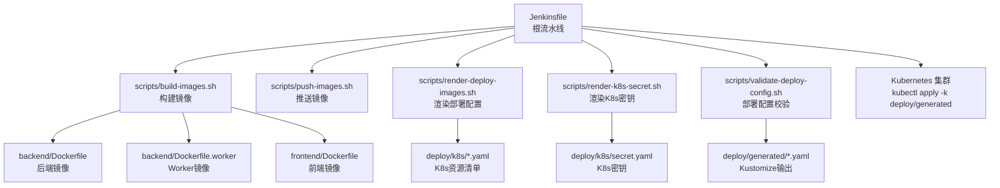
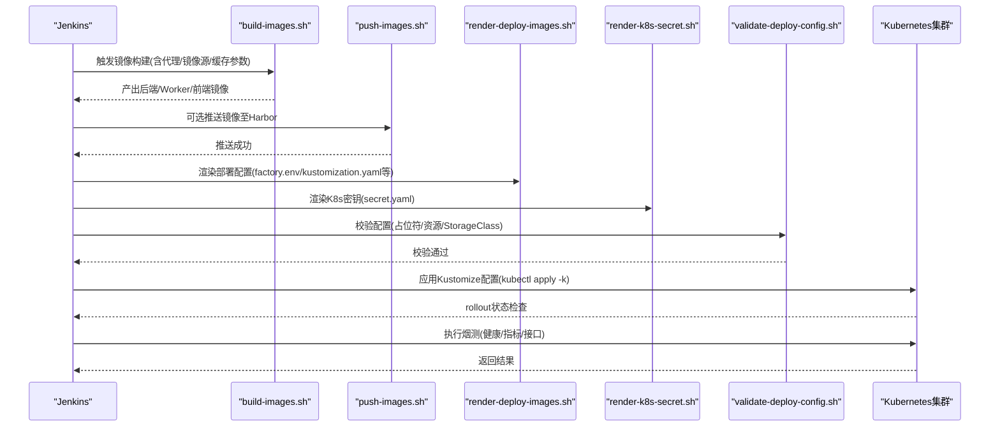
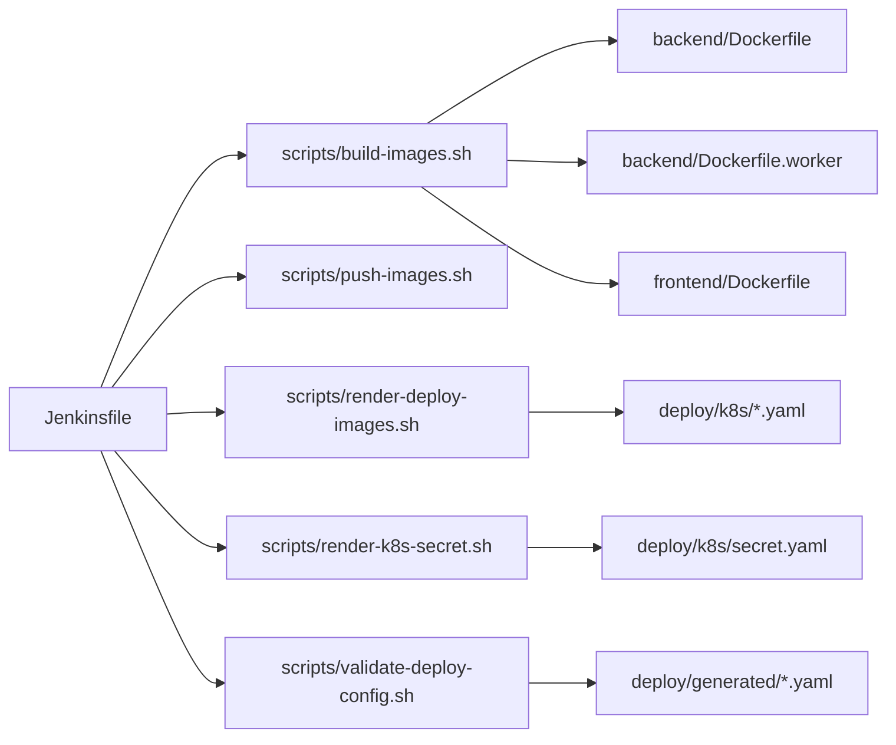

# CI/CD流水线

<cite>
**本文引用的文件**
- [Jenkinsfile](file://Jenkinsfile)
- [docs/jenkins-ci-cd.md](file://docs/jenkins-ci-cd.md)
- [backend/Dockerfile](file://backend/Dockerfile)
- [backend/Dockerfile.worker](file://backend/Dockerfile.worker)
- [frontend/Dockerfile](file://frontend/Dockerfile)
- [scripts/build-images.sh](file://scripts/build-images.sh)
- [scripts/push-images.sh](file://scripts/push-images.sh)
- [scripts/render-deploy-images.sh](file://scripts/render-deploy-images.sh)
- [scripts/render-k8s-secret.sh](file://scripts/render-k8s-secret.sh)
- [scripts/validate-deploy-config.sh](file://scripts/validate-deploy-config.sh)
- [backend/pyproject.toml](file://backend/pyproject.toml)
- [frontend/package.json](file://frontend/package.json)
- [deploy/k8s/backend.yaml](file://deploy/k8s/backend.yaml)
- [deploy/k8s/frontend.yaml](file://deploy/k8s/frontend.yaml)
- [deploy/k8s/worker.yaml](file://deploy/k8s/worker.yaml)
- [backend/services/deployment_packages/quality_renderer.py](file://backend/services/deployment_packages/quality_renderer.py)
- [backend/tests/test_quality_renderer.py](file://backend/tests/test_quality_renderer.py)
</cite>

## 目录
1. [简介](#简介)
2. [项目结构](#项目结构)
3. [核心组件](#核心组件)
4. [架构总览](#架构总览)
5. [详细组件分析](#详细组件分析)
6. [依赖关系分析](#依赖关系分析)
7. [性能考虑](#性能考虑)
8. [故障排查指南](#故障排查指南)
9. [结论](#结论)
10. [附录](#附录)

## 简介
本文件面向“部署包工厂”项目的CI/CD流水线，提供从Jenkins多分支流水线配置、参数化构建与环境变量管理，到自动化构建（代码检出、依赖安装、单元测试、镜像构建与推送）、自动化部署（Kubernetes应用部署、健康检查与烟测）、质量门禁（代码扫描、安全检查、测试覆盖率与质量门禁脚本）、部署验证与灰度发布、以及监控与失败通知的最佳实践指导。

## 项目结构
该仓库采用多模块结构：后端服务（FastAPI + Python）、前端（React + Vite）、Kubernetes部署清单与Kustomize编排、以及一系列Shell脚本用于镜像构建、推送、部署配置渲染与校验。Jenkins流水线通过根目录的Jenkinsfile统一编排整个交付链路。

图表来源
- [Jenkinsfile:35-246](file://Jenkinsfile#L35-L246)
- [scripts/build-images.sh:84-91](file://scripts/build-images.sh#L84-L91)
- [scripts/render-deploy-images.sh:74-104](file://scripts/render-deploy-images.sh#L74-L104)
- [scripts/render-k8s-secret.sh:66-74](file://scripts/render-k8s-secret.sh#L66-L74)
- [scripts/validate-deploy-config.sh:25-49](file://scripts/validate-deploy-config.sh#L25-L49)
- [backend/Dockerfile:1-36](file://backend/Dockerfile#L1-L36)
- [backend/Dockerfile.worker:1-34](file://backend/Dockerfile.worker#L1-L34)
- [frontend/Dockerfile:1-32](file://frontend/Dockerfile#L1-L32)
- [deploy/k8s/backend.yaml:1-96](file://deploy/k8s/backend.yaml#L1-L96)
- [deploy/k8s/frontend.yaml:1-84](file://deploy/k8s/frontend.yaml#L1-L84)
- [deploy/k8s/worker.yaml:1-59](file://deploy/k8s/worker.yaml#L1-L59)

章节来源
- [Jenkinsfile:1-258](file://Jenkinsfile#L1-L258)
- [docs/jenkins-ci-cd.md:1-59](file://docs/jenkins-ci-cd.md#L1-L59)

## 核心组件
- Jenkins多分支流水线与参数化构建：通过Jenkinsfile定义阶段、参数、环境变量与凭据，支持CI与部署双场景。
- 镜像构建与推送：后端、Worker与前端三类镜像统一由脚本构建，支持代理、镜像源与缓存控制；可选推送至Harbor。
- 部署配置渲染与校验：根据镜像标签与存储类生成Kustomize配置与K8s密钥，校验占位符与必要资源。
- Kubernetes部署与烟测：创建命名空间与拉取密钥，按需部署Postgres，应用Kustomize配置并进行健康检查。
- 质量门禁：提供质量门禁脚本与报告模板，覆盖完整性、K8s客户端Dry-run与Compose配置校验。

章节来源
- [Jenkinsfile:10-33](file://Jenkinsfile#L10-L33)
- [scripts/build-images.sh:57-82](file://scripts/build-images.sh#L57-L82)
- [scripts/push-images.sh:41-50](file://scripts/push-images.sh#L41-L50)
- [scripts/render-deploy-images.sh:78-140](file://scripts/render-deploy-images.sh#L78-L140)
- [scripts/render-k8s-secret.sh:66-74](file://scripts/render-k8s-secret.sh#L66-L74)
- [scripts/validate-deploy-config.sh:12-63](file://scripts/validate-deploy-config.sh#L12-L63)
- [Jenkinsfile:204-244](file://Jenkinsfile#L204-L244)

## 架构总览
下图展示从Jenkins触发到Kubernetes部署的端到端流程，包括镜像构建、推送、配置渲染、部署与健康检查。

图表来源
- [Jenkinsfile:53-244](file://Jenkinsfile#L53-L244)
- [scripts/build-images.sh:84-91](file://scripts/build-images.sh#L84-L91)
- [scripts/push-images.sh:47-50](file://scripts/push-images.sh#L47-L50)
- [scripts/render-deploy-images.sh:78-104](file://scripts/render-deploy-images.sh#L78-L104)
- [scripts/render-k8s-secret.sh:66-74](file://scripts/render-k8s-secret.sh#L66-L74)
- [scripts/validate-deploy-config.sh:25-49](file://scripts/validate-deploy-config.sh#L25-L49)

## 详细组件分析

### Jenkins流水线配置
- 多分支与并发控制：禁用并发构建，保留最近日志轮转，开启时间戳便于定位问题。
- 参数化构建：涵盖镜像仓库、命名空间、镜像标签、存储类、Kubeconfig路径、代理与镜像源、是否推送与部署、是否使用内置Postgres、是否禁用缓存等。
- 环境变量与凭据：设置命名空间、Postgres镜像、API Token与数据库URL等敏感信息通过凭据注入。
- 阶段划分：准备、构建镜像、推送镜像、渲染部署配置、确保命名空间与拉取密钥、确保测试Postgres、部署到K8s、烟测。
- 后处理：清理临时文件，仅归档关键部署摘要。

章节来源
- [Jenkinsfile:4-26](file://Jenkinsfile#L4-L26)
- [Jenkinsfile:28-33](file://Jenkinsfile#L28-L33)
- [Jenkinsfile:35-246](file://Jenkinsfile#L35-L246)
- [docs/jenkins-ci-cd.md:24-59](file://docs/jenkins-ci-cd.md#L24-L59)

### 自动化构建流程
- 代码检出：Jenkins Agent需具备git能力，流水线中通过命令行工具验证版本。
- 依赖安装：后端与Worker镜像在Docker构建过程中安装Python依赖；前端在多阶段构建中安装Node依赖并打包。
- 单元测试：可在本地或专用CI作业中执行，本流水线默认不包含测试阶段，建议在独立CI作业中运行。
- 镜像构建：统一由脚本驱动，支持代理、apt/pip/npm镜像源与禁用缓存选项。
- 镜像推送：登录Harbor后批量推送三类镜像。

章节来源
- [Jenkinsfile:36-68](file://Jenkinsfile#L36-L68)
- [scripts/build-images.sh:57-82](file://scripts/build-images.sh#L57-L82)
- [scripts/push-images.sh:41-50](file://scripts/push-images.sh#L41-L50)
- [backend/Dockerfile:20-25](file://backend/Dockerfile#L20-L25)
- [backend/Dockerfile.worker:20-25](file://backend/Dockerfile.worker#L20-L25)
- [frontend/Dockerfile:15-18](file://frontend/Dockerfile#L15-L18)

### 自动化部署策略
- 命名空间与拉取密钥：为Harbor私有仓库创建imagePullSecret，确保Pod可拉取镜像。
- 测试Postgres：在测试环境中创建内置Postgres，生产环境建议使用外部数据库。
- 应用部署：使用Kustomize渲染并应用资源，等待各Deployment rollout完成。
- 烟测：选择一个Ready的后端Pod，执行健康检查、指标查询与受限API访问验证。

章节来源
- [Jenkinsfile:111-244](file://Jenkinsfile#L111-L244)
- [scripts/render-deploy-images.sh:78-104](file://scripts/render-deploy-images.sh#L78-L104)
- [scripts/render-k8s-secret.sh:66-74](file://scripts/render-k8s-secret.sh#L66-L74)
- [scripts/validate-deploy-config.sh:25-49](file://scripts/validate-deploy-config.sh#L25-L49)
- [deploy/k8s/backend.yaml:34-77](file://deploy/k8s/backend.yaml#L34-L77)
- [deploy/k8s/frontend.yaml:26-65](file://deploy/k8s/frontend.yaml#L26-L65)
- [deploy/k8s/worker.yaml:20-58](file://deploy/k8s/worker.yaml#L20-L58)

### 蓝绿部署、滚动更新与回滚机制
- 滚动更新：Kubernetes原生滚动更新策略已内置于Deployment资源中，可通过replicas与探针保障平滑切换。
- 回滚机制：可使用kubectl rollout undo快速回滚至上一版本；建议结合金丝雀分批发布以降低风险。
- 蓝绿部署：通过两套Deployment/Service并行，切换Service指向实现蓝绿切换；需在Kustomize层新增对应补丁。

章节来源
- [deploy/k8s/backend.yaml:14-14](file://deploy/k8s/backend.yaml#L14-L14)
- [deploy/k8s/frontend.yaml:10-10](file://deploy/k8s/frontend.yaml#L10-L10)
- [deploy/k8s/worker.yaml:10-10](file://deploy/k8s/worker.yaml#L10-L10)

### 质量门禁配置
- 质量门禁脚本：自动生成质量门禁脚本与报告模板，包含完整性检查、K8s客户端Dry-run与Compose配置校验。
- 报告生成：将检查结果写入运行时报告文件，便于审计与追溯。
- 与流水线集成：可在独立质量门禁作业中执行，或在CI中作为质量门禁阶段。

章节来源
- [backend/services/deployment_packages/quality_renderer.py:18-23](file://backend/services/deployment_packages/quality_renderer.py#L18-L23)
- [backend/services/deployment_packages/quality_renderer.py:26-95](file://backend/services/deployment_packages/quality_renderer.py#L26-L95)
- [backend/tests/test_quality_renderer.py:6-29](file://backend/tests/test_quality_renderer.py#L6-L29)

### 部署验证、灰度发布与紧急回滚
- 部署验证：等待Rollout完成，选择Ready Pod执行健康/指标/受限接口验证。
- 灰度发布：通过逐步增加新版本副本数或使用Ingress路由规则进行流量切分。
- 紧急回滚：使用kubectl rollout undo或调整Deployment副本数快速恢复。

章节来源
- [Jenkinsfile:223-244](file://Jenkinsfile#L223-L244)

### 流水线监控、失败通知与报告生成
- 日志轮转与时间戳：保留最近构建日志，开启时间戳便于定位问题。
- 归档与清理：仅归档关键部署摘要，删除临时文件避免敏感信息泄露。
- 失败通知：建议在Jenkins中配置邮件/IM通知插件，结合post阶段的always块统一处理。

章节来源
- [Jenkinsfile:4-8](file://Jenkinsfile#L4-L8)
- [Jenkinsfile:248-256](file://Jenkinsfile#L248-L256)
- [docs/jenkins-ci-cd.md:49-49](file://docs/jenkins-ci-cd.md#L49-L49)

## 依赖关系分析
- 构建阶段依赖：Jenkinsfile依赖脚本与Dockerfile；脚本依赖Git与Docker CLI。
- 部署阶段依赖：Kustomize与kubectl；密钥与存储类配置需满足RWX PVC需求。
- 资源依赖：后端/Worker/前端三类镜像；Harbor Registry；可选内置Postgres。

图表来源
- [Jenkinsfile:53-244](file://Jenkinsfile#L53-L244)
- [scripts/build-images.sh:84-91](file://scripts/build-images.sh#L84-L91)
- [scripts/render-deploy-images.sh:78-104](file://scripts/render-deploy-images.sh#L78-L104)
- [scripts/render-k8s-secret.sh:66-74](file://scripts/render-k8s-secret.sh#L66-L74)
- [scripts/validate-deploy-config.sh:25-49](file://scripts/validate-deploy-config.sh#L25-L49)
- [backend/Dockerfile:1-36](file://backend/Dockerfile#L1-L36)
- [backend/Dockerfile.worker:1-34](file://backend/Dockerfile.worker#L1-L34)
- [frontend/Dockerfile:1-32](file://frontend/Dockerfile#L1-L32)
- [deploy/k8s/backend.yaml:1-96](file://deploy/k8s/backend.yaml#L1-L96)
- [deploy/k8s/frontend.yaml:1-84](file://deploy/k8s/frontend.yaml#L1-L84)
- [deploy/k8s/worker.yaml:1-59](file://deploy/k8s/worker.yaml#L1-L59)

## 性能考虑
- 构建缓存：通过禁用缓存参数在需要时强制重建，平衡一致性与速度。
- 代理与镜像源：在代理网络环境下，合理配置apt/pip/npm镜像源可显著提升依赖安装效率。
- 并发与资源：限制并发构建，合理设置容器CPU/Memory请求与限制，避免资源争抢。

## 故障排查指南
- 镜像构建失败：检查代理与镜像源参数是否正确传递至构建脚本；确认Dockerfile中的依赖安装命令可正常执行。
- 推送失败：确认Harbor凭据正确，网络可达，镜像标签格式符合预期。
- 部署失败：查看K8s事件与Pod状态，确认命名空间、拉取密钥与StorageClass配置；检查Rollout状态。
- 烟测失败：进入Pod内部执行健康/指标/受限接口验证，核对API Token与数据库连接串。

章节来源
- [Jenkinsfile:111-244](file://Jenkinsfile#L111-L244)
- [scripts/validate-deploy-config.sh:12-63](file://scripts/validate-deploy-config.sh#L12-L63)

## 结论
本CI/CD流水线以Jenkins为核心，结合Shell脚本与Kustomize，实现了从镜像构建、推送、配置渲染到Kubernetes部署与烟测的全链路自动化。通过参数化构建与质量门禁，可灵活适配不同环境与合规要求；配合滚动更新与回滚机制，能够安全高效地交付变更。

## 附录
- 建议作业：CI作业（不推送与部署）与部署作业（推送与部署），生产环境建议加入人工确认或分支保护策略。
- 凭据清单：Harbor管理员、GitHub Token、API Token、数据库URL等。

章节来源
- [docs/jenkins-ci-cd.md:51-59](file://docs/jenkins-ci-cd.md#L51-L59)