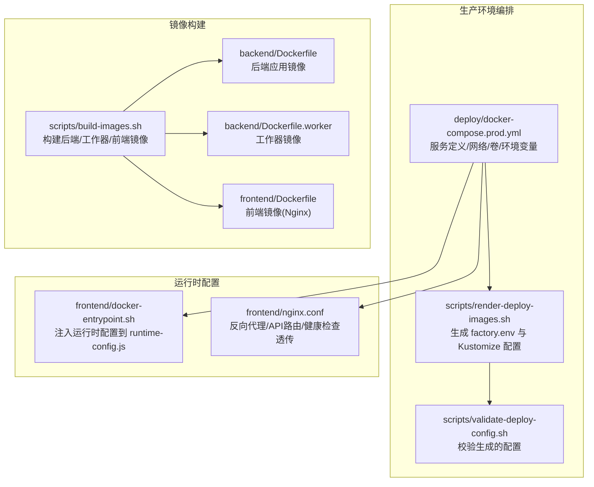
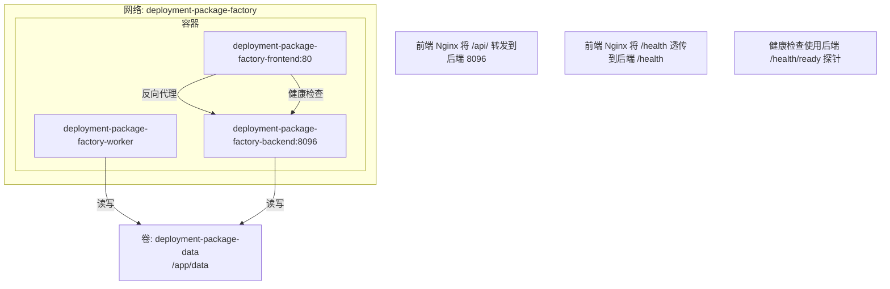
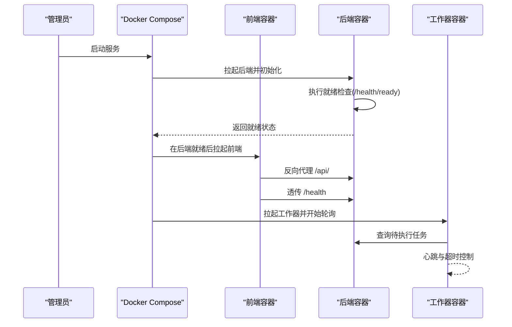

# Docker Compose部署

<cite>
**本文引用的文件**
- [docker-compose.prod.yml](file://deploy/docker-compose.prod.yml)
- [docker-compose.yml](file://docker-compose.yml)
- [backend/Dockerfile](file://backend/Dockerfile)
- [backend/Dockerfile.worker](file://backend/Dockerfile.worker)
- [frontend/Dockerfile](file://frontend/Dockerfile)
- [frontend/nginx.conf](file://frontend/nginx.conf)
- [frontend/docker-entrypoint.sh](file://frontend/docker-entrypoint.sh)
- [scripts/build-images.sh](file://scripts/build-images.sh)
- [scripts/render-deploy-images.sh](file://scripts/render-deploy-images.sh)
- [scripts/validate-deploy-config.sh](file://scripts/validate-deploy-config.sh)
- [backend/deployment_package_factory/main.py](file://backend/deployment_package_factory/main.py)
- [backend/deployment_package_factory/readiness.py](file://backend/deployment_package_factory/readiness.py)
- [backend/deployment_package_factory/metrics.py](file://backend/deployment_package_factory/metrics.py)
</cite>

## 目录
1. [简介](#简介)
2. [项目结构](#项目结构)
3. [核心组件](#核心组件)
4. [架构总览](#架构总览)
5. [详细组件分析](#详细组件分析)
6. [依赖关系分析](#依赖关系分析)
7. [性能与可靠性](#性能与可靠性)
8. [部署与运维指南](#部署与运维指南)
9. [故障排查](#故障排查)
10. [结论](#结论)
11. [附录](#附录)

## 简介
本操作手册面向生产环境，基于仓库中的 Docker Compose 配置，提供从镜像构建、环境准备、服务编排到运行验证的全流程说明。重点覆盖以下方面：
- 生产环境 Compose 文件结构与配置项详解（服务、网络、卷、环境变量）
- 前后端服务依赖关系与启动顺序
- 数据库连接与持久化策略
- 日志管理与健康检查
- 完整部署命令与验证步骤
- 负载均衡、SSL 与监控集成建议

## 项目结构
生产环境使用独立的 Compose 文件进行编排，配合渲染脚本生成最终的环境变量与镜像配置。

图表来源
- [docker-compose.prod.yml:1-65](file://deploy/docker-compose.prod.yml#L1-L65)
- [scripts/render-deploy-images.sh:1-141](file://scripts/render-deploy-images.sh#L1-L141)
- [scripts/validate-deploy-config.sh:1-64](file://scripts/validate-deploy-config.sh#L1-L64)
- [scripts/build-images.sh:1-97](file://scripts/build-images.sh#L1-L97)
- [backend/Dockerfile:1-36](file://backend/Dockerfile#L1-L36)
- [backend/Dockerfile.worker:1-34](file://backend/Dockerfile.worker#L1-L34)
- [frontend/Dockerfile:1-32](file://frontend/Dockerfile#L1-L32)
- [frontend/docker-entrypoint.sh:1-21](file://frontend/docker-entrypoint.sh#L1-L21)
- [frontend/nginx.conf:1-30](file://frontend/nginx.conf#L1-L30)

章节来源
- [docker-compose.prod.yml:1-65](file://deploy/docker-compose.prod.yml#L1-L65)
- [scripts/render-deploy-images.sh:1-141](file://scripts/render-deploy-images.sh#L1-L141)
- [scripts/validate-deploy-config.sh:1-64](file://scripts/validate-deploy-config.sh#L1-L64)
- [scripts/build-images.sh:1-97](file://scripts/build-images.sh#L1-L97)

## 核心组件
- 后端服务（FastAPI）：提供 API、就绪检查、指标导出，监听 8096 端口。
- 工作器服务（Python 模块）：执行异步任务轮询与心跳，处理打包任务。
- 前端服务（Nginx）：静态资源与反向代理，将 /api/ 请求转发至后端，/health 透传就绪检查。
- 共享数据卷：用于持久化部署包输出目录与临时数据。

章节来源
- [docker-compose.prod.yml:1-65](file://deploy/docker-compose.prod.yml#L1-L65)
- [backend/Dockerfile:33-36](file://backend/Dockerfile#L33-L36)
- [backend/Dockerfile.worker:33-34](file://backend/Dockerfile.worker#L33-L34)
- [frontend/Dockerfile:30-32](file://frontend/Dockerfile#L30-L32)
- [frontend/nginx.conf:14-28](file://frontend/nginx.conf#L14-L28)

## 架构总览
生产环境采用单机多容器编排，通过自定义网络隔离服务，共享卷承载持久化数据。前端通过 Nginx 将 API 请求转发至后端，同时将健康检查请求透传以支持 Compose 的健康检查机制。

图表来源
- [docker-compose.prod.yml:46-58](file://deploy/docker-compose.prod.yml#L46-L58)
- [frontend/nginx.conf:14-28](file://frontend/nginx.conf#L14-L28)
- [backend/deployment_package_factory/main.py:41-55](file://backend/deployment_package_factory/main.py#L41-L55)

## 详细组件分析

### 后端服务（deployment-package-factory-backend）
- 镜像与入口：基于 Python 3.12 Slim，暴露 8096 端口，使用 Uvicorn 运行应用。
- 健康检查：通过探针访问后端就绪接口，检测数据库连接、元数据存储可达性、输出目录可写性、镜像导出工具可用性。
- 环境变量：
  - 数据目录与输出目录
  - 数据库连接串（必填）
  - 并发构建数、轮询间隔、心跳周期、超时时间等
  - 源镜像仓库凭据
  - 清理策略（保留天数、总量上限）
- 卷挂载：绑定共享卷到 /app/data，持久化部署包产物与中间态数据。
- 网络：加入自定义网络，便于容器间通信。

章节来源
- [docker-compose.prod.yml:2-24](file://deploy/docker-compose.prod.yml#L2-L24)
- [backend/Dockerfile:1-36](file://backend/Dockerfile#L1-L36)
- [backend/deployment_package_factory/main.py:41-55](file://backend/deployment_package_factory/main.py#L41-L55)
- [backend/deployment_package_factory/readiness.py:14-37](file://backend/deployment_package_factory/readiness.py#L14-L37)

### 工作器服务（deployment-package-factory-worker）
- 镜像与入口：基于 Python 3.12 Slim，安装容器相关工具，运行工作器模块。
- 环境变量：与后端一致的数据目录、数据库连接串、并发控制、轮询与心跳参数、清理策略、源镜像仓库凭据。
- 卷挂载：与后端共享 /app/data。
- 网络：加入自定义网络。

章节来源
- [docker-compose.prod.yml:26-44](file://deploy/docker-compose.prod.yml#L26-L44)
- [backend/Dockerfile.worker:1-34](file://backend/Dockerfile.worker#L1-L34)

### 前端服务（deployment-package-factory-frontend）
- 镜像与入口：基于 Nginx，静态站点由上层构建产物提供；入口脚本在启动时将运行时配置注入到前端配置文件。
- 反向代理：将 /api/ 请求转发至后端 8096；将 /health 透传至后端 /health，供健康检查使用。
- 环境变量：API 基础地址与令牌，用于注入前端运行时配置。
- 端口映射：默认将宿主 5186 映射到容器 80（Nginx），可通过环境变量覆盖。
- 依赖关系：依赖后端健康状态，确保在后端就绪后再启动。

章节来源
- [docker-compose.prod.yml:46-58](file://deploy/docker-compose.prod.yml#L46-L58)
- [frontend/Dockerfile:1-32](file://frontend/Dockerfile#L1-L32)
- [frontend/nginx.conf:14-28](file://frontend/nginx.conf#L14-L28)
- [frontend/docker-entrypoint.sh:10-18](file://frontend/docker-entrypoint.sh#L10-L18)

### 共享卷与持久化
- 卷名称：deployment-package-data
- 挂载点：/app/data
- 用途：存放部署包产物、临时文件与缓存，实现跨容器共享与持久化。

章节来源
- [docker-compose.prod.yml:16-17](file://deploy/docker-compose.prod.yml#L16-L17)
- [docker-compose.prod.yml:41-42](file://deploy/docker-compose.prod.yml#L41-L42)

### 网络与依赖
- 自定义网络：deployment-package-factory
- 依赖声明：前端依赖后端健康状态，确保后端就绪后再启动。
- 端口映射：前端默认 5186:80，后端 8096:8096（开发环境）或 8096:8096（生产环境映射由 Nginx 80 透传）。

章节来源
- [docker-compose.prod.yml:23-24](file://deploy/docker-compose.prod.yml#L23-L24)
- [docker-compose.prod.yml:52-56](file://deploy/docker-compose.prod.yml#L52-L56)
- [docker-compose.yml:31-35](file://docker-compose.yml#L31-L35)

## 依赖关系分析

图表来源
- [docker-compose.prod.yml:52-54](file://deploy/docker-compose.prod.yml#L52-L54)
- [frontend/nginx.conf:14-24](file://frontend/nginx.conf#L14-L24)
- [backend/deployment_package_factory/main.py:41-55](file://backend/deployment_package_factory/main.py#L41-L55)

章节来源
- [docker-compose.prod.yml:52-54](file://deploy/docker-compose.prod.yml#L52-L54)
- [frontend/nginx.conf:14-24](file://frontend/nginx.conf#L14-L24)
- [backend/deployment_package_factory/main.py:41-55](file://backend/deployment_package_factory/main.py#L41-L55)

## 性能与可靠性
- 并发与资源：通过环境变量控制最大并发构建数与工作器轮询/心跳周期，避免资源争用与超时。
- 健康检查：后端提供就绪检查，Compose 使用健康探针保障启动顺序与可用性。
- 存储与清理：通过保留天数与总量上限限制磁盘占用，避免无限增长。
- 稳定性：重启策略为 unless-stopped，保证异常退出后自动恢复。

章节来源
- [docker-compose.prod.yml:10-15](file://deploy/docker-compose.prod.yml#L10-L15)
- [docker-compose.prod.yml:33-40](file://deploy/docker-compose.prod.yml#L33-L40)
- [backend/deployment_package_factory/readiness.py:34-37](file://backend/deployment_package_factory/readiness.py#L34-L37)

## 部署与运维指南

### 1. 准备与生成环境文件
- 使用渲染脚本生成 Compose 环境文件与 Kustomize 配置，指定镜像仓库、标签、HTTP 端口、数据库连接串与存储类。
- 校验生成的配置，确保必需项已填写且无占位符残留。

章节来源
- [scripts/render-deploy-images.sh:78-84](file://scripts/render-deploy-images.sh#L78-L84)
- [scripts/render-deploy-images.sh:86-104](file://scripts/render-deploy-images.sh#L86-L104)
- [scripts/validate-deploy-config.sh:50-56](file://scripts/validate-deploy-config.sh#L50-L56)

### 2. 构建镜像
- 使用构建脚本按需传递构建参数（如代理、镜像源、APT 源等），生成后端、工作器与前端镜像。
- 注意：工作器镜像包含容器运行时相关依赖，用于导出镜像能力。

章节来源
- [scripts/build-images.sh:54-91](file://scripts/build-images.sh#L54-L91)
- [backend/Dockerfile.worker:17-18](file://backend/Dockerfile.worker#L17-L18)

### 3. 启动服务
- 使用生成的环境文件与 Compose 文件启动服务。
- 前端容器会等待后端健康检查通过后再启动，确保依赖链路稳定。

章节来源
- [docker-compose.prod.yml:52-54](file://deploy/docker-compose.prod.yml#L52-L54)

### 4. 验证步骤
- 服务状态检查：确认三个服务均处于健康运行状态。
- 端口映射验证：访问宿主 5186，应看到前端页面；/api/ 应可访问后端 API。
- 健康检查验证：访问 /health 与 /health/ready，返回 200 且就绪状态为 ready 或 degraded。
- 日志查看：查看各容器日志，定位启动失败或运行期错误。
- 指标导出：访问 /metrics，确认指标正常导出。

章节来源
- [frontend/nginx.conf:22-24](file://frontend/nginx.conf#L22-L24)
- [backend/deployment_package_factory/main.py:41-62](file://backend/deployment_package_factory/main.py#L41-L62)
- [backend/deployment_package_factory/metrics.py:4-33](file://backend/deployment_package_factory/metrics.py#L4-L33)

### 5. 日志管理
- 容器日志：通过 Docker 日志收集系统集中采集。
- 建议：为后端与工作器配置日志级别与输出格式，结合指标监控进行问题定位。

章节来源
- [docker-compose.prod.yml:18-22](file://deploy/docker-compose.prod.yml#L18-L22)
- [backend/Dockerfile:7-9](file://backend/Dockerfile#L7-L9)

### 6. 负载均衡与 SSL
- 负载均衡：可在 Compose 外部使用反向代理（如 Nginx/Traefik）对前端进行负载均衡。
- SSL：在外部反向代理层启用 HTTPS 终止，后端与工作器保持内网通信即可。

章节来源
- [frontend/nginx.conf:1-30](file://frontend/nginx.conf#L1-L30)

### 7. 监控集成
- 指标：后端提供 Prometheus 格式指标，可直接抓取 /metrics。
- 健康检查：Compose 健康探针与后端 /health/ready 结合，实现自动重启与可观测性。

章节来源
- [backend/deployment_package_factory/main.py:57-62](file://backend/deployment_package_factory/main.py#L57-L62)
- [backend/deployment_package_factory/metrics.py:4-33](file://backend/deployment_package_factory/metrics.py#L4-L33)

## 故障排查
- 健康检查失败
  - 检查数据库连接串是否正确配置。
  - 查看就绪检查报告详情，确认元数据存储可达与输出目录可写。
- 前端无法访问 API
  - 确认 Nginx 反向代理规则与后端端口映射。
  - 检查后端是否已就绪再启动前端。
- 端口冲突
  - 修改宿主端口映射或停止占用进程。
- 镜像导出失败
  - 检查工作器镜像中容器运行时工具是否可用，必要时调整构建参数。

章节来源
- [scripts/validate-deploy-config.sh:50-56](file://scripts/validate-deploy-config.sh#L50-L56)
- [backend/deployment_package_factory/readiness.py:58-101](file://backend/deployment_package_factory/readiness.py#L58-L101)
- [frontend/nginx.conf:14-24](file://frontend/nginx.conf#L14-L24)

## 结论
本方案通过独立的生产 Compose 文件与配套脚本，实现了镜像构建、配置渲染、健康检查与持久化的标准化流程。前端通过 Nginx 实现 API 代理与健康检查透传，后端提供就绪检查与指标导出，工作器负责异步任务执行。结合外部负载均衡与 SSL 终止，可满足生产级可用性与可维护性要求。

## 附录

### 关键配置清单（环境变量）
- 数据库连接串：DEPLOYMENT_PACKAGE_DATABASE_URL（必填）
- 数据目录与输出目录：DEPLOYMENT_PACKAGE_DATA_DIR、DEPLOYMENT_PACKAGE_OUTPUT_DIR
- 并发与调度：DEPLOYMENT_PACKAGE_MAX_CONCURRENT_BUILDS、DEPLOYMENT_PACKAGE_WORKER_POLL_INTERVAL_SECONDS、DEPLOYMENT_PACKAGE_WORKER_HEARTBEAT_SECONDS、DEPLOYMENT_PACKAGE_RUNNING_TASK_TIMEOUT_MINUTES
- 清理策略：DEPLOYMENT_PACKAGE_RETENTION_DAYS、DEPLOYMENT_PACKAGE_MAX_TOTAL_GB
- 源镜像仓库凭据：DEPLOYMENT_PACKAGE_SOURCE_REGISTRY_USERNAME、DEPLOYMENT_PACKAGE_SOURCE_REGISTRY_PASSWORD
- 前端运行时配置：DEPLOYMENT_PACKAGE_FRONTEND_API_BASE_URL、DEPLOYMENT_PACKAGE_FRONTEND_API_TOKEN
- 执行模式：DEPLOYMENT_PACKAGE_EXECUTION_MODE（生产环境设为 worker）

章节来源
- [docker-compose.prod.yml:5-15](file://deploy/docker-compose.prod.yml#L5-L15)
- [docker-compose.prod.yml:29-40](file://deploy/docker-compose.prod.yml#L29-L40)
- [docker-compose.prod.yml:49-51](file://deploy/docker-compose.prod.yml#L49-L51)