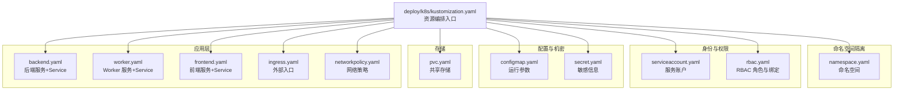
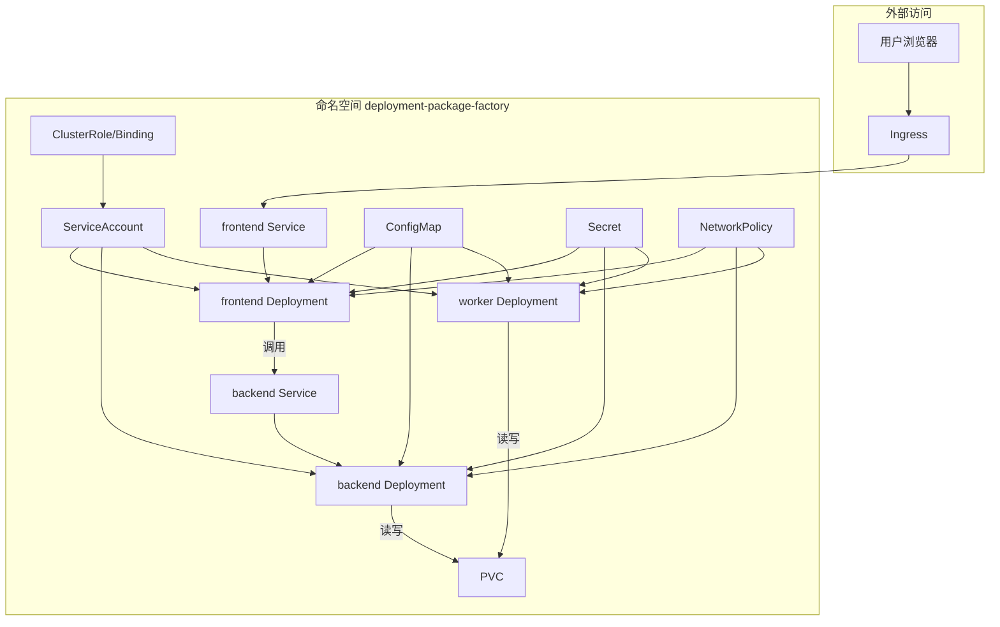
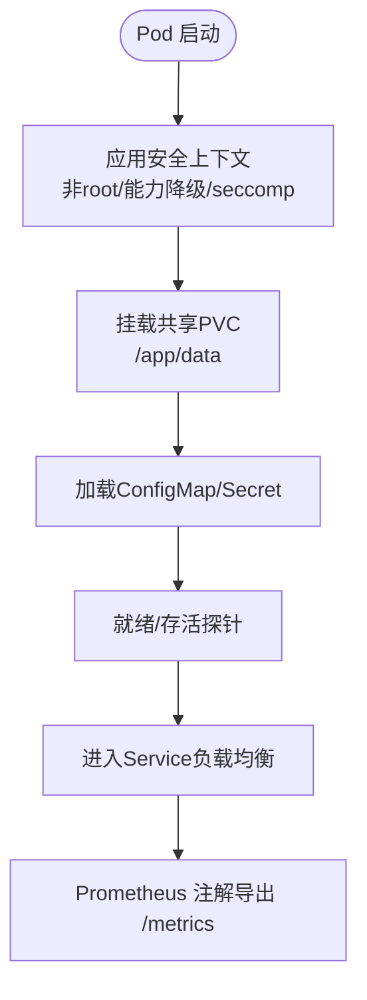
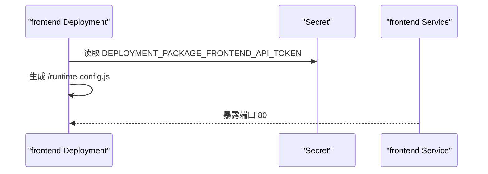
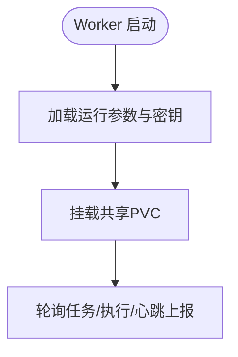
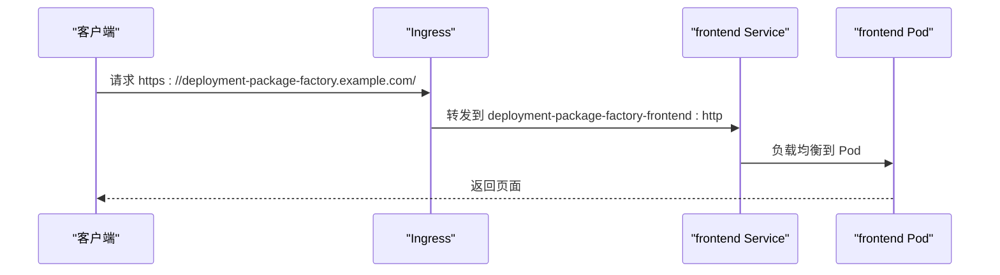
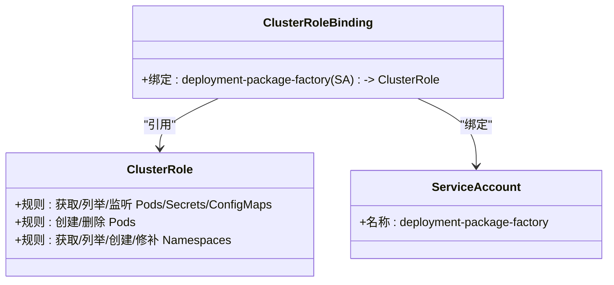
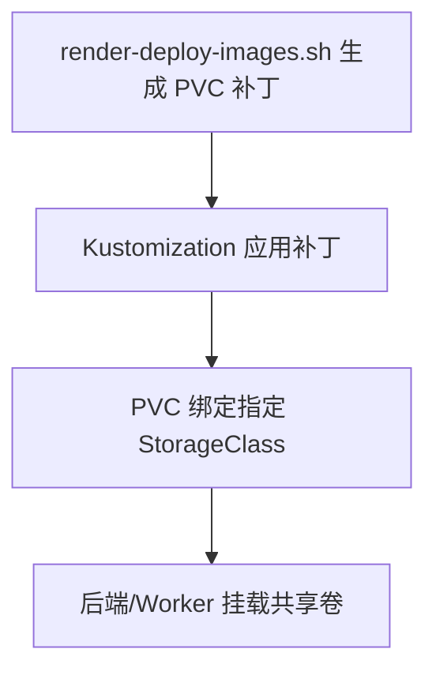
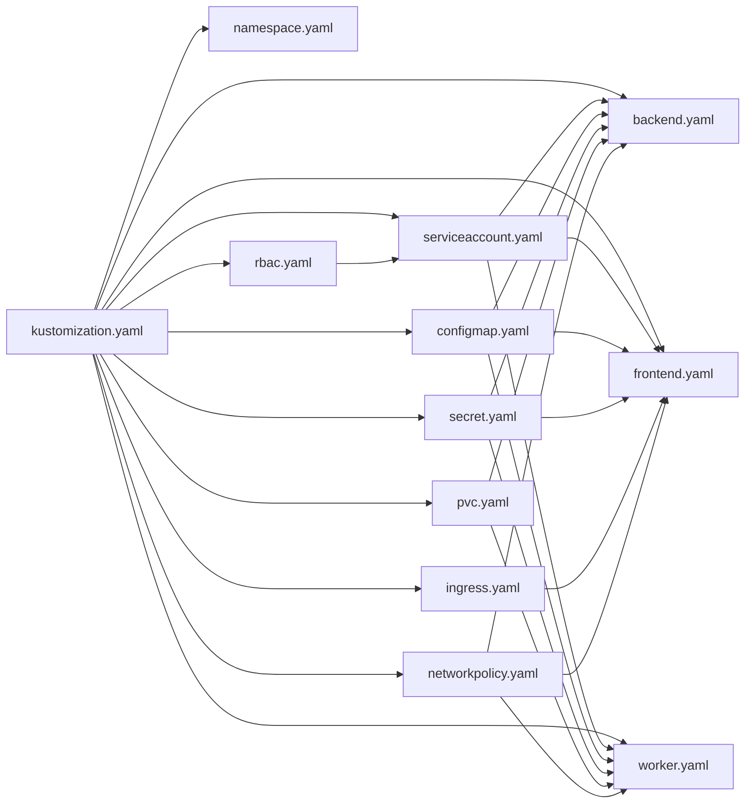

# Kubernetes部署

<cite>
**本文引用的文件**
- [deploy/k8s/kustomization.yaml](file://deploy/k8s/kustomization.yaml)
- [deploy/k8s/namespace.yaml](file://deploy/k8s/namespace.yaml)
- [deploy/k8s/serviceaccount.yaml](file://deploy/k8s/serviceaccount.yaml)
- [deploy/k8s/rbac.yaml](file://deploy/k8s/rbac.yaml)
- [deploy/k8s/configmap.yaml](file://deploy/k8s/configmap.yaml)
- [deploy/k8s/secret.template.yaml](file://deploy/k8s/secret.template.yaml)
- [deploy/k8s/pvc.yaml](file://deploy/k8s/pvc.yaml)
- [deploy/k8s/backend.yaml](file://deploy/k8s/backend.yaml)
- [deploy/k8s/worker.yaml](file://deploy/k8s/worker.yaml)
- [deploy/k8s/frontend.yaml](file://deploy/k8s/frontend.yaml)
- [deploy/k8s/ingress.yaml](file://deploy/k8s/ingress.yaml)
- [deploy/k8s/networkpolicy.yaml](file://deploy/k8s/networkpolicy.yaml)
- [deploy/README.md](file://deploy/README.md)
- [scripts/render-deploy-images.sh](file://scripts/render-deploy-images.sh)
- [scripts/render-k8s-secret.sh](file://scripts/render-k8s-secret.sh)
- [scripts/build-images.sh](file://scripts/build-images.sh)
</cite>

## 目录
1. [简介](#简介)
2. [项目结构](#项目结构)
3. [核心组件](#核心组件)
4. [架构总览](#架构总览)
5. [详细组件分析](#详细组件分析)
6. [依赖关系分析](#依赖关系分析)
7. [性能考虑](#性能考虑)
8. [故障排查指南](#故障排查指南)
9. [结论](#结论)
10. [附录](#附录)

## 简介
本指南面向在Kubernetes中部署“部署包工厂”的工程团队，系统讲解Kustomization配置的工作原理与自定义方法，逐项说明各部署清单的作用与职责：Backend Deployment负责后端服务、Frontend Deployment负责静态资源、Ingress提供外部访问、ConfigMap管理配置、Secret安全存储敏感信息、RBAC控制访问权限、PVC提供共享持久化存储。文档还涵盖命名空间隔离、资源限制与节点选择策略、kubectl命令行操作（部署、滚动更新、回滚、故障排查）、Helm Chart部署方式以及自动化部署脚本的使用方法。

## 项目结构
部署相关的核心文件位于 deploy/k8s 目录，通过 Kustomization 组织资源清单，形成可复用、可定制的部署基座。顶层 Kustomization 将命名空间、服务账户、RBAC、配置、密文、PVC、后端/前端/Worker、Ingress、NetworkPolicy 等资源统一编排。

图表来源
- [deploy/k8s/kustomization.yaml:1-15](file://deploy/k8s/kustomization.yaml#L1-L15)
- [deploy/k8s/namespace.yaml:1-7](file://deploy/k8s/namespace.yaml#L1-L7)
- [deploy/k8s/serviceaccount.yaml:1-9](file://deploy/k8s/serviceaccount.yaml#L1-L9)
- [deploy/k8s/rbac.yaml:1-49](file://deploy/k8s/rbac.yaml#L1-L49)
- [deploy/k8s/configmap.yaml:1-23](file://deploy/k8s/configmap.yaml#L1-L23)
- [deploy/k8s/secret.template.yaml:1-15](file://deploy/k8s/secret.template.yaml#L1-L15)
- [deploy/k8s/pvc.yaml:1-15](file://deploy/k8s/pvc.yaml#L1-L15)
- [deploy/k8s/backend.yaml:1-96](file://deploy/k8s/backend.yaml#L1-L96)
- [deploy/k8s/worker.yaml:1-59](file://deploy/k8s/worker.yaml#L1-L59)
- [deploy/k8s/frontend.yaml:1-84](file://deploy/k8s/frontend.yaml#L1-L84)
- [deploy/k8s/ingress.yaml:1-27](file://deploy/k8s/ingress.yaml#L1-L27)
- [deploy/k8s/networkpolicy.yaml:1-62](file://deploy/k8s/networkpolicy.yaml#L1-L62)

章节来源
- [deploy/k8s/kustomization.yaml:1-15](file://deploy/k8s/kustomization.yaml#L1-L15)
- [deploy/README.md:97-171](file://deploy/README.md#L97-L171)

## 核心组件
- 命名空间隔离：通过独立命名空间实现租户级隔离，避免资源互相影响。
- 服务账户与RBAC：为Pod授予最小权限，仅允许读取所需资源与动态创建/删除Pod等必要操作。
- 配置与密文：ConfigMap集中管理非敏感运行参数；Secret安全存放数据库连接、API Token等敏感信息。
- 存储：PVC以RWX方式提供共享卷，满足后端下载与Worker生成的协同访问需求。
- 应用层：后端提供API与任务执行协调、前端提供Web界面、Worker异步执行任务、Ingress暴露服务、NetworkPolicy限制网络流量。

章节来源
- [deploy/k8s/namespace.yaml:1-7](file://deploy/k8s/namespace.yaml#L1-L7)
- [deploy/k8s/serviceaccount.yaml:1-9](file://deploy/k8s/serviceaccount.yaml#L1-L9)
- [deploy/k8s/rbac.yaml:1-49](file://deploy/k8s/rbac.yaml#L1-L49)
- [deploy/k8s/configmap.yaml:1-23](file://deploy/k8s/configmap.yaml#L1-L23)
- [deploy/k8s/secret.template.yaml:1-15](file://deploy/k8s/secret.template.yaml#L1-L15)
- [deploy/k8s/pvc.yaml:1-15](file://deploy/k8s/pvc.yaml#L1-L15)
- [deploy/k8s/backend.yaml:1-96](file://deploy/k8s/backend.yaml#L1-L96)
- [deploy/k8s/worker.yaml:1-59](file://deploy/k8s/worker.yaml#L1-L59)
- [deploy/k8s/frontend.yaml:1-84](file://deploy/k8s/frontend.yaml#L1-L84)
- [deploy/k8s/ingress.yaml:1-27](file://deploy/k8s/ingress.yaml#L1-L27)
- [deploy/k8s/networkpolicy.yaml:1-62](file://deploy/k8s/networkpolicy.yaml#L1-L62)

## 架构总览
下图展示Kubernetes部署的整体架构：Ingress接收外部请求，转发至前端Service；前端再调用后端Service；后端与Worker通过共享PVC协作完成打包任务；RBAC确保最小权限；ConfigMap与Secret提供配置与密钥；NetworkPolicy限制出入站流量。

图表来源
- [deploy/k8s/ingress.yaml:1-27](file://deploy/k8s/ingress.yaml#L1-L27)
- [deploy/k8s/frontend.yaml:1-84](file://deploy/k8s/frontend.yaml#L1-L84)
- [deploy/k8s/backend.yaml:1-96](file://deploy/k8s/backend.yaml#L1-L96)
- [deploy/k8s/worker.yaml:1-59](file://deploy/k8s/worker.yaml#L1-L59)
- [deploy/k8s/serviceaccount.yaml:1-9](file://deploy/k8s/serviceaccount.yaml#L1-L9)
- [deploy/k8s/rbac.yaml:1-49](file://deploy/k8s/rbac.yaml#L1-L49)
- [deploy/k8s/configmap.yaml:1-23](file://deploy/k8s/configmap.yaml#L1-L23)
- [deploy/k8s/secret.template.yaml:1-15](file://deploy/k8s/secret.template.yaml#L1-L15)
- [deploy/k8s/pvc.yaml:1-15](file://deploy/k8s/pvc.yaml#L1-L15)
- [deploy/k8s/networkpolicy.yaml:1-62](file://deploy/k8s/networkpolicy.yaml#L1-L62)

## 详细组件分析

### Backend Deployment 与 Service
- 职责：提供API、健康检查、Prometheus指标导出、任务协调与打包产物管理。
- 安全与资源：非root运行、Drop全部能力、限制CPU/内存、健康探针、PVC挂载。
- 配置来源：envFrom引用ConfigMap与Secret；Prometheus注解开启自动发现。
- 服务暴露：ClusterIP Service，端口映射至容器端口。

图表来源
- [deploy/k8s/backend.yaml:34-77](file://deploy/k8s/backend.yaml#L34-L77)
- [deploy/k8s/backend.yaml:46-51](file://deploy/k8s/backend.yaml#L46-L51)
- [deploy/k8s/backend.yaml:55-66](file://deploy/k8s/backend.yaml#L55-L66)
- [deploy/k8s/backend.yaml:87-96](file://deploy/k8s/backend.yaml#L87-L96)

章节来源
- [deploy/k8s/backend.yaml:1-96](file://deploy/k8s/backend.yaml#L1-L96)

### Frontend Deployment 与 Service
- 职责：提供Web界面，通过环境变量注入后端API基础URL与Token，生成运行时配置。
- 安全与资源：非root运行、能力降级、健康探针、CPU/内存限制。
- 配置来源：环境变量从Secret读取Token，Service暴露80端口。

图表来源
- [deploy/k8s/frontend.yaml:38-46](file://deploy/k8s/frontend.yaml#L38-L46)
- [deploy/k8s/frontend.yaml:67-84](file://deploy/k8s/frontend.yaml#L67-L84)

章节来源
- [deploy/k8s/frontend.yaml:1-84](file://deploy/k8s/frontend.yaml#L1-L84)

### Worker Deployment
- 职责：异步执行打包任务，与后端配合完成生成流程。
- 安全与资源：与后端相同的最小权限与资源限制，共享PVC。
- 配置来源：envFrom引用ConfigMap与Secret。

图表来源
- [deploy/k8s/worker.yaml:39-58](file://deploy/k8s/worker.yaml#L39-L58)

章节来源
- [deploy/k8s/worker.yaml:1-59](file://deploy/k8s/worker.yaml#L1-L59)

### Ingress
- 职责：将域名映射到前端Service，配置代理缓冲与超时参数以支持大文件上传。
- 入口类：nginx；路径前缀匹配根路径。

图表来源
- [deploy/k8s/ingress.yaml:15-27](file://deploy/k8s/ingress.yaml#L15-L27)

章节来源
- [deploy/k8s/ingress.yaml:1-27](file://deploy/k8s/ingress.yaml#L1-L27)

### ConfigMap
- 职责：集中管理运行参数，如并发数、保留天数、输出目录、心跳间隔、超时时间等。
- 使用：后端/前端/Worker通过 envFrom 引用。

章节来源
- [deploy/k8s/configmap.yaml:1-23](file://deploy/k8s/configmap.yaml#L1-L23)

### Secret
- 职责：存放数据库URL、API Token、镜像仓库凭据等敏感信息。
- 生成：提供模板文件与脚本，通过命令行参数生成最终密文文件并纳入Kustomization。

章节来源
- [deploy/k8s/secret.template.yaml:1-15](file://deploy/k8s/secret.template.yaml#L1-L15)
- [scripts/render-k8s-secret.sh:1-77](file://scripts/render-k8s-secret.sh#L1-L77)

### RBAC
- 职责：授予服务账户对Pod、Secret、ConfigMap、Namespace等资源的最小权限，支持运行时动态创建/删除Pod。
- 绑定：将ClusterRole绑定到命名空间内的ServiceAccount。

图表来源
- [deploy/k8s/rbac.yaml:1-49](file://deploy/k8s/rbac.yaml#L1-L49)
- [deploy/k8s/serviceaccount.yaml:1-9](file://deploy/k8s/serviceaccount.yaml#L1-L9)

章节来源
- [deploy/k8s/rbac.yaml:1-49](file://deploy/k8s/rbac.yaml#L1-L49)
- [deploy/k8s/serviceaccount.yaml:1-9](file://deploy/k8s/serviceaccount.yaml#L1-L9)

### PVC 与共享存储
- 职责：提供后端下载与Worker生成共享的RWX卷，确保多副本可同时访问。
- 自定义：通过脚本生成存储类补丁，注入集群可用的RWX StorageClass。

图表来源
- [scripts/render-deploy-images.sh:106-114](file://scripts/render-deploy-images.sh#L106-L114)
- [deploy/k8s/pvc.yaml:1-15](file://deploy/k8s/pvc.yaml#L1-L15)

章节来源
- [deploy/k8s/pvc.yaml:1-15](file://deploy/k8s/pvc.yaml#L1-L15)
- [scripts/render-deploy-images.sh:106-114](file://scripts/render-deploy-images.sh#L106-L114)

### NetworkPolicy
- 职责：限制入站/出站流量，仅放行前端/后端/数据库等必要端口，保障生产环境安全。
- 影响：若使用外部数据库/镜像仓库/对象存储，请按需扩展放行范围。

章节来源
- [deploy/k8s/networkpolicy.yaml:1-62](file://deploy/k8s/networkpolicy.yaml#L1-L62)

## 依赖关系分析
Kustomization将多个资源清单聚合为一个可部署的整体，其中命名空间、服务账户、RBAC、ConfigMap、Secret、PVC为后三者提供运行时依赖；后端/前端/Worker依赖这些依赖资源；Ingress依赖前端Service；NetworkPolicy作用于所有Pod。

图表来源
- [deploy/k8s/kustomization.yaml:3-14](file://deploy/k8s/kustomization.yaml#L3-L14)
- [deploy/k8s/backend.yaml:25](file://deploy/k8s/backend.yaml#L25)
- [deploy/k8s/frontend.yaml:21](file://deploy/k8s/frontend.yaml#L21)
- [deploy/k8s/worker.yaml:21](file://deploy/k8s/worker.yaml#L21)

章节来源
- [deploy/k8s/kustomization.yaml:1-15](file://deploy/k8s/kustomization.yaml#L1-L15)

## 性能考虑
- 资源配额：为后端/Worker/前端分别设置requests/limits，避免资源争抢。
- 并发与超时：通过ConfigMap调整最大并发、心跳周期、任务超时，平衡吞吐与稳定性。
- 存储性能：选择高性能RWX存储类，确保后端下载与Worker生成的I/O性能。
- 探针与健康：合理设置初始延迟与周期，减少误判导致的频繁重启。
- 网络策略：仅放行必要端口，降低网络开销与攻击面。

## 故障排查指南
- 检查Pod状态与事件
  - kubectl get pods -n deployment-package-factory
  - kubectl describe pod -n deployment-package-factory <pod-name>
- 查看日志
  - kubectl logs -n deployment-package-factory -l app.kubernetes.io/component=backend
  - kubectl logs -n deployment-package-factory -l app.kubernetes.io/component=worker
  - kubectl logs -n deployment-package-factory -l app.kubernetes.io/component=frontend
- 验证配置与密文
  - kubectl get configmap -n deployment-package-factory -o yaml
  - kubectl get secret -n deployment-package-factory -o yaml
- 验证Ingress与Service
  - kubectl get ingress -n deployment-package-factory
  - kubectl get svc -n deployment-package-factory
- 验证PVC与存储
  - kubectl get pvc -n deployment-package-factory
  - kubectl describe pvc -n deployment-package-factory deployment-package-factory-data
- 验证网络策略
  - kubectl get networkpolicy -n deployment-package-factory -o yaml
- 回滚与更新
  - kubectl rollout undo deployment -n deployment-package-factory deployment-package-factory-backend
  - kubectl rollout undo deployment -n deployment-package-factory deployment-package-factory-frontend
  - kubectl rollout undo deployment -n deployment-package-factory deployment-package-factory-worker
- 重新渲染与应用
  - scripts/render-deploy-images.sh --registry ... --storage-class ...
  - kubectl apply -k deploy/generated

章节来源
- [deploy/README.md:132-171](file://deploy/README.md#L132-L171)

## 结论
通过Kustomization将命名空间、服务账户、RBAC、ConfigMap、Secret、PVC、后端/前端/Worker、Ingress与NetworkPolicy有机整合，实现了高内聚、低耦合的Kubernetes部署方案。结合自动化脚本与严格的资源与网络策略，能够在生产环境中稳定、安全地运行“部署包工厂”。

## 附录

### Kustomization工作原理与自定义方法
- 资源编排：顶层kustomization.yaml声明resources顺序，决定创建优先级与依赖关系。
- 图像替换：通过images字段统一替换后端/前端/Worker镜像名与标签。
- 补丁应用：通过patches引入PVC存储类补丁与Worker辅助镜像补丁，实现环境差异化定制。
- 输出与应用：脚本生成deploy/generated下的kustomization.yaml与补丁文件，使用kubectl apply -k一键部署。

章节来源
- [deploy/k8s/kustomization.yaml:1-15](file://deploy/k8s/kustomization.yaml#L1-L15)
- [scripts/render-deploy-images.sh:86-104](file://scripts/render-deploy-images.sh#L86-L104)
- [scripts/render-deploy-images.sh:106-134](file://scripts/render-deploy-images.sh#L106-L134)

### 命令行操作示例
- 部署
  - kubectl apply -k deploy/generated
- 滚动更新
  - kubectl set image deployment -n deployment-package-factory deployment-package-factory-backend backend=<new-image> --record
  - kubectl rollout status deployment -n deployment-package-factory deployment-package-factory-backend
- 回滚
  - kubectl rollout undo deployment -n deployment-package-factory deployment-package-factory-backend
- 故障排查
  - kubectl get pods -n deployment-package-factory
  - kubectl logs -n deployment-package-factory -l app.kubernetes.io/name=deployment-package-factory

章节来源
- [deploy/README.md:132-171](file://deploy/README.md#L132-L171)

### Helm Chart部署方式
- 说明：仓库提供Kustomization部署方案，未直接提供Helm Chart。若需使用Helm，可将现有Kustomization资源转换为Helm模板，或在CI中使用helm diff插件进行变更预览与回滚。
- 建议：保持与Kustomization一致的命名空间、ServiceAccount、RBAC、ConfigMap、Secret与PVC结构，确保Helm Chart与现有脚本生态兼容。

[本节为概念性说明，不涉及具体文件分析]

### 自动化部署脚本使用方法
- 构建镜像
  - scripts/build-images.sh --registry registry.example.com --repository platform --tag 2026.06
- 渲染部署配置
  - scripts/render-deploy-images.sh --registry registry.example.com --repository platform --tag 2026.06 --database-url <db-url> --storage-class nfs-rwx
- 生成密文
  - scripts/render-k8s-secret.sh --api-token <token> --frontend-api-token <token> --database-url <db-url> [--source-registry-username <user>] [--source-registry-password <password>]

章节来源
- [scripts/build-images.sh:1-97](file://scripts/build-images.sh#L1-L97)
- [scripts/render-deploy-images.sh:1-141](file://scripts/render-deploy-images.sh#L1-L141)
- [scripts/render-k8s-secret.sh:1-77](file://scripts/render-k8s-secret.sh#L1-L77)