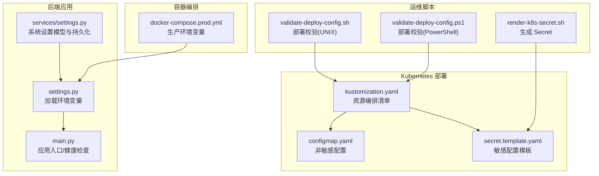
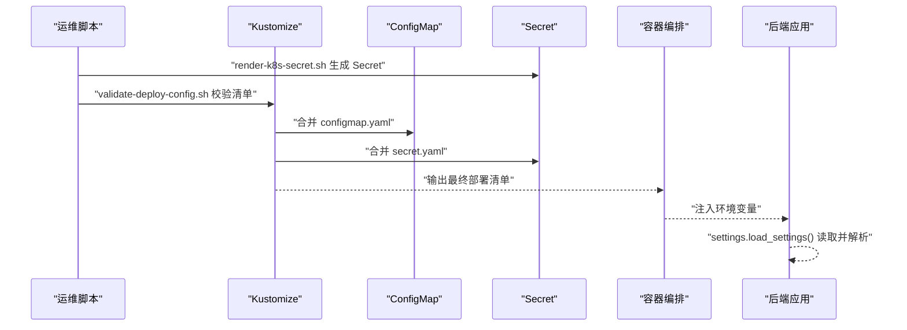
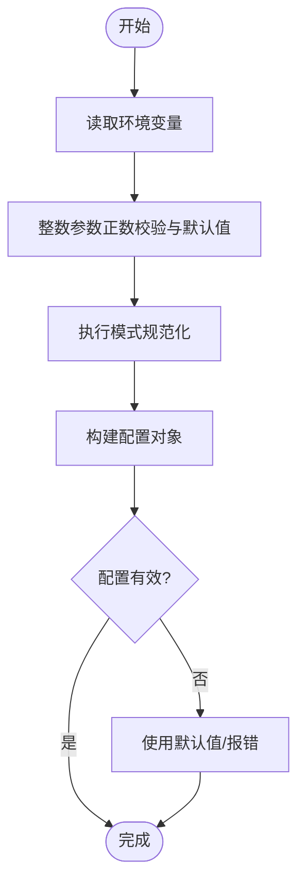
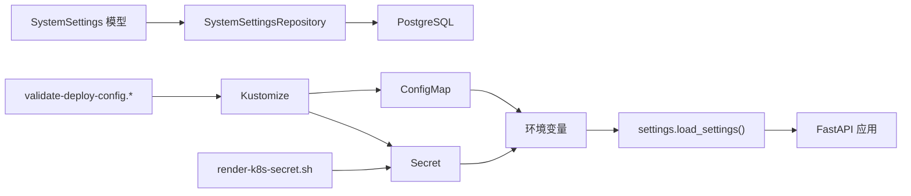

# 环境配置

<cite>
**本文引用的文件**
- [settings.py](file://backend/deployment_package_factory/settings.py)
- [settings.py](file://backend/deployment_package_factory/services/settings.py)
- [configmap.yaml](file://deploy/k8s/configmap.yaml)
- [secret.template.yaml](file://deploy/k8s/secret.template.yaml)
- [kustomization.yaml](file://deploy/k8s/kustomization.yaml)
- [docker-compose.prod.yml](file://deploy/docker-compose.prod.yml)
- [render-k8s-secret.sh](file://scripts/render-k8s-secret.sh)
- [validate-deploy-config.sh](file://scripts/validate-deploy-config.sh)
- [validate-deploy-config.ps1](file://scripts/validate-deploy-config.ps1)
- [main.py](file://backend/deployment_package_factory/main.py)
</cite>

## 目录
1. [简介](#简介)
2. [项目结构](#项目结构)
3. [核心组件](#核心组件)
4. [架构总览](#架构总览)
5. [详细组件分析](#详细组件分析)
6. [依赖分析](#依赖分析)
7. [性能考虑](#性能考虑)
8. [故障排查指南](#故障排查指南)
9. [结论](#结论)
10. [附录](#附录)

## 简介
本指南聚焦于部署包工厂的环境配置与管理，系统性阐述以下主题：
- ConfigMap 与 Secret 的使用场景与配置方法
- 敏感信息加密存储与密钥轮换策略
- 数据库连接、API 密钥与第三方服务集成参数的配置
- 环境变量的层次结构与优先级规则（默认值、运行时覆盖）
- 不同环境（dev/test/prod）的配置差异与切换方法
- 配置验证工具与配置热更新的实现方案

## 项目结构
围绕环境配置的关键目录与文件如下：
- 后端应用读取环境变量并加载设置：backend/deployment_package_factory/settings.py
- 系统设置模型与持久化：backend/deployment_package_factory/services/settings.py
- Kubernetes 部署清单：deploy/k8s/configmap.yaml、deploy/k8s/secret.template.yaml、deploy/k8s/kustomization.yaml
- Docker Compose 生产环境编排：deploy/docker-compose.prod.yml
- 密钥渲染与部署校验脚本：scripts/render-k8s-secret.sh、scripts/validate-deploy-config.sh、scripts/validate-deploy-config.ps1
- 应用入口与健康检查：backend/deployment_package_factory/main.py

图表来源
- [settings.py:26-41](file://backend/deployment_package_factory/settings.py#L26-L41)
- [settings.py:158-167](file://backend/deployment_package_factory/services/settings.py#L158-L167)
- [configmap.yaml:8-22](file://deploy/k8s/configmap.yaml#L8-L22)
- [secret.template.yaml:9-14](file://deploy/k8s/secret.template.yaml#L9-L14)
- [kustomization.yaml:3-14](file://deploy/k8s/kustomization.yaml#L3-L14)
- [docker-compose.prod.yml:5-15](file://deploy/docker-compose.prod.yml#L5-L15)
- [render-k8s-secret.sh:66-74](file://scripts/render-k8s-secret.sh#L66-L74)
- [validate-deploy-config.sh:25-48](file://scripts/validate-deploy-config.sh#L25-L48)
- [validate-deploy-config.ps1:28-55](file://scripts/validate-deploy-config.ps1#L28-L55)

章节来源
- [settings.py:26-41](file://backend/deployment_package_factory/settings.py#L26-L41)
- [settings.py:158-167](file://backend/deployment_package_factory/services/settings.py#L158-L167)
- [configmap.yaml:8-22](file://deploy/k8s/configmap.yaml#L8-L22)
- [secret.template.yaml:9-14](file://deploy/k8s/secret.template.yaml#L9-L14)
- [kustomization.yaml:3-14](file://deploy/k8s/kustomization.yaml#L3-L14)
- [docker-compose.prod.yml:5-15](file://deploy/docker-compose.prod.yml#L5-L15)
- [render-k8s-secret.sh:66-74](file://scripts/render-k8s-secret.sh#L66-L74)
- [validate-deploy-config.sh:25-48](file://scripts/validate-deploy-config.sh#L25-L48)
- [validate-deploy-config.ps1:28-55](file://scripts/validate-deploy-config.ps1#L28-L55)

## 核心组件
- 环境变量加载器：从进程环境变量读取配置，支持默认值与类型约束，并对整数型参数进行正数校验与兜底。
- 系统设置模型：定义 Git、Harbor、Jenkins、Kubernetes、中间件等第三方服务的配置模型与字段校验。
- Kubernetes ConfigMap/Secret：非敏感参数通过 ConfigMap 注入，敏感参数通过 Secret 注入；由 Kustomize 组合。
- Docker Compose：在生产模式下通过环境变量注入数据库连接与可选凭据。
- 部署校验：脚本确保必要文件存在、占位符被替换、关键键存在且符合约定。

章节来源
- [settings.py:26-41](file://backend/deployment_package_factory/settings.py#L26-L41)
- [settings.py:14-167](file://backend/deployment_package_factory/services/settings.py#L14-L167)
- [configmap.yaml:8-22](file://deploy/k8s/configmap.yaml#L8-L22)
- [secret.template.yaml:9-14](file://deploy/k8s/secret.template.yaml#L9-L14)
- [kustomization.yaml:3-14](file://deploy/k8s/kustomization.yaml#L3-L14)
- [docker-compose.prod.yml:5-15](file://deploy/docker-compose.prod.yml#L5-L15)
- [validate-deploy-config.sh:25-48](file://scripts/validate-deploy-config.sh#L25-L48)
- [validate-deploy-config.ps1:28-55](file://scripts/validate-deploy-config.ps1#L28-L55)

## 架构总览
下图展示从“环境变量输入”到“应用运行时”的整体流程，以及“配置验证”与“密钥渲染”的运维流程。

图表来源
- [render-k8s-secret.sh:66-74](file://scripts/render-k8s-secret.sh#L66-L74)
- [validate-deploy-config.sh:25-48](file://scripts/validate-deploy-config.sh#L25-L48)
- [configmap.yaml:8-22](file://deploy/k8s/configmap.yaml#L8-L22)
- [secret.template.yaml:9-14](file://deploy/k8s/secret.template.yaml#L9-L14)
- [kustomization.yaml:3-14](file://deploy/k8s/kustomization.yaml#L3-L14)
- [settings.py:26-41](file://backend/deployment_package_factory/settings.py#L26-L41)

## 详细组件分析

### 环境变量加载与优先级
- 加载位置：后端应用通过环境变量加载配置，未提供的键采用默认值或空字符串。
- 类型与边界：整数类参数会进行正数校验与兜底；执行模式限定为后台或工作模式。
- 运行时覆盖：容器编排（Kubernetes 或 Docker Compose）中的环境变量会覆盖 ConfigMap 中的同名键值。
- 健康检查：应用在就绪接口中调用设置加载逻辑以验证关键配置可用性。

图表来源
- [settings.py:44-56](file://backend/deployment_package_factory/settings.py#L44-L56)
- [settings.py:26-41](file://backend/deployment_package_factory/settings.py#L26-L41)

章节来源
- [settings.py:26-41](file://backend/deployment_package_factory/settings.py#L26-L41)
- [main.py:45-55](file://backend/deployment_package_factory/main.py#L45-L55)

### ConfigMap 使用场景与配置方法
- 非敏感参数：如数据目录、输出目录、并发构建数、执行模式、超时与保留策略、共享存储声明等。
- 注入方式：Kustomize 将 configmap.yaml 合并到最终清单；容器启动时以环境变量形式注入。
- 变更策略：ConfigMap 支持热更新，但部分挂载路径或已注入的环境变量可能不会立即生效，需结合滚动重启策略。

章节来源
- [configmap.yaml:8-22](file://deploy/k8s/configmap.yaml#L8-L22)
- [kustomization.yaml:3-14](file://deploy/k8s/kustomization.yaml#L3-L14)

### Secret 使用场景与配置方法
- 敏感参数：API Token、前端 API Base URL、数据库连接串、镜像仓库用户名/密码等。
- 模板与渲染：secret.template.yaml 提供占位符模板；render-k8s-secret.sh 脚本根据命令行参数生成 secret.yaml 并写入目标路径。
- 安全建议：避免将明文写入版本控制；使用 CI/CD 管道安全注入参数。

章节来源
- [secret.template.yaml:9-14](file://deploy/k8s/secret.template.yaml#L9-L14)
- [render-k8s-secret.sh:11-42](file://scripts/render-k8s-secret.sh#L11-L42)
- [render-k8s-secret.sh:66-74](file://scripts/render-k8s-secret.sh#L66-L74)

### 第三方服务集成参数
- Git：提供者、基础地址、分组、用户名、邮箱、令牌等，含字段裁剪与格式校验。
- Harbor：镜像仓库主机、项目、用户名、密码、是否不安全。
- Jenkins：基础地址、文件夹、用户名、密码、作业名、凭据 ID 等。
- Kubernetes：集群名、Ingress VIP、命名空间、kubeconfig 路径、存储类等。
- 中间件：Redis、PostgreSQL、DM、IoTDB、MongoDB、Kafka、MQ、Nacos 的启用、主机、端口、认证与数据库/命名空间等。

章节来源
- [settings.py:14-167](file://backend/deployment_package_factory/services/settings.py#L14-L167)

### 数据库连接配置
- Kubernetes：通过 Secret 注入数据库连接串；部署校验脚本要求必须包含该键。
- Docker Compose：生产模式要求显式提供数据库连接串；未提供则校验失败。
- 应用侧：系统设置仓库基于数据库 URL 进行连接与表初始化。

章节来源
- [secret.template.yaml](file://deploy/k8s/secret.template.yaml#L12)
- [validate-deploy-config.sh:46-48](file://scripts/validate-deploy-config.sh#L46-L48)
- [validate-deploy-config.ps1:52-54](file://scripts/validate-deploy-config.ps1#L52-L54)
- [docker-compose.prod.yml](file://deploy/docker-compose.prod.yml#L7)
- [settings.py:218-221](file://backend/deployment_package_factory/services/settings.py#L218-L221)

### API 密钥管理
- 后端与前端分别维护独立的 API Token；均来自 Secret。
- 健康检查接口依赖设置加载，间接验证 Token 与数据库连接等关键配置可用。

章节来源
- [secret.template.yaml:10-11](file://deploy/k8s/secret.template.yaml#L10-L11)
- [main.py:45-55](file://backend/deployment_package_factory/main.py#L45-L55)

### 不同环境（dev/test/prod）的配置差异与切换
- 开发（dev）：可通过 ConfigMap 设置源命名空间等参数，便于本地联调。
- 测试（test）：可复用 dev 的 ConfigMap，配合独立的 Secret。
- 生产（prod）：通过 Docker Compose 或 K8s Secret 注入数据库连接串与 API Token；部署前必须通过校验脚本。

章节来源
- [configmap.yaml:18-19](file://deploy/k8s/configmap.yaml#L18-L19)
- [docker-compose.prod.yml:5-15](file://deploy/docker-compose.prod.yml#L5-L15)
- [validate-deploy-config.sh:25-48](file://scripts/validate-deploy-config.sh#L25-L48)
- [validate-deploy-config.ps1:28-55](file://scripts/validate-deploy-config.ps1#L28-L55)

### 配置验证工具
- K8s 模式：校验必要文件存在、拒绝占位符残留、要求包含 Secret 清单、共享存储使用 ReadWriteMany、StorageClass 配置。
- Docker Compose 模式：校验生产环境变量文件存在且包含数据库连接串。

章节来源
- [validate-deploy-config.sh:12-48](file://scripts/validate-deploy-config.sh#L12-L48)
- [validate-deploy-config.ps1:13-55](file://scripts/validate-deploy-config.ps1#L13-L55)

### 配置热更新实现方案
- ConfigMap 热更新：Kubernetes 支持对已注入的环境变量进行热更新，但部分挂载路径或已注入的环境变量可能不会立即生效，建议结合滚动重启策略。
- Secret 更新：Secret 更改后通常需要滚动更新 Pod 才能生效；可结合探针与就绪检查保障平滑过渡。

章节来源
- [configmap.yaml:8-22](file://deploy/k8s/configmap.yaml#L8-L22)
- [kustomization.yaml:3-14](file://deploy/k8s/kustomization.yaml#L3-L14)

## 依赖分析
- 后端应用依赖环境变量加载模块；系统设置模型用于持久化与校验第三方服务参数。
- 部署层通过 Kustomize 组合 ConfigMap 与 Secret；运维脚本负责密钥渲染与部署校验。
- 编排层（K8s/Docker Compose）决定最终注入的环境变量与覆盖顺序。

图表来源
- [settings.py:26-41](file://backend/deployment_package_factory/settings.py#L26-L41)
- [settings.py:158-167](file://backend/deployment_package_factory/services/settings.py#L158-L167)
- [kustomization.yaml:3-14](file://deploy/k8s/kustomization.yaml#L3-L14)
- [render-k8s-secret.sh:66-74](file://scripts/render-k8s-secret.sh#L66-L74)
- [validate-deploy-config.sh:25-48](file://scripts/validate-deploy-config.sh#L25-L48)

章节来源
- [settings.py:26-41](file://backend/deployment_package_factory/settings.py#L26-L41)
- [settings.py:158-167](file://backend/deployment_package_factory/services/settings.py#L158-L167)
- [kustomization.yaml:3-14](file://deploy/k8s/kustomization.yaml#L3-L14)
- [render-k8s-secret.sh:66-74](file://scripts/render-k8s-secret.sh#L66-L74)
- [validate-deploy-config.sh:25-48](file://scripts/validate-deploy-config.sh#L25-L48)

## 性能考虑
- 环境变量解析成本极低，主要开销在于数据库连接与第三方服务调用。
- 对整数参数进行正数校验与兜底，避免无效配置导致的运行期异常。
- 在高并发构建场景下，合理设置并发数与任务超时时间，避免资源争用。

## 故障排查指南
- 占位符残留：部署校验脚本会检测 Secret 与 PVC Patch 是否仍包含占位符，若存在则直接失败。
- 缺失关键键：校验脚本要求 Secret 必须包含数据库连接串；否则失败。
- 共享存储：K8s PVC 必须使用 ReadWriteMany；否则失败。
- 存储类：生成的 PVC Patch 必须定义 storageClassName。
- Docker Compose：生产模式必须提供数据库连接串，否则失败。

章节来源
- [validate-deploy-config.sh:18-48](file://scripts/validate-deploy-config.sh#L18-L48)
- [validate-deploy-config.ps1:20-55](file://scripts/validate-deploy-config.ps1#L20-L55)

## 结论
本指南提供了从配置生成、注入、校验到热更新的完整链路说明。通过将敏感信息放入 Secret、非敏感信息放入 ConfigMap，并借助 Kustomize 与校验脚本，可以安全、可靠地管理多环境配置。同时，明确的优先级与兜底策略确保了应用在不同环境下的稳定运行。

## 附录
- 密钥轮换建议
  - 使用 Secret 模板与渲染脚本生成新 Secret，然后触发滚动更新。
  - 在 CI/CD 中自动化执行渲染与校验，确保变更可追溯。
- 环境变量命名规范
  - 建议统一前缀（如 DEPLOYMENT_PACKAGE_*），便于识别与管理。
- 运行时覆盖建议
  - 在容器编排中仅覆盖必要的敏感或动态参数，保持 ConfigMap 的通用性。