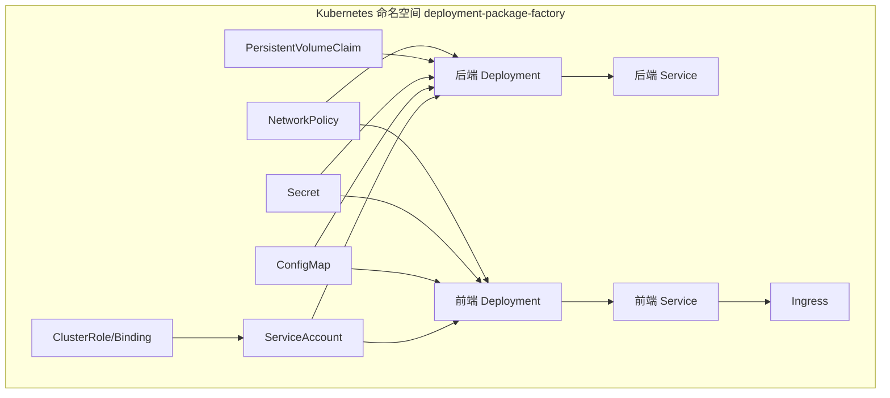
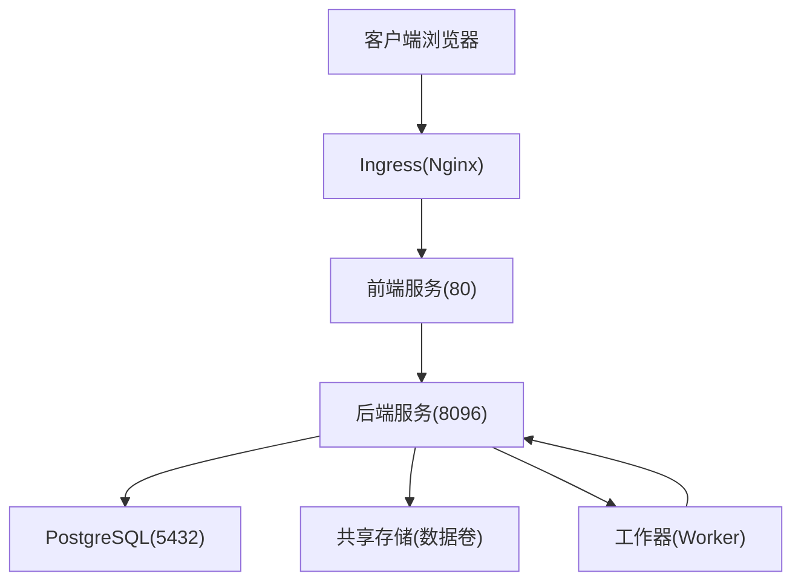
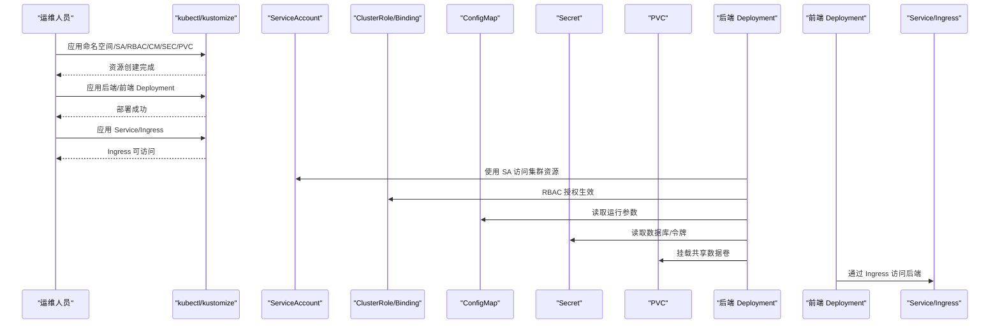
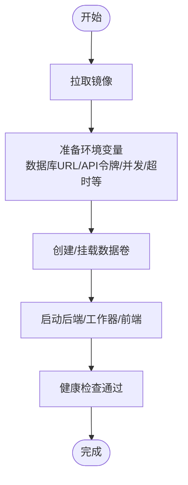
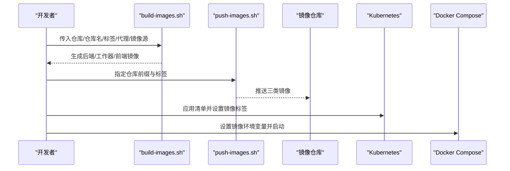
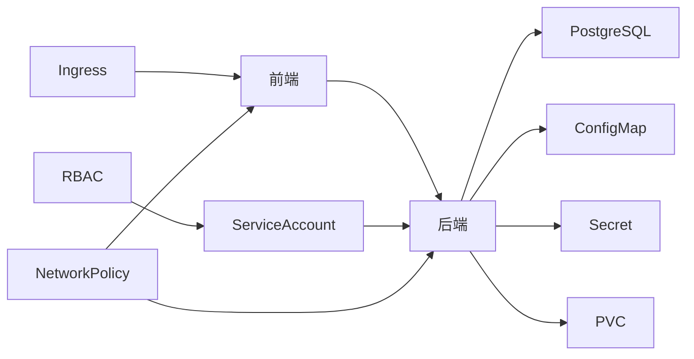

# 生产环境部署

<cite>
**本文引用的文件**
- [deploy/k8s/backend.yaml](file://deploy/k8s/backend.yaml)
- [deploy/k8s/frontend.yaml](file://deploy/k8s/frontend.yaml)
- [deploy/k8s/ingress.yaml](file://deploy/k8s/ingress.yaml)
- [deploy/k8s/configmap.yaml](file://deploy/k8s/configmap.yaml)
- [deploy/k8s/secret.template.yaml](file://deploy/k8s/secret.template.yaml)
- [deploy/k8s/rbac.yaml](file://deploy/k8s/rbac.yaml)
- [deploy/k8s/networkpolicy.yaml](file://deploy/k8s/networkpolicy.yaml)
- [deploy/k8s/pvc.yaml](file://deploy/k8s/pvc.yaml)
- [deploy/k8s/serviceaccount.yaml](file://deploy/k8s/serviceaccount.yaml)
- [deploy/docker-compose.prod.yml](file://deploy/docker-compose.prod.yml)
- [scripts/build-images.sh](file://scripts/build-images.sh)
- [scripts/push-images.sh](file://scripts/push-images.sh)
- [scripts/render-k8s-secret.sh](file://scripts/render-k8s-secret.sh)
- [backend/Dockerfile](file://backend/Dockerfile)
- [frontend/Dockerfile](file://frontend/Dockerfile)
</cite>

## 目录
1. [简介](#简介)
2. [项目结构](#项目结构)
3. [核心组件](#核心组件)
4. [架构总览](#架构总览)
5. [详细组件分析](#详细组件分析)
6. [依赖关系分析](#依赖关系分析)
7. [性能考虑](#性能考虑)
8. [故障排查指南](#故障排查指南)
9. [结论](#结论)
10. [附录](#附录)

## 简介
本指南面向生产环境部署“部署包工厂”系统，覆盖 Kubernetes 与 Docker Compose 两种部署模式。内容包括部署清单结构（Service、Deployment、Ingress、ConfigMap、Secret、RBAC、NetworkPolicy、PVC、ServiceAccount）、镜像构建与推送流程（含多平台与版本管理建议）、环境变量配置要点（数据库连接、API 令牌、并发与超时控制）、部署前检查清单、部署验证步骤以及生产安全与网络策略建议。

## 项目结构
- 后端服务：基于 Python 的 Uvicorn 应用，暴露健康检查与指标端点，支持工作器模式执行任务。
- 前端服务：基于 Nginx 的静态站点，通过运行时注入 API 基地址与令牌实现前后端联动。
- 部署清单：Kubernetes 清单位于 deploy/k8s，包含后端、前端、Ingress、ConfigMap、Secret、RBAC、NetworkPolicy、PVC、ServiceAccount；Compose 清单位于 deploy/docker-compose.prod.yml。
- 镜像构建脚本：scripts/build-images.sh 与 scripts/push-images.sh 支持统一的镜像标签与仓库前缀。
- 安全渲染：scripts/render-k8s-secret.sh 将敏感信息渲染为 Secret 并输出到 deploy/k8s/secret.yaml。

图表来源
- [deploy/k8s/serviceaccount.yaml:1-9](file://deploy/k8s/serviceaccount.yaml#L1-L9)
- [deploy/k8s/configmap.yaml:1-23](file://deploy/k8s/configmap.yaml#L1-L23)
- [deploy/k8s/secret.template.yaml:1-15](file://deploy/k8s/secret.template.yaml#L1-L15)
- [deploy/k8s/pvc.yaml:1-15](file://deploy/k8s/pvc.yaml#L1-L15)
- [deploy/k8s/rbac.yaml:1-49](file://deploy/k8s/rbac.yaml#L1-L49)
- [deploy/k8s/networkpolicy.yaml:1-62](file://deploy/k8s/networkpolicy.yaml#L1-L62)
- [deploy/k8s/backend.yaml:1-96](file://deploy/k8s/backend.yaml#L1-L96)
- [deploy/k8s/frontend.yaml:1-84](file://deploy/k8s/frontend.yaml#L1-L84)
- [deploy/k8s/ingress.yaml:1-27](file://deploy/k8s/ingress.yaml#L1-L27)

章节来源
- [deploy/k8s/backend.yaml:1-96](file://deploy/k8s/backend.yaml#L1-L96)
- [deploy/k8s/frontend.yaml:1-84](file://deploy/k8s/frontend.yaml#L1-L84)
- [deploy/k8s/ingress.yaml:1-27](file://deploy/k8s/ingress.yaml#L1-L27)
- [deploy/k8s/configmap.yaml:1-23](file://deploy/k8s/configmap.yaml#L1-L23)
- [deploy/k8s/secret.template.yaml:1-15](file://deploy/k8s/secret.template.yaml#L1-L15)
- [deploy/k8s/rbac.yaml:1-49](file://deploy/k8s/rbac.yaml#L1-L49)
- [deploy/k8s/networkpolicy.yaml:1-62](file://deploy/k8s/networkpolicy.yaml#L1-L62)
- [deploy/k8s/pvc.yaml:1-15](file://deploy/k8s/pvc.yaml#L1-L15)
- [deploy/k8s/serviceaccount.yaml:1-9](file://deploy/k8s/serviceaccount.yaml#L1-L9)

## 核心组件
- 后端应用
  - 部署类型：Deployment，使用非 root 用户运行，启用 seccomp 默认配置，限制容器能力，挂载共享数据卷。
  - 探针：就绪探针与存活探针均指向 /health/ready 与 /health。
  - 资源：定义 CPU 与内存请求/限制，满足生产级稳定性。
  - 环境：通过 ConfigMap 与 Secret 注入运行时参数与凭据。
- 前端应用
  - 部署类型：Deployment，Nginx 提供静态服务，容器内暴露 80 端口。
  - 运行时注入：通过环境变量注入 API 基地址与令牌。
- Ingress
  - 使用 nginx.ingress.kubernetes.io/* 注解优化代理缓冲与超时，绑定域名与路径。
- ConfigMap
  - 关键参数：数据目录、输出目录、并发构建数、执行模式、轮询与心跳间隔、任务超时、保留天数、最大容量、本地镜像导出开关、数据卷声明名称等。
- Secret
  - 包含 API 令牌、前端令牌、数据库连接串、可选的源镜像仓库用户名/密码。
- RBAC
  - 给 ServiceAccount 授予读取 Pod/Secret/ConfigMap 权限，并允许在命名空间中创建/删除 Pod 与命名空间相关操作。
- NetworkPolicy
  - 控制入站与出站流量，仅放行必要的端口（80/8080/8096/5432），限制对外 DNS、Kubernetes API 与集群内部通信。
- PVC
  - 申请 RWX 存储类以满足多副本共享写入需求，初始容量 100Gi。
- ServiceAccount
  - 自动挂载令牌，供后端与工作器读取集群资源。

章节来源
- [deploy/k8s/backend.yaml:1-96](file://deploy/k8s/backend.yaml#L1-L96)
- [deploy/k8s/frontend.yaml:1-84](file://deploy/k8s/frontend.yaml#L1-L84)
- [deploy/k8s/ingress.yaml:1-27](file://deploy/k8s/ingress.yaml#L1-L27)
- [deploy/k8s/configmap.yaml:1-23](file://deploy/k8s/configmap.yaml#L1-L23)
- [deploy/k8s/secret.template.yaml:1-15](file://deploy/k8s/secret.template.yaml#L1-L15)
- [deploy/k8s/rbac.yaml:1-49](file://deploy/k8s/rbac.yaml#L1-L49)
- [deploy/k8s/networkpolicy.yaml:1-62](file://deploy/k8s/networkpolicy.yaml#L1-L62)
- [deploy/k8s/pvc.yaml:1-15](file://deploy/k8s/pvc.yaml#L1-L15)
- [deploy/k8s/serviceaccount.yaml:1-9](file://deploy/k8s/serviceaccount.yaml#L1-L9)

## 架构总览
下图展示生产环境的端到端交互：客户端经 Ingress 访问前端，前端通过 API 基地址调用后端；后端从数据库读写元数据，使用共享存储持久化部署产物与中间态；工作器在后台轮询任务并执行。

图表来源
- [deploy/k8s/ingress.yaml:1-27](file://deploy/k8s/ingress.yaml#L1-L27)
- [deploy/k8s/frontend.yaml:1-84](file://deploy/k8s/frontend.yaml#L1-L84)
- [deploy/k8s/backend.yaml:1-96](file://deploy/k8s/backend.yaml#L1-L96)
- [deploy/k8s/pvc.yaml:1-15](file://deploy/k8s/pvc.yaml#L1-L15)
- [deploy/k8s/configmap.yaml:1-23](file://deploy/k8s/configmap.yaml#L1-L23)

## 详细组件分析

### Kubernetes 部署清单解析
- Service
  - 后端 Service 暴露 8096 端口，前端 Service 暴露 80 端口，均采用 ClusterIP。
- Deployment
  - 后端与前端均使用单副本部署，生产建议根据负载提升副本数并配合 HPA。
  - 容器安全上下文：禁止提权、丢弃全部能力、非 root 运行、seccomp 默认。
  - 探针：健康检查路径分别为 /health/ready 与 /health。
  - 资源：已设定 requests/limits，建议结合监控指标进行调优。
- Ingress
  - 指定 ingressClassName 为 nginx，绑定主机名与根路径，注解用于代理缓冲与长连接超时。
- ConfigMap
  - 运行期关键参数集中管理，便于滚动更新。
- Secret
  - 敏感信息集中管理，避免硬编码。
- RBAC
  - 限定后端与工作器对必要资源的访问范围。
- NetworkPolicy
  - 入站仅放行前端/后端/数据库端口；出站限制至集群 DNS/Kubernetes API/同命名空间服务与特定 CIDR。
- PVC
  - 申请 RWX 存储类，确保多副本共享写入能力。
- ServiceAccount
  - 与 RBAC 绑定，自动挂载令牌。

图表来源
- [deploy/k8s/serviceaccount.yaml:1-9](file://deploy/k8s/serviceaccount.yaml#L1-L9)
- [deploy/k8s/rbac.yaml:1-49](file://deploy/k8s/rbac.yaml#L1-L49)
- [deploy/k8s/configmap.yaml:1-23](file://deploy/k8s/configmap.yaml#L1-L23)
- [deploy/k8s/secret.template.yaml:1-15](file://deploy/k8s/secret.template.yaml#L1-L15)
- [deploy/k8s/pvc.yaml:1-15](file://deploy/k8s/pvc.yaml#L1-L15)
- [deploy/k8s/backend.yaml:1-96](file://deploy/k8s/backend.yaml#L1-L96)
- [deploy/k8s/frontend.yaml:1-84](file://deploy/k8s/frontend.yaml#L1-L84)
- [deploy/k8s/ingress.yaml:1-27](file://deploy/k8s/ingress.yaml#L1-L27)

章节来源
- [deploy/k8s/backend.yaml:1-96](file://deploy/k8s/backend.yaml#L1-L96)
- [deploy/k8s/frontend.yaml:1-84](file://deploy/k8s/frontend.yaml#L1-L84)
- [deploy/k8s/ingress.yaml:1-27](file://deploy/k8s/ingress.yaml#L1-L27)
- [deploy/k8s/configmap.yaml:1-23](file://deploy/k8s/configmap.yaml#L1-L23)
- [deploy/k8s/secret.template.yaml:1-15](file://deploy/k8s/secret.template.yaml#L1-L15)
- [deploy/k8s/rbac.yaml:1-49](file://deploy/k8s/rbac.yaml#L1-L49)
- [deploy/k8s/networkpolicy.yaml:1-62](file://deploy/k8s/networkpolicy.yaml#L1-L62)
- [deploy/k8s/pvc.yaml:1-15](file://deploy/k8s/pvc.yaml#L1-L15)
- [deploy/k8s/serviceaccount.yaml:1-9](file://deploy/k8s/serviceaccount.yaml#L1-L9)

### Docker Compose 部署解析
- 服务
  - 后端：执行健康检查，依赖数据库 URL 与 API 令牌等环境变量。
  - 工作器：独立容器，负责轮询与执行任务，参数与后端一致。
  - 前端：暴露宿主端口映射，默认 80，依赖后端健康状态。
- 卷
  - 使用命名卷 deployment-package-data 挂载到 /app/data。
- 网络
  - 所有服务加入自定义网络 deployment-package-factory。

图表来源
- [deploy/docker-compose.prod.yml:1-65](file://deploy/docker-compose.prod.yml#L1-L65)

章节来源
- [deploy/docker-compose.prod.yml:1-65](file://deploy/docker-compose.prod.yml#L1-L65)

### 镜像构建与推送流程
- 构建脚本
  - 支持指定仓库前缀、仓库名、标签；支持禁用缓存；支持代理与镜像源参数透传。
  - 分别构建后端、工作器与前端镜像。
- 推送脚本
  - 必须提供仓库前缀；按顺序推送三类镜像。
- Dockerfile
  - 后端：Python 3.12 slim，安装 skopeo 与证书，pip 安装项目，非 root 用户运行。
  - 前端：Node 22 Alpine 构建，Nginx 1.27 Alpine 运行，启用 NPM Registry 配置。

图表来源
- [scripts/build-images.sh:1-97](file://scripts/build-images.sh#L1-L97)
- [scripts/push-images.sh:1-54](file://scripts/push-images.sh#L1-L54)
- [backend/Dockerfile:1-36](file://backend/Dockerfile#L1-L36)
- [frontend/Dockerfile:1-32](file://frontend/Dockerfile#L1-L32)

章节来源
- [scripts/build-images.sh:1-97](file://scripts/build-images.sh#L1-L97)
- [scripts/push-images.sh:1-54](file://scripts/push-images.sh#L1-L54)
- [backend/Dockerfile:1-36](file://backend/Dockerfile#L1-L36)
- [frontend/Dockerfile:1-32](file://frontend/Dockerfile#L1-L32)

### 环境变量配置要点
- 数据库连接
  - 通过 Secret 中的 DEPLOYMENT_PACKAGE_DATABASE_URL 注入，格式包含主机、端口、数据库名与认证信息。
- API 令牌
  - 后端与前端分别使用 DEPLOYMENT_PACKAGE_API_TOKEN 与 DEPLOYMENT_PACKAGE_FRONTEND_API_TOKEN，需强随机值。
- 并发与执行
  - DEPLOYMENT_PACKAGE_MAX_CONCURRENT_BUILDS 控制并发任务数；执行模式 DEPLOYMENT_PACKAGE_EXECUTION_MODE 设为 worker。
  - 工作器轮询间隔与心跳间隔由 DEPLOYMENT_PACKAGE_WORKER_POLL_INTERVAL_SECONDS 与 DEPLOYMENT_PACKAGE_WORKER_HEARTBEAT_SECONDS 控制。
- 超时与保留
  - 任务超时 DEPLOYMENT_PACKAGE_RUNNING_TASK_TIMEOUT_MINUTES；产物保留天数 DEPLOYMENT_PACKAGE_RETENTION_DAYS；总容量上限 DEPLOYMENT_PACKAGE_MAX_TOTAL_GB。
- 存储与导出
  - 数据目录与输出目录由 DEPLOYMENT_PACKAGE_DATA_DIR 与 DEPLOYMENT_PACKAGE_OUTPUT_DIR 指定；本地镜像导出 DEPLOYMENT_PACKAGE_LOCAL_IMAGE_EXPORT。
- 源镜像仓库
  - 可选的源镜像仓库用户名/密码 DEPLOYMENT_PACKAGE_SOURCE_REGISTRY_USERNAME/PASSWORD。
- 前端运行时
  - 前端通过 DEPLOYMENT_PACKAGE_FRONTEND_API_BASE_URL 注入后端 API 地址；令牌通过 Secret 注入。

章节来源
- [deploy/k8s/configmap.yaml:1-23](file://deploy/k8s/configmap.yaml#L1-L23)
- [deploy/k8s/secret.template.yaml:1-15](file://deploy/k8s/secret.template.yaml#L1-L15)
- [deploy/k8s/frontend.yaml:38-46](file://deploy/k8s/frontend.yaml#L38-L46)
- [deploy/docker-compose.prod.yml:5-15](file://deploy/docker-compose.prod.yml#L5-L15)
- [deploy/docker-compose.prod.yml:29-40](file://deploy/docker-compose.prod.yml#L29-L40)

## 依赖关系分析
- 组件耦合
  - 后端依赖数据库、共享存储与 Secret/ConfigMap；前端依赖后端 API 与 Secret 注入的令牌。
- 外部依赖
  - Ingress 控制器（nginx）；Kubernetes API；PostgreSQL；镜像仓库。
- 潜在环路
  - 清单未见循环依赖；前端依赖后端健康状态，属于合理的启动依赖。

图表来源
- [deploy/k8s/frontend.yaml:1-84](file://deploy/k8s/frontend.yaml#L1-L84)
- [deploy/k8s/backend.yaml:1-96](file://deploy/k8s/backend.yaml#L1-L96)
- [deploy/k8s/ingress.yaml:1-27](file://deploy/k8s/ingress.yaml#L1-L27)
- [deploy/k8s/configmap.yaml:1-23](file://deploy/k8s/configmap.yaml#L1-L23)
- [deploy/k8s/secret.template.yaml:1-15](file://deploy/k8s/secret.template.yaml#L1-L15)
- [deploy/k8s/pvc.yaml:1-15](file://deploy/k8s/pvc.yaml#L1-L15)
- [deploy/k8s/serviceaccount.yaml:1-9](file://deploy/k8s/serviceaccount.yaml#L1-L9)
- [deploy/k8s/rbac.yaml:1-49](file://deploy/k8s/rbac.yaml#L1-L49)
- [deploy/k8s/networkpolicy.yaml:1-62](file://deploy/k8s/networkpolicy.yaml#L1-L62)

章节来源
- [deploy/k8s/frontend.yaml:1-84](file://deploy/k8s/frontend.yaml#L1-L84)
- [deploy/k8s/backend.yaml:1-96](file://deploy/k8s/backend.yaml#L1-L96)
- [deploy/k8s/ingress.yaml:1-27](file://deploy/k8s/ingress.yaml#L1-L27)
- [deploy/k8s/configmap.yaml:1-23](file://deploy/k8s/configmap.yaml#L1-L23)
- [deploy/k8s/secret.template.yaml:1-15](file://deploy/k8s/secret.template.yaml#L1-L15)
- [deploy/k8s/pvc.yaml:1-15](file://deploy/k8s/pvc.yaml#L1-L15)
- [deploy/k8s/serviceaccount.yaml:1-9](file://deploy/k8s/serviceaccount.yaml#L1-L9)
- [deploy/k8s/rbac.yaml:1-49](file://deploy/k8s/rbac.yaml#L1-L49)
- [deploy/k8s/networkpolicy.yaml:1-62](file://deploy/k8s/networkpolicy.yaml#L1-L62)

## 性能考虑
- 资源配额
  - 后端与前端已设置 requests/limits，建议结合 HPA 与监控指标动态调整。
- 并发与超时
  - 合理设置并发数与任务超时，避免资源争用与僵尸任务。
- 存储
  - 使用 RWX 存储类满足共享写入；监控容量阈值，设置清理策略。
- 网络
  - 通过 NetworkPolicy 限制不必要的出站流量，降低延迟与风险。

## 故障排查指南
- 健康检查失败
  - 检查后端 /health/ready 与 /health 路径是否可达；确认数据库连通性与 Secret 注入正确。
- 镜像拉取失败
  - 确认仓库前缀与标签；校验镜像仓库凭证；检查私有仓库白名单与 Insecure Registries 配置。
- 前端无法访问后端
  - 校验前端 DEPLOYMENT_PACKAGE_FRONTEND_API_BASE_URL 是否指向正确的后端域名或 IP；确认 Ingress 规则与主机名匹配。
- 存储不可用
  - 确认 StorageClass 支持 RWX；检查 PVC 绑定状态与容量；查看节点可用存储。
- 权限不足
  - 校验 ServiceAccount 令牌与 RBAC 授权；确认后端需要的资源权限已授予。
- 网络不通
  - 检查 NetworkPolicy 的入站/出站规则；确认放行数据库与必要的出站端口。

章节来源
- [deploy/k8s/backend.yaml:55-66](file://deploy/k8s/backend.yaml#L55-L66)
- [deploy/k8s/frontend.yaml:47-58](file://deploy/k8s/frontend.yaml#L47-L58)
- [deploy/k8s/ingress.yaml:1-27](file://deploy/k8s/ingress.yaml#L1-L27)
- [deploy/k8s/secret.template.yaml:1-15](file://deploy/k8s/secret.template.yaml#L1-L15)
- [deploy/k8s/networkpolicy.yaml:1-62](file://deploy/k8s/networkpolicy.yaml#L1-L62)
- [deploy/k8s/pvc.yaml:1-15](file://deploy/k8s/pvc.yaml#L1-L15)
- [deploy/k8s/rbac.yaml:1-49](file://deploy/k8s/rbac.yaml#L1-L49)

## 结论
本指南提供了“部署包工厂”在 Kubernetes 与 Docker Compose 两种模式下的完整部署方案。通过标准化的部署清单、集中化的环境变量管理、严格的 RBAC 与 NetworkPolicy、以及完善的镜像构建与推送流程，可在生产环境中实现高可用、可扩展且安全的交付流水线。

## 附录

### 部署前检查清单
- 环境准备
  - 准备镜像仓库与凭证；准备 PostgreSQL 实例与连接串；准备 Ingress 控制器与域名解析。
- 清单准备
  - 替换 PVC 的 StorageClass 为可用的 RWX 类型；替换 Ingress 主机名为实际域名；渲染 Secret 文件。
- 参数核对
  - 确认 ConfigMap 中的数据目录、输出目录、并发、超时、保留与容量参数符合预期。
- 安全加固
  - 启用 RBAC 与 NetworkPolicy；最小权限原则；禁用不必要的探针与调试端口。
- 验证计划
  - 健康检查、API 可达性、前端访问、任务执行与日志采集。

### 部署验证步骤
- Kubernetes
  - 应用所有清单；等待 Pod 就绪；访问 Ingress 域名验证前端；调用后端 /health 与 /metrics；检查 PVC 绑定与存储使用。
- Docker Compose
  - 启动服务；检查后端健康检查；访问前端页面；验证任务执行与日志输出。

### 生产环境安全配置建议
- 最小权限
  - RBAC 仅授予后端与工作器所需资源；避免使用 cluster-admin。
- 网络隔离
  - NetworkPolicy 严格限制入站/出站；仅放行必要端口与 CIDR。
- 凭据管理
  - Secret 使用强随机令牌；定期轮换；避免明文存储。
- 镜像安全
  - 使用可信基础镜像；启用镜像签名与漏洞扫描；限制私有仓库访问白名单。

### 存储类选择与网络策略设置
- 存储类
  - 选择支持 ReadWriteMany 的 StorageClass；确保容量与 IOPS 满足并发写入需求。
- 网络策略
  - 入站：仅放行 80/8080/8096/5432；出站：限制至集群 DNS/Kubernetes API/同命名空间服务与必要外部地址。