# 镜像管理

<cite>
**本文引用的文件**
- [backend/Dockerfile](file://backend/Dockerfile)
- [backend/Dockerfile.worker](file://backend/Dockerfile.worker)
- [frontend/Dockerfile](file://frontend/Dockerfile)
- [scripts/build-images.sh](file://scripts/build-images.sh)
- [scripts/push-images.sh](file://scripts/push-images.sh)
- [scripts/render-deploy-images.sh](file://scripts/render-deploy-images.sh)
- [Jenkinsfile](file://Jenkinsfile)
- [deploy/docker-compose.prod.yml](file://deploy/docker-compose.prod.yml)
- [deploy/k8s/backend.yaml](file://deploy/k8s/backend.yaml)
- [deploy/k8s/worker.yaml](file://deploy/k8s/worker.yaml)
- [backend/deployment_package_factory/services/settings.py](file://backend/deployment_package_factory/services/settings.py)
- [backend/deployment_package_factory/readiness.py](file://backend/deployment_package_factory/readiness.py)
- [docs/jenkins-ci-cd.md](file://docs/jenkins-ci-cd.md)
- [README.md](file://README.md)
- [docs/deployment-package-factory-delivery-audit.md](file://docs/deployment-package-factory-delivery-audit.md)
</cite>

## 目录
1. [简介](#简介)
2. [项目结构](#项目结构)
3. [核心组件](#核心组件)
4. [架构总览](#架构总览)
5. [组件详解](#组件详解)
6. [依赖关系分析](#依赖关系分析)
7. [性能考量](#性能考量)
8. [故障排查指南](#故障排查指南)
9. [结论](#结论)
10. [附录](#附录)

## 简介
本技术指南聚焦于部署包工厂（Deployment Package Factory）的镜像管理，涵盖镜像构建流程（含多阶段构建、缓存策略、构建参数）、镜像标签与版本控制、Harbor 私有仓库配置与使用、镜像推送与自动化 CI/CD 集成、以及镜像安全扫描与合规性最佳实践。文档基于仓库内的实际脚本、配置与流水线进行系统化梳理，帮助读者快速理解并落地镜像管理与交付。

## 项目结构
项目采用前后端分离的镜像体系，配合一套可复用的构建、推送与部署渲染脚本，结合 Jenkins 流水线实现自动化交付。关键位置如下：
- 后端服务镜像：基于 Python 3.12 slim，内置镜像导出工具以支持离线镜像归档。
- Worker 镜像：与后端镜像共用基础层，额外安装镜像导出所需工具。
- 前端镜像：多阶段构建，第一阶段构建产物，第二阶段使用 Nginx 提供静态服务。
- 构建与推送脚本：集中于 scripts/ 目录，支持参数化构建、代理与镜像源配置。
- 部署渲染：根据 Registry/Repository/Tag 生成 K8s 与 Compose 的最终部署配置。
- CI/CD：Jenkinsfile 定义了完整的构建、推送、渲染、部署与冒烟测试流程。

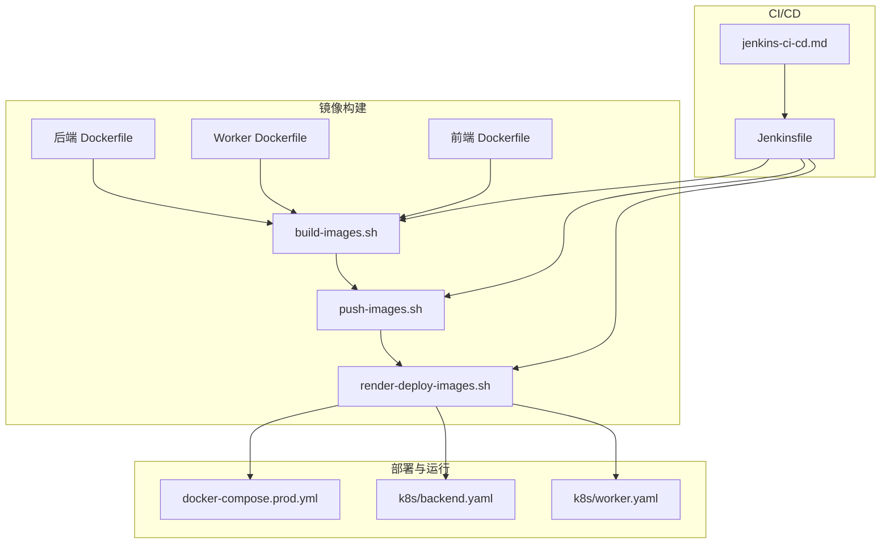

图表来源
- [backend/Dockerfile:1-36](file://backend/Dockerfile#L1-L36)
- [backend/Dockerfile.worker:1-34](file://backend/Dockerfile.worker#L1-L34)
- [frontend/Dockerfile:1-32](file://frontend/Dockerfile#L1-L32)
- [scripts/build-images.sh:1-97](file://scripts/build-images.sh#L1-L97)
- [scripts/push-images.sh:1-54](file://scripts/push-images.sh#L1-L54)
- [scripts/render-deploy-images.sh:1-141](file://scripts/render-deploy-images.sh#L1-L141)
- [deploy/docker-compose.prod.yml:1-65](file://deploy/docker-compose.prod.yml#L1-L65)
- [deploy/k8s/backend.yaml:1-96](file://deploy/k8s/backend.yaml#L1-L96)
- [deploy/k8s/worker.yaml:1-59](file://deploy/k8s/worker.yaml#L1-L59)
- [Jenkinsfile:1-258](file://Jenkinsfile#L1-L258)
- [docs/jenkins-ci-cd.md:1-59](file://docs/jenkins-ci-cd.md#L1-L59)

章节来源
- [backend/Dockerfile:1-36](file://backend/Dockerfile#L1-L36)
- [backend/Dockerfile.worker:1-34](file://backend/Dockerfile.worker#L1-L34)
- [frontend/Dockerfile:1-32](file://frontend/Dockerfile#L1-L32)
- [scripts/build-images.sh:1-97](file://scripts/build-images.sh#L1-L97)
- [scripts/push-images.sh:1-54](file://scripts/push-images.sh#L1-L54)
- [scripts/render-deploy-images.sh:1-141](file://scripts/render-deploy-images.sh#L1-L141)
- [Jenkinsfile:1-258](file://Jenkinsfile#L1-L258)
- [docs/jenkins-ci-cd.md:1-59](file://docs/jenkins-ci-cd.md#L1-L59)

## 核心组件
- 多阶段构建与最小化运行时
  - 后端与 Worker 使用 Python slim 基础镜像，减少体积与攻击面。
  - 前端采用 Node 构建 + Nginx 静态服务的两阶段镜像，确保运行时仅为 Nginx。
- 构建参数与缓存策略
  - 支持 APT/NPM 源镜像、pip index、代理等构建参数，提升构建稳定性与速度。
  - 提供禁用缓存选项，便于问题定位与一致性验证。
- 镜像标签与版本控制
  - Jenkinsfile 默认使用 Git Commit 短 SHA 作为 Tag；亦可通过参数指定。
  - 支持 Registry、Repository 命名空间拼接，形成统一的镜像命名规范。
- Harbor 私有仓库集成
  - Jenkins 推送阶段登录 Harbor，使用凭据管理用户名密码。
  - K8s 部署阶段创建拉取密钥（imagePullSecret），保障镜像拉取安全。
- 自动化 CI/CD
  - 构建 → 推送 → 渲染部署配置 → 确保命名空间与密钥 → 部署 → 冒烟测试。
- 镜像安全与合规
  - 生成镜像归档锁与 SHA256 校验，支持离线导入与一致性校验。
  - 文档提出 SBOM、镜像签名、包签名与漏洞扫描摘要的下一阶段目标。

章节来源
- [backend/Dockerfile:1-36](file://backend/Dockerfile#L1-L36)
- [backend/Dockerfile.worker:1-34](file://backend/Dockerfile.worker#L1-L34)
- [frontend/Dockerfile:1-32](file://frontend/Dockerfile#L1-L32)
- [scripts/build-images.sh:57-82](file://scripts/build-images.sh#L57-L82)
- [scripts/push-images.sh:1-54](file://scripts/push-images.sh#L1-L54)
- [scripts/render-deploy-images.sh:67-104](file://scripts/render-deploy-images.sh#L67-L104)
- [Jenkinsfile:10-26](file://Jenkinsfile#L10-L26)
- [Jenkinsfile:53-84](file://Jenkinsfile#L53-L84)
- [Jenkinsfile:111-129](file://Jenkinsfile#L111-L129)
- [docs/deployment-package-factory-delivery-audit.md:310-318](file://docs/deployment-package-factory-delivery-audit.md#L310-L318)

## 架构总览
下图展示了从代码提交到镜像构建、推送、渲染与部署的完整链路，以及 Harbor 在其中的角色。

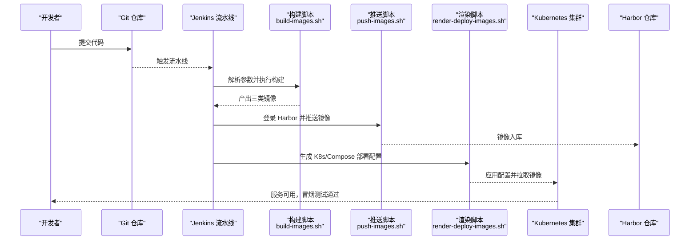

图表来源
- [Jenkinsfile:53-109](file://Jenkinsfile#L53-L109)
- [scripts/build-images.sh:84-91](file://scripts/build-images.sh#L84-L91)
- [scripts/push-images.sh:47-50](file://scripts/push-images.sh#L47-L50)
- [scripts/render-deploy-images.sh:74-104](file://scripts/render-deploy-images.sh#L74-L104)

章节来源
- [Jenkinsfile:1-258](file://Jenkinsfile#L1-L258)
- [scripts/build-images.sh:1-97](file://scripts/build-images.sh#L1-L97)
- [scripts/push-images.sh:1-54](file://scripts/push-images.sh#L1-L54)
- [scripts/render-deploy-images.sh:1-141](file://scripts/render-deploy-images.sh#L1-L141)

## 组件详解

### 后端镜像构建（Python）
- 多阶段与最小化
  - 使用 Python slim 基础镜像，减少体积与安全风险。
  - 安装镜像导出工具以支持离线归档。
- 构建参数
  - 支持 APT 源镜像、APT 安全源镜像、pip index。
  - 支持构建代理（HTTP/HTTPS/no_proxy）。
- 运行时
  - 非 root 用户运行，暴露服务端口，CMD 启动 Uvicorn。

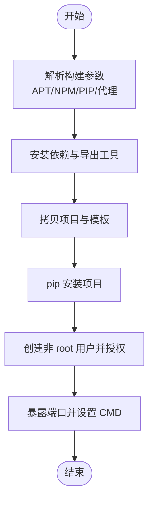

图表来源
- [backend/Dockerfile:3-36](file://backend/Dockerfile#L3-L36)

章节来源
- [backend/Dockerfile:1-36](file://backend/Dockerfile#L1-L36)

### Worker 镜像构建（Python + 导出工具）
- 目标
  - 与后端共享基础层，额外安装镜像导出工具，用于离线归档。
- 构建参数
  - 同后端镜像，支持相同构建参数。
- 运行时
  - 以独立模块方式运行 Worker。

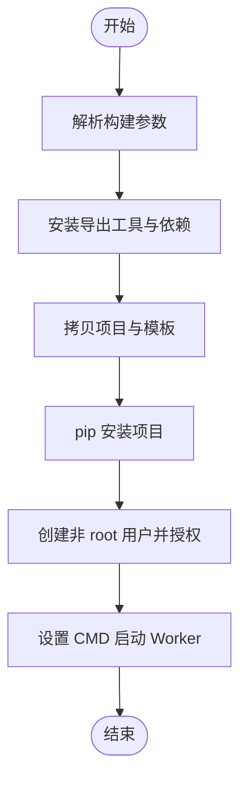

图表来源
- [backend/Dockerfile.worker:3-34](file://backend/Dockerfile.worker#L3-L34)

章节来源
- [backend/Dockerfile.worker:1-34](file://backend/Dockerfile.worker#L1-L34)

### 前端镜像构建（Node + Nginx）
- 多阶段
  - 第一阶段：Node 安装依赖并构建产物。
  - 第二阶段：Nginx 提供静态服务，拷贝构建产物。
- 构建参数
  - 支持 NPM Registry 镜像。
- 运行时
  - Nginx 非 root 用户运行，暴露 Web 端口，入口脚本负责初始化。

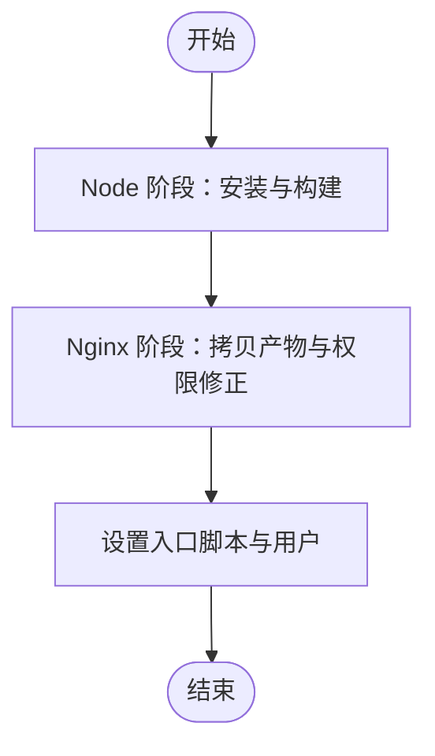

图表来源
- [frontend/Dockerfile:1-32](file://frontend/Dockerfile#L1-L32)

章节来源
- [frontend/Dockerfile:1-32](file://frontend/Dockerfile#L1-L32)

### 构建脚本（build-images.sh）
- 功能
  - 根据 Registry/Repository/Tag 组合镜像名称。
  - 支持禁用缓存、代理、APT/NPM/PIP 源镜像等参数。
  - 依次构建后端、Worker、前端三类镜像。
- 输出
  - 控制台打印构建完成的镜像列表，便于核对。

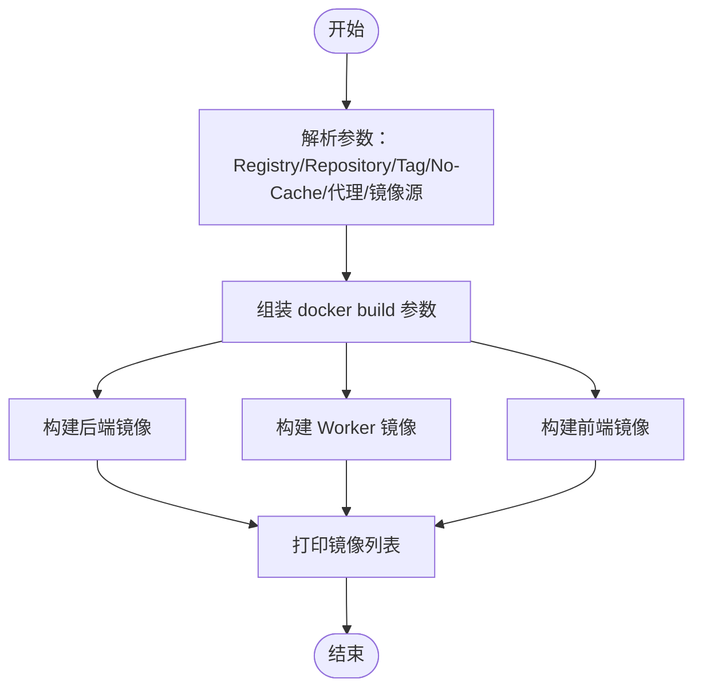

图表来源
- [scripts/build-images.sh:9-97](file://scripts/build-images.sh#L9-L97)

章节来源
- [scripts/build-images.sh:1-97](file://scripts/build-images.sh#L1-L97)

### 推送脚本（push-images.sh）
- 功能
  - 根据 Registry/Repository/Tag 组合目标镜像名称。
  - 逐一推送后端、Worker、前端镜像。
- 安全
  - 与 Jenkins 凭据配合，登录 Harbor 后推送，结束后登出。

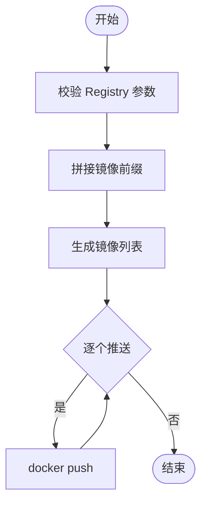

图表来源
- [scripts/push-images.sh:8-54](file://scripts/push-images.sh#L8-L54)

章节来源
- [scripts/push-images.sh:1-54](file://scripts/push-images.sh#L1-L54)

### 部署渲染脚本（render-deploy-images.sh）
- 功能
  - 根据 Registry/Repository/Tag 生成 K8s 与 Compose 的最终部署配置。
  - 输出 Kustomization、PVC StorageClass Patch、Worker Helper Patch 与环境变量文件。
- 关键点
  - 为 K8s 部署提供 images patches，确保所有镜像使用统一前缀与 Tag。
  - 为 Worker 注入导出工具镜像环境变量。

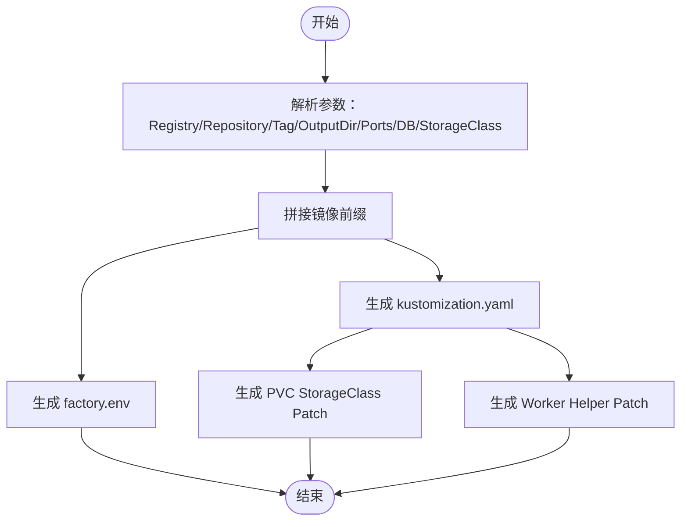

图表来源
- [scripts/render-deploy-images.sh:12-141](file://scripts/render-deploy-images.sh#L12-L141)

章节来源
- [scripts/render-deploy-images.sh:1-141](file://scripts/render-deploy-images.sh#L1-L141)

### CI/CD 流水线（Jenkinsfile）
- 阶段
  - Prepare：计算 Tag、检查工具版本。
  - Build Images：调用构建脚本，支持禁用缓存与代理。
  - Push Images：登录 Harbor 并推送镜像。
  - Render Deploy Config：生成部署配置与密钥。
  - Ensure Test Namespace：创建命名空间与拉取密钥。
  - Ensure Test Postgres：可选创建测试数据库。
  - Deploy to K8s：应用 Kustomize 并等待 rollout。
  - Smoke Test：验证健康与指标接口。
- 参数
  - Registry、Repository、Image Tag、StorageClass、Kubeconfig、代理、镜像源、是否推送/部署、是否使用内置 Postgres、是否禁用缓存等。

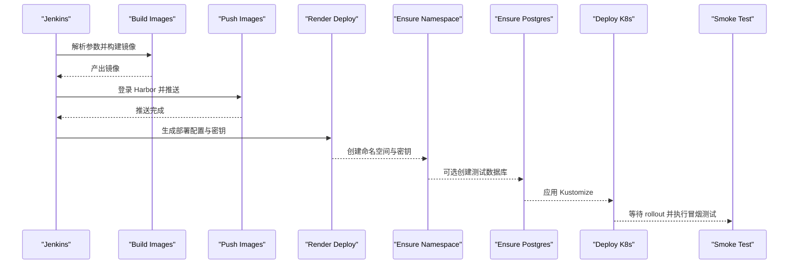

图表来源
- [Jenkinsfile:35-246](file://Jenkinsfile#L35-L246)

章节来源
- [Jenkinsfile:1-258](file://Jenkinsfile#L1-L258)
- [docs/jenkins-ci-cd.md:1-59](file://docs/jenkins-ci-cd.md#L1-L59)

### 部署清单（K8s 与 Compose）
- K8s
  - 后端与 Worker 均以非 root 用户运行，配置安全上下文与资源限制。
  - 后端开启就绪/存活探针，暴露指标端点。
- Compose
  - 通过环境变量注入镜像名称与端口，统一数据卷与网络。

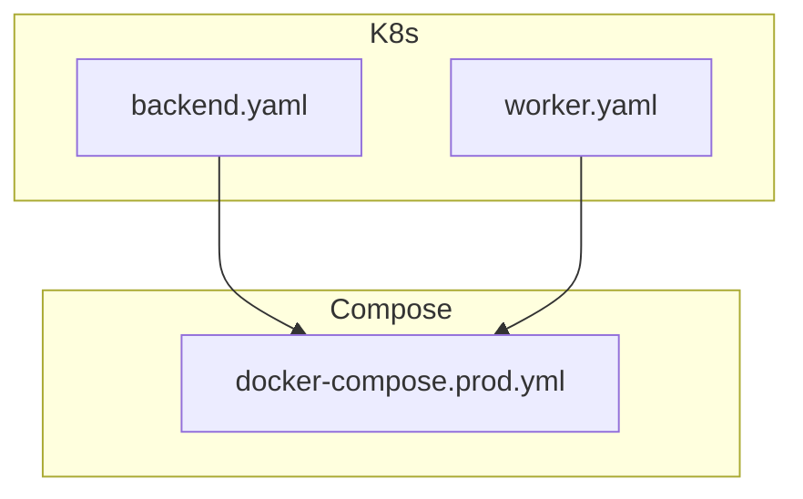

图表来源
- [deploy/k8s/backend.yaml:1-96](file://deploy/k8s/backend.yaml#L1-L96)
- [deploy/k8s/worker.yaml:1-59](file://deploy/k8s/worker.yaml#L1-L59)
- [deploy/docker-compose.prod.yml:1-65](file://deploy/docker-compose.prod.yml#L1-L65)

章节来源
- [deploy/k8s/backend.yaml:1-96](file://deploy/k8s/backend.yaml#L1-L96)
- [deploy/k8s/worker.yaml:1-59](file://deploy/k8s/worker.yaml#L1-L59)
- [deploy/docker-compose.prod.yml:1-65](file://deploy/docker-compose.prod.yml#L1-L65)

### 镜像仓库与标签管理
- Harbor 设置
  - 后端提供 Harbor 配置模型，包含 registry、project、用户名、密码与不安全配置。
  - 参数校验确保 registry 与 project 的规范化。
- 标签与版本控制
  - Jenkins 默认使用 Git Commit 短 SHA 作为 Tag。
  - 支持通过参数覆盖 Tag，便于灰度与回滚。
- 命名空间与前缀
  - Registry 与 Repository 组合形成统一前缀，保证镜像唯一性与可追溯性。

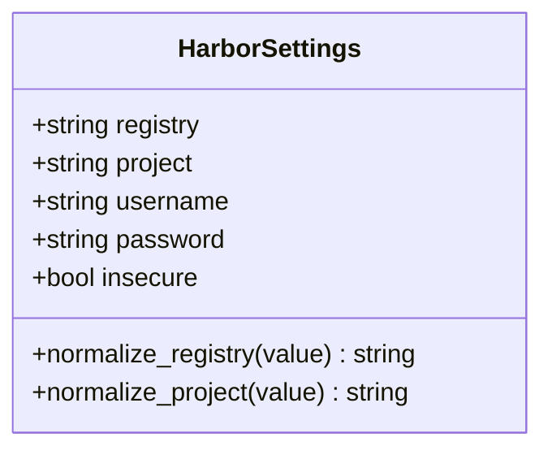

图表来源
- [backend/deployment_package_factory/services/settings.py:49-74](file://backend/deployment_package_factory/services/settings.py#L49-L74)

章节来源
- [backend/deployment_package_factory/services/settings.py:49-74](file://backend/deployment_package_factory/services/settings.py#L49-L74)
- [Jenkinsfile:10-26](file://Jenkinsfile#L10-L26)
- [scripts/render-deploy-images.sh:67-76](file://scripts/render-deploy-images.sh#L67-L76)

### 镜像安全与合规
- 现状
  - 生成镜像归档锁与 SHA256 校验，支持离线导入与一致性校验。
  - 交付包包含完整性校验、质量门禁与健康检查脚本。
- 下一阶段建议
  - 引入 SBOM、镜像签名、包签名与漏洞扫描摘要，提升供应链安全。

章节来源
- [README.md:127-137](file://README.md#L127-L137)
- [docs/deployment-package-factory-delivery-audit.md:310-318](file://docs/deployment-package-factory-delivery-audit.md#L310-L318)

## 依赖关系分析
- 组件耦合
  - 构建脚本与 Dockerfile 强耦合，参数直接影响镜像构建行为。
  - 推送脚本依赖 Jenkins 凭据与 Registry 配置。
  - 渲染脚本依赖 Registry/Repository/Tag，决定最终部署清单。
- 外部依赖
  - Harbor 作为镜像仓库，需要正确的凭据与网络可达性。
  - K8s 集群需要拉取密钥与正确的 StorageClass。
- 潜在循环依赖
  - 未发现直接循环依赖；各脚本职责清晰，通过参数传递解耦。

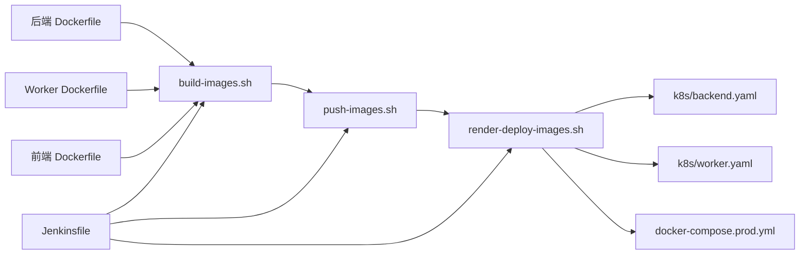

图表来源
- [backend/Dockerfile:1-36](file://backend/Dockerfile#L1-L36)
- [backend/Dockerfile.worker:1-34](file://backend/Dockerfile.worker#L1-L34)
- [frontend/Dockerfile:1-32](file://frontend/Dockerfile#L1-L32)
- [scripts/build-images.sh:1-97](file://scripts/build-images.sh#L1-L97)
- [scripts/push-images.sh:1-54](file://scripts/push-images.sh#L1-L54)
- [scripts/render-deploy-images.sh:1-141](file://scripts/render-deploy-images.sh#L1-L141)
- [deploy/k8s/backend.yaml:1-96](file://deploy/k8s/backend.yaml#L1-L96)
- [deploy/k8s/worker.yaml:1-59](file://deploy/k8s/worker.yaml#L1-L59)
- [deploy/docker-compose.prod.yml:1-65](file://deploy/docker-compose.prod.yml#L1-L65)
- [Jenkinsfile:1-258](file://Jenkinsfile#L1-L258)

章节来源
- [Jenkinsfile:1-258](file://Jenkinsfile#L1-L258)
- [scripts/build-images.sh:1-97](file://scripts/build-images.sh#L1-L97)
- [scripts/push-images.sh:1-54](file://scripts/push-images.sh#L1-L54)
- [scripts/render-deploy-images.sh:1-141](file://scripts/render-deploy-images.sh#L1-L141)

## 性能考量
- 构建缓存
  - 在开发与 PR 验证场景建议禁用缓存，确保一致性。
  - 在主干构建与测试环境可启用缓存以提升速度。
- 网络与镜像源
  - 通过 APT/NPM/PIP 镜像源与代理参数优化网络性能。
- 镜像体积
  - 多阶段构建与 slim 基础镜像有效降低体积，缩短拉取时间。
- 并发与资源
  - Worker 独立部署可提升并发处理能力，避免后端阻塞。

## 故障排查指南
- 构建失败
  - 检查构建参数（代理、镜像源、禁用缓存）是否正确。
  - 查看构建脚本输出的镜像名称是否符合预期。
- 推送失败
  - 确认 Jenkins 凭据配置与 Harbor 可达性。
  - 核对镜像前缀与 Tag 是否一致。
- 部署失败
  - 检查命名空间、拉取密钥与 StorageClass。
  - 核对渲染脚本生成的 Kustomization 与 Patch 文件。
- 就绪与健康
  - 后端就绪探针与存活探针失败通常与数据库连接、数据目录写入或导出工具状态有关。
  - 使用冒烟测试验证健康与指标接口。

章节来源
- [scripts/build-images.sh:57-82](file://scripts/build-images.sh#L57-L82)
- [scripts/push-images.sh:29-32](file://scripts/push-images.sh#L29-L32)
- [scripts/render-deploy-images.sh:67-104](file://scripts/render-deploy-images.sh#L67-L104)
- [Jenkinsfile:111-129](file://Jenkinsfile#L111-L129)
- [backend/deployment_package_factory/readiness.py:94-101](file://backend/deployment_package_factory/readiness.py#L94-L101)
- [Jenkinsfile:223-245](file://Jenkinsfile#L223-L245)

## 结论
本指南基于仓库现有实现，系统梳理了镜像构建、标签与版本控制、Harbor 私有仓库集成、推送与自动化 CI/CD 流程，以及镜像安全与合规现状与下一阶段建议。通过参数化构建、统一命名规范与严格的部署渲染流程，项目实现了可复现、可审计、可追溯的镜像管理闭环。建议在后续阶段引入 SBOM、镜像签名与漏洞扫描摘要，进一步强化供应链安全。

## 附录
- 最佳实践摘要
  - 使用 Git Commit 短 SHA 作为默认 Tag，必要时手动覆盖。
  - 在 PR 验证与主干构建之间切换禁用缓存策略。
  - 通过镜像源与代理参数优化网络性能。
  - 在 K8s 部署前确保命名空间、拉取密钥与 StorageClass 正确配置。
  - 引入 SBOM、镜像签名与漏洞扫描摘要，完善供应链安全。