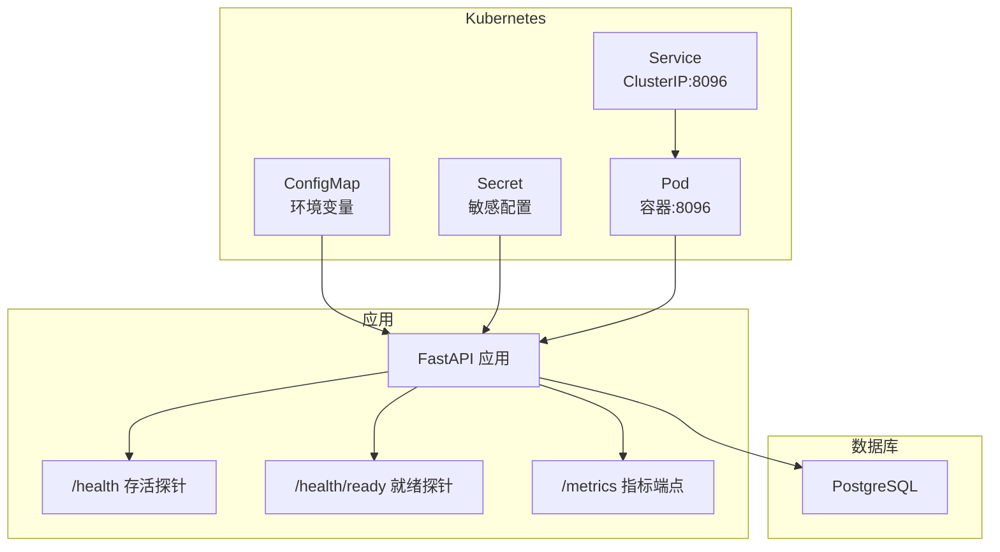
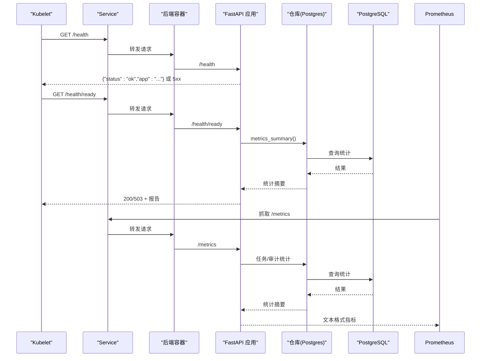
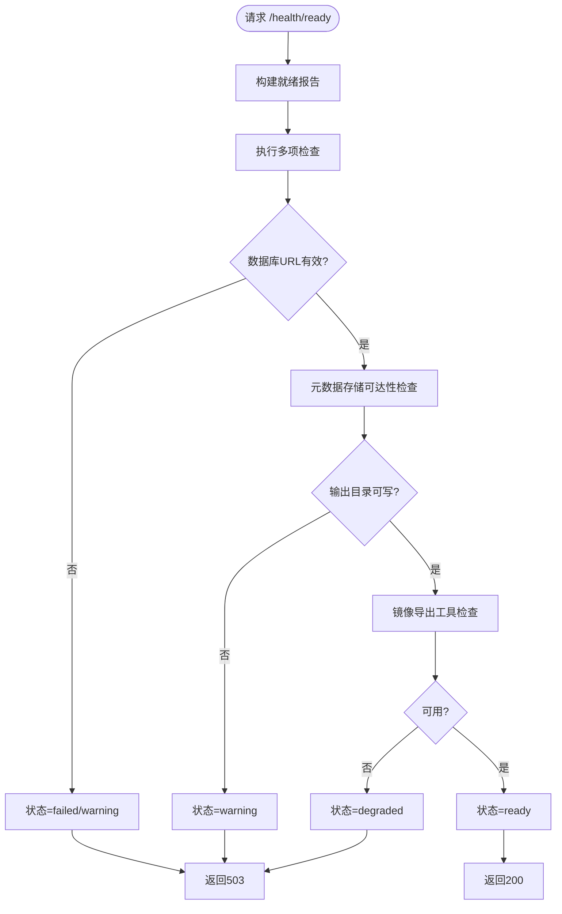
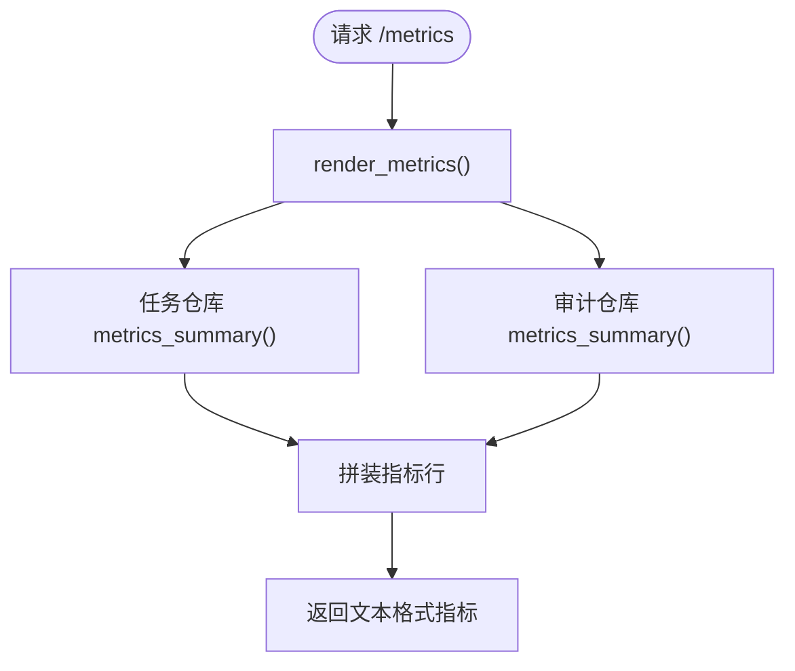
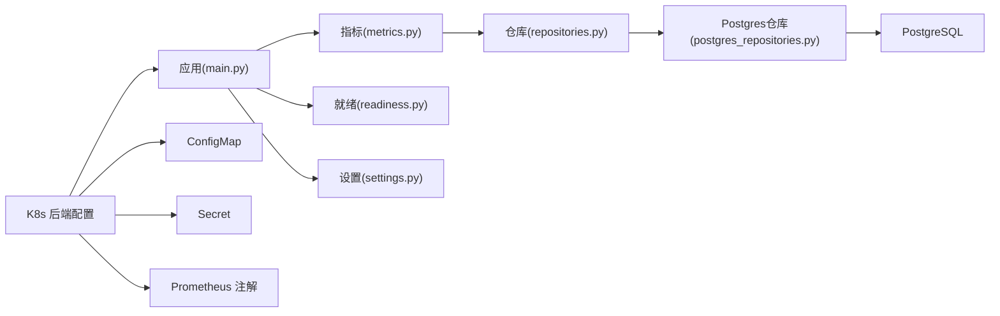

# 监控与可观测性

<cite>
**本文引用的文件**
- [backend\deployment_package_factory\main.py](file://backend/deployment_package_factory/main.py)
- [backend\deployment_package_factory\metrics.py](file://backend/deployment_package_factory/metrics.py)
- [backend\deployment_package_factory\readiness.py](file://backend/deployment_package_factory/readiness.py)
- [backend\deployment_package_factory\settings.py](file://backend/deployment_package_factory/settings.py)
- [backend\deployment_package_factory\services\deployment_packages\repositories.py](file://backend/deployment_package_factory/services/deployment_packages/repositories.py)
- [backend\deployment_package_factory\services\deployment_packages\postgres_repositories.py](file://backend/deployment_package_factory/services/deployment_packages/postgres_repositories.py)
- [backend\Dockerfile](file://backend/Dockerfile)
- [deploy\k8s\backend.yaml](file://deploy/k8s/backend.yaml)
- [deploy\k8s\configmap.yaml](file://deploy/k8s/configmap.yaml)
- [deploy\k8s\secret.template.yaml](file://deploy/k8s/secret.template.yaml)
- [backend\pyproject.toml](file://backend/pyproject.toml)
</cite>

## 目录
1. [简介](#简介)
2. [项目结构](#项目结构)
3. [核心组件](#核心组件)
4. [架构总览](#架构总览)
5. [详细组件分析](#详细组件分析)
6. [依赖分析](#依赖分析)
7. [性能考虑](#性能考虑)
8. [故障排查指南](#故障排查指南)
9. [结论](#结论)
10. [附录](#附录)

## 简介
本指南面向部署包工厂后端服务的监控与可观测性落地，覆盖以下方面：
- Prometheus 指标采集配置：/health 和 /metrics 端点的使用方法与指标含义
- 健康检查机制：就绪探针与存活探针的配置策略
- 日志管理策略：容器日志收集、日志格式规范与日志轮转配置
- 告警规则建议：服务可用性、资源使用率与业务指标的阈值
- 分布式追踪与性能监控：建议与最佳实践
- 容量规划：基于指标与运行参数的容量估算
- 监控仪表板模板与常用查询语句示例

## 项目结构
后端服务采用 FastAPI 应用，通过 Kubernetes 部署，Prometheus 以注解方式自动抓取 /metrics；健康检查通过 /health 与 /health/ready 提供。

图表来源
- [deploy\k8s\backend.yaml:1-96](file://deploy/k8s/backend.yaml#L1-L96)
- [backend\deployment_package_factory\main.py:41-62](file://backend/deployment_package_factory/main.py#L41-L62)
- [backend\deployment_package_factory\services\deployment_packages\repositories.py:10-25](file://backend/deployment_package_factory/services/deployment_packages/repositories.py#L10-L25)

章节来源
- [deploy\k8s\backend.yaml:1-96](file://deploy/k8s/backend.yaml#L1-L96)
- [backend\deployment_package_factory\main.py:23-67](file://backend/deployment_package_factory/main.py#L23-L67)

## 核心组件
- 应用入口与路由注册：创建 FastAPI 实例、挂载路由、注册 /health、/health/ready、/metrics。
- 指标渲染器：聚合任务与审计指标，输出符合 Prometheus 文本格式。
- 就绪检查器：校验数据库连接、元数据存储可达性、输出目录可写、镜像导出工具可用性。
- 设置加载器：从环境变量读取配置，提供默认值与类型约束。
- 数据访问层：PostgreSQL 仓库封装，提供 metrics_summary 能力。

章节来源
- [backend\deployment_package_factory\main.py:23-67](file://backend/deployment_package_factory/main.py#L23-L67)
- [backend\deployment_package_factory\metrics.py:4-33](file://backend/deployment_package_factory/metrics.py#L4-L33)
- [backend\deployment_package_factory\readiness.py:14-37](file://backend/deployment_package_factory/readiness.py#L14-L37)
- [backend\deployment_package_factory\settings.py:26-56](file://backend/deployment_package_factory/settings.py#L26-L56)
- [backend\deployment_package_factory\services\deployment_packages\postgres_repositories.py:71-96](file://backend/deployment_package_factory/services/deployment_packages/postgres_repositories.py#L71-L96)

## 架构总览
下图展示监控与可观测性的关键交互路径：Kubernetes 探针与 Prometheus 抓取指标，应用内部通过 /metrics 输出指标，/health/ready 进行就绪检查，/health 进行存活检查。

图表来源
- [deploy\k8s\backend.yaml:55-66](file://deploy/k8s/backend.yaml#L55-L66)
- [backend\deployment_package_factory\main.py:41-62](file://backend/deployment_package_factory/main.py#L41-L62)
- [backend\deployment_package_factory\metrics.py:4-33](file://backend/deployment_package_factory/metrics.py#L4-L33)
- [backend\deployment_package_factory\readiness.py:14-37](file://backend/deployment_package_factory/readiness.py#L14-L37)
- [backend\deployment_package_factory\services\deployment_packages\postgres_repositories.py:71-96](file://backend/deployment_package_factory/services/deployment_packages/postgres_repositories.py#L71-L96)

## 详细组件分析

### /health 与 /health/ready 端点
- /health：存活探针端点，返回应用基本状态，用于判断进程是否存活。
- /health/ready：就绪探针端点，返回综合检查报告，包含数据库、元数据存储、输出目录、镜像导出工具等检查项，根据结果返回 200 或 503。

图表来源
- [backend\deployment_package_factory\main.py:45-55](file://backend/deployment_package_factory/main.py#L45-L55)
- [backend\deployment_package_factory\readiness.py:14-37](file://backend/deployment_package_factory/readiness.py#L14-L37)

章节来源
- [backend\deployment_package_factory\main.py:41-55](file://backend/deployment_package_factory/main.py#L41-L55)
- [backend\deployment_package_factory\readiness.py:14-37](file://backend/deployment_package_factory/readiness.py#L14-L37)

### /metrics 指标定义与含义
- 指标渲染逻辑：从任务仓库与审计仓库获取统计摘要，输出标准 Prometheus 文本格式指标。
- 关键指标说明（名称与含义）：
  - deployment_package_tasks_total：部署包任务总数（counter）
  - deployment_package_tasks_by_status{status="..."}：按状态分组的任务数（gauge）
  - deployment_package_artifacts_available：可用的已完成包制品数量（gauge）
  - deployment_package_artifacts_bytes：可用制品总字节数（gauge）
  - deployment_package_audit_events_total：部署包审计事件总数（counter）
  - deployment_package_audit_events_by_action{action="..."}：按动作分组的审计事件数（gauge）

图表来源
- [backend\deployment_package_factory\main.py:57-62](file://backend/deployment_package_factory/main.py#L57-L62)
- [backend\deployment_package_factory\metrics.py:4-33](file://backend/deployment_package_factory/metrics.py#L4-L33)
- [backend\deployment_package_factory\services\deployment_packages\postgres_repositories.py:71-96](file://backend/deployment_package_factory/services/deployment_packages/postgres_repositories.py#L71-L96)
- [backend\deployment_package_factory\services\deployment_packages\postgres_repositories.py:423-436](file://backend/deployment_package_factory/services/deployment_packages/postgres_repositories.py#L423-L436)

章节来源
- [backend\deployment_package_factory\metrics.py:4-33](file://backend/deployment_package_factory/metrics.py#L4-L33)
- [backend\deployment_package_factory\services\deployment_packages\postgres_repositories.py:71-96](file://backend/deployment_package_factory/services/deployment_packages/postgres_repositories.py#L71-L96)
- [backend\deployment_package_factory\services\deployment_packages\postgres_repositories.py:423-436](file://backend/deployment_package_factory/services/deployment_packages/postgres_repositories.py#L423-L436)

### 健康检查机制与探针配置
- 存活探针(/health)：Kubernetes 使用 HTTP GET 访问 /health，用于判断容器进程是否存活。
- 就绪探针(/health/ready)：Kubernetes 使用 HTTP GET 访问 /health/ready，仅当返回 200 时才将流量转发至 Pod。
- 探针参数建议：
  - 初始延迟：就绪探针初始延迟应大于应用启动时间；存活探针可略短。
  - 周期：根据负载与稳定性调整，避免过于频繁导致额外开销。
  - 超时与不健康阈值：结合业务峰值与数据库响应时间设置。

章节来源
- [deploy\k8s\backend.yaml:55-66](file://deploy/k8s/backend.yaml#L55-L66)
- [backend\deployment_package_factory\main.py:41-55](file://backend/deployment_package_factory/main.py#L41-L55)

### 日志管理策略
- 容器日志收集：容器标准输出即应用日志，Prometheus 与 Grafana 可直接采集。
- 日志格式规范：建议统一使用结构化日志（如 JSON），包含时间戳、级别、模块、消息体与上下文字段，便于检索与过滤。
- 日志轮转配置：在容器运行时或宿主机侧配置日志轮转，限制单文件大小与保留份数，避免磁盘占满。
- 采集与持久化：建议结合 DaemonSet 的日志采集器（如 Fluent Bit/Fluentd）与对象存储/集中式日志系统（如 Loki/Elasticsearch）。

[本节为通用实践说明，未直接分析具体文件，故不附加章节来源]

### 告警规则配置建议
- 服务可用性
  - /health 返回非 200：告警级别高
  - /health/ready 连续多次返回非 200：告警级别中到高
- 资源使用率
  - CPU 使用率持续超过阈值（例如 80%）且持续时间较长
  - 内存使用率持续超过阈值（例如 85%）
  - 文件描述符/句柄接近上限
- 业务指标
  - deployment_package_tasks_total 增长异常缓慢或停滞
  - deployment_package_tasks_by_status{status="failed"} 增长过快
  - deployment_package_artifacts_available 增长停滞或下降
  - deployment_package_audit_events_total 增长异常（如批量操作触发）
- 运行参数与容量
  - 运行超时/并发限制：DEPLOYMENT_PACKAGE_RUNNING_TASK_TIMEOUT_MINUTES、DEPLOYMENT_PACKAGE_MAX_CONCURRENT_BUILDS
  - 存储容量：DEPLOYMENT_PACKAGE_MAX_TOTAL_GB 与实际制品字节增长趋势对比

[本节为通用实践说明，未直接分析具体文件，故不附加章节来源]

### 分布式追踪与性能监控
- 分布式追踪：建议在应用入口与关键处理链路埋点，记录请求 ID、阶段耗时与错误码，结合 OpenTelemetry 收集与 Jaeger/Tempo 展示。
- 性能监控：关注数据库查询耗时、任务队列长度、工作线程心跳间隔与超时时间，结合火焰图定位热点。
- 性能基线：建立不同规模下的 QPS、P95/P99 延迟与资源占用基线，作为容量规划依据。

[本节为通用实践说明，未直接分析具体文件，故不附加章节来源]

### 容量规划建议
- 并发与超时
  - 最大并发构建数：DEPLOYMENT_PACKAGE_MAX_CONCURRENT_BUILDS
  - 任务运行超时：DEPLOYMENT_PACKAGE_RUNNING_TASK_TIMEOUT_MINUTES
  - 心跳周期：DEPLOYMENT_PACKAGE_WORKER_HEARTBEAT_SECONDS
- 存储容量
  - 输出目录与制品总大小：DEPLOYMENT_PACKAGE_OUTPUT_DIR 与 deployment_package_artifacts_bytes
  - 总容量上限：DEPLOYMENT_PACKAGE_MAX_TOTAL_GB
- 资源配额
  - CPU/内存请求与限制：结合历史指标与峰值预测设置

章节来源
- [deploy\k8s\configmap.yaml:11-17](file://deploy/k8s/configmap.yaml#L11-L17)
- [backend\deployment_package_factory\settings.py:26-41](file://backend/deployment_package_factory/settings.py#L26-L41)
- [deploy\k8s\backend.yaml:67-73](file://deploy/k8s/backend.yaml#L67-L73)

### 监控仪表板模板与常用查询
- 仪表板模板建议
  - 基础面板：存活状态、就绪状态、HTTP 请求速率与错误率
  - 业务面板：任务总数、按状态分布、制品数量与体积、审计事件趋势
  - 资源面板：CPU/内存使用率、磁盘使用、数据库连接数
- 常用查询示例
  - 任务总数与状态分布
    - sum(deployment_package_tasks_total) by (instance)
    - sum by (status)(deployment_package_tasks_by_status)
  - 制品统计
    - sum(deployment_package_artifacts_available) by (instance)
    - sum(deployment_package_artifacts_bytes) by (instance)
  - 审计事件
    - sum(rate(deployment_package_audit_events_total[5m])) by (instance)
    - sum by (action)(rate(deployment_package_audit_events_by_action[5m]))
  - 就绪状态
    - 通过 /health/ready 的检查项状态与详情进行可视化

[本节为通用实践说明，未直接分析具体文件，故不附加章节来源]

## 依赖分析
- 应用对数据库的依赖：通过仓库层封装，所有指标统计均依赖 PostgreSQL 表 package_tasks 与 audit_events。
- 配置依赖：运行参数来自 ConfigMap 与 Secret，容器暴露端口与命令由 Dockerfile 定义。
- Kubernetes 注解：通过注解启用 Prometheus 抓取 /metrics。

图表来源
- [backend\deployment_package_factory\main.py:17-20](file://backend/deployment_package_factory/main.py#L17-L20)
- [backend\deployment_package_factory\metrics.py:4-6](file://backend/deployment_package_factory/metrics.py#L4-L6)
- [backend\deployment_package_factory\readiness.py:14-22](file://backend/deployment_package_factory/readiness.py#L14-L22)
- [backend\deployment_package_factory\settings.py:26-41](file://backend/deployment_package_factory/settings.py#L26-L41)
- [backend\deployment_package_factory\services\deployment_packages\repositories.py:10-15](file://backend/deployment_package_factory/services/deployment_packages/repositories.py#L10-L15)
- [backend\deployment_package_factory\services\deployment_packages\postgres_repositories.py:71-96](file://backend/deployment_package_factory/services/deployment_packages/postgres_repositories.py#L71-L96)
- [deploy\k8s\backend.yaml:10-12](file://deploy/k8s/backend.yaml#L10-L12)
- [deploy\k8s\configmap.yaml:8-22](file://deploy/k8s/configmap.yaml#L8-L22)
- [deploy\k8s\secret.template.yaml:9-14](file://deploy/k8s/secret.template.yaml#L9-L14)

章节来源
- [backend\deployment_package_factory\services\deployment_packages\repositories.py:10-25](file://backend/deployment_package_factory/services/deployment_packages/repositories.py#L10-L25)
- [backend\deployment_package_factory\services\deployment_packages\postgres_repositories.py:71-96](file://backend/deployment_package_factory/services/deployment_packages/postgres_repositories.py#L71-L96)
- [deploy\k8s\backend.yaml:10-12](file://deploy/k8s/backend.yaml#L10-L12)

## 性能考虑
- 指标查询复杂度：仓库层的统计查询为 O(n) 扫描与分组聚合，建议在业务低峰期或缓存策略下调用。
- 数据库索引：package_tasks 与 audit_events 表已建立必要索引，确保统计查询高效。
- 资源配额：合理设置 CPU/内存请求与限制，避免在高峰期被限流。
- 并发与超时：根据任务执行时间与数据库响应时间调整并发与超时参数，减少僵尸任务与堆积。

章节来源
- [backend\deployment_package_factory\services\deployment_packages\postgres_repositories.py:340-341](file://backend/deployment_package_factory/services/deployment_packages/postgres_repositories.py#L340-L341)
- [backend\deployment_package_factory\services\deployment_packages\postgres_repositories.py:454-456](file://backend/deployment_package_factory/services/deployment_packages/postgres_repositories.py#L454-L456)
- [deploy\k8s\backend.yaml:67-73](file://deploy/k8s/backend.yaml#L67-L73)
- [deploy\k8s\configmap.yaml:11-17](file://deploy/k8s/configmap.yaml#L11-L17)

## 故障排查指南
- /health 返回非 200
  - 检查应用进程是否正常启动
  - 查看容器日志与事件
- /health/ready 返回 503
  - 检查数据库 URL 是否为空或不可达
  - 检查元数据存储是否可访问与模式检查是否通过
  - 检查输出目录是否存在且可写
  - 检查镜像导出工具可用性与版本信息
- 指标缺失或异常
  - 确认 Prometheus 注解与抓取路径正确
  - 检查 /metrics 返回的文本格式是否符合规范
  - 核对仓库层统计查询是否成功返回
- 容器日志过大
  - 配置日志轮转与清理策略
  - 控制日志级别，避免过多调试日志

章节来源
- [backend\deployment_package_factory\main.py:41-62](file://backend/deployment_package_factory/main.py#L41-L62)
- [backend\deployment_package_factory\readiness.py:14-37](file://backend/deployment_package_factory/readiness.py#L14-L37)
- [deploy\k8s\backend.yaml:10-12](file://deploy/k8s/backend.yaml#L10-L12)

## 结论
通过在 Kubernetes 中启用 /metrics 抓取与 /health、/health/ready 探针，结合结构化日志与容量参数监控，可实现对部署包工厂后端服务的全链路可观测。建议配合分布式追踪与性能基线，持续优化资源与业务指标阈值，保障生产环境稳定运行。

## 附录
- 环境变量与默认值参考
  - 数据目录、输出目录、最大并发、执行模式、轮询与心跳间隔、任务超时、保留天数、总容量上限等
- 容器与端口
  - 暴露端口 8096，容器用户非 root，CMD 使用 uvicorn 启动

章节来源
- [deploy\k8s\configmap.yaml:8-22](file://deploy/k8s/configmap.yaml#L8-L22)
- [deploy\k8s\secret.template.yaml:9-14](file://deploy/k8s/secret.template.yaml#L9-L14)
- [backend\deployment_package_factory\settings.py:26-41](file://backend/deployment_package_factory/settings.py#L26-L41)
- [backend\Dockerfile:33-35](file://backend/Dockerfile#L33-L35)
- [backend\pyproject.toml:6-11](file://backend/pyproject.toml#L6-L11)