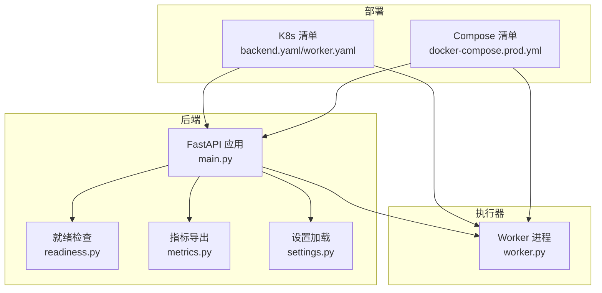
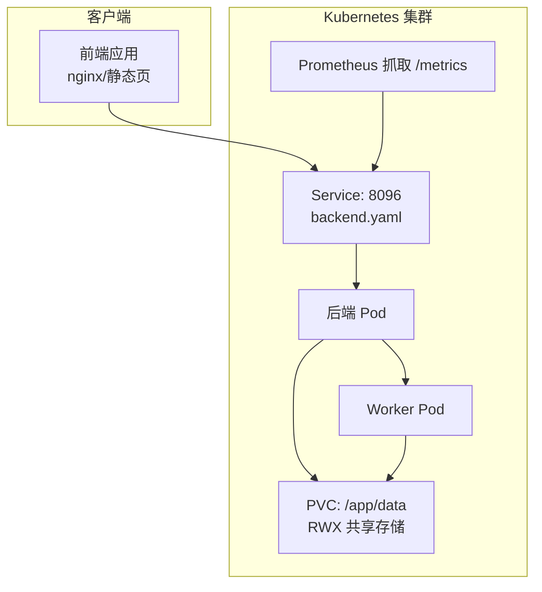
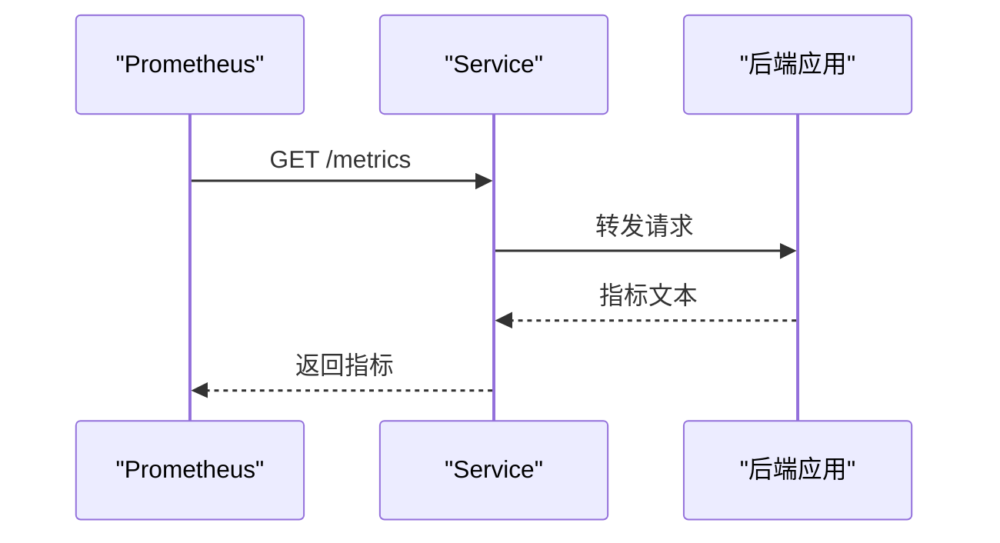
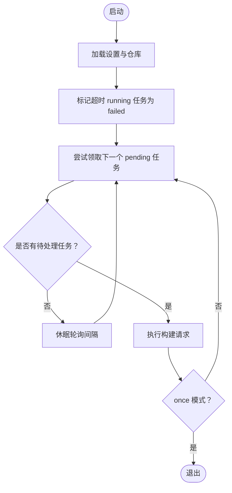
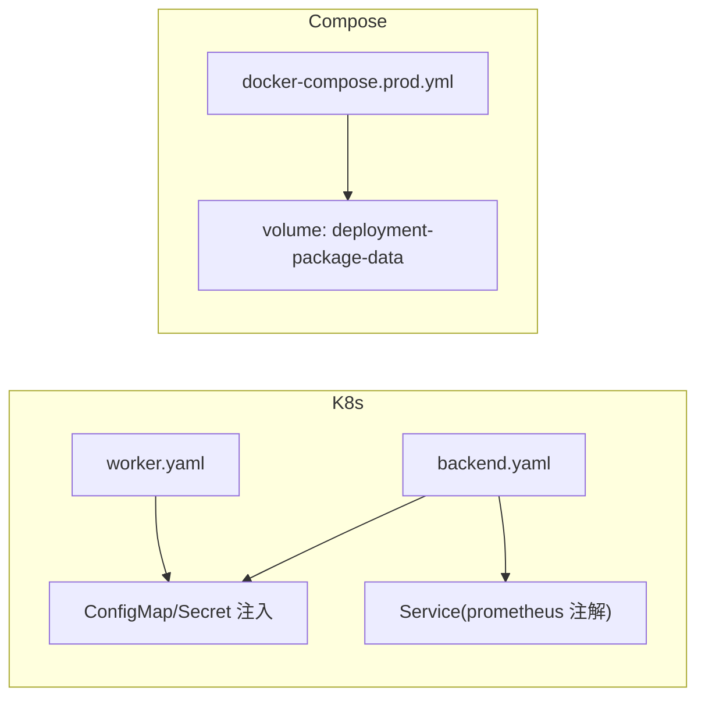
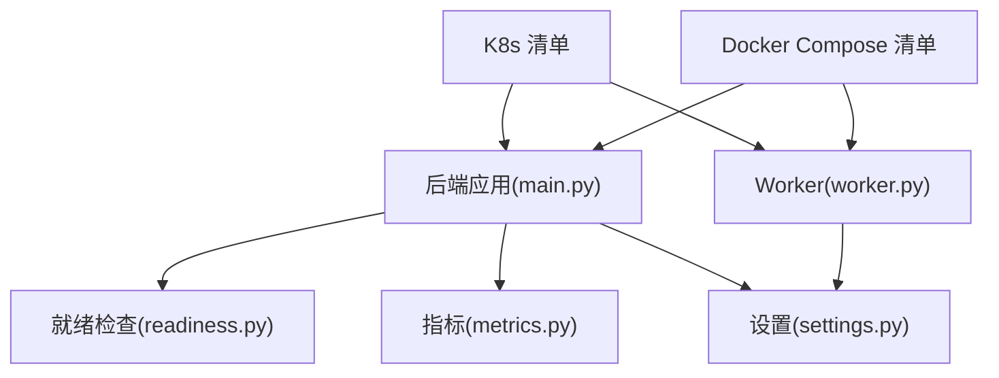

# 运维与维护

<cite>
**本文引用的文件**
- [README.md](file://README.md)
- [main.py](file://backend/deployment_package_factory/main.py)
- [metrics.py](file://backend/deployment_package_factory/metrics.py)
- [settings.py](file://backend/deployment_package_factory/settings.py)
- [readiness.py](file://backend/deployment_package_factory/readiness.py)
- [worker.py](file://backend/deployment_package_factory/worker.py)
- [backend.yaml](file://deploy/k8s/backend.yaml)
- [worker.yaml](file://deploy/k8s/worker.yaml)
- [docker-compose.prod.yml](file://deploy/docker-compose.prod.yml)
- [deploy/README.md](file://deploy/README.md)
- [render-deploy-images.sh](file://scripts/render-deploy-images.sh)
- [validate-deploy-config.sh](file://scripts/validate-deploy-config.sh)
</cite>

## 目录
1. [简介](#简介)
2. [项目结构](#项目结构)
3. [核心组件](#核心组件)
4. [架构总览](#架构总览)
5. [详细组件分析](#详细组件分析)
6. [依赖分析](#依赖分析)
7. [性能考虑](#性能考虑)
8. [故障排查指南](#故障排查指南)
9. [结论](#结论)
10. [附录](#附录)

## 简介
本指南面向部署包工厂项目的运维与维护团队，提供从资源监控、性能调优、容量规划，到故障恢复、升级迁移、日常维护与应急响应的全流程操作手册。文档结合后端 FastAPI 服务、Worker 执行器、Kubernetes 与 Docker Compose 部署清单，以及内置健康检查与 Prometheus 指标，帮助您建立稳定、可观测、可扩展的生产运行体系。

## 项目结构
- 后端服务：FastAPI 提供健康检查、就绪检查、指标导出与 API 路由。
- Worker：独立任务执行器，按轮询与心跳机制处理导包任务。
- 部署：Kubernetes 与 Docker Compose 两套生产部署方案，均支持 worker 模式与共享存储。
- 可观测性：/health、/health/ready、/metrics 三类关键端点；Prometheus 注解已在 Service 上声明。
- 运行参数：通过环境变量控制并发、执行模式、清理策略等。

图表来源
- [main.py:23-68](file://backend/deployment_package_factory/main.py#L23-L68)
- [readiness.py:14-37](file://backend/deployment_package_factory/readiness.py#L14-L37)
- [metrics.py:4-38](file://backend/deployment_package_factory/metrics.py#L4-L38)
- [settings.py:26-57](file://backend/deployment_package_factory/settings.py#L26-L57)
- [worker.py:19-51](file://backend/deployment_package_factory/worker.py#L19-L51)
- [backend.yaml:1-96](file://deploy/k8s/backend.yaml#L1-L96)
- [worker.yaml:1-59](file://deploy/k8s/worker.yaml#L1-L59)
- [docker-compose.prod.yml:1-65](file://deploy/docker-compose.prod.yml#L1-L65)

章节来源
- [README.md:89-116](file://README.md#L89-L116)
- [deploy/README.md:1-210](file://deploy/README.md#L1-L210)

## 核心组件
- 健康与就绪检查
  - /health 返回应用存活状态。
  - /health/ready 汇总数据库、元数据仓库、产物目录写入能力与镜像导出环境检查，失败时返回 503，降级时返回 degraded。
- 指标导出
  - /metrics 输出任务总数、按状态分组的任务数、可下载产物数量与字节总量、审计事件总数及按动作分组的审计事件数。
- 设置与执行模式
  - 通过环境变量控制并发、执行模式（后台任务/worker）、轮询与心跳周期、超时阈值、产物保留策略等。
- Worker 任务执行
  - 轮询待处理任务、刷新心跳、超时标记失败、执行构建请求。

章节来源
- [main.py:41-62](file://backend/deployment_package_factory/main.py#L41-L62)
- [readiness.py:14-102](file://backend/deployment_package_factory/readiness.py#L14-L102)
- [metrics.py:4-38](file://backend/deployment_package_factory/metrics.py#L4-L38)
- [settings.py:26-57](file://backend/deployment_package_factory/settings.py#L26-L57)
- [worker.py:19-51](file://backend/deployment_package_factory/worker.py#L19-L51)

## 架构总览
下图展示生产环境典型拓扑：后端负责 API 与就绪检查，Worker 负责任务执行；两者共享 RWX PVC 存储以存放工作目录与产物；Prometheus 通过 Service 注解自动抓取指标；前端通过反向代理访问后端 API。

图表来源
- [backend.yaml:80-96](file://deploy/k8s/backend.yaml#L80-L96)
- [backend.yaml:55-66](file://deploy/k8s/backend.yaml#L55-L66)
- [worker.yaml:30-59](file://deploy/k8s/worker.yaml#L30-L59)
- [deploy/README.md:173-210](file://deploy/README.md#L173-L210)

## 详细组件分析

### 组件A：后端应用与就绪检查
- 关键职责
  - 注册路由与中间件，提供 /health、/health/ready、/metrics。
  - 就绪检查聚合数据库连接、元数据仓库可达性、产物目录写入、镜像导出环境可用性。
- 性能与可靠性
  - 就绪检查失败时返回 503，避免流量进入不完整实例。
  - 指标导出为 Prometheus 文本格式，便于自动发现与告警。

图表来源
- [main.py:57-62](file://backend/deployment_package_factory/main.py#L57-L62)
- [metrics.py:4-38](file://backend/deployment_package_factory/metrics.py#L4-L38)
- [backend.yaml:80-96](file://deploy/k8s/backend.yaml#L80-L96)

章节来源
- [main.py:23-68](file://backend/deployment_package_factory/main.py#L23-L68)
- [readiness.py:14-37](file://backend/deployment_package_factory/readiness.py#L14-L37)

### 组件B：Worker 任务执行器
- 关键职责
  - 轮询待处理任务，刷新心跳，超时标记失败，执行构建请求。
  - 支持一次性执行模式，便于验证与排障。
- 参数与行为
  - 轮询间隔、心跳周期、运行超时分钟数、最大并发等由环境变量控制。
  - 进程崩溃后，超时任务会被标记失败，便于重试。

图表来源
- [worker.py:19-51](file://backend/deployment_package_factory/worker.py#L19-L51)
- [settings.py:26-57](file://backend/deployment_package_factory/settings.py#L26-L57)

章节来源
- [worker.py:19-51](file://backend/deployment_package_factory/worker.py#L19-L51)
- [deploy/README.md:170-171](file://deploy/README.md#L170-L171)

### 组件C：Kubernetes 与 Docker Compose 部署
- Kubernetes
  - 后端与 Worker 使用相同 ConfigMap/Secret 注入环境变量；后端 Service 声明 Prometheus 抓取注解。
  - PVC 使用 ReadWriteMany，确保 backend/worker 可同时访问共享存储。
- Docker Compose
  - 生产模式强制 worker 执行模式；后端进行健康检查；数据卷映射至 /app/data。

图表来源
- [backend.yaml:46-51](file://deploy/k8s/backend.yaml#L46-L51)
- [worker.yaml:39-44](file://deploy/k8s/worker.yaml#L39-L44)
- [backend.yaml:10-12](file://deploy/k8s/backend.yaml#L10-L12)
- [docker-compose.prod.yml:5-16](file://deploy/docker-compose.prod.yml#L5-L16)
- [docker-compose.prod.yml:41-44](file://deploy/docker-compose.prod.yml#L41-L44)

章节来源
- [deploy/README.md:97-210](file://deploy/README.md#L97-L210)
- [docker-compose.prod.yml:1-65](file://deploy/docker-compose.prod.yml#L1-L65)

## 依赖分析
- 组件耦合
  - 后端依赖就绪检查模块与指标模块；Worker 依赖设置加载与任务仓库。
  - 部署层通过 ConfigMap/Secret 与环境变量耦合后端与 Worker。
- 外部依赖
  - PostgreSQL：保存任务与审计元数据。
  - 共享存储：RWX PVC，供 backend/worker 读写工作目录与产物。
  - 镜像导出工具：K8s 默认 skopeo，Compose 回退到 Docker CLI。

图表来源
- [main.py:23-68](file://backend/deployment_package_factory/main.py#L23-L68)
- [readiness.py:14-37](file://backend/deployment_package_factory/readiness.py#L14-L37)
- [metrics.py:4-38](file://backend/deployment_package_factory/metrics.py#L4-L38)
- [settings.py:26-57](file://backend/deployment_package_factory/settings.py#L26-L57)
- [worker.py:19-51](file://backend/deployment_package_factory/worker.py#L19-L51)
- [backend.yaml:1-96](file://deploy/k8s/backend.yaml#L1-L96)
- [worker.yaml:1-59](file://deploy/k8s/worker.yaml#L1-L59)
- [docker-compose.prod.yml:1-65](file://deploy/docker-compose.prod.yml#L1-L65)

章节来源
- [README.md:89-116](file://README.md#L89-L116)
- [deploy/README.md:173-210](file://deploy/README.md#L173-L210)

## 性能考虑
- 并发与队列
  - 通过 DEPLOYMENT_PACKAGE_MAX_CONCURRENT_BUILDS 控制单进程并发；worker 模式下由 Worker 进程并发执行。
- 轮询与心跳
  - DEPLOYMENT_PACKAGE_WORKER_POLL_INTERVAL_SECONDS 控制轮询间隔；DEPLOYMENT_PACKAGE_WORKER_HEARTBEAT_SECONDS 控制心跳刷新周期；DEPLOYMENT_PACKAGE_RUNNING_TASK_TIMEOUT_MINUTES 控制定时清理。
- 存储与 I/O
  - 使用 RWX PVC 保证 backend/worker 并发访问；合理设置存储类与容量，避免 I/O 瓶颈。
- 指标与告警
  - 利用 /metrics 指标与 Prometheus 抓取，建立任务堆积、产物体积、审计事件增长等告警。

章节来源
- [settings.py:34-41](file://backend/deployment_package_factory/settings.py#L34-L41)
- [worker.py:37-48](file://backend/deployment_package_factory/worker.py#L37-L48)
- [deploy/README.md:173-210](file://deploy/README.md#L173-L210)

## 故障排查指南
- 健康与就绪
  - 若 /health/ready 返回 503 或 degraded，检查数据库连接、元数据仓库可达性、产物目录写入权限、镜像导出工具可用性。
- Worker 任务卡住
  - 查看任务心跳与超时配置；若任务长时间 running 且无心跳更新，会被标记失败，可重试。
- 部署配置校验
  - 使用 scripts/validate-deploy-config.sh 校验 K8s/Compose 配置文件完整性与占位符替换情况。
- 镜像导出问题
  - 在 K8s 环境优先使用内置 skopeo；Compose 环境可回退到 Docker CLI，确保可访问镜像仓库。
- 日志与诊断
  - 后端与 Worker 日志输出包含任务 ID、心跳与轮询信息，便于定位问题。

章节来源
- [main.py:45-55](file://backend/deployment_package_factory/main.py#L45-L55)
- [readiness.py:14-102](file://backend/deployment_package_factory/readiness.py#L14-L102)
- [worker.py:37-51](file://backend/deployment_package_factory/worker.py#L37-L51)
- [validate-deploy-config.sh:1-64](file://scripts/validate-deploy-config.sh#L1-L64)
- [deploy/README.md:170-171](file://deploy/README.md#L170-L171)

## 升级迁移与变更管理
- 版本升级
  - 构建新镜像并渲染部署配置，更新 K8s/Compose 中的镜像地址，再执行滚动更新。
- 配置变更
  - 通过 ConfigMap/Secret 注入环境变量；变更后滚动重启受影响组件。
- 数据迁移
  - 元数据存储在外部 PostgreSQL；迁移时需确保连接字符串正确与备份策略到位。
- 清理策略
  - 通过 DEPLOYMENT_PACKAGE_RETENTION_DAYS 与 DEPLOYMENT_PACKAGE_MAX_TOTAL_GB 控制产物保留与容量上限；清理仅影响产物与工作目录，不影响数据库记录。

章节来源
- [deploy/README.md:43-62](file://deploy/README.md#L43-L62)
- [settings.py:39-41](file://backend/deployment_package_factory/settings.py#L39-L41)
- [README.md:306-314](file://README.md#L306-L314)

## 日常维护任务
- 日志清理
  - 后端与 Worker 日志由容器运行时管理；定期检查容器日志滚动与磁盘占用。
- 磁盘空间管理
  - 监控 /app/data 下 work 与 artifacts 目录增长；必要时触发清理任务或扩容共享存储。
- 数据库维护
  - 外部 PostgreSQL 需按平台规范进行备份、索引维护与统计信息更新。
- 配置校验
  - 使用 scripts/validate-deploy-config.sh 确保密钥、存储类、数据库连接等配置正确。

章节来源
- [deploy/README.md:191-210](file://deploy/README.md#L191-L210)
- [validate-deploy-config.sh:1-64](file://scripts/validate-deploy-config.sh#L1-L64)

## 运维工具使用指南
- kubectl
  - 获取后端/Worker Pod、Ingress 状态；应用 Kustomize 生成的部署清单。
- 日志查看
  - 查看后端与 Worker 容器日志，关注任务 ID、心跳与轮询间隔。
- 性能分析
  - 通过 /metrics 与 Prometheus 抓取指标，结合告警系统定位异常。

章节来源
- [deploy/README.md:146-151](file://deploy/README.md#L146-L151)
- [main.py:57-62](file://backend/deployment_package_factory/main.py#L57-L62)

## 常见场景与应急响应
- 服务重启
  - 通过滚动更新或重启 Pod 触发；就绪探针保障流量切换。
- 数据恢复
  - PostgreSQL 备份恢复；恢复后验证元数据仓库可达性与任务状态一致性。
- 灾难恢复
  - 重建后端/Worker 与共享存储；恢复数据库与密钥；重新渲染部署配置并验证。

章节来源
- [deploy/README.md:132-151](file://deploy/README.md#L132-L151)
- [readiness.py:64-83](file://backend/deployment_package_factory/readiness.py#L64-L83)

## 结论
通过健康/就绪检查与指标导出，结合 worker 模式与共享存储，部署包工厂在生产环境中实现了高可用与可观测性。遵循本文的运维最佳实践、故障恢复策略与升级流程，可有效提升系统的稳定性与可维护性。

## 附录
- 环境变量速查
  - DEPLOYMENT_PACKAGE_DATABASE_URL：外部 PostgreSQL 连接串（必填）
  - DEPLOYMENT_PACKAGE_OUTPUT_DIR：产物输出目录
  - DEPLOYMENT_PACKAGE_API_TOKEN：后端 API 访问令牌
  - DEPLOYMENT_PACKAGE_MAX_CONCURRENT_BUILDS：最大并发
  - DEPLOYMENT_PACKAGE_EXECUTION_MODE：background 或 worker
  - DEPLOYMENT_PACKAGE_WORKER_POLL_INTERVAL_SECONDS：轮询间隔
  - DEPLOYMENT_PACKAGE_WORKER_HEARTBEAT_SECONDS：心跳周期
  - DEPLOYMENT_PACKAGE_RUNNING_TASK_TIMEOUT_MINUTES：运行超时
  - DEPLOYMENT_PACKAGE_RETENTION_DAYS：保留天数
  - DEPLOYMENT_PACKAGE_MAX_TOTAL_GB：总容量上限
- 常用端点
  - GET /health：存活检查
  - GET /health/ready：就绪检查
  - GET /metrics：Prometheus 指标

章节来源
- [README.md:66-87](file://README.md#L66-L87)
- [main.py:41-62](file://backend/deployment_package_factory/main.py#L41-L62)