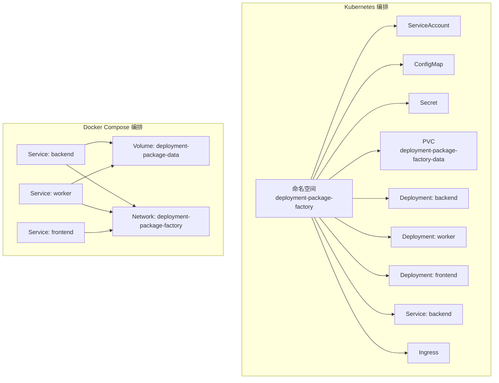
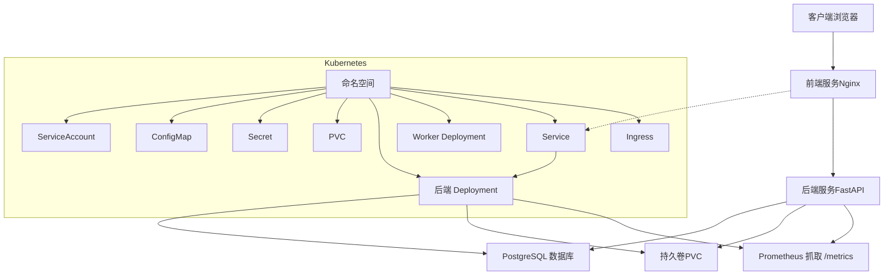
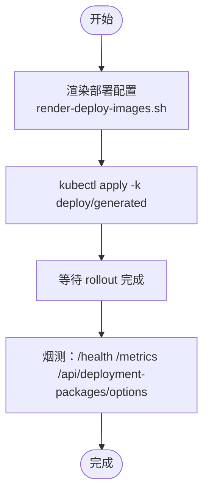
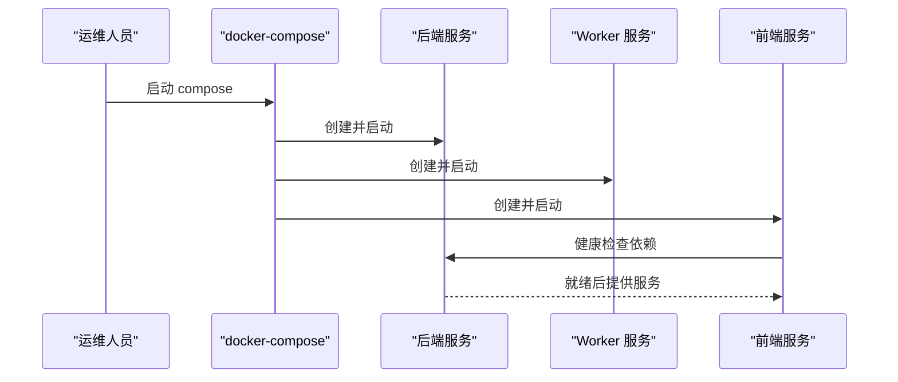
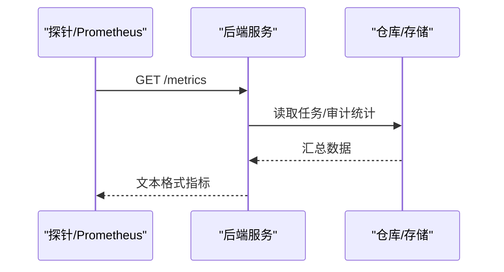
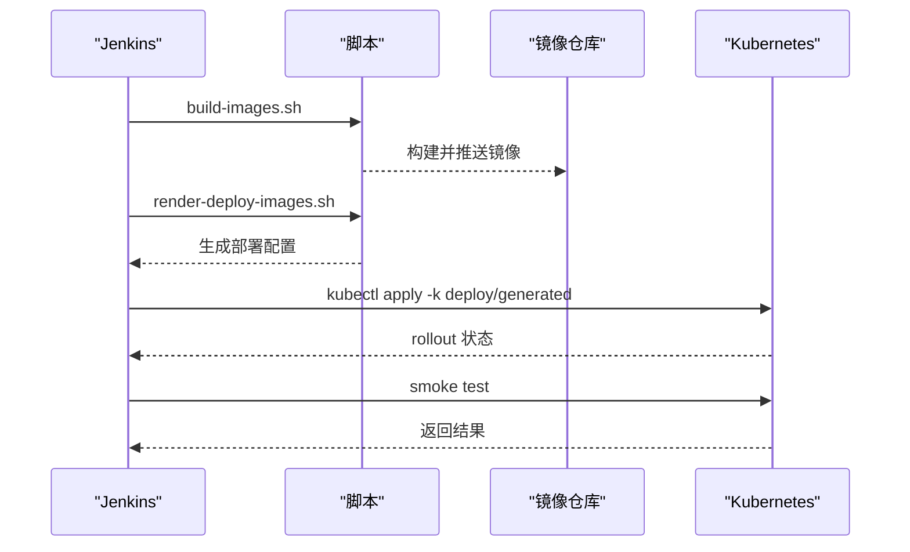
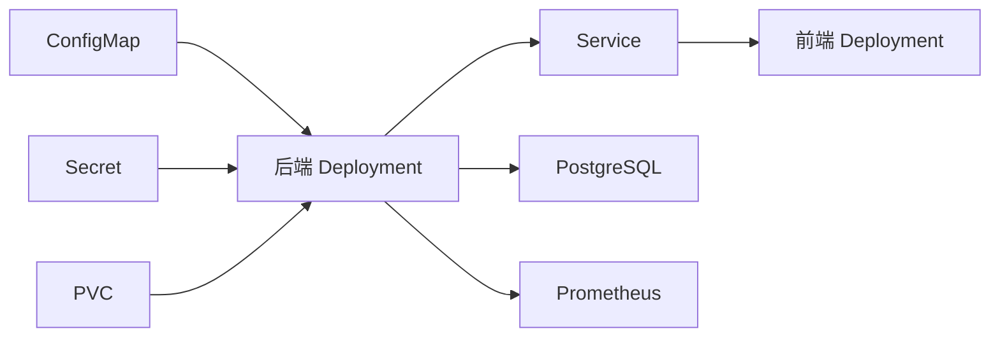

# 部署与运维

<cite>
**本文引用的文件**
- [backend.yaml](file://deploy/k8s/backend.yaml)
- [configmap.yaml](file://deploy/k8s/configmap.yaml)
- [secret.template.yaml](file://deploy/k8s/secret.template.yaml)
- [docker-compose.prod.yml](file://deploy/docker-compose.prod.yml)
- [main.py](file://backend/deployment_package_factory/main.py)
- [Dockerfile（后端）](file://backend/Dockerfile)
- [Dockerfile（前端）](file://frontend/Dockerfile)
- [settings.py](file://backend/deployment_package_factory/settings.py)
- [metrics.py](file://backend/deployment_package_factory/metrics.py)
- [readiness.py](file://backend/deployment_package_factory/readiness.py)
- [Jenkinsfile](file://Jenkinsfile)
- [jenkins-ci-cd.md](file://docs/jenkins-ci-cd.md)
- [build-images.sh](file://scripts/build-images.sh)
- [render-deploy-images.sh](file://scripts/render-deploy-images.sh)
- [render-k8s-secret.sh](file://scripts/render-k8s-secret.sh)
</cite>

## 目录
1. [简介](#简介)
2. [项目结构](#项目结构)
3. [核心组件](#核心组件)
4. [架构总览](#架构总览)
5. [详细组件分析](#详细组件分析)
6. [依赖关系分析](#依赖关系分析)
7. [性能考虑](#性能考虑)
8. [故障排查指南](#故障排查指南)
9. [结论](#结论)
10. [附录](#附录)

## 简介
本运维文档面向“部署包工厂”的生产环境部署与运维，覆盖以下内容：
- 生产环境部署方案：Kubernetes 与 Docker Compose 两种方式的步骤与配置要点
- 部署清单结构、资源配置与环境变量管理
- 监控与可观测性：健康检查端点、Prometheus 指标采集、日志策略
- CI/CD 流水线：Jenkins 管道定义、自动化构建与部署策略
- 运维最佳实践、性能调优、故障恢复与灾难恢复
- 部署前检查清单、升级迁移指南与灾难恢复预案

## 项目结构
该项目采用前后端分离与多容器协作的架构：
- 后端服务基于 FastAPI，提供健康检查、就绪检查与 Prometheus 指标端点
- 前端服务基于 Nginx 提供静态资源与反向代理
- 支持通过 Kubernetes 与 Docker Compose 两种方式进行编排部署
- CI/CD 使用 Jenkins 管道，配合脚本完成镜像构建、配置渲染与部署

图表来源
- [backend.yaml:1-96](file://deploy/k8s/backend.yaml#L1-L96)
- [configmap.yaml:1-23](file://deploy/k8s/configmap.yaml#L1-L23)
- [secret.template.yaml:1-15](file://deploy/k8s/secret.template.yaml#L1-L15)
- [docker-compose.prod.yml:1-65](file://deploy/docker-compose.prod.yml#L1-L65)

章节来源
- [backend.yaml:1-96](file://deploy/k8s/backend.yaml#L1-L96)
- [configmap.yaml:1-23](file://deploy/k8s/configmap.yaml#L1-L23)
- [secret.template.yaml:1-15](file://deploy/k8s/secret.template.yaml#L1-L15)
- [docker-compose.prod.yml:1-65](file://deploy/docker-compose.prod.yml#L1-L65)

## 核心组件
- 后端服务（FastAPI）
  - 提供 /health、/health/ready、/metrics 端点
  - 通过 ConfigMap/Secret 注入环境变量
  - 使用只读非 root 用户运行，具备安全上下文
- Worker 组件
  - 以 worker 执行模式运行，支持并发任务与心跳
- 前端服务（Nginx）
  - 提供静态页面与反向代理，暴露 80 端口
- 数据持久化
  - 后端使用 PVC 存储部署包产物与中间数据
- 监控与可观测性
  - Prometheus 自动抓取 /metrics
  - 健康与就绪探针保障滚动更新与流量切换

章节来源
- [main.py:23-68](file://backend/deployment_package_factory/main.py#L23-L68)
- [settings.py:26-57](file://backend/deployment_package_factory/settings.py#L26-L57)
- [metrics.py:4-38](file://backend/deployment_package_factory/metrics.py#L4-L38)
- [readiness.py:14-102](file://backend/deployment_package_factory/readiness.py#L14-L102)
- [backend.yaml:34-77](file://deploy/k8s/backend.yaml#L34-L77)
- [Dockerfile（后端）:27-35](file://backend/Dockerfile#L27-L35)
- [Dockerfile（前端）:20-32](file://frontend/Dockerfile#L20-L32)

## 架构总览
下图展示生产环境的端到端架构与数据流：

图表来源
- [backend.yaml:1-96](file://deploy/k8s/backend.yaml#L1-L96)
- [configmap.yaml:1-23](file://deploy/k8s/configmap.yaml#L1-L23)
- [secret.template.yaml:1-15](file://deploy/k8s/secret.template.yaml#L1-L15)
- [main.py:41-62](file://backend/deployment_package_factory/main.py#L41-L62)

## 详细组件分析

### Kubernetes 部署清单与配置
- 命名空间与 RBAC
  - 使用独立命名空间隔离资源
  - 通过 ServiceAccount 与 RBAC 控制权限
- ConfigMap
  - 注入运行参数：数据目录、输出目录、并发数、执行模式、轮询/心跳间隔、超时、保留天数、最大容量等
  - 包含本地镜像导出开关与 PVC 名称
- Secret
  - 包含数据库连接串、API Token、可选的源镜像仓库凭据
- PVC
  - 通过补丁文件指定 StorageClass，满足 RWX 场景需求
- 后端 Deployment
  - 安全上下文：非 root、seccomp 默认策略
  - 探针：/health（存活）、/health/ready（就绪）
  - 资源请求/限制：CPU 与内存配额
  - 环境变量：envFrom 引用 ConfigMap 与 Secret
  - 卷挂载：/app/data 挂载至 PVC
- Service 与 Ingress
  - Service 暴露 8096 端口
  - Ingress 作为统一入口（如需）

图表来源
- [render-deploy-images.sh:78-141](file://scripts/render-deploy-images.sh#L78-L141)
- [Jenkinsfile:204-245](file://Jenkinsfile#L204-L245)

章节来源
- [backend.yaml:1-96](file://deploy/k8s/backend.yaml#L1-L96)
- [configmap.yaml:1-23](file://deploy/k8s/configmap.yaml#L1-L23)
- [secret.template.yaml:1-15](file://deploy/k8s/secret.template.yaml#L1-L15)
- [render-deploy-images.sh:78-141](file://scripts/render-deploy-images.sh#L78-L141)

### Docker Compose 部署
- 三层服务
  - backend：执行模式为 worker，具备健康检查
  - worker：执行后台任务，轮询与心跳参数可调
  - frontend：反向代理，依赖后端健康状态
- 数据卷
  - 使用命名卷 deployment-package-data 持久化
- 网络
  - 共享网络 deployment-package-factory
- 环境变量
  - 数据目录、输出目录、数据库连接串、API Token、并发数、源镜像仓库凭据、保留策略与容量上限等

图表来源
- [docker-compose.prod.yml:1-65](file://deploy/docker-compose.prod.yml#L1-L65)

章节来源
- [docker-compose.prod.yml:1-65](file://deploy/docker-compose.prod.yml#L1-L65)

### 环境变量与配置管理
- 关键配置项
  - 数据目录与输出目录
  - 数据库连接串
  - API Token
  - 并发构建数、执行模式（background/worker）
  - Worker 轮询/心跳/超时
  - 产物保留天数与总量上限
  - 源镜像仓库用户名/密码
  - 本地镜像导出开关、安全镜像仓库白名单
- 注入方式
  - Kubernetes：ConfigMap/Secret 通过 envFrom 注入
  - Docker Compose：直接在服务 environment 中声明

章节来源
- [configmap.yaml:8-22](file://deploy/k8s/configmap.yaml#L8-L22)
- [docker-compose.prod.yml:5-16](file://deploy/docker-compose.prod.yml#L5-L16)
- [settings.py:26-57](file://backend/deployment_package_factory/settings.py#L26-L57)

### 监控与可观测性
- 健康检查
  - /health：存活探针
  - /health/ready：就绪探针，综合数据库、元数据存储、输出目录可写性、镜像导出工具可用性
- 指标采集
  - /metrics：Counter/Gauge 指标，包括任务总数、按状态分组、可用制品数量与字节数、审计事件总数与按动作分组
- 日志策略
  - 后端容器标准输出即应用日志，建议结合集群日志收集系统集中存储与检索
  - 前端 Nginx 访问/错误日志可通过挂载卷或 Sidecar 方案采集

图表来源
- [main.py:41-62](file://backend/deployment_package_factory/main.py#L41-L62)
- [metrics.py:4-38](file://backend/deployment_package_factory/metrics.py#L4-L38)
- [readiness.py:14-37](file://backend/deployment_package_factory/readiness.py#L14-L37)

章节来源
- [main.py:41-62](file://backend/deployment_package_factory/main.py#L41-L62)
- [metrics.py:4-38](file://backend/deployment_package_factory/metrics.py#L4-L38)
- [readiness.py:14-102](file://backend/deployment_package_factory/readiness.py#L14-L102)

### CI/CD 流水线（Jenkins）
- 阶段概览
  - 准备：校验 Git/Docker/Kubectl 版本，计算镜像 Tag
  - 构建镜像：后端、Worker、前端三类镜像，支持代理与镜像源参数
  - 推送镜像：可选，登录 Harbor 并推送
  - 渲染部署配置：生成 factory.env、kustomization.yaml、PVC 补丁与 Worker 辅助镜像补丁
  - 确保测试命名空间与拉取密钥
  - 确保测试数据库（可选）
  - 部署到 Kubernetes：应用 Kustomize 配置并等待 rollout
  - 烟测：在后端 Pod 内验证 /health、/metrics、接口鉴权
- 凭据与参数
  - Harbor 登录、GitHub Token、API Token、数据库连接串
  - 关键参数：镜像仓库、命名空间、StorageClass、Kubeconfig 路径、是否推送/部署、是否使用内置 Postgres、是否禁用缓存等

图表来源
- [Jenkinsfile:35-245](file://Jenkinsfile#L35-L245)
- [build-images.sh:54-97](file://scripts/build-images.sh#L54-L97)
- [render-deploy-images.sh:78-141](file://scripts/render-deploy-images.sh#L78-L141)

章节来源
- [Jenkinsfile:1-258](file://Jenkinsfile#L1-L258)
- [jenkins-ci-cd.md:1-59](file://docs/jenkins-ci-cd.md#L1-L59)
- [build-images.sh:1-97](file://scripts/build-images.sh#L1-L97)
- [render-deploy-images.sh:1-141](file://scripts/render-deploy-images.sh#L1-L141)
- [render-k8s-secret.sh:1-77](file://scripts/render-k8s-secret.sh#L1-L77)

## 依赖关系分析
- 组件耦合
  - 后端服务依赖数据库与持久卷；Worker 作为执行单元与后端协同
  - 前端依赖后端健康状态，通过 Service 暴露的端口进行通信
- 外部依赖
  - Harbor 镜像仓库、PostgreSQL 数据库、Kubernetes API、Ingress 控制器
- 配置依赖
  - ConfigMap/Secret 与 Deployment/Service/Ingress 的绑定关系
  - PVC StorageClass 与集群 CSI 插件

图表来源
- [backend.yaml:46-51](file://deploy/k8s/backend.yaml#L46-L51)
- [configmap.yaml:8-22](file://deploy/k8s/configmap.yaml#L8-L22)
- [secret.template.yaml:9-15](file://deploy/k8s/secret.template.yaml#L9-L15)

章节来源
- [backend.yaml:46-51](file://deploy/k8s/backend.yaml#L46-L51)
- [configmap.yaml:8-22](file://deploy/k8s/configmap.yaml#L8-L22)
- [secret.template.yaml:9-15](file://deploy/k8s/secret.template.yaml#L9-L15)

## 性能考虑
- 资源配额
  - 后端容器设置 CPU/内存请求与限制，避免资源争抢
  - Worker 并发数与轮询/心跳间隔需根据任务复杂度与数据库负载调优
- I/O 与存储
  - PVC 使用合适的 StorageClass 与容量上限，定期清理过期制品
- 网络与探针
  - 就绪探针延迟与周期合理设置，避免滚动更新期间流量抖动
- 镜像与构建
  - 构建阶段使用代理与镜像源加速，必要时禁用缓存以保证一致性

## 故障排查指南
- 健康与就绪失败
  - 检查 /health/ready 返回的就绪报告，定位数据库连通性、元数据可达性、输出目录可写性与镜像导出工具状态
- 指标缺失
  - 确认 /metrics 能正常返回文本格式指标；检查后端日志与数据库连接串
- 部署 rollout 卡住
  - 查看 Pod 事件与容器日志；核对 ConfigMap/Secret 更新生效情况
- CI/CD 失败
  - 检查 Jenkins 凭据、镜像仓库登录、Kubeconfig 权限与网络连通性；查看流水线阶段日志

章节来源
- [readiness.py:14-102](file://backend/deployment_package_factory/readiness.py#L14-L102)
- [metrics.py:4-38](file://backend/deployment_package_factory/metrics.py#L4-L38)
- [Jenkinsfile:204-245](file://Jenkinsfile#L204-L245)

## 结论
本项目提供了完整的生产级部署与运维能力：清晰的部署清单、完善的监控可观测性、可复用的 CI/CD 流水线以及可扩展的配置管理。通过合理的资源配置、严格的凭据管理与持续的烟测验证，可在 Kubernetes 与 Docker Compose 环境中稳定交付。

## 附录

### 部署前检查清单
- 环境准备
  - Kubernetes 集群可用，具备 Ingress/StorageClass 权限
  - Harbor 可用，具备推送权限
- 配置准备
  - 生成并注入 Secret（数据库连接串、API Token、可选源镜像仓库凭据）
  - 设置 ConfigMap 参数（并发、执行模式、保留策略、容量上限等）
  - 渲染并应用 Kustomize 配置
- 验收测试
  - 确认 rollout 成功
  - 在后端 Pod 内执行烟测：/health、/metrics、鉴权接口

章节来源
- [secret.template.yaml:9-15](file://deploy/k8s/secret.template.yaml#L9-L15)
- [configmap.yaml:8-22](file://deploy/k8s/configmap.yaml#L8-L22)
- [render-deploy-images.sh:78-141](file://scripts/render-deploy-images.sh#L78-L141)
- [Jenkinsfile:223-245](file://Jenkinsfile#L223-L245)

### 升级与迁移指南
- 升级策略
  - 使用滚动更新，结合就绪探针确保流量平滑切换
  - 逐步增加副本数与资源配额，观察 /metrics 与日志
- 迁移建议
  - 生产环境优先使用外部 PostgreSQL，避免内置数据库迁移风险
  - 迁移前备份 PVC 与数据库，验证回滚路径

### 灾难恢复预案
- 快速恢复
  - 重建命名空间与 Secret/ConfigMap，重新应用 Kustomize 配置
  - 恢复 PVC 数据与数据库备份，重启后端与 Worker
- 预防措施
  - 定期快照 PVC 与数据库
  - 在 CI/CD 中加入自动备份与验证步骤