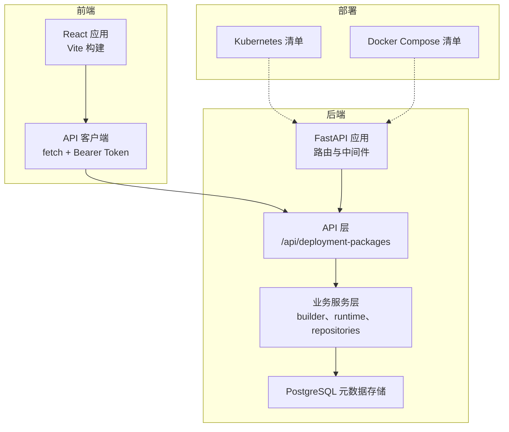
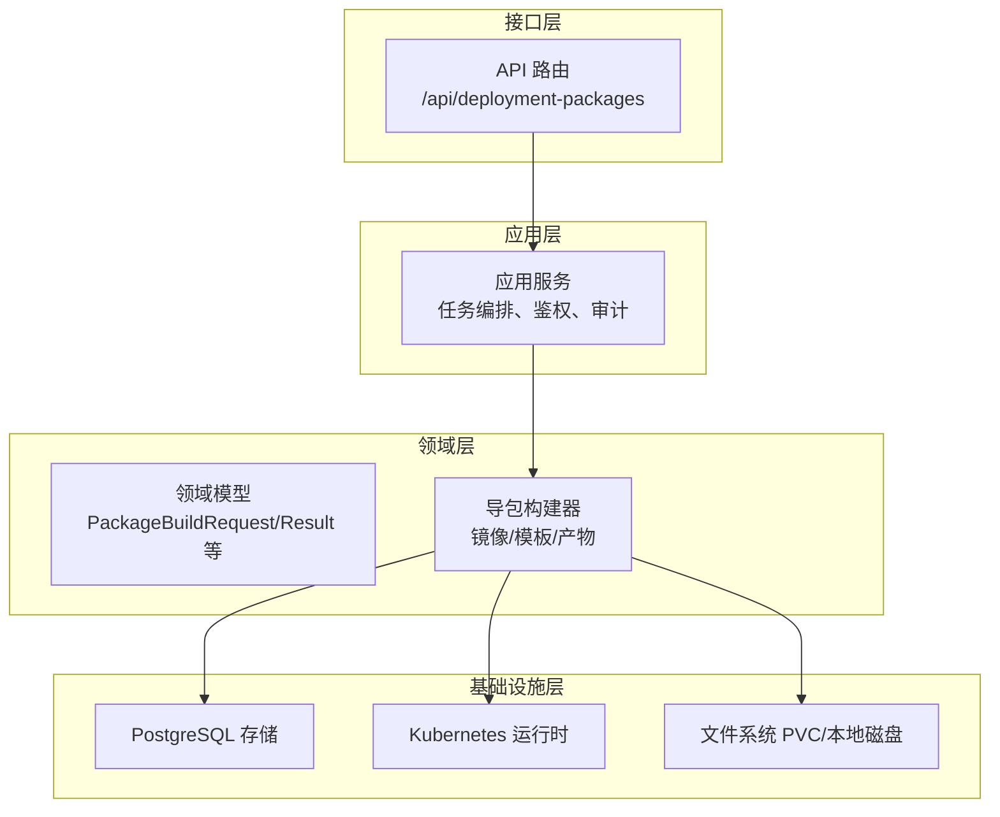
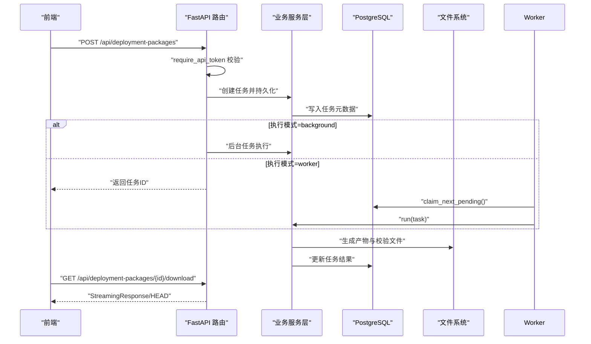
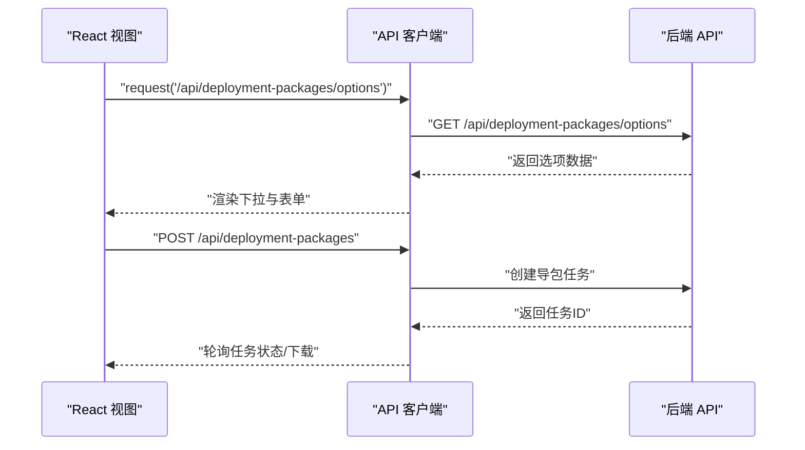
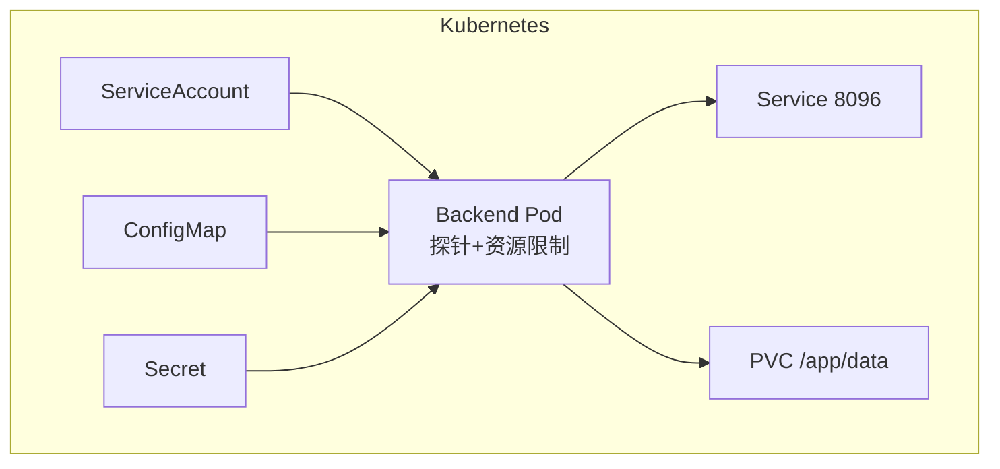
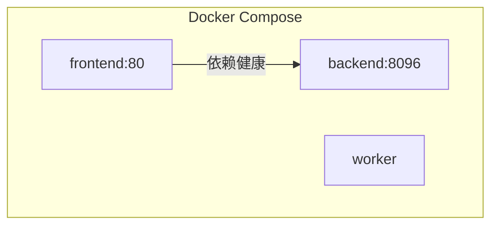
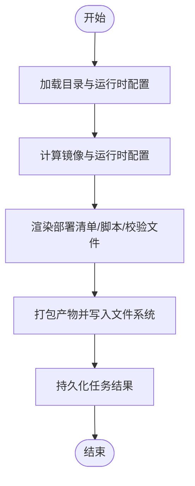
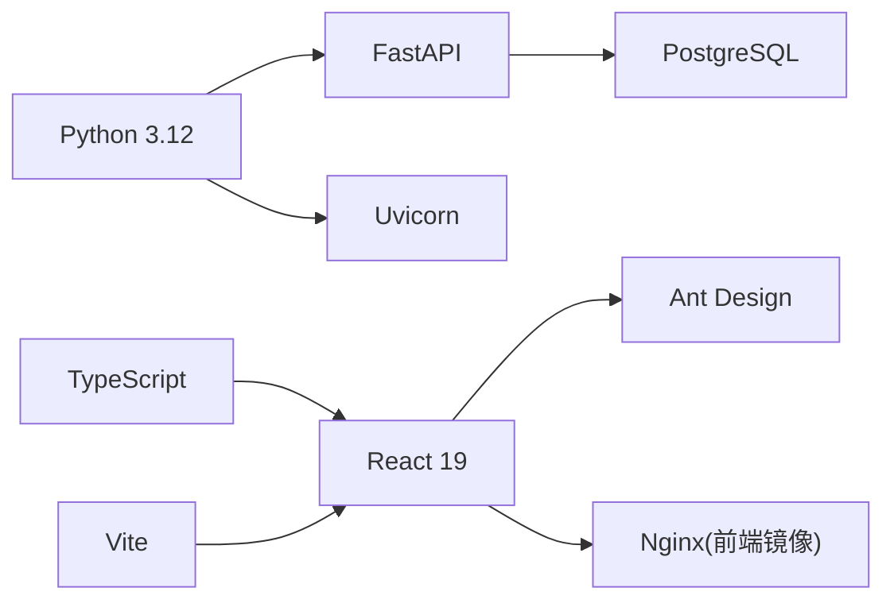

# 技术架构概览

<cite>
**本文引用的文件**
- [backend/pyproject.toml](file://backend/pyproject.toml)
- [frontend/package.json](file://frontend/package.json)
- [backend/deployment_package_factory/main.py](file://backend/deployment_package_factory/main.py)
- [frontend/src/main.tsx](file://frontend/src/main.tsx)
- [backend/deployment_package_factory/settings.py](file://backend/deployment_package_factory/settings.py)
- [frontend/src/api/client.ts](file://frontend/src/api/client.ts)
- [backend/Dockerfile](file://backend/Dockerfile)
- [frontend/Dockerfile](file://frontend/Dockerfile)
- [backend/deployment_package_factory/api/deployment_packages.py](file://backend/deployment_package_factory/api/deployment_packages.py)
- [frontend/vite.config.ts](file://frontend/vite.config.ts)
- [backend/deployment_package_factory/services/deployment_packages/builder.py](file://backend/deployment_package_factory/services/deployment_packages/builder.py)
- [backend/deployment_package_factory/worker.py](file://backend/deployment_package_factory/worker.py)
- [deploy/k8s/backend.yaml](file://deploy/k8s/backend.yaml)
- [deploy/docker-compose.prod.yml](file://deploy/docker-compose.prod.yml)
- [README.md](file://README.md)
</cite>

## 目录
1. [简介](#简介)
2. [项目结构](#项目结构)
3. [核心组件](#核心组件)
4. [架构总览](#架构总览)
5. [详细组件分析](#详细组件分析)
6. [依赖关系分析](#依赖关系分析)
7. [性能考量](#性能考量)
8. [故障排查指南](#故障排查指南)
9. [结论](#结论)
10. [附录](#附录)

## 简介
部署包工厂是一个面向生产交付的“部署包导出”系统，后端基于 FastAPI + Python 提供 RESTful API，前端基于 React 19 + TypeScript 提供可视化界面。系统支持两类部署模式：Kubernetes 原生部署与 Docker Compose 单机部署。其核心目标是根据用户选择的基础平台、业务产品与中间件依赖，自动生成可在目标环境中离线安装的交付包（含镜像清单/归档、安装脚本、质量门禁与安全校验等），并提供任务编排、审计追踪与可观测性。

## 项目结构
项目采用前后端分离架构，后端以 FastAPI 应用为核心，前端以 Vite + React 构建，二者通过 REST API 交互。部署层提供两套清单：Kubernetes 原生部署与 Docker Compose 单机部署，满足不同规模与场景需求。

图表来源
- [backend/deployment_package_factory/main.py:23-68](file://backend/deployment_package_factory/main.py#L23-L68)
- [backend/deployment_package_factory/api/deployment_packages.py:50-54](file://backend/deployment_package_factory/api/deployment_packages.py#L50-L54)
- [frontend/src/main.tsx:13-70](file://frontend/src/main.tsx#L13-L70)
- [frontend/src/api/client.ts:24-43](file://frontend/src/api/client.ts#L24-L43)
- [deploy/k8s/backend.yaml:1-96](file://deploy/k8s/backend.yaml#L1-L96)
- [deploy/docker-compose.prod.yml:1-65](file://deploy/docker-compose.prod.yml#L1-L65)

章节来源
- [README.md:1-349](file://README.md#L1-L349)

## 核心组件
- 后端应用与路由
  - FastAPI 应用创建、CORS 中间件、健康检查与就绪检查、Prometheus 指标端点。
  - API 路由集中于 /api/deployment-packages，包含导包预览、创建、任务管理、下载、清理、业务平台注册等。
- 业务服务层
  - 导包构建器负责镜像发现、运行时配置、模板渲染、产物打包与校验。
  - 任务执行器支持后台任务与独立 Worker 两种执行模式。
- 前端应用
  - React 19 + TypeScript，Ant Design UI，多视图 Tab 切换，通过 API 客户端与后端交互。
- 配置与运行时
  - 后端通过环境变量加载配置，支持执行模式、并发度、心跳、超时、保留策略等。
  - 前端通过运行时注入与 Vite 环境变量提供 API 基地址与令牌。

章节来源
- [backend/deployment_package_factory/main.py:23-68](file://backend/deployment_package_factory/main.py#L23-L68)
- [backend/deployment_package_factory/api/deployment_packages.py:50-54](file://backend/deployment_package_factory/api/deployment_packages.py#L50-L54)
- [backend/deployment_package_factory/services/deployment_packages/builder.py:146-200](file://backend/deployment_package_factory/services/deployment_packages/builder.py#L146-L200)
- [backend/deployment_package_factory/worker.py:19-51](file://backend/deployment_package_factory/worker.py#L19-L51)
- [frontend/src/main.tsx:13-70](file://frontend/src/main.tsx#L13-L70)
- [frontend/src/api/client.ts:24-43](file://frontend/src/api/client.ts#L24-L43)
- [backend/deployment_package_factory/settings.py:26-57](file://backend/deployment_package_factory/settings.py#L26-L57)

## 架构总览
系统采用四层架构理念（接口、应用、领域、基础设施）约束后端代码边界，确保业务规则集中在领域层，避免 API 处理器与持久化代码耦合。前端通过 REST API 与后端解耦，支持跨环境部署与弹性扩缩容。

图表来源
- [backend/deployment_package_factory/api/deployment_packages.py:50-54](file://backend/deployment_package_factory/api/deployment_packages.py#L50-L54)
- [backend/deployment_package_factory/services/deployment_packages/builder.py:146-200](file://backend/deployment_package_factory/services/deployment_packages/builder.py#L146-L200)
- [backend/deployment_package_factory/settings.py:26-57](file://backend/deployment_package_factory/settings.py#L26-L57)

## 详细组件分析

### 后端应用与 API 设计
- 应用创建与中间件
  - CORS 允许任意来源，便于前端跨域访问。
  - 健康检查 /health 返回应用状态；就绪检查 /health/ready 综合数据库、输出目录与镜像导出工具状态。
  - 指标端点 /metrics 输出 Prometheus 文本格式。
- API 路由与鉴权
  - 所有 /api/deployment-packages 接口均依赖 require_api_token 中间件进行 Bearer Token 校验。
  - 提供导包预览、创建、任务列表与详情、取消/重试、清理、下载、校验和脚本生成等完整生命周期接口。
- 任务执行模式
  - background：由 API 后台任务执行。
  - worker：由独立 Worker 进程轮询并执行任务，支持心跳与超时处理。

图表来源
- [backend/deployment_package_factory/main.py:41-62](file://backend/deployment_package_factory/main.py#L41-L62)
- [backend/deployment_package_factory/api/deployment_packages.py:245-282](file://backend/deployment_package_factory/api/deployment_packages.py#L245-L282)
- [backend/deployment_package_factory/worker.py:19-51](file://backend/deployment_package_factory/worker.py#L19-L51)

章节来源
- [backend/deployment_package_factory/main.py:23-68](file://backend/deployment_package_factory/main.py#L23-L68)
- [backend/deployment_package_factory/api/deployment_packages.py:110-123](file://backend/deployment_package_factory/api/deployment_packages.py#L110-L123)
- [backend/deployment_package_factory/api/deployment_packages.py:245-381](file://backend/deployment_package_factory/api/deployment_packages.py#L245-L381)
- [backend/deployment_package_factory/worker.py:19-51](file://backend/deployment_package_factory/worker.py#L19-L51)

### 前端应用与数据交互
- 视图与导航
  - 多 Tab 视图：部署包工厂、微服务注册、系统设置、环境清理。
- API 客户端
  - 通过 window.__DEPLOYMENT_PACKAGE_FACTORY_CONFIG__ 注入运行时配置，支持 API 基地址与令牌。
  - fetch 请求自动附加 Authorization: Bearer Token，下载链接支持带令牌参数。
- 开发代理
  - Vite 代理将 /api 与 /health 代理至本地后端 8096 端口，便于联调。

图表来源
- [frontend/src/main.tsx:13-70](file://frontend/src/main.tsx#L13-L70)
- [frontend/src/api/client.ts:24-43](file://frontend/src/api/client.ts#L24-L43)
- [frontend/vite.config.ts:35-41](file://frontend/vite.config.ts#L35-L41)

章节来源
- [frontend/src/main.tsx:13-70](file://frontend/src/main.tsx#L13-L70)
- [frontend/src/api/client.ts:24-43](file://frontend/src/api/client.ts#L24-L43)
- [frontend/vite.config.ts:35-41](file://frontend/vite.config.ts#L35-L41)

### 部署架构与运行时
- Kubernetes 原生部署
  - 后端 Deployment 使用非 root 用户、最小权限与安全上下文，配置 readiness/liveness 探针与资源限制。
  - Service 暴露 8096 端口，Prometheus 自动抓取 /metrics。
  - 支持 ConfigMap/Secret 注入环境变量，PVC 挂载数据目录。
- Docker Compose 单机部署
  - 后端、Worker、前端三服务协同，后端与 Worker 通过环境变量控制执行模式与并发度。
  - 前端依赖后端健康状态，端口映射至 80，便于本地访问。

图表来源
- [deploy/k8s/backend.yaml:1-96](file://deploy/k8s/backend.yaml#L1-L96)

图表来源
- [deploy/docker-compose.prod.yml:1-65](file://deploy/docker-compose.prod.yml#L1-L65)

章节来源
- [deploy/k8s/backend.yaml:1-96](file://deploy/k8s/backend.yaml#L1-L96)
- [deploy/docker-compose.prod.yml:1-65](file://deploy/docker-compose.prod.yml#L1-L65)

### 导包构建流程
- 输入与预览
  - 用户选择项目、来源环境、部署模式、业务服务与数据库等，后端解析目录与运行时，计算镜像与运行时配置。
- 镜像与模板渲染
  - 根据运行时发现来源环境中的业务镜像与中间件，渲染部署清单、安装脚本、质量门禁与安全校验文件。
- 产物与校验
  - 生成 tar.gz 产物，包含 manifest、package-index、verify/quality-gate 脚本与镜像归档/清单。
  - 提供下载与校验和接口，支持 Range 分片下载与 HEAD 预检。

图表来源
- [backend/deployment_package_factory/services/deployment_packages/builder.py:146-200](file://backend/deployment_package_factory/services/deployment_packages/builder.py#L146-L200)
- [backend/deployment_package_factory/api/deployment_packages.py:126-162](file://backend/deployment_package_factory/api/deployment_packages.py#L126-L162)

章节来源
- [backend/deployment_package_factory/services/deployment_packages/builder.py:146-200](file://backend/deployment_package_factory/services/deployment_packages/builder.py#L146-L200)
- [backend/deployment_package_factory/api/deployment_packages.py:126-162](file://backend/deployment_package_factory/api/deployment_packages.py#L126-L162)

## 依赖关系分析
- 技术栈与版本
  - 后端：FastAPI、Uvicorn、Pydantic、PyYAML、PostgreSQL 驱动。
  - 前端：React 19、TypeScript、Vite、Ant Design。
- 容器镜像
  - 后端镜像基于 Python slim，安装 skopeo 与证书，暴露 8096 端口。
  - 前端镜像基于 Nginx，构建产物静态托管，暴露 80 端口。
- 部署依赖
  - Kubernetes 部署需要命名空间、RBAC、ConfigMap、Secret、PVC、Service、Ingress。
  - Docker Compose 部署需要网络与卷，后端/Worker/前端三服务。

图表来源
- [backend/pyproject.toml:6-12](file://backend/pyproject.toml#L6-L12)
- [frontend/package.json:12-24](file://frontend/package.json#L12-L24)
- [backend/Dockerfile:1-36](file://backend/Dockerfile#L1-L36)
- [frontend/Dockerfile:1-32](file://frontend/Dockerfile#L1-L32)

章节来源
- [backend/pyproject.toml:6-12](file://backend/pyproject.toml#L6-L12)
- [frontend/package.json:12-24](file://frontend/package.json#L12-L24)
- [backend/Dockerfile:1-36](file://backend/Dockerfile#L1-L36)
- [frontend/Dockerfile:1-32](file://frontend/Dockerfile#L1-L32)

## 性能考量
- 并发与队列
  - 通过 max_concurrent_builds 控制单进程并发，避免资源争抢。
  - Worker 模式下通过心跳与超时机制提升稳定性与可恢复性。
- 下载与传输
  - 支持 Range 分片下载与 HEAD 预检，降低大文件传输开销。
- 镜像导出
  - 优先使用 skopeo 无守护导出，减少对 Docker 守护进程的依赖；本地回退到 Docker CLI。
- 前端构建
  - Vite 通过手动分块优化 vendor 依赖，减小首包体积与缓存命中率。

章节来源
- [backend/deployment_package_factory/settings.py:34-41](file://backend/deployment_package_factory/settings.py#L34-L41)
- [backend/deployment_package_factory/worker.py:37-51](file://backend/deployment_package_factory/worker.py#L37-L51)
- [backend/deployment_package_factory/api/deployment_packages.py:392-431](file://backend/deployment_package_factory/api/deployment_packages.py#L392-L431)
- [frontend/vite.config.ts:8-29](file://frontend/vite.config.ts#L8-L29)

## 故障排查指南
- 健康与就绪
  - /health：检查应用存活；/health/ready：检查数据库连接、输出目录写入与镜像导出工具状态。
- 日志与审计
  - 所有关键操作写入审计事件，可通过 /api/deployment-packages/audit-events 查询。
- 下载问题
  - 若下载 404，检查产物是否被清理；若 Range 错误，检查 Range/If-Range 请求头。
- Worker 任务
  - 任务长时间 running，检查 worker 心跳与超时配置；必要时重启 Worker 或清理超时任务。

章节来源
- [backend/deployment_package_factory/main.py:41-62](file://backend/deployment_package_factory/main.py#L41-L62)
- [backend/deployment_package_factory/api/deployment_packages.py:285-292](file://backend/deployment_package_factory/api/deployment_packages.py#L285-L292)
- [backend/deployment_package_factory/api/deployment_packages.py:392-431](file://backend/deployment_package_factory/api/deployment_packages.py#L392-L431)
- [backend/deployment_package_factory/worker.py:37-51](file://backend/deployment_package_factory/worker.py#L37-L51)

## 结论
本项目以清晰的前后端分离架构与 RESTful API 设计为核心，结合 FastAPI 的高性能与 React 19 的现代化开发体验，提供了可扩展、可观测且易于部署的交付包导出能力。通过 Kubernetes 原生部署与 Docker Compose 单机部署双模支持，既能满足生产级弹性与安全要求，也能快速落地于本地与轻量化环境。未来可在任务编排、项目模板扩展与离线安装校验等方面持续增强。

## 附录
- 关键环境变量与默认行为
  - 后端：DEPLOYMENT_PACKAGE_DATABASE_URL、DEPLOYMENT_PACKAGE_OUTPUT_DIR、DEPLOYMENT_PACKAGE_EXECUTION_MODE、DEPLOYMENT_PACKAGE_MAX_CONCURRENT_BUILDS 等。
  - 前端：DEPLOYMENT_PACKAGE_FRONTEND_API_BASE_URL、DEPLOYMENT_PACKAGE_FRONTEND_API_TOKEN。
- API 端点概览
  - 导包：POST /api/deployment-packages、GET /api/deployment-packages/tasks、GET /api/deployment-packages/{id}/download 等。
  - 审计与清理：GET /api/deployment-packages/audit-events、POST /api/deployment-packages/cleanup。
- 部署清单
  - Kubernetes：Namespace、RBAC、ConfigMap、Secret、PVC、Deployment、Service、Ingress、Kustomize。
  - Docker Compose：后端、Worker、前端三服务与数据卷。

章节来源
- [README.md:66-116](file://README.md#L66-L116)
- [backend/deployment_package_factory/settings.py:26-57](file://backend/deployment_package_factory/settings.py#L26-L57)
- [frontend/src/api/client.ts:24-43](file://frontend/src/api/client.ts#L24-L43)
- [backend/deployment_package_factory/api/deployment_packages.py:110-123](file://backend/deployment_package_factory/api/deployment_packages.py#L110-L123)
- [deploy/k8s/backend.yaml:1-96](file://deploy/k8s/backend.yaml#L1-L96)
- [deploy/docker-compose.prod.yml:1-65](file://deploy/docker-compose.prod.yml#L1-L65)