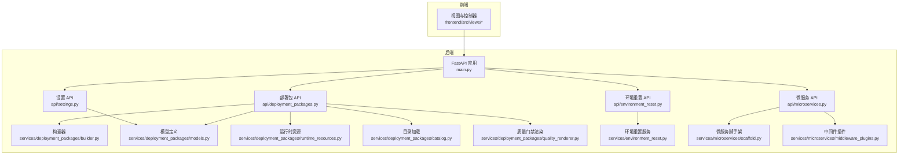
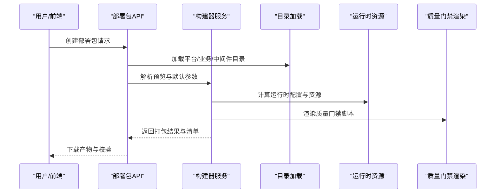
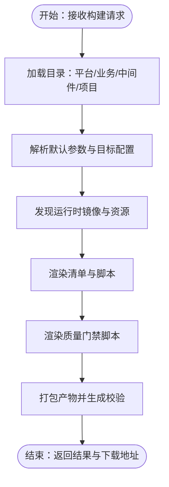
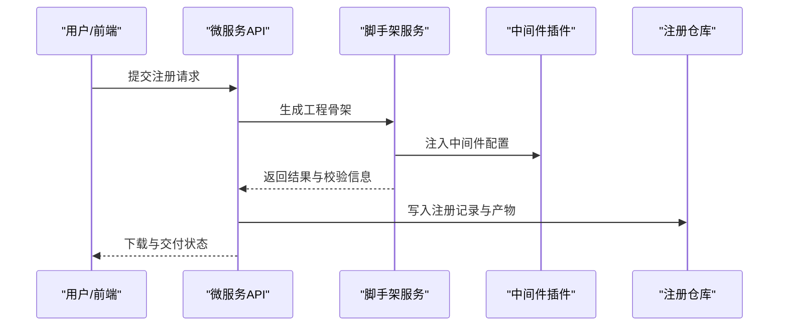
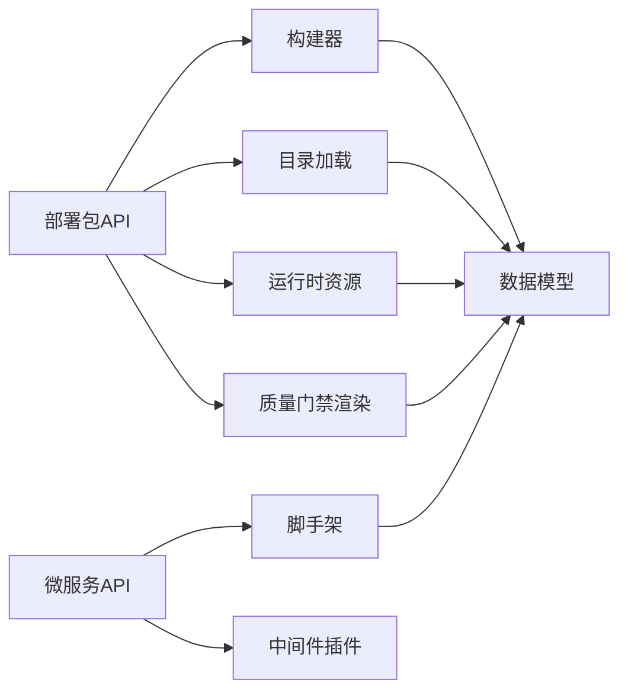

# 核心功能特性

<cite>
**本文引用的文件**
- [backend/deployment_package_factory/main.py](file://backend/deployment_package_factory/main.py)
- [backend/deployment_package_factory/api/deployment_packages.py](file://backend/deployment_package_factory/api/deployment_packages.py)
- [backend/deployment_package_factory/api/microservices.py](file://backend/deployment_package_factory/api/microservices.py)
- [backend/deployment_package_factory/api/settings.py](file://backend/deployment_package_factory/api/settings.py)
- [backend/deployment_package_factory/api/environment_reset.py](file://backend/deployment_package_factory/api/environment_reset.py)
- [backend/deployment_package_factory/services/deployment_packages/builder.py](file://backend/deployment_package_factory/services/deployment_packages/builder.py)
- [backend/deployment_package_factory/services/deployment_packages/models.py](file://backend/deployment_package_factory/services/deployment_packages/models.py)
- [backend/deployment_package_factory/services/deployment_packages/runtime_resources.py](file://backend/deployment_package_factory/services/deployment_packages/runtime_resources.py)
- [backend/deployment_package_factory/services/deployment_packages/catalog.py](file://backend/deployment_package_factory/services/deployment_packages/catalog.py)
- [backend/deployment_package_factory/services/deployment_packages/quality_renderer.py](file://backend/deployment_package_factory/services/deployment_packages/quality_renderer.py)
- [backend/deployment_package_factory/services/environment_reset.py](file://backend/deployment_package_factory/services/environment_reset.py)
- [backend/deployment_package_factory/services/microservices/scaffold.py](file://backend/deployment_package_factory/services/microservices/scaffold.py)
- [backend/deployment_package_factory/services/microservices/middleware_plugins.py](file://backend/deployment_package_factory/services/microservices/middleware_plugins.py)
- [templates/catalog/platform.yaml](file://templates/catalog/platform.yaml)
- [templates/catalog/business.yaml](file://templates/catalog/business.yaml)
</cite>

## 目录
1. [引言](#引言)
2. [项目结构](#项目结构)
3. [核心组件](#核心组件)
4. [架构总览](#架构总览)
5. [详细组件分析](#详细组件分析)
6. [依赖关系分析](#依赖关系分析)
7. [性能考虑](#性能考虑)
8. [故障排查指南](#故障排查指南)
9. [结论](#结论)
10. [附录](#附录)

## 引言
本文件面向部署包工厂项目的核心功能特性，围绕“部署包生成”“微服务注册”“系统设置管理”“环境清理”四大模块进行系统化说明。内容既适合初学者快速理解业务价值与使用方式，也为有经验的工程师提供实现原理、数据流与扩展点的技术细节。

## 项目结构
后端采用 FastAPI 构建，API 路由按功能域划分，服务层负责具体业务编排与渲染；前端通过视图组件调用 API 实现可视化操作。模板目录提供平台与业务能力清单，支撑多业务平台与多部署模式的组合。

**图表来源**
- [backend/deployment_package_factory/main.py:23-68](file://backend/deployment_package_factory/main.py#L23-L68)
- [backend/deployment_package_factory/api/deployment_packages.py:50-124](file://backend/deployment_package_factory/api/deployment_packages.py#L50-L124)
- [backend/deployment_package_factory/api/microservices.py:29-49](file://backend/deployment_package_factory/api/microservices.py#L29-L49)
- [backend/deployment_package_factory/api/settings.py:17-44](file://backend/deployment_package_factory/api/settings.py#L17-L44)
- [backend/deployment_package_factory/api/environment_reset.py:16-43](file://backend/deployment_package_factory/api/environment_reset.py#L16-L43)

**章节来源**
- [backend/deployment_package_factory/main.py:23-68](file://backend/deployment_package_factory/main.py#L23-L68)
- [backend/deployment_package_factory/api/deployment_packages.py:50-124](file://backend/deployment_package_factory/api/deployment_packages.py#L50-L124)
- [backend/deployment_package_factory/api/microservices.py:29-49](file://backend/deployment_package_factory/api/microservices.py#L29-L49)
- [backend/deployment_package_factory/api/settings.py:17-44](file://backend/deployment_package_factory/api/settings.py#L17-L44)
- [backend/deployment_package_factory/api/environment_reset.py:16-43](file://backend/deployment_package_factory/api/environment_reset.py#L16-L43)

## 核心组件
- 部署包生成：根据项目配置与业务选择，解析目录、计算镜像来源与目标映射，渲染部署清单与质量门禁脚本，产出可分发的打包归档，并生成 SHA256 校验。
- 微服务注册：基于模板生成微服务工程骨架，注入中间件配置与交付元数据，支持多种技术栈与中间件组合，提供下载与交付状态查询。
- 系统设置管理：集中维护系统级配置（如 Git/Jenkins/Harbor 凭据、中间件默认值等），支持 Excel 导入覆盖。
- 环境清理：对数据库表与输出目录进行预览与清理，保障开发与测试环境整洁。

**章节来源**
- [backend/deployment_package_factory/services/deployment_packages/builder.py:146-247](file://backend/deployment_package_factory/services/deployment_packages/builder.py#L146-L247)
- [backend/deployment_package_factory/services/microservices/scaffold.py:229-287](file://backend/deployment_package_factory/services/microservices/scaffold.py#L229-L287)
- [backend/deployment_package_factory/api/settings.py:42-69](file://backend/deployment_package_factory/api/settings.py#L42-L69)
- [backend/deployment_package_factory/services/environment_reset.py:99-113](file://backend/deployment_package_factory/services/environment_reset.py#L99-L113)

## 架构总览
系统以 API 层为入口，路由至对应服务层完成任务编排。部署包生成贯穿“目录解析—依赖计算—镜像发现—清单渲染—质量门禁—产物打包”的完整链路；微服务注册包含“请求校验—上下文补全—模板渲染—交付准备—结果落库—产物打包”。

**图表来源**
- [backend/deployment_package_factory/api/deployment_packages.py:245-282](file://backend/deployment_package_factory/api/deployment_packages.py#L245-L282)
- [backend/deployment_package_factory/services/deployment_packages/builder.py:146-247](file://backend/deployment_package_factory/services/deployment_packages/builder.py#L146-L247)
- [backend/deployment_package_factory/services/deployment_packages/catalog.py:44-79](file://backend/deployment_package_factory/services/deployment_packages/catalog.py#L44-L79)
- [backend/deployment_package_factory/services/deployment_packages/runtime_resources.py:25-52](file://backend/deployment_package_factory/services/deployment_packages/runtime_resources.py#L25-L52)
- [backend/deployment_package_factory/services/deployment_packages/quality_renderer.py:18-24](file://backend/deployment_package_factory/services/deployment_packages/quality_renderer.py#L18-L24)

## 详细组件分析

### 部署包生成
- 多环境支持：通过源环境与目标环境配置，自动推断命名空间、镜像仓库与存储类等参数，支持 dev/test 等不同环境差异。
- 多部署模式：同时支持 Kubernetes 与 Docker Compose 两种模式，质量门禁脚本按模式条件执行。
- 多业务平台：平台与业务能力目录定义了 EAM/MES/ERP/APS 等业务域及其依赖关系，生成阶段自动纳入所需镜像与中间件。
- 质量门禁：内置完整性校验、K8s 客户端干跑、Compose 配置干跑三类检查，生成报告并阻断失败项。
- 运行时资源：从运行中的 Pod/Secret/ConfigMap 探测数据库、桶、集合等资源，形成可审计的运行时配置组与资源清单。

**图表来源**
- [backend/deployment_package_factory/services/deployment_packages/builder.py:146-247](file://backend/deployment_package_factory/services/deployment_packages/builder.py#L146-L247)
- [backend/deployment_package_factory/services/deployment_packages/quality_renderer.py:18-24](file://backend/deployment_package_factory/services/deployment_packages/quality_renderer.py#L18-L24)
- [backend/deployment_package_factory/services/deployment_packages/runtime_resources.py:25-52](file://backend/deployment_package_factory/services/deployment_packages/runtime_resources.py#L25-L52)

**章节来源**
- [backend/deployment_package_factory/api/deployment_packages.py:110-165](file://backend/deployment_package_factory/api/deployment_packages.py#L110-L165)
- [backend/deployment_package_factory/services/deployment_packages/builder.py:146-247](file://backend/deployment_package_factory/services/deployment_packages/builder.py#L146-L247)
- [backend/deployment_package_factory/services/deployment_packages/quality_renderer.py:18-24](file://backend/deployment_package_factory/services/deployment_packages/quality_renderer.py#L18-L24)
- [backend/deployment_package_factory/services/deployment_packages/runtime_resources.py:25-52](file://backend/deployment_package_factory/services/deployment_packages/runtime_resources.py#L25-L52)
- [templates/catalog/platform.yaml:1-66](file://templates/catalog/platform.yaml#L1-L66)
- [templates/catalog/business.yaml:1-60](file://templates/catalog/business.yaml#L1-L60)

### 微服务注册
- 多技术栈支持：内置 Python-FastAPI 模板与通用模板渲染，支持前端微前端框架与后端语言扩展。
- 模板生成系统：根据请求参数渲染工程骨架（Dockerfile、Helm Chart、CI/CD 脚本、本地运行脚本等）。
- 中间件插件机制：通过中间件插件定义键值、环境变量名、默认端点与占位符，自动生成配置示例与 TS 映射。
- 交付与状态：生成交付元数据（Git 仓库、Jenkins Job、镜像引用等），支持重试与状态刷新。

**图表来源**
- [backend/deployment_package_factory/api/microservices.py:52-67](file://backend/deployment_package_factory/api/microservices.py#L52-L67)
- [backend/deployment_package_factory/services/microservices/scaffold.py:229-287](file://backend/deployment_package_factory/services/microservices/scaffold.py#L229-L287)
- [backend/deployment_package_factory/services/microservices/middleware_plugins.py:27-68](file://backend/deployment_package_factory/services/microservices/middleware_plugins.py#L27-L68)

**章节来源**
- [backend/deployment_package_factory/api/microservices.py:47-169](file://backend/deployment_package_factory/api/microservices.py#L47-L169)
- [backend/deployment_package_factory/services/microservices/scaffold.py:229-287](file://backend/deployment_package_factory/services/microservices/scaffold.py#L229-L287)
- [backend/deployment_package_factory/services/microservices/middleware_plugins.py:27-68](file://backend/deployment_package_factory/services/microservices/middleware_plugins.py#L27-L68)

### 系统设置管理
- 集中式配置：统一管理 Git/Jenkins/Harbor 凭据、中间件默认值、命名空间前缀等，作为微服务注册与部署包生成的上下文默认值。
- Excel 导入：支持从 Excel 文件导入覆盖当前设置，返回导入字段与告警信息，确保环境一致性。

**章节来源**
- [backend/deployment_package_factory/api/settings.py:42-69](file://backend/deployment_package_factory/api/settings.py#L42-L69)

### 环境清理
- 预览与执行：支持对数据库表与输出目录进行扫描统计，确认删除范围；执行时严格限制仅清理输出根目录内的路径，避免误删。
- 统计汇总：统计受影响的行数、文件数量与字节释放，便于审计与容量规划。

**章节来源**
- [backend/deployment_package_factory/api/environment_reset.py:24-43](file://backend/deployment_package_factory/api/environment_reset.py#L24-L43)
- [backend/deployment_package_factory/services/environment_reset.py:99-113](file://backend/deployment_package_factory/services/environment_reset.py#L99-L113)

## 依赖关系分析
- API 层依赖服务层：部署包 API 与微服务 API 分别调用构建器、目录加载、运行时资源与质量门禁渲染等服务。
- 目录驱动：平台与业务目录决定可用能力、依赖关系与默认参数，直接影响部署包生成的镜像与资源清单。
- 运行时探测：构建器通过 Kubernetes API 探测运行时镜像与资源，保证清单与实际环境一致。
- 数据模型：统一的数据模型贯穿 API、服务与渲染层，确保跨模块的一致性。

**图表来源**
- [backend/deployment_package_factory/api/deployment_packages.py:50-124](file://backend/deployment_package_factory/api/deployment_packages.py#L50-L124)
- [backend/deployment_package_factory/services/deployment_packages/builder.py:21-57](file://backend/deployment_package_factory/services/deployment_packages/builder.py#L21-L57)
- [backend/deployment_package_factory/services/deployment_packages/models.py:56-120](file://backend/deployment_package_factory/services/deployment_packages/models.py#L56-L120)

**章节来源**
- [backend/deployment_package_factory/services/deployment_packages/models.py:56-120](file://backend/deployment_package_factory/services/deployment_packages/models.py#L56-L120)
- [backend/deployment_package_factory/services/deployment_packages/catalog.py:44-79](file://backend/deployment_package_factory/services/deployment_packages/catalog.py#L44-L79)

## 性能考虑
- 并发与后台执行：API 支持后台模式，通过任务执行器并发控制最大构建数量，降低长耗时任务对接口响应的影响。
- 镜像导出工具检测：优先使用无守护进程的镜像导出工具，减少容器运行时开销；若不可用则回退到 Docker CLI。
- 资源去重与覆盖：运行时资源配置支持去重与覆盖，避免重复声明导致的渲染膨胀。
- 输出清理策略：通过保留天数与总大小阈值控制产物留存，定期清理历史包，平衡存储与审计需求。

[本节为通用指导，不直接分析具体文件]

## 故障排查指南
- 部署包创建被阻断：当微服务交付未就绪或质量门禁失败时，API 会记录审计事件并返回错误。可通过审计事件列表定位原因。
- 镜像导出环境检查：若导出工具不可用，需在工作节点安装并验证工具版本，或启用 Docker 守护进程访问。
- 环境重置确认：执行环境重置需要精确的确认短语，否则抛出参数错误；请先执行预览确认影响范围。

**章节来源**
- [backend/deployment_package_factory/api/deployment_packages.py:256-261](file://backend/deployment_package_factory/api/deployment_packages.py#L256-L261)
- [backend/deployment_package_factory/services/deployment_packages/builder.py:105-143](file://backend/deployment_package_factory/services/deployment_packages/builder.py#L105-L143)
- [backend/deployment_package_factory/api/environment_reset.py:32-43](file://backend/deployment_package_factory/api/environment_reset.py#L32-L43)

## 结论
部署包工厂通过“目录驱动+运行时探测+质量门禁”的组合，实现了对多环境、多部署模式与多业务平台的统一支撑；微服务注册以模板与插件为核心，降低了交付成本并提升了可运维性；系统设置与环境清理保障了配置一致性与环境整洁度。整体设计兼顾易用性与可扩展性，适合在复杂企业环境中落地。

[本节为总结性内容，不直接分析具体文件]

## 附录
- 关键数据模型概览（部分）
  - 包构建请求与结果、预览、任务与审计事件等模型定义，用于前后端契约与持久化。
- 平台与业务目录
  - 平台能力（IAM、AI-Agent、Workflow、Observability 等）与业务能力（EAM/MES/ERP/APS）的依赖与镜像映射，决定部署包的组成。

**章节来源**
- [backend/deployment_package_factory/services/deployment_packages/models.py:104-251](file://backend/deployment_package_factory/services/deployment_packages/models.py#L104-L251)
- [templates/catalog/platform.yaml:1-66](file://templates/catalog/platform.yaml#L1-L66)
- [templates/catalog/business.yaml:1-60](file://templates/catalog/business.yaml#L1-L60)