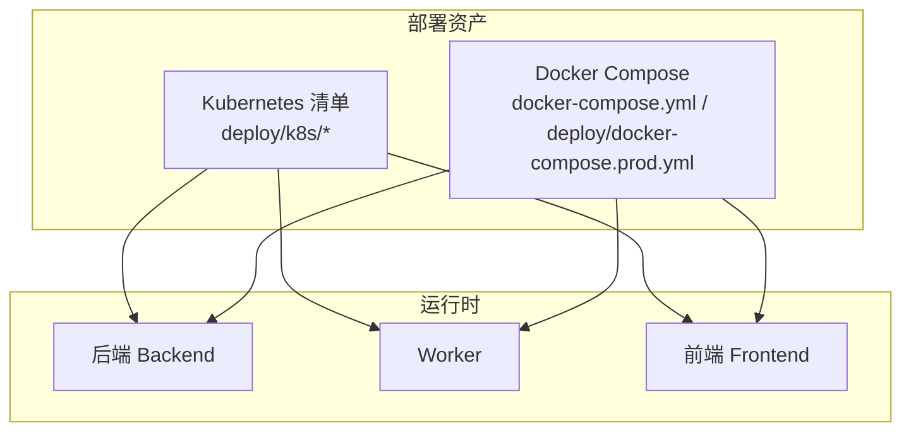
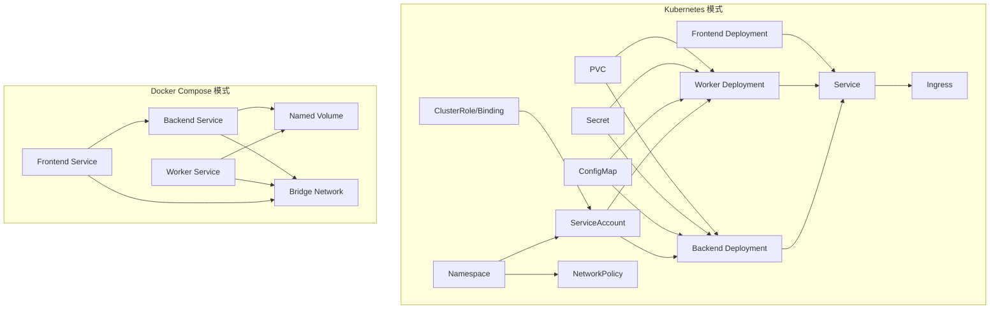
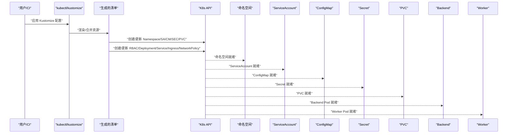
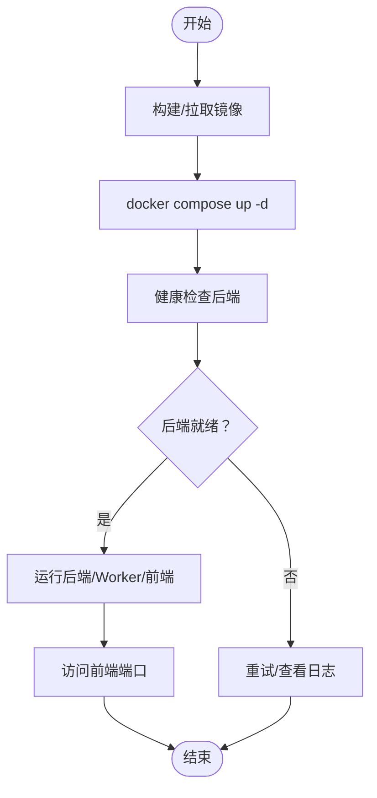
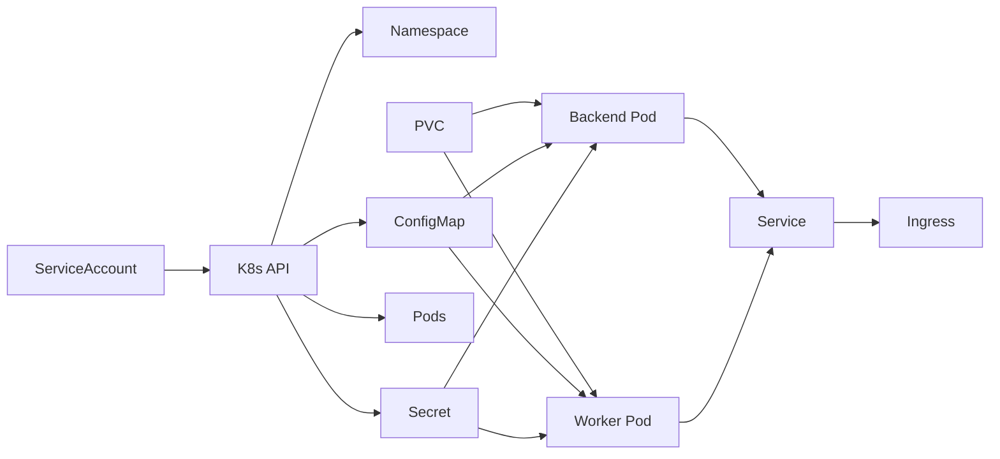

# 部署模式支持

<cite>
**本文引用的文件**
- [deploy/README.md](file://deploy/README.md)
- [docker-compose.yml](file://docker-compose.yml)
- [deploy/docker-compose.prod.yml](file://deploy/docker-compose.prod.yml)
- [deploy/k8s/backend.yaml](file://deploy/k8s/backend.yaml)
- [deploy/k8s/frontend.yaml](file://deploy/k8s/frontend.yaml)
- [deploy/k8s/ingress.yaml](file://deploy/k8s/ingress.yaml)
- [deploy/k8s/configmap.yaml](file://deploy/k8s/configmap.yaml)
- [deploy/k8s/secret.template.yaml](file://deploy/k8s/secret.template.yaml)
- [deploy/k8s/pvc.yaml](file://deploy/k8s/pvc.yaml)
- [deploy/k8s/rbac.yaml](file://deploy/k8s/rbac.yaml)
- [deploy/k8s/serviceaccount.yaml](file://deploy/k8s/serviceaccount.yaml)
- [deploy/k8s/networkpolicy.yaml](file://deploy/k8s/networkpolicy.yaml)
- [deploy/k8s/namespace.yaml](file://deploy/k8s/namespace.yaml)
- [deploy/k8s/worker.yaml](file://deploy/k8s/worker.yaml)
- [backend/deployment_package_factory/services/deployment_packages/kubernetes_runtime.py](file://backend/deployment_package_factory/services/deployment_packages/kubernetes_runtime.py)
</cite>

## 目录
1. [简介](#简介)
2. [项目结构](#项目结构)
3. [核心组件](#核心组件)
4. [架构总览](#架构总览)
5. [详细组件分析](#详细组件分析)
6. [依赖分析](#依赖分析)
7. [性能考虑](#性能考虑)
8. [故障排查指南](#故障排查指南)
9. [结论](#结论)
10. [附录](#附录)

## 简介
本文件面向“部署包工厂”项目的部署与运维人员，系统性说明两种部署模式的支持与差异：Kubernetes 原生部署与 Docker Compose 单机部署。文档覆盖适用场景、优缺点、配置要点、资源清单结构、环境要求、资源消耗与运维复杂度，并提供部署选择的决策指导与最佳实践。

## 项目结构
本项目在 deploy 目录下提供了两套官方部署资产：
- Kubernetes 清单：位于 deploy/k8s，包含命名空间、RBAC、ServiceAccount、ConfigMap、Secret、PVC、Deployment（后端、前端、Worker）、Service、Ingress、NetworkPolicy 等。
- Docker Compose：提供本地开发与单机快速启动的 compose 文件，以及生产模式的独立镜像与卷配置。

图表来源
- [deploy/k8s/backend.yaml:1-96](file://deploy/k8s/backend.yaml#L1-L96)
- [deploy/k8s/worker.yaml:1-59](file://deploy/k8s/worker.yaml#L1-L59)
- [deploy/k8s/frontend.yaml:1-84](file://deploy/k8s/frontend.yaml#L1-L84)
- [docker-compose.yml:1-36](file://docker-compose.yml#L1-L36)
- [deploy/docker-compose.prod.yml:1-65](file://deploy/docker-compose.prod.yml#L1-L65)

章节来源
- [deploy/README.md:63-171](file://deploy/README.md#L63-L171)

## 核心组件
- 后端服务：提供 API、健康检查、指标暴露、任务编排与执行协调。
- Worker 服务：在生产模式下负责具体任务的拉取与执行，支持心跳与超时恢复。
- 前端服务：静态资源服务，通过运行时配置注入后端访问信息。
- 数据持久化：通过 PVC 提供共享读写存储，满足后端下载与 Worker 生成的协同。
- 网络入口：通过 Ingress 对外暴露，支持代理缓冲与长连接参数优化。
- 安全与权限：通过 ServiceAccount 与 RBAC 授权后端在集群内进行命名空间、Pod、Secret、ConfigMap 的读取与管理。

章节来源
- [deploy/k8s/backend.yaml:1-96](file://deploy/k8s/backend.yaml#L1-L96)
- [deploy/k8s/worker.yaml:1-59](file://deploy/k8s/worker.yaml#L1-L59)
- [deploy/k8s/frontend.yaml:1-84](file://deploy/k8s/frontend.yaml#L1-L84)
- [deploy/k8s/pvc.yaml:1-15](file://deploy/k8s/pvc.yaml#L1-L15)
- [deploy/k8s/ingress.yaml:1-27](file://deploy/k8s/ingress.yaml#L1-L27)
- [deploy/k8s/rbac.yaml:1-49](file://deploy/k8s/rbac.yaml#L1-L49)
- [deploy/k8s/serviceaccount.yaml:1-9](file://deploy/k8s/serviceaccount.yaml#L1-L9)

## 架构总览
两种部署模式均以“后端 + Worker + 前端”的三层架构为核心，区别在于运行载体与资源编排方式。

图表来源
- [deploy/k8s/namespace.yaml:1-7](file://deploy/k8s/namespace.yaml#L1-L7)
- [deploy/k8s/serviceaccount.yaml:1-9](file://deploy/k8s/serviceaccount.yaml#L1-L9)
- [deploy/k8s/configmap.yaml:1-23](file://deploy/k8s/configmap.yaml#L1-L23)
- [deploy/k8s/secret.template.yaml:1-15](file://deploy/k8s/secret.template.yaml#L1-L15)
- [deploy/k8s/pvc.yaml:1-15](file://deploy/k8s/pvc.yaml#L1-L15)
- [deploy/k8s/rbac.yaml:1-49](file://deploy/k8s/rbac.yaml#L1-L49)
- [deploy/k8s/backend.yaml:1-96](file://deploy/k8s/backend.yaml#L1-L96)
- [deploy/k8s/worker.yaml:1-59](file://deploy/k8s/worker.yaml#L1-L59)
- [deploy/k8s/frontend.yaml:1-84](file://deploy/k8s/frontend.yaml#L1-L84)
- [deploy/k8s/ingress.yaml:1-27](file://deploy/k8s/ingress.yaml#L1-L27)
- [deploy/k8s/networkpolicy.yaml:1-62](file://deploy/k8s/networkpolicy.yaml#L1-L62)
- [docker-compose.yml:1-36](file://docker-compose.yml#L1-L36)
- [deploy/docker-compose.prod.yml:1-65](file://deploy/docker-compose.prod.yml#L1-L65)

## 详细组件分析

### Kubernetes 原生部署
- 命名空间与身份
  - 使用独立命名空间隔离资源，配合 ServiceAccount 与 RBAC 控制后端对集群资源的读写能力。
- 配置与密钥
  - ConfigMap 统一注入运行参数（并发、心跳、超时、保留策略等）。
  - Secret 存放数据库连接串与 API 密钥等敏感信息。
- 存储
  - PVC 使用 ReadWriteMany，确保后端与 Worker 共享同一工作目录与产物目录。
- 应用与网络
  - 后端与 Worker 通过 Deployment 管理副本与探针；前端提供静态资源服务。
  - Service 暴露后端与前端；Ingress 将域名映射至前端 Service；NetworkPolicy 限制入/出站流量。
- 运行时集成
  - 后端在集群内通过 ServiceAccount Token 访问 API，实现命名空间注册、Pod/Secret/ConfigMap 读取、镜像导出辅助 Pod 创建等能力。

图表来源
- [deploy/k8s/namespace.yaml:1-7](file://deploy/k8s/namespace.yaml#L1-L7)
- [deploy/k8s/serviceaccount.yaml:1-9](file://deploy/k8s/serviceaccount.yaml#L1-L9)
- [deploy/k8s/configmap.yaml:1-23](file://deploy/k8s/configmap.yaml#L1-L23)
- [deploy/k8s/secret.template.yaml:1-15](file://deploy/k8s/secret.template.yaml#L1-L15)
- [deploy/k8s/pvc.yaml:1-15](file://deploy/k8s/pvc.yaml#L1-L15)
- [deploy/k8s/rbac.yaml:1-49](file://deploy/k8s/rbac.yaml#L1-L49)
- [deploy/k8s/backend.yaml:1-96](file://deploy/k8s/backend.yaml#L1-L96)
- [deploy/k8s/worker.yaml:1-59](file://deploy/k8s/worker.yaml#L1-L59)
- [deploy/k8s/frontend.yaml:1-84](file://deploy/k8s/frontend.yaml#L1-L84)
- [deploy/k8s/ingress.yaml:1-27](file://deploy/k8s/ingress.yaml#L1-L27)
- [deploy/k8s/networkpolicy.yaml:1-62](file://deploy/k8s/networkpolicy.yaml#L1-L62)

章节来源
- [deploy/README.md:97-171](file://deploy/README.md#L97-L171)
- [deploy/k8s/backend.yaml:1-96](file://deploy/k8s/backend.yaml#L1-L96)
- [deploy/k8s/worker.yaml:1-59](file://deploy/k8s/worker.yaml#L1-L59)
- [deploy/k8s/frontend.yaml:1-84](file://deploy/k8s/frontend.yaml#L1-L84)
- [deploy/k8s/ingress.yaml:1-27](file://deploy/k8s/ingress.yaml#L1-L27)
- [deploy/k8s/configmap.yaml:1-23](file://deploy/k8s/configmap.yaml#L1-L23)
- [deploy/k8s/secret.template.yaml:1-15](file://deploy/k8s/secret.template.yaml#L1-L15)
- [deploy/k8s/pvc.yaml:1-15](file://deploy/k8s/pvc.yaml#L1-L15)
- [deploy/k8s/rbac.yaml:1-49](file://deploy/k8s/rbac.yaml#L1-L49)
- [deploy/k8s/serviceaccount.yaml:1-9](file://deploy/k8s/serviceaccount.yaml#L1-L9)
- [deploy/k8s/networkpolicy.yaml:1-62](file://deploy/k8s/networkpolicy.yaml#L1-L62)
- [backend/deployment_package_factory/services/deployment_packages/kubernetes_runtime.py:1-459](file://backend/deployment_package_factory/services/deployment_packages/kubernetes_runtime.py#L1-L459)

### Docker Compose 单机部署
- 本地开发与快速启动
  - 本地 compose 提供后端、前端与健康检查，适合单机调试与演示。
- 生产模式
  - 生产使用独立镜像与卷，后端以 worker 执行模式运行，Worker 作为独立服务参与任务处理。
- 环境变量
  - 支持通过环境变量覆盖镜像、端口、数据库连接、并发、心跳、超时、保留策略等参数。

图表来源
- [docker-compose.yml:1-36](file://docker-compose.yml#L1-L36)
- [deploy/docker-compose.prod.yml:1-65](file://deploy/docker-compose.prod.yml#L1-L65)

章节来源
- [deploy/README.md:63-96](file://deploy/README.md#L63-L96)
- [docker-compose.yml:1-36](file://docker-compose.yml#L1-L36)
- [deploy/docker-compose.prod.yml:1-65](file://deploy/docker-compose.prod.yml#L1-L65)

## 依赖分析
- 后端对集群 API 的依赖
  - 通过 ServiceAccount Token 访问 API，读取/列出/创建/修补命名空间，读取 Secret/ConfigMap，创建临时导出 Pod 等。
- 资源耦合关系
  - PVC 与后端/Worker 共享；ConfigMap/Secret 为后端与 Worker 提供统一配置；Service/Ingress 提供网络出口。
- 运维耦合点
  - Secret 与 PVC 的存储类需满足多节点共享读写；NetworkPolicy 需与外部数据库/镜像仓库端口匹配。

图表来源
- [backend/deployment_package_factory/services/deployment_packages/kubernetes_runtime.py:382-424](file://backend/deployment_package_factory/services/deployment_packages/kubernetes_runtime.py#L382-L424)
- [deploy/k8s/serviceaccount.yaml:1-9](file://deploy/k8s/serviceaccount.yaml#L1-L9)
- [deploy/k8s/configmap.yaml:1-23](file://deploy/k8s/configmap.yaml#L1-L23)
- [deploy/k8s/secret.template.yaml:1-15](file://deploy/k8s/secret.template.yaml#L1-L15)
- [deploy/k8s/pvc.yaml:1-15](file://deploy/k8s/pvc.yaml#L1-L15)
- [deploy/k8s/backend.yaml:1-96](file://deploy/k8s/backend.yaml#L1-L96)
- [deploy/k8s/worker.yaml:1-59](file://deploy/k8s/worker.yaml#L1-L59)
- [deploy/k8s/frontend.yaml:1-84](file://deploy/k8s/frontend.yaml#L1-L84)
- [deploy/k8s/ingress.yaml:1-27](file://deploy/k8s/ingress.yaml#L1-L27)

章节来源
- [backend/deployment_package_factory/services/deployment_packages/kubernetes_runtime.py:1-459](file://backend/deployment_package_factory/services/deployment_packages/kubernetes_runtime.py#L1-L459)

## 性能考虑
- 并发与资源
  - 后端与 Worker 均声明 CPU/内存请求与限制，建议结合业务并发与任务复杂度调优。
- 存储吞吐
  - PVC 使用 ReadWriteMany，需确保底层存储类具备良好的并发读写能力与低延迟。
- 网络与代理
  - Ingress 代理缓冲与长连接参数已针对大体积上传/下载场景优化，建议结合实际带宽与并发评估。
- 指标监控
  - 后端暴露 Prometheus 文本指标，建议配合集群监控体系进行告警与容量规划。

章节来源
- [deploy/k8s/backend.yaml:67-74](file://deploy/k8s/backend.yaml#L67-L74)
- [deploy/k8s/worker.yaml:48-55](file://deploy/k8s/worker.yaml#L48-L55)
- [deploy/README.md:173-209](file://deploy/README.md#L173-L209)

## 故障排查指南
- 健康检查失败
  - 检查后端健康端点与探针配置；确认数据库连接与 PVC 挂载正常。
- Worker 任务卡死
  - 核对心跳周期与任务超时阈值；若任务长时间无心跳，将被标记失败，需重试。
- 端口冲突与访问异常
  - 检查前端端口映射与 Ingress 域名；确认网络策略允许必要的出站端口。
- 存储不可共享
  - 确认 PVC 存储类为 ReadWriteMany，且集群具备可用的共享存储。
- 权限不足
  - 确认 ServiceAccount 已绑定 ClusterRole，具备读取/创建/修补命名空间与 Pod 的权限。

章节来源
- [deploy/docker-compose.prod.yml:18-22](file://deploy/docker-compose.prod.yml#L18-L22)
- [deploy/k8s/backend.yaml:55-66](file://deploy/k8s/backend.yaml#L55-L66)
- [deploy/k8s/frontend.yaml:47-58](file://deploy/k8s/frontend.yaml#L47-L58)
- [deploy/k8s/ingress.yaml:8-13](file://deploy/k8s/ingress.yaml#L8-L13)
- [deploy/k8s/networkpolicy.yaml:27-62](file://deploy/k8s/networkpolicy.yaml#L27-L62)
- [deploy/k8s/pvc.yaml:9-11](file://deploy/k8s/pvc.yaml#L9-L11)
- [deploy/k8s/rbac.yaml:1-49](file://deploy/k8s/rbac.yaml#L1-L49)

## 结论
- Kubernetes 模式适用于生产与多租户场景，具备完善的权限控制、网络策略与可观测性，但运维复杂度较高。
- Docker Compose 模式适用于本地开发与小规模演示，部署简单、启动快速，但不满足生产级高可用与共享存储需求。
- 选择建议：生产优先 Kubernetes；开发测试优先 Docker Compose；跨环境一致性可通过 Kustomize 与 Secret/ConfigMap 管理实现。

## 附录

### 两种部署模式对比与选择建议
- 适用场景
  - Kubernetes：生产、多环境、多团队协作、需要严格的权限与网络隔离。
  - Docker Compose：本地开发、演示、单机验证、快速原型。
- 优缺点
  - Kubernetes：权限与网络更可控、资源隔离强、可观测性好，但学习成本与运维复杂度更高。
  - Docker Compose：部署门槛低、易于理解，但缺乏集群级安全与弹性。
- 配置要点
  - Kubernetes：Secret/ConfigMap/PVC/Ingress/NetworkPolicy 需按生产要求逐项校验；存储类必须为 RWX。
  - Docker Compose：注意卷与端口映射，生产模式建议使用独立镜像与命名卷。
- 环境要求与资源消耗
  - Kubernetes：至少 2 核 CPU、4 Gi 内存起步，结合并发与任务复杂度扩容；PVC 至少 100Gi 并保证共享读写。
  - Docker Compose：单机资源建议同上，注意磁盘空间与并发任务数量平衡。
- 运维复杂度
  - Kubernetes：涉及 RBAC、Ingress、NetworkPolicy、Secret 生命周期管理与滚动升级策略。
  - Docker Compose：以服务与卷为主，升级与回滚相对简单。

章节来源
- [deploy/README.md:63-171](file://deploy/README.md#L63-L171)
- [deploy/k8s/pvc.yaml:9-11](file://deploy/k8s/pvc.yaml#L9-L11)
- [deploy/docker-compose.prod.yml:60-65](file://deploy/docker-compose.prod.yml#L60-L65)