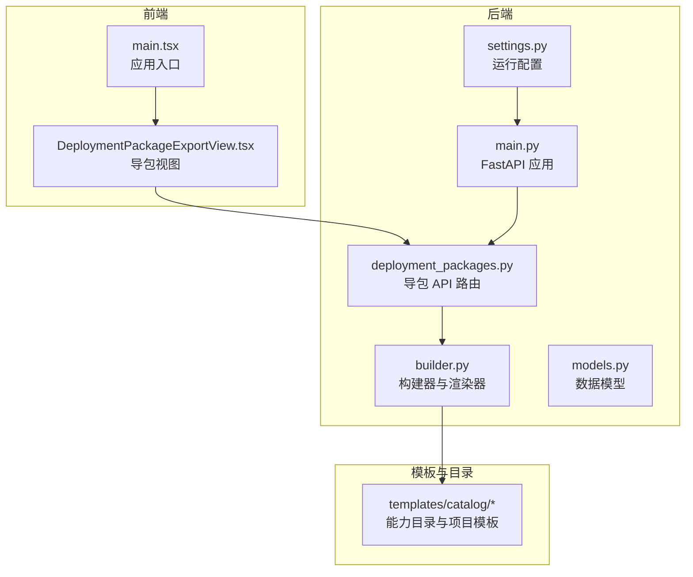
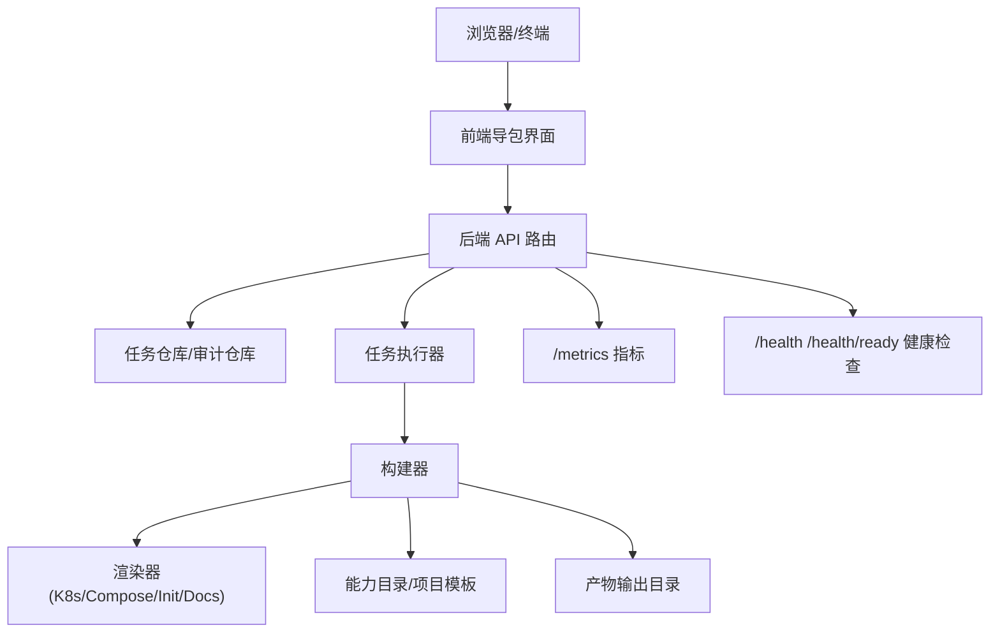
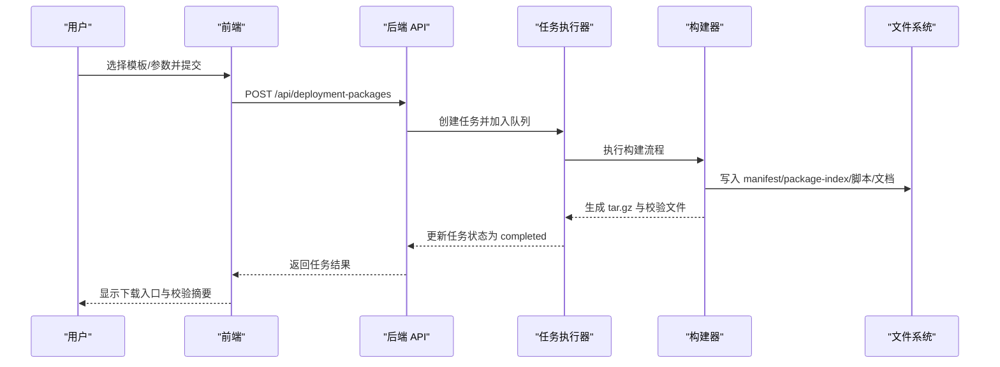
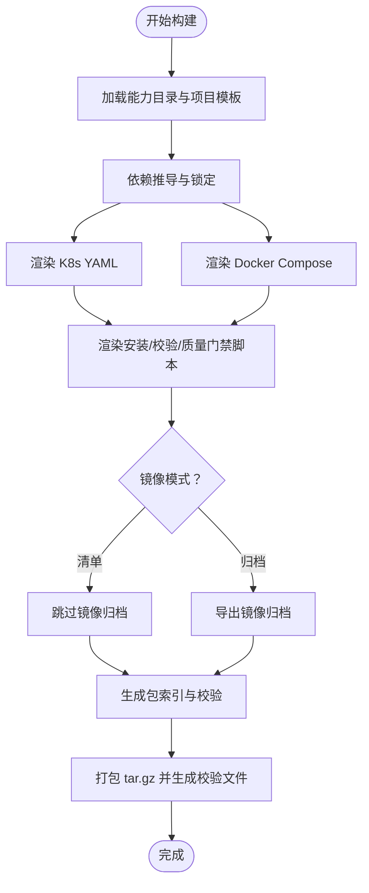
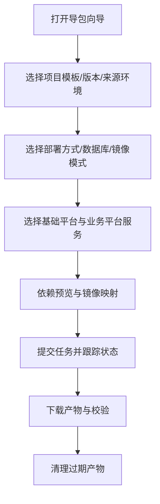
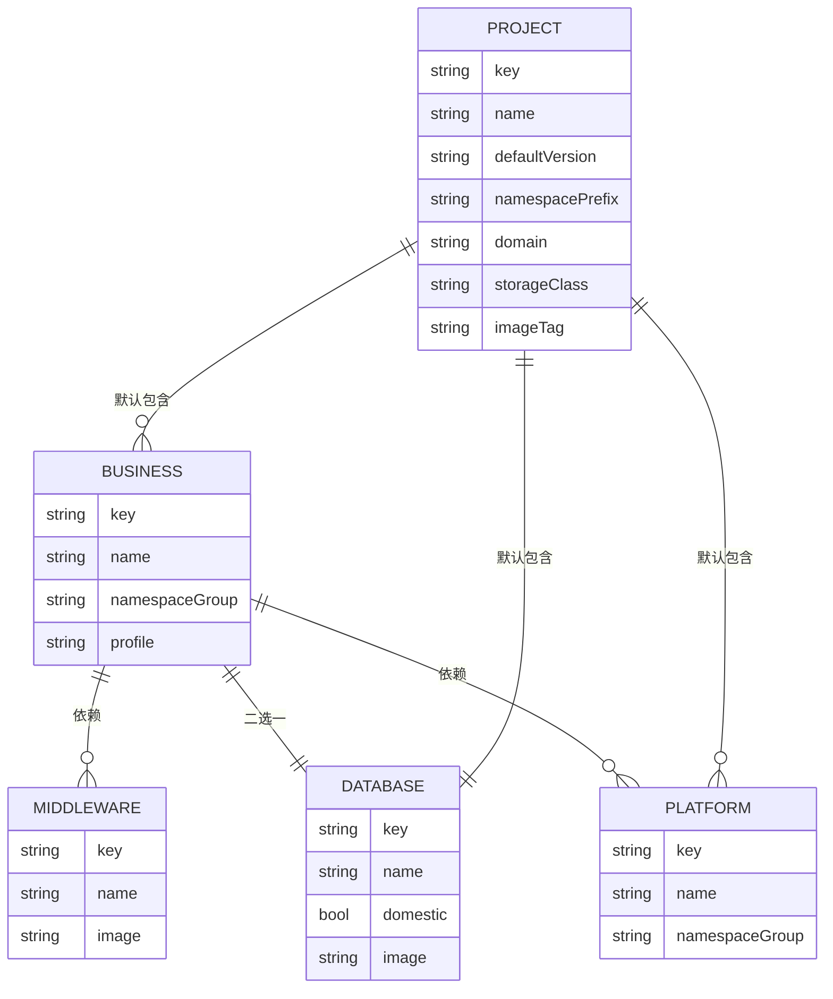

# 项目介绍

<cite>
**本文引用的文件**
- [README.md](file://README.md)
- [main.py](file://backend/deployment_package_factory/main.py)
- [deployment_packages.py](file://backend/deployment_package_factory/api/deployment_packages.py)
- [builder.py](file://backend/deployment_package_factory/services/deployment_packages/builder.py)
- [models.py](file://backend/deployment_package_factory/services/deployment_packages/models.py)
- [settings.py](file://backend/deployment_package_factory/settings.py)
- [main.tsx](file://frontend/src/main.tsx)
- [DeploymentPackageExportView.tsx](file://frontend/src/views/DeploymentPackageExportView.tsx)
- [business.yaml](file://templates/catalog/business.yaml)
- [deploy/README.md](file://deploy/README.md)
- [deployment-package-factory-delivery-audit.md](file://docs/deployment-package-factory-delivery-audit.md)
- [deployment-package-factory-implementation-plan.md](file://docs/deployment-package-factory-implementation-plan.md)
- [AGENTS.md](file://AGENTS.md)
</cite>

## 目录
1. [简介](#简介)
2. [项目结构](#项目结构)
3. [核心组件](#核心组件)
4. [架构总览](#架构总览)
5. [详细组件分析](#详细组件分析)
6. [依赖分析](#依赖分析)
7. [性能考量](#性能考量)
8. [故障排查指南](#故障排查指南)
9. [结论](#结论)
10. [附录](#附录)

## 简介
部署包工厂是一个独立的生产级交付工具，旨在将开发/测试环境中的基础平台能力、业务产品与中间件依赖标准化地导出为可审计、可验证、可重复的生产部署包。项目通过“能力目录 + 依赖推导 + 任务化导包 + 质量门禁”的闭环，解决企业级生产环境部署中的标准化、一致性与可追溯性难题。

- 核心使命：将复杂多样的业务与中间件组合，转化为可直接交付生产的标准化包，降低迁移成本与部署风险。
- 价值主张：统一交付物、可验证的完整性、可审计的操作轨迹、可重复的初始化与安装流程。
- 主要场景：从 dev/test 环境向生产环境迁移时的标准化交付；跨团队协作中的交付物对齐；合规与审计要求下的可追溯性。

## 项目结构
项目采用前后端分离与模板/部署清单解耦的设计，核心模块包括：
- 后端（FastAPI）：提供导包 API、任务编排、产物管理与可观测性。
- 前端（React/Vite）：提供导包向导、依赖预览、任务状态与下载、清理与审计面板。
- 模板与目录：能力目录（平台/业务/中间件/项目模板/依赖规则）驱动依赖推导与产物渲染。
- 部署清单：支持 Docker Compose 与 Kubernetes 的生产部署与工厂自身部署。

图表来源
- [main.tsx:1-81](file://frontend/src/main.tsx#L1-L81)
- [DeploymentPackageExportView.tsx:1-135](file://frontend/src/views/DeploymentPackageExportView.tsx#L1-L135)
- [main.py:1-68](file://backend/deployment_package_factory/main.py#L1-L68)
- [deployment_packages.py:1-658](file://backend/deployment_package_factory/api/deployment_packages.py#L1-L658)
- [builder.py:1-800](file://backend/deployment_package_factory/services/deployment_packages/builder.py#L1-L800)
- [models.py:1-251](file://backend/deployment_package_factory/services/deployment_packages/models.py#L1-L251)
- [settings.py:1-57](file://backend/deployment_package_factory/settings.py#L1-L57)

章节来源
- [README.md:1-120](file://README.md#L1-L120)
- [main.py:1-68](file://backend/deployment_package_factory/main.py#L1-L68)
- [main.tsx:1-81](file://frontend/src/main.tsx#L1-L81)

## 核心组件
- 后端 API 与任务编排
  - 提供导包选项、预览、创建任务、任务查询、取消/重试、清理、下载与校验等接口。
  - 任务状态持久化至 PostgreSQL，支持并发控制、心跳与超时恢复。
- 构建器与渲染器
  - 基于能力目录与项目模板，自动推导依赖、生成 K8s 与 Docker Compose 渲染产物、初始化脚本、安装/校验/质量门禁脚本、包索引与完整性校验。
- 前端导包向导
  - 以向导形式引导用户选择项目模板、产品版本、来源/目标环境、部署方式、数据库与镜像模式，实时预览依赖与镜像映射，并跟踪任务状态与下载。
- 运行配置与可观测性
  - 通过环境变量灵活配置数据目录、数据库、输出目录、并发与清理策略、执行模式（后台任务/独立 worker）、指标导出等。
  - 提供健康检查、就绪检查与 Prometheus 指标端点。

章节来源
- [deployment_packages.py:110-382](file://backend/deployment_package_factory/api/deployment_packages.py#L110-L382)
- [builder.py:146-247](file://backend/deployment_package_factory/services/deployment_packages/builder.py#L146-L247)
- [DeploymentPackageExportView.tsx:15-135](file://frontend/src/views/DeploymentPackageExportView.tsx#L15-L135)
- [settings.py:26-57](file://backend/deployment_package_factory/settings.py#L26-L57)
- [README.md:66-138](file://README.md#L66-L138)

## 架构总览
部署包工厂采用“前端向导 + 后端 API + 任务编排 + 渲染器 + 模板目录”的分层架构。前端负责交互与可视化，后端负责任务生命周期与产物生成，模板目录提供能力与依赖规则，渲染器将规则与运行时信息转化为可部署的 YAML/脚本/文档。

图表来源
- [deployment_packages.py:245-382](file://backend/deployment_package_factory/api/deployment_packages.py#L245-L382)
- [builder.py:146-247](file://backend/deployment_package_factory/services/deployment_packages/builder.py#L146-L247)
- [main.py:41-62](file://backend/deployment_package_factory/main.py#L41-L62)

## 详细组件分析

### 后端 API 与任务编排
- 导包选项与预览：根据能力目录与项目模板，计算依赖、镜像映射与运行时配置，返回可审计的预览结果。
- 任务生命周期：创建任务 → 后台执行 → 状态持久化 → 产物生成 → 下载/校验 → 清理。
- 取消/重试/清理：支持任务取消、失败重试、按策略清理过期产物，保留审计与任务元数据。
- 审计与可观测性：所有关键操作写入审计事件，支持查询与过滤；暴露健康检查与 Prometheus 指标。

图表来源
- [deployment_packages.py:245-382](file://backend/deployment_package_factory/api/deployment_packages.py#L245-L382)
- [builder.py:146-247](file://backend/deployment_package_factory/services/deployment_packages/builder.py#L146-L247)

章节来源
- [deployment_packages.py:110-382](file://backend/deployment_package_factory/api/deployment_packages.py#L110-L382)
- [main.py:41-62](file://backend/deployment_package_factory/main.py#L41-L62)

### 构建器与渲染器
- 依赖推导：基于能力目录与项目模板，自动补齐基础平台、业务平台与中间件依赖，确保数据库二选一与镜像一致性。
- 渲染产物：生成 K8s 与 Docker Compose 渲染文件、初始化脚本、安装/卸载/干跑脚本、质量门禁脚本、包索引与完整性校验文件。
- 镜像导出：支持镜像清单与镜像归档两种模式，优先使用无守护导出工具，回退到本地 Docker CLI。
- 运行时配置：从来源环境的 Secret/ConfigMap/环境变量中解析运行时配置，确保目标环境一致性。

图表来源
- [builder.py:146-247](file://backend/deployment_package_factory/services/deployment_packages/builder.py#L146-L247)
- [business.yaml:1-60](file://templates/catalog/business.yaml#L1-L60)

章节来源
- [builder.py:146-247](file://backend/deployment_package_factory/services/deployment_packages/builder.py#L146-L247)
- [business.yaml:1-60](file://templates/catalog/business.yaml#L1-L60)

### 前端导包向导
- 交互设计：采用向导分步引导，限制每步输入数量，确保易用性与正确性。
- 功能覆盖：模板选择、版本与环境选择、部署方式、数据库与镜像模式、依赖预览、镜像映射、任务状态跟踪、下载与校验、清理与审计面板。
- 状态管理：通过自定义 Hook 解耦逻辑与 UI，保证组件职责单一与可维护性。

图表来源
- [DeploymentPackageExportView.tsx:15-135](file://frontend/src/views/DeploymentPackageExportView.tsx#L15-L135)
- [AGENTS.md:19-27](file://AGENTS.md#L19-L27)

章节来源
- [DeploymentPackageExportView.tsx:15-135](file://frontend/src/views/DeploymentPackageExportView.tsx#L15-L135)
- [AGENTS.md:19-27](file://AGENTS.md#L19-L27)

### 运行配置与部署
- 环境变量：支持数据目录、数据库连接、输出目录、并发与清理策略、执行模式、worker 轮询与心跳、任务超时、保留天数与总量上限等。
- 生产部署：提供 Docker Compose 与 Kubernetes 部署清单，支持镜像渲染、存储类注入、网络策略与监控注解。
- 工厂自身部署：包含镜像构建/推送脚本与部署 overlay 渲染脚本，便于在不同环境快速部署。

章节来源
- [settings.py:26-57](file://backend/deployment_package_factory/settings.py#L26-L57)
- [deploy/README.md:1-210](file://deploy/README.md#L1-L210)
- [README.md:89-138](file://README.md#L89-L138)

## 依赖分析
- 能力目录与项目模板
  - 平台能力：IAM、AI/Agent、File/Documents、Workflow/Camunda、Audit、Gateway/Frontend Shell。
  - 业务产品：EAM、MES、ERP、APS。
  - 中间件：数据库（PostgreSQL/达梦二选一）、Redis、MinIO、Qdrant、Camunda、IoTDB。
  - 项目模板：默认版本、镜像 tag、registry、namespace 前缀、domain、storageClass、overlay 等。
- 依赖推导
  - 业务服务自动补齐基础平台与中间件依赖；数据库二选一；镜像 tag 与 registry 解析；运行时配置从来源环境注入。

图表来源
- [business.yaml:1-60](file://templates/catalog/business.yaml#L1-L60)
- [models.py:56-90](file://backend/deployment_package_factory/services/deployment_packages/models.py#L56-L90)

章节来源
- [business.yaml:1-60](file://templates/catalog/business.yaml#L1-L60)
- [models.py:56-90](file://backend/deployment_package_factory/services/deployment_packages/models.py#L56-L90)

## 性能考量
- 并发与队列：通过并发上限与队列机制控制构建压力，避免资源争用；worker 模式下 API 进程不直接执行重任务。
- 产物清理：基于保留天数与总容量上限的清理策略，减少磁盘占用；清理不影响任务与审计元数据。
- 镜像导出：优先使用无守护导出工具，减少对宿主机 Docker daemon 的依赖；本地回退到 Docker CLI。
- 指标与可观测性：暴露 Prometheus 指标与健康/就绪检查，便于运维监控与弹性伸缩。

## 故障排查指南
- 健康与就绪检查
  - 使用健康端点判断服务状态；就绪端点会检查数据库、元数据仓库、产物输出目录写入能力与镜像导出工具状态。
- 任务状态与日志
  - 通过任务查询接口查看状态、进度、错误与日志；失败时结合失败阶段与建议进行定位。
- 审计事件
  - 通过审计事件接口查询最近操作记录，按动作、状态与前缀过滤，辅助问题溯源。
- 清理策略
  - 使用清理接口进行 dry-run 与执行清理；注意清理仅删除产物，不删除任务与审计记录。
- 镜像导出环境
  - 使用镜像导出环境检查接口确认导出工具可用性；若不可用，检查工具安装与访问权限。

章节来源
- [main.py:41-62](file://backend/deployment_package_factory/main.py#L41-L62)
- [deployment_packages.py:285-331](file://backend/deployment_package_factory/api/deployment_packages.py#L285-L331)
- [README.md:98-116](file://README.md#L98-L116)

## 结论
部署包工厂通过“能力目录 + 依赖推导 + 任务化导包 + 质量门禁”的体系化设计，为企业提供了标准化、可审计、可重复的生产交付能力。它不仅提升了交付效率与一致性，也降低了迁移风险与运维负担。随着后续在 worker 化、权限审计、真实项目初始化、强质量门禁与供应链安全等方面的深化，项目将持续增强企业级生产治理能力。

## 附录
- 项目发展历程与阶段性成果：参见交付审计报告与实施计划，涵盖从 MVP 到生产化雏形的关键里程碑与剩余风险。
- 设计约束与最佳实践：前端 UX 约束与后端 DDD 约束，指导代码结构与交互设计的一致性。

章节来源
- [deployment-package-factory-delivery-audit.md:1-458](file://docs/deployment-package-factory-delivery-audit.md#L1-L458)
- [deployment-package-factory-implementation-plan.md:1-800](file://docs/deployment-package-factory-implementation-plan.md#L1-L800)
- [AGENTS.md:19-51](file://AGENTS.md#L19-L51)