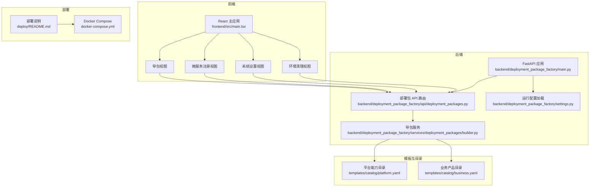
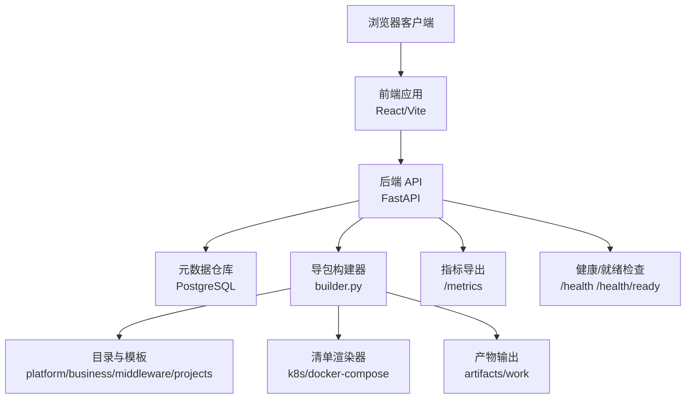
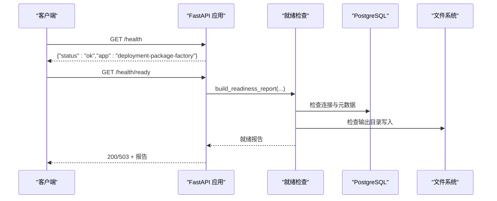
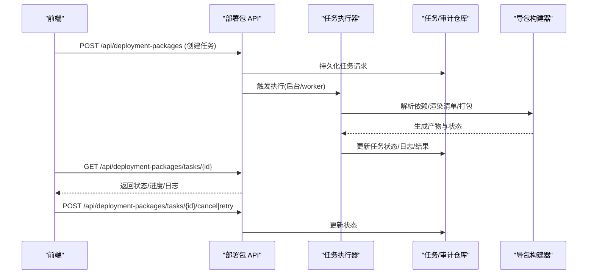
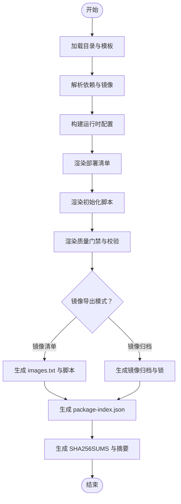
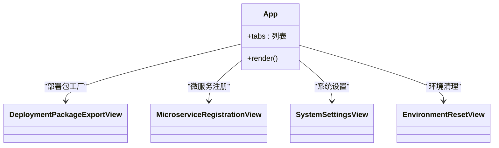
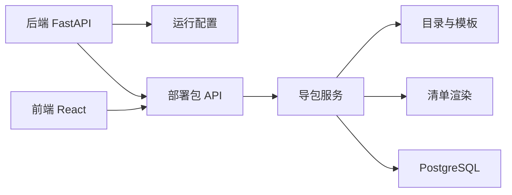

# 项目概述

<cite>
**本文引用的文件**
- [README.md](file://README.md)
- [backend/deployment_package_factory/main.py](file://backend/deployment_package_factory/main.py)
- [frontend/src/main.tsx](file://frontend/src/main.tsx)
- [backend/pyproject.toml](file://backend/pyproject.toml)
- [frontend/package.json](file://frontend/package.json)
- [backend/deployment_package_factory/settings.py](file://backend/deployment_package_factory/settings.py)
- [backend/deployment_package_factory/api/deployment_packages.py](file://backend/deployment_package_factory/api/deployment_packages.py)
- [backend/deployment_package_factory/services/deployment_packages/builder.py](file://backend/deployment_package_factory/services/deployment_packages/builder.py)
- [templates/catalog/business.yaml](file://templates/catalog/business.yaml)
- [templates/catalog/platform.yaml](file://templates/catalog/platform.yaml)
- [deploy/README.md](file://deploy/README.md)
- [docker-compose.yml](file://docker-compose.yml)
- [backend/tests/test_main.py](file://backend/tests/test_main.py)
- [scripts/validate_microservice_scaffolds.py](file://scripts/validate_microservice_scaffolds.py)
- [docs/deployment-package-factory-delivery-audit.md](file://docs/deployment-package-factory-delivery-audit.md)
</cite>

## 目录
1. [简介](#简介)
2. [项目结构](#项目结构)
3. [核心组件](#核心组件)
4. [架构总览](#架构总览)
5. [详细组件分析](#详细组件分析)
6. [依赖分析](#依赖分析)
7. [性能考虑](#性能考虑)
8. [故障排查指南](#故障排查指南)
9. [结论](#结论)
10. [附录](#附录)

## 简介
部署包工厂是一个独立的生产交付包导出系统，旨在从开发/测试环境选择基础平台能力、业务产品与中间件依赖，生成标准化的生产交付包。项目支持多种业务平台（EAM、MES、ERP、APS），涵盖基础平台能力（IAM、AI/Agent、文件/文档、工作流/Camunda、审计、网关/前端壳）与中间件依赖（数据库、Redis、MinIO、Camunda、Qdrant、IoTDB 等）。后端基于 FastAPI，前端基于 React/Vite，提供可视化导包界面与系统设置、环境清理等功能。支持两种部署模式：Kubernetes 与 Docker Compose。项目强调可审计、可重复执行的初始化模板、完整性校验与质量门禁，确保交付包在不同环境中的一致性与安全性。

## 项目结构
项目采用前后端分离与模板/清单解耦的设计：
- 后端（FastAPI）：提供导包 API、任务管理、质量门禁、可观测性与就绪检查。
- 前端（React/Vite）：提供导包向导、微服务注册、系统设置与环境清理视图。
- 模板与目录：通过 YAML 定义平台、业务、中间件、依赖规则与项目模板。
- 部署清单：提供自身部署所需的 K8s 与 Compose 清单及渲染脚本。
- 脚本与测试：包含微服务脚手架验证、部署镜像渲染、测试用例与质量保障。

图表来源
- [frontend/src/main.tsx:1-81](file://frontend/src/main.tsx#L1-L81)
- [backend/deployment_package_factory/main.py:23-68](file://backend/deployment_package_factory/main.py#L23-L68)
- [backend/deployment_package_factory/api/deployment_packages.py:50-124](file://backend/deployment_package_factory/api/deployment_packages.py#L50-L124)
- [backend/deployment_package_factory/services/deployment_packages/builder.py:146-200](file://backend/deployment_package_factory/services/deployment_packages/builder.py#L146-L200)
- [templates/catalog/platform.yaml:1-66](file://templates/catalog/platform.yaml#L1-L66)
- [templates/catalog/business.yaml:1-60](file://templates/catalog/business.yaml#L1-L60)
- [deploy/README.md:1-210](file://deploy/README.md#L1-L210)
- [docker-compose.yml:1-36](file://docker-compose.yml#L1-L36)

章节来源
- [README.md:5-11](file://README.md#L5-L11)
- [frontend/src/main.tsx:13-70](file://frontend/src/main.tsx#L13-L70)
- [backend/deployment_package_factory/main.py:23-68](file://backend/deployment_package_factory/main.py#L23-L68)
- [deploy/README.md:1-210](file://deploy/README.md#L1-L210)

## 核心组件
- 后端应用与路由
  - 应用创建、CORS、路由注册、健康与就绪检查、Prometheus 指标导出。
- 部署包 API
  - 导包选项、预览、创建、任务查询、取消/重试、清理、下载与校验。
- 导包服务
  - 依赖解析、运行时环境探测、部署清单渲染、初始化脚本、质量门禁、镜像导出与打包。
- 运行配置
  - 通过环境变量控制数据目录、数据库连接、输出目录、并发与保留策略等。
- 前端主应用
  - 导包工厂、微服务注册、系统设置、环境清理四个视图模块化组织。

章节来源
- [backend/deployment_package_factory/main.py:23-68](file://backend/deployment_package_factory/main.py#L23-L68)
- [backend/deployment_package_factory/api/deployment_packages.py:110-124](file://backend/deployment_package_factory/api/deployment_packages.py#L110-L124)
- [backend/deployment_package_factory/services/deployment_packages/builder.py:146-200](file://backend/deployment_package_factory/services/deployment_packages/builder.py#L146-L200)
- [backend/deployment_package_factory/settings.py:26-57](file://backend/deployment_package_factory/settings.py#L26-L57)
- [frontend/src/main.tsx:13-70](file://frontend/src/main.tsx#L13-L70)

## 架构总览
系统采用“前端交互 + 后端服务 + 模板驱动 + 清单渲染”的架构。前端负责用户交互与任务状态展示，后端负责任务编排、依赖解析与产物生成，模板与目录驱动部署包内容，部署清单支撑多环境部署。

图表来源
- [backend/deployment_package_factory/main.py:41-62](file://backend/deployment_package_factory/main.py#L41-L62)
- [backend/deployment_package_factory/api/deployment_packages.py:63-103](file://backend/deployment_package_factory/api/deployment_packages.py#L63-L103)
- [backend/deployment_package_factory/services/deployment_packages/builder.py:146-200](file://backend/deployment_package_factory/services/deployment_packages/builder.py#L146-L200)

## 详细组件分析

### 后端应用与路由
- 应用初始化：创建 FastAPI 实例，注册 CORS，挂载部署包、环境重置、微服务与设置路由。
- 健康检查：/health 返回应用状态；/health/ready 检查数据库、输出目录与镜像导出环境。
- 指标导出：/metrics 输出 Prometheus 文本格式指标。

图表来源
- [backend/deployment_package_factory/main.py:41-62](file://backend/deployment_package_factory/main.py#L41-L62)

章节来源
- [backend/deployment_package_factory/main.py:23-68](file://backend/deployment_package_factory/main.py#L23-L68)

### 部署包 API
- 选项与预览：/api/deployment-packages/options 返回可选来源环境、部署模式、平台/业务服务、数据库与中间件；/api/deployment-packages/preview 基于请求解析依赖与运行时配置。
- 任务生命周期：创建、查询、取消、重试、清理与下载。
- 业务平台注册：支持注册/禁用业务平台命名空间，写入审计事件。

图表来源
- [backend/deployment_package_factory/api/deployment_packages.py:110-124](file://backend/deployment_package_factory/api/deployment_packages.py#L110-L124)
- [backend/deployment_package_factory/api/deployment_packages.py:91-103](file://backend/deployment_package_factory/api/deployment_packages.py#L91-L103)
- [backend/deployment_package_factory/services/deployment_packages/builder.py:146-200](file://backend/deployment_package_factory/services/deployment_packages/builder.py#L146-L200)

章节来源
- [backend/deployment_package_factory/api/deployment_packages.py:110-124](file://backend/deployment_package_factory/api/deployment_packages.py#L110-L124)
- [backend/deployment_package_factory/api/deployment_packages.py:91-103](file://backend/deployment_package_factory/api/deployment_packages.py#L91-L103)

### 导包服务与模板驱动
- 依赖解析：根据平台、业务与中间件目录计算完整依赖集合。
- 运行时环境：探测来源环境镜像与命名空间，构建运行时配置。
- 清单渲染：生成 K8s 与 Docker Compose 清单、初始化脚本、安装/卸载/干跑脚本、质量门禁与校验脚本。
- 镜像导出：支持镜像清单与镜像归档两种模式，优先使用 skopeo（K8s worker），回退到 Docker CLI。
- 产物索引与完整性：生成 package-index.json、SHA256 校验与安全摘要。

图表来源
- [backend/deployment_package_factory/services/deployment_packages/builder.py:146-200](file://backend/deployment_package_factory/services/deployment_packages/builder.py#L146-L200)
- [templates/catalog/platform.yaml:1-66](file://templates/catalog/platform.yaml#L1-L66)
- [templates/catalog/business.yaml:1-60](file://templates/catalog/business.yaml#L1-L60)

章节来源
- [backend/deployment_package_factory/services/deployment_packages/builder.py:146-200](file://backend/deployment_package_factory/services/deployment_packages/builder.py#L146-L200)

### 前端应用与视图
- 主应用以标签页形式组织四个视图：部署包工厂、微服务注册、系统设置、环境清理。
- 导包视图提供项目模板选择、产品版本、来源环境、部署模式、平台/业务服务、数据库与镜像模式选择，支持依赖预览、镜像映射预览与任务状态跟踪。
- 微服务注册视图支持多种技术栈与微前端框架组合，生成可 clone 的项目骨架并通过内置验证器进行端到端检查。

图表来源
- [frontend/src/main.tsx:13-70](file://frontend/src/main.tsx#L13-L70)

章节来源
- [frontend/src/main.tsx:13-70](file://frontend/src/main.tsx#L13-L70)

### 运行配置与环境变量
- 关键配置项：数据目录、数据库连接、输出目录、API Token、并发与保留策略、执行模式与 worker 轮询/心跳/超时等。
- 前端容器启动时生成运行时配置，优先读取后端注入的 API 地址与 Token。

章节来源
- [backend/deployment_package_factory/settings.py:26-57](file://backend/deployment_package_factory/settings.py#L26-L57)
- [README.md:66-87](file://README.md#L66-L87)

### 部署模式与自身部署
- Docker Compose：单机/轻量环境一键启动，健康检查与数据卷持久化。
- Kubernetes：提供命名空间、ConfigMap、PVC、Deployment、Service、Ingress、RBAC、Secret 等清单，支持 Kustomize 渲染与镜像 overlay/env 注入。
- 生产建议：worker 模式、共享 RWX 存储类、外部 PostgreSQL、网络策略与域名配置。

章节来源
- [docker-compose.yml:1-36](file://docker-compose.yml#L1-L36)
- [deploy/README.md:63-210](file://deploy/README.md#L63-L210)

## 依赖分析
- 技术栈概览
  - 后端：FastAPI、Uvicorn、Pydantic、PyYAML、PostgreSQL（psycopg）。
  - 前端：React 19、Vite、Ant Design、TypeScript。
- 外部依赖与集成点
  - PostgreSQL：任务、审计、业务平台与微服务注册元数据存储。
  - 镜像导出：K8s worker 使用 skopeo，本地/Compose 回退 Docker CLI。
  - 模板与目录：YAML 驱动平台、业务、中间件与项目模板。
- 耦合与内聚
  - API 层与服务层职责清晰；服务层通过目录与模板实现高内聚、低耦合的渲染逻辑。
  - 配置集中于 settings 模块，便于在不同部署模式下统一管理。

图表来源
- [backend/pyproject.toml:6-12](file://backend/pyproject.toml#L6-L12)
- [frontend/package.json:12-20](file://frontend/package.json#L12-L20)
- [backend/deployment_package_factory/settings.py:26-57](file://backend/deployment_package_factory/settings.py#L26-L57)
- [backend/deployment_package_factory/api/deployment_packages.py:63-103](file://backend/deployment_package_factory/api/deployment_packages.py#L63-L103)

章节来源
- [backend/pyproject.toml:6-12](file://backend/pyproject.toml#L6-L12)
- [frontend/package.json:12-20](file://frontend/package.json#L12-L20)

## 性能考虑
- 并发与队列：通过最大并发构建数限制与任务状态持久化，避免资源争用与长时间阻塞。
- 镜像导出：优先使用 skopeo（daemonless）减少资源占用；本地回退 Docker CLI 时需注意守护进程可用性。
- 产物清理：基于保留天数与总容量上限的清理策略，防止磁盘膨胀。
- 指标监控：暴露任务总数、按状态分组的任务数量、产物数量与字节、审计事件与质量门禁统计，便于容量与性能分析。

## 故障排查指南
- 就绪检查失败
  - 检查数据库连接字符串、输出目录写入能力与镜像导出工具状态；/health/ready 返回 degraded 时表示镜像导出工具不可用但仍可继续使用。
- 任务状态异常
  - 查看任务详情与日志，必要时取消并重试；worker 模式下可通过心跳超时判断任务是否超时。
- 部署包下载失败
  - 若产物已被清理，artifactAvailable 会为 false；需重新生成并下载。
- 前端访问问题
  - 确认前端容器生成的运行时配置与后端 API Token 一致；本地开发可使用 Vite 环境变量兜底。

章节来源
- [backend/tests/test_main.py:29-89](file://backend/tests/test_main.py#L29-L89)
- [README.md:107-116](file://README.md#L107-L116)

## 结论
部署包工厂通过“模板驱动 + 清单渲染 + 质量门禁”的方式，实现了从开发/测试环境到生产交付包的标准化与可审计化。其核心价值在于：
- 统一交付物：K8s 与 Docker Compose 两套产物，满足不同部署场景。
- 可视化与可追溯：前端向导、任务状态、审计事件与就绪检查提升可运维性。
- 企业级治理：并发限制、清理策略、指标导出与自身部署清单为生产化奠定基础。

下一阶段建议围绕独立 Worker 化、权限与审计接入、真实项目初始化模板、强质量门禁与供应链安全等方面持续演进。

## 附录
- 本地运行与开发
  - 后端：uvicorn 启动；前端：Vite dev；或使用 docker compose 一键启动。
- 微服务脚手架验证
  - 支持 Python/Node/Java/Vue/React 与微前端框架组合的端到端验证，可选真实本地构建。
- 阶段性交付审计
  - 覆盖独立项目边界、能力目录、导包 API、部署包内容生成、安装与校验、前端页面、运行配置与自身部署等能力。

章节来源
- [README.md:12-64](file://README.md#L12-L64)
- [scripts/validate_microservice_scaffolds.py:60-99](file://scripts/validate_microservice_scaffolds.py#L60-L99)
- [docs/deployment-package-factory-delivery-audit.md:1-458](file://docs/deployment-package-factory-delivery-audit.md#L1-L458)