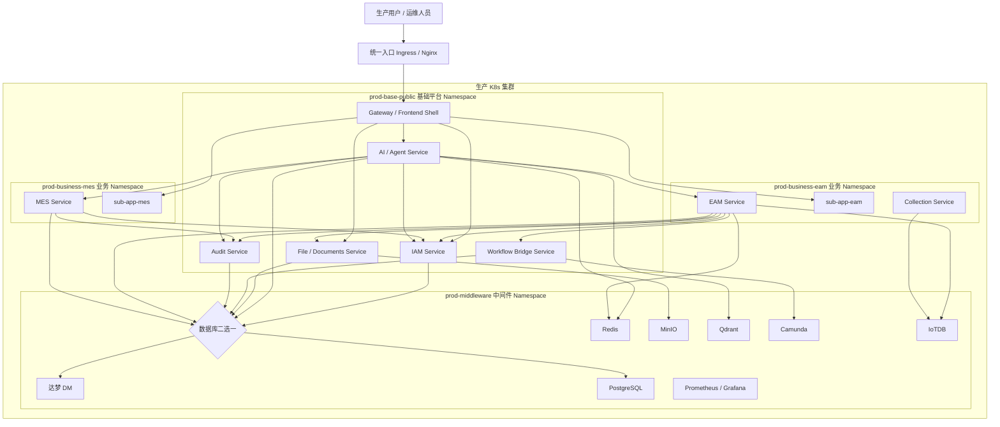
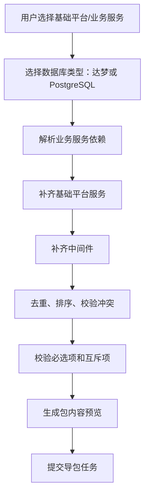
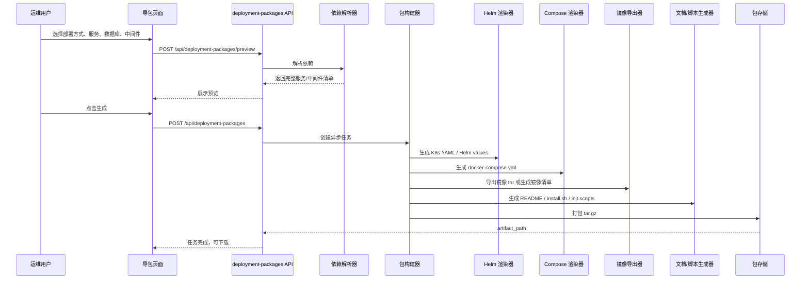
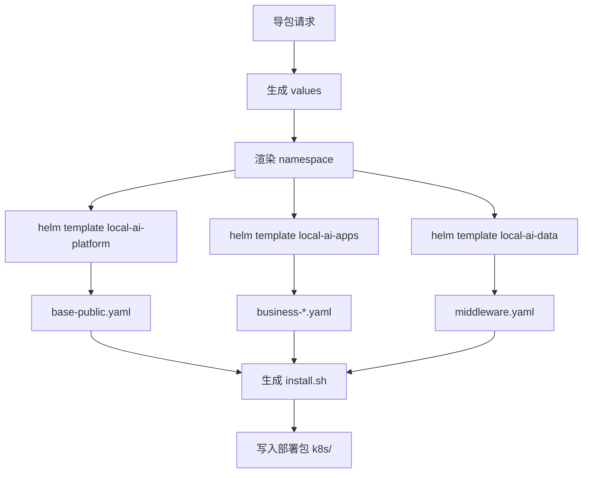
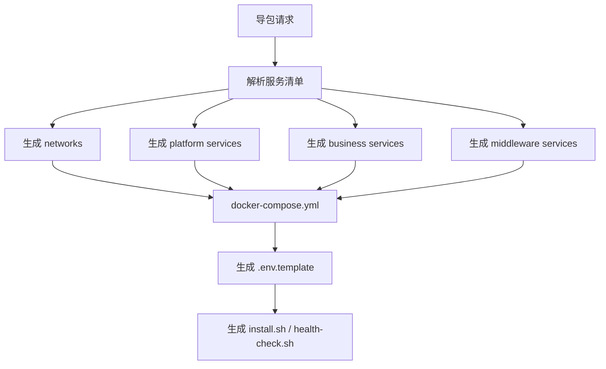
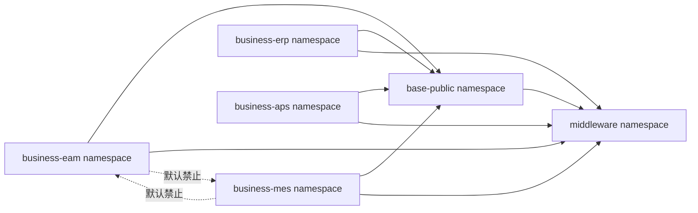
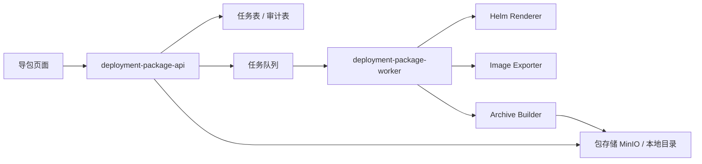

# 平台化环境隔离与生产部署包导出中心详细设计

版本：V1.0
日期：2026-06-27
适用项目：deployment-package-factory 独立仓库，面向 local-ai-assistant 及后续业务平台导包
目标形态：独立部署包工厂（独立 Git 仓库、独立 FastAPI 后端、独立 React 前端）+ 基础平台能力 + 核心业务产品 + 中间件服务，支持 dev/test 环境隔离，并一键导出 K8s / Docker Compose 生产部署包。


## 0. 架构决策更新：独立 Git 仓库

经实施确认，部署包工厂不作为 `local-ai-assistant` 当前业务前后端的内嵌模块交付，而是作为独立 Git 仓库交付：

```text
D:\project\work\li-yong\deployment-package-factory
```

独立仓库边界：

- `backend/`：独立 FastAPI API，负责能力目录、依赖预览、任务化导包、包下载。
- `frontend/`：独立 Vite + React 页面，负责项目选择、依赖预览、任务进度和下载。
- `templates/catalog/`：能力目录、项目模板、中间件和依赖规则。
- `data/`：运行时任务数据库和导包产物目录，默认不提交。

原文中出现的 `backend/app/...`、`frontend/src/views/ops/...`、`templates/...` 是早期“嵌入业务仓库”的路径草案；实际落地路径以本独立仓库为准：

```text
backend/deployment_package_factory/...
frontend/src/...
templates/catalog/...
```

当前业务仓库 `local-ai-assistant` 仅作为被导出的业务平台来源，不承载导包页面和导包 API。
## 1. 背景

当前项目已经具备基础的平台化雏形：

- 后端：`backend` 中已经包含 IAM、AI/Agent、File/Documents、Workflow/Camunda、Audit、EAM 等能力域。
- 前端：`frontend` 为统一基座，`sub-app-eam` 为 EAM 微前端子应用。
- 镜像：已有 `backend/Dockerfile`、`backend/Dockerfile.iam`、`backend/Dockerfile.eam`、`frontend/Dockerfile`、`sub-app-eam/Dockerfile` 等。
- 部署：已有 `infra/helm/local-ai-platform`、`infra/helm/local-ai-apps`、`infra/helm/local-ai-data`、`infra/helm/local-ai-edge` 等 Helm chart。

本次升级目标不是重写系统，而是在现有结构上补齐：

- 开发环境与测试环境隔离。
- 基础平台服务与业务平台服务隔离。
- 中间件按国产化/非国产化和业务依赖自动匹配。
- 通过页面一键生成生产部署包。

## 2. 建设目标

### 2.1 功能目标

导包页面支持用户选择：

- 部署方式：K8s、Docker Compose。
- 来源环境：开发环境、测试环境。
- 基础平台服务：IAM、AI/Agent、File/Documents、Workflow/Camunda、Audit、Gateway/Frontend Shell。
- 业务平台服务：EAM、MES、ERP、APS。
- 中间件服务：数据库必选二选一，国产化达梦或非国产化 PostgreSQL；其他中间件按选择自动匹配。
- 生产参数：域名、镜像仓库、namespace 前缀、StorageClass、密码模板、是否导出镜像 tar。

最终生成：

- K8s 部署包。
- Docker Compose 部署包。
- 镜像包，包含基础镜像、业务镜像、中间件镜像。
- 初始化脚本。
- 安装脚本、卸载脚本、健康检查脚本。
- 部署文档、升级文档、回滚文档。
- `manifest.json` 可审计清单。

### 2.2 非功能目标

- 环境隔离：dev/test/prod 配置、Secret、数据库、Redis、对象存储、namespace 独立。
- 分层隔离：基础平台、业务产品、中间件在运行时边界清晰。
- 安全可审计：导包任务全链路审计，Secret 只输出模板，不输出明文生产密码。
- 可离线交付：支持导出镜像 tar 与离线安装脚本。
- 可扩展：后续 MES、ERP、APS、更多国产化中间件可以通过能力目录扩展。

## 3. 总体生产架构图



## 4. 环境与 Namespace 设计

### 4.1 开发环境

```text
dev-base-public
dev-business-eam
dev-business-mes
dev-business-erp
dev-business-aps
dev-middleware
```

### 4.2 测试环境

```text
test-base-public
test-business-eam
test-business-mes
test-business-erp
test-business-aps
test-middleware
```

### 4.3 生产部署包默认目标

```text
prod-base-public
prod-business-eam
prod-business-mes
prod-business-erp
prod-business-aps
prod-middleware
```

### 4.4 Pod 标签规范

基础平台 Pod：

```yaml
labels:
  local-ai/env: dev
  local-ai/layer: platform
  local-ai/domain: iam
  local-ai/product: iam
```

业务 Pod：

```yaml
labels:
  local-ai/env: test
  local-ai/layer: business
  local-ai/domain: eam
  local-ai/product: eam
```

中间件 Pod：

```yaml
labels:
  local-ai/env: test
  local-ai/layer: middleware
  local-ai/domain: redis
  local-ai/product: redis
```

## 5. 服务拆分设计

### 5.1 基础平台服务

| 服务 | 当前映射 | 目标镜像 | 职责 |
| --- | --- | --- | --- |
| IAM | `backend/Dockerfile.iam` | `local-ai-iam-service` | 用户、组织、角色、权限、菜单、数据范围、登录认证 |
| AI / Agent | `backend/Dockerfile`，后续可拆 `Dockerfile.ai` | `local-ai-ai-agent-service` 或复用 `local-ai-backend` | Agent Graph、Subagent、MCP 工具、模型代理、工具鉴权 |
| File / Documents | `backend/Dockerfile`，后续可拆 `Dockerfile.file` | `local-ai-file-service` 或复用 `local-ai-backend` | 文件上传、附件、文档解析、对象存储代理、文档索引 |
| Workflow / Camunda | `backend/Dockerfile`，后续可拆 `Dockerfile.workflow` | `local-ai-workflow-service` 或复用 `local-ai-backend` | 流程定义、Camunda 桥接、审批流 |
| Audit | `backend/Dockerfile`，后续可拆 `Dockerfile.audit` | `local-ai-audit-service` 或复用 `local-ai-backend` | 操作审计、登录审计、Agent 工具审计、部署包审计 |
| Gateway / Frontend Shell | `frontend/Dockerfile` | `local-ai-frontend` | 统一入口、微前端基座、Nginx 网关 |

第一阶段可以继续复用 `local-ai-backend` 承载 AI/File/Workflow/Audit，避免拆得过早。第二阶段再按流量、职责和独立发布需求拆成独立镜像。

### 5.2 业务平台服务

| 服务 | 当前映射 | 目标镜像 | 职责 |
| --- | --- | --- | --- |
| EAM | `backend/Dockerfile.eam` + `sub-app-eam/Dockerfile` | `local-ai-eam-service`、`sub-app-eam` | 设备、维修、保养、点巡检、备件、采集 |
| MES | 后续新增 | `local-ai-mes-service`、`sub-app-mes` | 生产订单、工序、报工、质量、班组、产线 |
| ERP | 后续新增 | `local-ai-erp-service`、`sub-app-erp` | 物料、采购、供应商、库存/财务集成 |
| APS | 后续新增 | `local-ai-aps-service`、`sub-app-aps` | 排产、计划、产能、约束、优化 |

### 5.3 中间件服务

| 类型 | 必选/可选 | 说明 |
| --- | --- | --- |
| 达梦 DM | 数据库二选一 | 国产化数据库 |
| PostgreSQL | 数据库二选一 | 非国产化数据库 |
| Redis | 自动匹配 | 缓存、限流、任务状态、会话辅助 |
| MinIO | 自动匹配 | 文件、附件、文档、导出包存储 |
| Qdrant | 自动匹配 | RAG、语义检索、Agent 知识库 |
| Camunda | 自动匹配 | BPMN 流程引擎 |
| IoTDB | 自动匹配/可选 | EAM 采集时序数据 |
| Prometheus / Grafana | 可选 | 监控与可视化 |

## 6. 是否引入 Nacos

### 6.1 结论

第一阶段不建议强制引入 Nacos。

原因：

- K8s 已经提供 Service DNS，可满足服务发现。
- K8s ConfigMap/Secret + Helm values 可以满足部署时配置管理。
- 当前项目以 Python/FastAPI + 前端微应用为主，不是典型 Spring Cloud 体系。
- 引入 Nacos 会增加运行复杂度、初始化脚本、权限治理和运维成本。

### 6.2 当前推荐方案

```text
服务发现：K8s Service DNS
部署配置：Helm values + ConfigMap + Secret
动态开关：数据库配置表 / ops config_resource
导包配置：deployment package profile
```

### 6.3 预留扩展

后续如有大量 Java/Spring Cloud 服务，或需要集中动态配置推送，可增加配置中心适配层：

```python
class ConfigProvider:
    def get(self, key: str) -> str:
        raise NotImplementedError

class EnvConfigProvider(ConfigProvider):
    ...

class DatabaseConfigProvider(ConfigProvider):
    ...

class NacosConfigProvider(ConfigProvider):
    ...
```

## 7. 代码架构调整

### 7.1 后端新增模块

```text
backend/deployment_package_factory/api/deployment_packages.py

backend/deployment_package_factory/services/deployment_packages/
  __init__.py
  catalog.py
  dependency_resolver.py
  models.py
  builder.py
  helm_renderer.py
  compose_renderer.py
  image_exporter.py
  init_script_renderer.py
  docs_renderer.py
  archive.py
  task_repo.py
```

职责说明：

| 文件 | 职责 |
| --- | --- |
| `catalog.py` | 定义平台能力、业务能力、中间件能力目录 |
| `dependency_resolver.py` | 根据用户选择自动推导依赖 |
| `models.py` | 请求、响应、任务状态数据模型 |
| `builder.py` | 导包任务总编排 |
| `helm_renderer.py` | 生成 K8s YAML / Helm values |
| `compose_renderer.py` | 生成 Docker Compose 文件 |
| `image_exporter.py` | 导出镜像 tar 或生成镜像清单 |
| `init_script_renderer.py` | 生成初始化 SQL 和 shell 脚本 |
| `docs_renderer.py` | 生成 README 和安装文档 |
| `archive.py` | 打包 tar.gz |
| `task_repo.py` | 持久化导包任务状态 |

### 7.2 前端新增模块

```text
frontend/src/api/deploymentPackages.ts
frontend/src/views/DeploymentPackageExportView.tsx
```

新增菜单权限：

```text
platform.deploymentPackage.view
platform.deploymentPackage.create
platform.deploymentPackage.download
platform.deploymentPackage.delete
platform.deploymentPackage.imageExport
```

### 7.3 模板目录

```text
templates/
  catalog/
    platform.yaml
    business.yaml
    middleware.yaml
    dependency-rules.yaml

  k8s/
    values/
    scripts/
    docs/

  docker-compose/
    templates/
    scripts/
    docs/

  init/
    postgres/
    dm/
    minio/
    qdrant/
    camunda/
```

## 8. 能力目录设计

### 8.1 基础平台能力目录

```yaml
platform:
  iam:
    name: IAM
    required: true
    namespaceGroup: base-public
    images:
      - local-ai-iam-service
    middleware:
      - database
      - redis

  ai-agent:
    name: AI / Agent
    namespaceGroup: base-public
    images:
      - local-ai-backend
    dependsOn:
      - iam
      - audit
    middleware:
      - database
      - redis
      - qdrant

  file-documents:
    name: File / Documents
    namespaceGroup: base-public
    images:
      - local-ai-backend
    dependsOn:
      - iam
    middleware:
      - database
      - minio

  workflow-camunda:
    name: Workflow / Camunda
    namespaceGroup: base-public
    images:
      - local-ai-backend
    dependsOn:
      - iam
      - audit
    middleware:
      - database
      - camunda

  audit:
    name: Audit
    namespaceGroup: base-public
    images:
      - local-ai-backend
    middleware:
      - database

  gateway-frontend:
    name: Gateway / Frontend Shell
    required: true
    namespaceGroup: base-public
    images:
      - local-ai-frontend
```

### 8.2 业务能力目录

```yaml
business:
  eam:
    name: EAM
    namespaceGroup: business-eam
    profile: 4x60
    images:
      - local-ai-eam-service
      - sub-app-eam
      - local-ai-collection-service
    dependsOn:
      - iam
      - gateway-frontend
      - file-documents
      - workflow-camunda
      - audit
    middleware:
      - database
      - redis
      - minio
      - camunda
      - iotdb

  mes:
    name: MES
    namespaceGroup: business-mes
    profile: 4x3
    images:
      - local-ai-mes-service
      - sub-app-mes
    dependsOn:
      - iam
      - gateway-frontend
      - audit
    middleware:
      - database
      - redis

  erp:
    name: ERP
    namespaceGroup: business-erp
    images:
      - local-ai-erp-service
    dependsOn:
      - iam
      - gateway-frontend
      - audit
    middleware:
      - database
      - redis

  aps:
    name: APS
    namespaceGroup: business-aps
    images:
      - local-ai-aps-service
    dependsOn:
      - iam
      - gateway-frontend
      - audit
    middleware:
      - database
      - redis
```

### 8.3 数据库二选一

```yaml
databaseOptions:
  dm:
    name: 达梦 DM
    domestic: true
    image: dm8:latest
    initPath: init/dm

  postgres:
    name: PostgreSQL
    domestic: false
    image: postgres:16
    initPath: init/postgres
```

## 9. 依赖推导流程图



规则示例：

```text
选择 EAM
  -> IAM
  -> Gateway / Frontend Shell
  -> File / Documents
  -> Workflow / Camunda
  -> Audit
  -> Redis
  -> MinIO
  -> Camunda
  -> IoTDB

选择 MES
  -> IAM
  -> Gateway / Frontend Shell
  -> Audit
  -> Redis

选择 AI / Agent
  -> IAM
  -> Audit
  -> Redis
  -> Qdrant
```

## 10. 导包业务流程图



## 11. 页面原型图

### 11.1 页面整体

```text
┌──────────────────────────────────────────────────────────────────────────────┐
│ 部署包导出中心                                                               │
│ 从开发/测试环境选择平台能力、业务产品和中间件，生成生产部署包。              │
├──────────────────────────────────────────────────────────────────────────────┤
│ 来源环境                                                                     │
│  ( ) 开发环境 dev       (●) 测试环境 test                                    │
├──────────────────────────────────────────────────────────────────────────────┤
│ 部署方式                                                                     │
│  [✓] K8s 部署包       [✓] Docker Compose 部署包                              │
├──────────────────────────────────────────────────────────────────────────────┤
│ 基础平台服务 base-public-namespace                                           │
│  [✓] IAM                       [✓] Gateway / Frontend Shell                  │
│  [ ] AI / Agent                [ ] File / Documents                          │
│  [ ] Workflow / Camunda        [ ] Audit                                     │
├──────────────────────────────────────────────────────────────────────────────┤
│ 业务平台服务 business-namespace                                              │
│  [ ] EAM  规格：4x60          [ ] MES  规格：4x3                             │
│  [ ] ERP                      [ ] APS                                        │
├──────────────────────────────────────────────────────────────────────────────┤
│ 中间件服务                                                                   │
│  数据库，必选二选一：                                                        │
│  (●) 国产化：达梦 DM          ( ) 非国产化：PostgreSQL                       │
│                                                                              │
│  自动匹配中间件：                                                            │
│  [✓] Redis  [✓] MinIO  [✓] Qdrant  [✓] Camunda  [ ] IoTDB  [ ] 监控套件      │
├──────────────────────────────────────────────────────────────────────────────┤
│ 生产参数                                                                     │
│  生产域名：        [ prod.example.com                         ]              │
│  镜像仓库：        [ harbor.example.com/local-ai               ]              │
│  Namespace 前缀：  [ prod                                      ]              │
│  StorageClass：    [ nfs-client                                ]              │
│  镜像导出：        [✓] 导出镜像 tar   [ ] 仅生成镜像清单                     │
├──────────────────────────────────────────────────────────────────────────────┤
│ 包内容预览                                                                   │
│  平台服务：IAM、Gateway、AI-Agent、Audit                                     │
│  业务服务：EAM                                                               │
│  中间件：DM、Redis、MinIO、Qdrant、Camunda、IoTDB                            │
│  输出：K8s YAML、Docker Compose、初始化脚本、安装文档、镜像包                │
├──────────────────────────────────────────────────────────────────────────────┤
│ [生成部署包]  [保存模板]  [重置]                                             │
└──────────────────────────────────────────────────────────────────────────────┘
```

### 11.2 生成任务状态

```text
┌──────────────────────────────────────────────────────────────────────────────┐
│ 导包任务                                                                     │
├──────────────────────────────────────────────────────────────────────────────┤
│ 任务编号：pkg-20260627-001                                                   │
│ 状态：运行中                                                                 │
│ 进度：[██████████████████░░░░░░░░░░] 62%                                     │
│ 当前步骤：正在导出业务镜像 local-ai-eam-service:k8s                          │
├──────────────────────────────────────────────────────────────────────────────┤
│ 日志                                                                         │
│  10:01:03 创建任务                                                           │
│  10:01:04 解析依赖完成                                                       │
│  10:01:06 生成 K8s YAML 完成                                                  │
│  10:01:08 生成 Docker Compose 完成                                            │
│  10:01:12 正在导出镜像                                                       │
├──────────────────────────────────────────────────────────────────────────────┤
│ [取消任务]  [刷新]                                                           │
└──────────────────────────────────────────────────────────────────────────────┘
```

### 11.3 完成状态

```text
┌──────────────────────────────────────────────────────────────────────────────┐
│ 导包完成                                                                     │
├──────────────────────────────────────────────────────────────────────────────┤
│ 文件：local-ai-prod-package-20260627.tar.gz                                  │
│ 大小：8.4 GB                                                                 │
│ SHA256：a1b2c3...                                                            │
│ 包含：K8s、Docker Compose、镜像、初始化脚本、安装文档                        │
├──────────────────────────────────────────────────────────────────────────────┤
│ [下载部署包]  [查看 manifest.json]  [复制安装命令]                           │
└──────────────────────────────────────────────────────────────────────────────┘
```

## 12. API 设计

### 12.1 查询选项

```http
GET /api/deployment-packages/options
```

响应：

```json
{
  "sourceEnvs": ["dev", "test"],
  "deployModes": ["k8s", "docker-compose"],
  "platformServices": [],
  "businessServices": [],
  "databaseOptions": ["dm", "postgres"],
  "optionalMiddleware": ["redis", "minio", "qdrant", "camunda", "iotdb", "monitoring"]
}
```

### 12.2 预览依赖

```http
POST /api/deployment-packages/preview
```

请求：

```json
{
  "sourceEnv": "test",
  "deployModes": ["k8s", "docker-compose"],
  "platformServices": ["iam", "gateway-frontend", "ai-agent"],
  "businessServices": [{"name": "eam", "profile": "4x60"}],
  "database": {"type": "dm"}
}
```

响应：

```json
{
  "resolvedPlatformServices": ["iam", "gateway-frontend", "ai-agent", "audit", "file-documents", "workflow-camunda"],
  "resolvedBusinessServices": ["eam"],
  "resolvedMiddleware": ["dm", "redis", "minio", "qdrant", "camunda", "iotdb"],
  "images": {
    "platform": ["local-ai-iam-service:k8s", "local-ai-backend:k8s", "local-ai-frontend:k8s"],
    "business": ["local-ai-eam-service:k8s", "sub-app-eam:k8s", "local-ai-collection-service:k8s"],
    "middleware": ["dm8:latest", "redis:7", "minio/minio:latest", "qdrant/qdrant:latest", "camunda/camunda:latest"]
  },
  "warnings": []
}
```

### 12.3 创建导包任务

```http
POST /api/deployment-packages
```

请求：

```json
{
  "sourceEnv": "test",
  "deployModes": ["k8s", "docker-compose"],
  "baseNamespace": "base-public",
  "platformServices": ["iam", "ai-agent", "file-documents", "workflow-camunda", "audit", "gateway-frontend"],
  "businessServices": [{"name": "eam", "profile": "4x60"}],
  "database": {"type": "dm", "domestic": true},
  "targetProfile": {
    "env": "prod",
    "domain": "prod.example.com",
    "registry": "harbor.example.com/local-ai",
    "namespacePrefix": "prod",
    "storageClass": "nfs-client",
    "exportImages": true
  }
}
```

响应：

```json
{
  "id": "pkg-20260627-001",
  "status": "queued",
  "progress": 0,
  "message": "导包任务已创建"
}
```

### 12.4 查询任务

```http
GET /api/deployment-packages/{id}
```

### 12.5 下载包

```http
GET /api/deployment-packages/{id}/download
```

## 13. 数据模型

```text
deployment_package_tasks
  id
  source_env
  deploy_modes
  platform_services
  business_services
  database_type
  middleware
  target_profile
  status
  progress
  message
  artifact_path
  artifact_size
  artifact_sha256
  created_by
  created_at
  updated_at
  error
```

状态：

```text
queued
running
completed
failed
canceled
```

## 14. 生产部署包目录结构

```text
local-ai-prod-package-20260627/
  manifest.json
  README.md

  docs/
    install-k8s.md
    install-docker-compose.md
    config-reference.md
    middleware-reference.md
    init-guide.md
    upgrade.md
    rollback.md

  images/
    platform/
      local-ai-iam-service.tar
      local-ai-backend.tar
      local-ai-frontend.tar
    business/
      local-ai-eam-service.tar
      sub-app-eam.tar
      local-ai-collection-service.tar
    middleware/
      dm8.tar
      postgres.tar
      redis.tar
      minio.tar
      qdrant.tar
      camunda.tar
      iotdb.tar

  k8s/
    namespaces.yaml
    base-public.yaml
    business-eam.yaml
    business-mes.yaml
    middleware.yaml
    ingress.yaml
    networkpolicies.yaml
    secrets.template.yaml
    values-prod.yaml
    install.sh
    uninstall.sh
    health-check.sh

  docker-compose/
    docker-compose.yml
    .env.template
    install.sh
    uninstall.sh
    health-check.sh

  init/
    postgres/
      001_schema.sql
      002_iam_seed.sql
      003_permissions_seed.sql
      004_eam_seed.sql
    dm/
      001_schema.sql
      002_iam_seed.sql
      003_permissions_seed.sql
      004_eam_seed.sql
    minio/
      create-buckets.sh
    qdrant/
      create-collections.sh
    camunda/
      deploy-processes.sh
    iam/
      bootstrap-admin.sh

  scripts/
    load-images.sh
    push-images.sh
    check-prerequisites.sh
    render-config.sh
```

## 15. manifest.json

```json
{
  "packageId": "pkg-20260627-001",
  "createdAt": "2026-06-27T10:00:00Z",
  "sourceEnv": "test",
  "targetEnv": "prod",
  "deployModes": ["k8s", "docker-compose"],
  "database": "dm",
  "platformServices": ["iam", "ai-agent", "file-documents", "workflow-camunda", "audit", "gateway-frontend"],
  "businessServices": ["eam"],
  "middleware": ["dm", "redis", "minio", "qdrant", "camunda", "iotdb"],
  "images": {
    "platform": ["local-ai-iam-service:k8s", "local-ai-backend:k8s", "local-ai-frontend:k8s"],
    "business": ["local-ai-eam-service:k8s", "sub-app-eam:k8s", "local-ai-collection-service:k8s"],
    "middleware": ["dm8:latest", "redis:7", "minio/minio:latest", "qdrant/qdrant:latest"]
  },
  "artifact": {
    "file": "local-ai-prod-package-20260627.tar.gz",
    "sha256": "",
    "sizeBytes": 0
  }
}
```

## 16. K8s 生成流程



示例命令：

```bash
helm template base-public infra/helm/local-ai-platform \
  -f generated/values/base-public.yaml \
  --namespace prod-base-public > k8s/base-public.yaml

helm template business-eam infra/helm/local-ai-apps \
  -f generated/values/business-eam.yaml \
  --namespace prod-business-eam > k8s/business-eam.yaml

helm template middleware infra/helm/local-ai-data \
  -f generated/values/middleware.yaml \
  --namespace prod-middleware > k8s/middleware.yaml
```

## 17. Docker Compose 生成流程



网络：

```yaml
networks:
  base-public:
  business-eam:
  business-mes:
  middleware:
```

服务示例：

```yaml
services:
  iam-service:
    image: ${REGISTRY}/local-ai-iam-service:${IMAGE_TAG}
    networks:
      - base-public
      - middleware

  eam-service:
    image: ${REGISTRY}/local-ai-eam-service:${IMAGE_TAG}
    networks:
      - business-eam
      - base-public
      - middleware

  frontend:
    image: ${REGISTRY}/local-ai-frontend:${IMAGE_TAG}
    ports:
      - "${FRONTEND_PORT}:80"
    networks:
      - base-public
      - business-eam
```

## 18. 初始化脚本设计

### 18.1 数据库初始化

PostgreSQL：

```text
init/postgres/
  001_schema.sql
  002_iam_seed.sql
  003_permissions_seed.sql
  004_eam_seed.sql
```

达梦：

```text
init/dm/
  001_schema.sql
  002_iam_seed.sql
  003_permissions_seed.sql
  004_eam_seed.sql
```

### 18.2 MinIO 初始化

```bash
#!/usr/bin/env bash
set -euo pipefail

mc alias set local "http://${MINIO_ENDPOINT}" "${MINIO_ROOT_USER}" "${MINIO_ROOT_PASSWORD}"
mc mb local/documents || true
mc mb local/media-training || true
mc mb local/deployment-packages || true
```

### 18.3 Qdrant 初始化

```bash
#!/usr/bin/env bash
set -euo pipefail

curl -X PUT "http://${QDRANT_HOST}:6333/collections/local_documents" \
  -H "Content-Type: application/json" \
  -d '{"vectors":{"size":1024,"distance":"Cosine"}}'
```

### 18.4 Camunda 初始化

```bash
#!/usr/bin/env bash
set -euo pipefail

curl -X POST "http://${CAMUNDA_HOST}:8080/v1/deployments" \
  -F "files=@processes/eam-repair.bpmn"
```

## 19. 镜像导出设计

### 19.1 离线导出

```bash
docker pull harbor/local-ai/local-ai-backend:k8s
docker save harbor/local-ai/local-ai-backend:k8s -o images/platform/local-ai-backend.tar
```

### 19.2 离线加载

```bash
#!/usr/bin/env bash
set -euo pipefail

find images -name "*.tar" -print0 | while IFS= read -r -d '' image; do
  echo "Loading ${image}"
  docker load -i "${image}"
done
```

### 19.3 containerd 加载

```bash
ctr -n k8s.io images import images/platform/local-ai-backend.tar
```

## 20. 安全设计

- Secret 不导出明文生产值，只导出 `secrets.template.yaml` 和 `.env.template`。
- 导包任务必须鉴权。
- 镜像导出能力需要单独权限：`platform.deploymentPackage.imageExport`。
- 每次导包写审计：
  - 操作人。
  - 来源环境。
  - 选择服务。
  - 数据库类型。
  - 是否包含镜像。
  - 产物 SHA256。
  - 下载记录。
- 禁止从 test 包中携带真实测试用户密码、测试业务数据。

## 21. 网络隔离设计



策略：

- dev 与 test 默认互不可访问。
- business namespace 只能访问同环境 base-public 与 middleware。
- middleware 默认不接受非同环境 namespace 访问。
- 业务之间默认禁止，确需集成时通过 API 网关或事件总线白名单放开。

## 22. 监控与审计

导包中心需要暴露：

- 导包任务总数。
- 成功/失败次数。
- 平均耗时。
- 镜像导出耗时。
- 包大小分布。
- 最近失败原因。

审计事件：

```text
deployment_package.created
deployment_package.previewed
deployment_package.completed
deployment_package.failed
deployment_package.downloaded
deployment_package.deleted
```

## 23. 实施计划

### 阶段一：环境与 Helm 分层

交付：

- `dev/test/prod` values 目录。
- namespace、label 规范落地。
- base-public/business/middleware values 拆分。
- dev/test 数据库、Redis、MinIO、Qdrant 配置隔离。

验收：

- dev/test 可同时部署。
- dev/test 服务不可串访问。
- EAM 可在对应环境正常访问 IAM/File/Workflow。

### 阶段二：导包后端

交付：

- `deployment_packages` 后端模块。
- 能力目录。
- 依赖推导。
- 预览 API。
- 创建任务 API。
- K8s YAML 生成。
- Docker Compose 生成。
- tar.gz 打包。

验收：

- 可生成不含镜像的部署包。
- `manifest.json` 正确。
- `install.sh` 与文档存在。

### 阶段三：导包页面

交付：

- 部署方式选择。
- 基础平台服务选择。
- 业务平台服务选择。
- 数据库二选一。
- 中间件自动推导。
- 任务进度。
- 下载包。

验收：

- 页面选择 EAM 后自动补齐 IAM/Gateway/File/Workflow/Audit 和对应中间件。
- 权限不足用户不可创建导包任务。

### 阶段四：镜像与初始化脚本

交付：

- 镜像 tar 导出。
- `load-images.sh`。
- PostgreSQL/DM 初始化脚本。
- MinIO/Qdrant/Camunda 初始化脚本。
- 健康检查脚本。

验收：

- 离线机器可加载镜像。
- K8s 包可安装并通过健康检查。
- Docker Compose 包可启动并通过健康检查。

### 阶段五：国产化增强

交付：

- 达梦连接模板。
- 达梦初始化脚本。
- 达梦 SQL 方言差异处理。
- 达梦健康检查。
- 达梦备份恢复文档。

验收：

- 选择达梦时不生成 PostgreSQL 依赖。
- 选择 PostgreSQL 时不生成达梦依赖。

## 24. 验收标准

### 功能验收

- 支持 K8s 包导出。
- 支持 Docker Compose 包导出。
- 支持数据库达梦/PostgreSQL 二选一。
- 支持 EAM、MES、ERP、APS 业务产品选择。
- 支持基础平台服务选择与自动依赖补齐。
- 支持中间件自动推导。
- 支持镜像 tar 包导出。
- 支持部署文档和初始化脚本生成。

### 安全验收

- 导包操作有权限控制。
- 导包操作有审计记录。
- 生产 Secret 只生成模板。
- 不导出测试环境业务数据。

### 部署验收

- 生成的 K8s 包可以在空集群安装。
- 生成的 Docker Compose 包可以在单机启动。
- 安装后健康检查通过。
- 卸载脚本可清理资源。

## 25. 风险与应对

| 风险 | 影响 | 应对 |
| --- | --- | --- |
| 服务拆分过快 | 开发复杂度上升 | 第一阶段复用 `local-ai-backend`，后续再拆 AI/File/Workflow/Audit |
| Secret 泄露 | 安全事故 | 只导出模板，不导出真实密钥 |
| DM 与 PostgreSQL 方言差异 | 初始化失败 | 初始化 SQL 分目录维护 |
| 镜像包过大 | 导出耗时长 | 支持仅导出镜像清单，或按服务分批导出 |
| 环境串访问 | 数据污染 | NetworkPolicy + namespace + 独立数据库 |
| 依赖推导错误 | 包缺组件 | 能力目录单测 + 预览确认 |

## 26. Worker 架构与任务执行安全

导包任务不应由普通 FastAPI Web 进程直接执行。尤其是镜像导出、Helm 渲染、tar.gz 打包、SHA256 计算等动作耗时长且 I/O 密集，若直接在 API 进程中执行，会导致接口阻塞、进程内存膨胀、超时和权限边界混乱。

推荐拆分：

```text
deployment-package-api
  职责：任务创建、预览、查询、取消、下载、权限校验、审计记录

deployment-package-worker
  职责：依赖推导、Helm 渲染、Compose 渲染、镜像导出、脚本生成、文档生成、归档打包
```



任务执行建议：

- API 进程禁止挂载 Docker socket。
- Worker 可以单独部署在受控节点上，必要时通过 `nodeSelector`、`taints/tolerations` 限制调度。
- Worker 设置并发上限，例如同一时间最多 1 到 2 个完整镜像导出任务。
- 大文件生成路径独立挂载 PVC，例如 `/data/deployment-packages`。
- 所有命令执行必须使用白名单参数，不允许拼接用户输入形成 shell 命令。

Worker 状态机：

```text
queued
running
rendering
exporting_images
generating_docs
archiving
completed
failed
canceled
```

## 27. 镜像导出模式

导包页面不应只提供一种“完整导出镜像 tar”的模式。建议提供三种模式：

```text
仅生成配置与镜像清单
  适合已有生产 Harbor 的场景。

导出完整离线镜像包
  适合离线交付、内网部署、无外网生产现场。

推送到目标镜像仓库
  适合可以连通目标 Harbor/Registry 的场景。
```

页面字段：

```text
镜像处理方式：
  ( ) 仅生成镜像清单
  ( ) 导出完整离线镜像包
  ( ) 推送到目标镜像仓库

目标镜像仓库：
  harbor.example.com/local-ai
```

`manifest.json` 中记录：

```json
{
  "imageMode": "tar",
  "registry": "harbor.example.com/local-ai",
  "images": [
    {
      "name": "local-ai-backend",
      "tag": "k8s",
      "digest": "sha256:...",
      "tar": "images/platform/local-ai-backend.tar",
      "sha256": "..."
    }
  ]
}
```

## 28. 部署包版本与兼容性矩阵

部署包必须自带版本元数据，避免生产现场无法判断包、数据库脚本、Helm chart、镜像版本是否匹配。

`manifest.json` 建议增加：

```json
{
  "packageSchemaVersion": "1.0",
  "appVersion": "V18.12",
  "gitCommit": "84e2ef3a",
  "chartVersion": "1.0.0",
  "databaseSchemaVersion": "20260627",
  "compatibleKubernetes": ">=1.26",
  "compatibleDockerCompose": ">=2.20",
  "databaseDialect": "dm",
  "generatedBy": {
    "service": "deployment-package-worker",
    "version": "1.0.0"
  }
}
```

兼容性文档：

```text
docs/compatibility-matrix.md
  K8s 版本
  Docker Compose 版本
  数据库版本
  Redis 版本
  MinIO 版本
  Qdrant 版本
  Camunda 版本
  浏览器版本
```

## 29. 初始化脚本幂等规范

初始化脚本必须可重复执行。生产现场常见场景是安装中断后再次执行，或初始化某个步骤失败后重试。如果脚本非幂等，会导致二次安装更难恢复。

要求：

- 建库、建 schema、建表使用 `IF NOT EXISTS` 或等效逻辑。
- 初始化角色、菜单、权限时使用 upsert。
- 默认管理员存在则更新策略，不重复插入。
- MinIO bucket 存在则跳过。
- Qdrant collection 存在则校验向量维度，不直接覆盖。
- Camunda 流程按 key + version/tag 部署，不重复污染。
- 所有脚本支持 `--dry-run`，输出即将执行的动作。

示例：

```bash
#!/usr/bin/env bash
set -euo pipefail

if mc ls local/documents >/dev/null 2>&1; then
  echo "Bucket documents already exists, skip."
else
  mc mb local/documents
fi
```

数据库脚本目录建议增加：

```text
init/
  postgres/
    schema/
    seed/
    migration/
  dm/
    schema/
    seed/
    migration/
```

## 30. Secret 模板与安装前检查

导包不能输出真实生产 Secret。建议输出三类文件：

```text
secrets.template.yaml
  必填项模板，包含占位符。

secrets.example.yaml
  示例假值，只用于说明格式。

secret-check.sh
  安装前检查脚本，确保占位符已替换。
```

必须检查：

```text
DATABASE_PASSWORD
REDIS_PASSWORD
MINIO_ROOT_PASSWORD
JWT_SECRET
DEFAULT_ADMIN_PASSWORD
OPENAI_API_KEY / 模型供应商 Key
CAMUNDA_CLIENT_SECRET
QDRANT_API_KEY
```

检查逻辑：

```bash
if grep -R "__REPLACE_WITH_" k8s/secrets.yaml docker-compose/.env >/dev/null; then
  echo "Secret placeholders are not replaced."
  exit 1
fi
```

## 31. 自动依赖锁定原因

页面自动勾选服务和中间件时，必须展示“为什么被选中”。否则用户看到某些选项无法取消时，会误以为页面不可控。

示例：

```text
Redis
  已锁定
  原因：IAM、AI / Agent、EAM 依赖 Redis。

MinIO
  已锁定
  原因：File / Documents、EAM 附件依赖 MinIO。

Camunda
  已锁定
  原因：Workflow / Camunda、EAM 流程依赖 Camunda。

Qdrant
  已锁定
  原因：AI / Agent 语义检索依赖 Qdrant。
```

预览 API 响应增加：

```json
{
  "resolvedMiddleware": [
    {
      "key": "redis",
      "locked": true,
      "requiredBy": ["iam", "ai-agent", "eam"],
      "reason": "IAM、AI / Agent、EAM 依赖 Redis"
    }
  ]
}
```

## 32. 包完整性与供应链安全

部署包必须能被校验，至少生成：

```text
SHA256SUMS
image-digest-lock.json
artifact-manifest.json
```

推荐目录：

```text
security/
  SHA256SUMS
  image-digest-lock.json
  sbom.spdx.json
  vulnerability-scan-summary.json
```

第一阶段至少实现：

- 每个镜像 tar 的 sha256。
- 每个部署 YAML 的 sha256。
- 最终 tar.gz 的 sha256。
- 镜像 digest 锁定文件。

后续增强：

- SBOM 生成。
- Cosign 镜像签名。
- 部署包签名。
- 漏洞扫描报告。

## 33. Helm 多 Namespace 发布策略

当前生产包需要同时生成：

```text
prod-base-public
prod-business-eam
prod-business-mes
prod-middleware
```

现有 Helm chart 可能默认一个 release 只安装到一个 namespace，因此必须明确发布策略。

推荐第一阶段采用：

```text
helm template -> 纯 YAML -> kubectl apply
```

优点：

- 多 namespace 更容易控制。
- 离线现场无需 Helm release 状态。
- 生成包可读性强。
- 便于安装脚本统一执行。

第二阶段再支持：

```text
每个 namespace 一个 Helm release
  local-ai-platform -n prod-base-public
  local-ai-eam -n prod-business-eam
  local-ai-data -n prod-middleware
```

安装脚本结构：

```bash
kubectl apply -f k8s/namespaces.yaml
kubectl apply -f k8s/middleware.yaml
kubectl apply -f k8s/base-public.yaml
kubectl apply -f k8s/business-eam.yaml
kubectl apply -f k8s/ingress.yaml
kubectl apply -f k8s/networkpolicies.yaml
```

## 34. 预检、干运行与安装可恢复性

建议部署包增加生产安装预检和 dry-run 能力。

预检内容：

```text
K8s 版本是否满足。
Docker / Docker Compose 版本是否满足。
kubectl 是否可访问目标集群。
StorageClass 是否存在。
IngressClass 是否存在。
目标 namespace 是否已存在。
节点 CPU/内存是否满足所选规格。
镜像是否已加载或可拉取。
Secret 是否已替换占位符。
端口是否冲突。
```

脚本：

```text
scripts/check-prerequisites.sh
k8s/dry-run.sh
docker-compose/dry-run.sh
```

K8s dry-run：

```bash
kubectl apply --dry-run=server -f k8s/
```

Docker Compose dry-run：

```bash
docker compose --env-file .env config
```

可恢复性要求：

- 每一步安装脚本都可以重复执行。
- 安装失败时输出失败步骤和恢复建议。
- 支持从已生成的 `manifest.json` 继续安装。
- 导包 Worker 任务失败后支持重试，而不是重新从零开始。

## 35. 包存储、保留与清理策略

导出的生产包通常很大，需要保留策略。

建议配置：

```text
DEPLOYMENT_PACKAGE_DIR=/data/deployment-packages
DEPLOYMENT_PACKAGE_RETENTION_DAYS=30
DEPLOYMENT_PACKAGE_MAX_TOTAL_GB=500
DEPLOYMENT_PACKAGE_CLEANUP_INTERVAL_HOURS=24
```

清理规则：

- 默认保留最近 30 天。
- 已标记收藏/归档的包不自动删除。
- 删除包之前保留任务元数据和审计记录。
- 删除包时同时删除临时工作目录。

任务临时目录：

```text
/data/deployment-packages/work/pkg-xxx
/data/deployment-packages/artifacts/pkg-xxx.tar.gz
```

## 36. 多架构镜像与资源规格模板

生产现场可能存在 `amd64`、`arm64` 或国产 CPU 架构。导包页面需要预留架构选项：

```text
目标架构：
  (●) linux/amd64
  ( ) linux/arm64
  ( ) 多架构
```

`manifest.json` 记录：

```json
{
  "targetPlatforms": ["linux/amd64"],
  "resourceProfile": "medium"
}
```

资源规格模板：

```text
small
  适合演示和小规模测试。

medium
  适合普通生产。

large
  适合 EAM 4x60、MES 4x3 等较大规模业务。

custom
  用户手动调整 replicas、requests、limits。
```

示例：

```yaml
profiles:
  eam-4x60:
    replicas:
      eamService: 2
      collectionService: 2
    resources:
      eamService:
        requests:
          cpu: 500m
          memory: 1Gi
        limits:
          cpu: "2"
          memory: 2Gi
```

## 37. 升级、回滚与备份策略

生产部署包不仅要支持首次安装，还应支持升级和回滚。

包内增加：

```text
docs/upgrade.md
docs/rollback.md
scripts/backup-before-upgrade.sh
scripts/rollback.sh
```

升级前备份：

- 数据库 schema 版本。
- 数据库数据备份。
- MinIO bucket 关键对象清单。
- 当前 K8s YAML 快照。
- 当前镜像 tag 和 digest。

回滚策略：

```text
应用回滚：回滚 Deployment 镜像 tag。
配置回滚：恢复上一版 ConfigMap/Secret。
数据库回滚：优先前向修复，必要时按备份恢复。
流程回滚：Camunda 新旧流程版本并存，按流程 key/version 控制。
```

## 38. 测试矩阵与质量门禁

导包能力本质上是生产交付工具，必须建立独立测试矩阵。

### 38.1 单元测试

```text
dependency_resolver
  选择 EAM 自动补齐 IAM/Gateway/File/Workflow/Audit。
  选择 AI/Agent 自动补齐 Qdrant/Redis/Audit。
  数据库达梦/PostgreSQL 二选一互斥。
  已锁定依赖不可被用户取消。

catalog
  能力目录 key 唯一。
  每个业务服务必须声明 namespaceGroup。
  每个镜像必须有 image name 和 tag 规则。
```

### 38.2 渲染测试

```text
K8s
  helm template 可以成功。
  kubeconform/kubeval 校验通过。
  NetworkPolicy、Namespace、Service、Deployment、Ingress 都存在。

Docker Compose
  docker compose config 校验通过。
  networks、volumes、depends_on、healthcheck 存在。
```

### 38.3 脚本测试

```text
install.sh
  支持重复执行。
  Secret 未替换时失败。
  dry-run 可执行。

load-images.sh
  镜像 tar 不存在时给出明确错误。
  重复加载不失败。

health-check.sh
  服务未就绪时输出具体失败服务。
```

### 38.4 集成测试

```text
最小包
  IAM + Gateway + PostgreSQL + Redis

EAM 包
  IAM + Gateway + File + Workflow + Audit + EAM + PostgreSQL + Redis + MinIO + Camunda + IoTDB

国产化包
  IAM + Gateway + EAM + 达梦 + Redis + MinIO

完整包
  基础平台全选 + EAM + MES + 中间件全选
```

质量门禁：

```text
生成包必须包含 manifest.json。
生成包必须包含 README.md。
生成包必须包含 SHA256SUMS。
K8s 模式必须通过 YAML 校验。
Compose 模式必须通过 docker compose config。
初始化脚本必须通过 shellcheck。
```

## 39. 异常处理与用户反馈

导包页面和 Worker 需要明确异常分类，让用户知道如何恢复。

### 39.1 异常分类

```text
配置异常
  例如未选择数据库、业务依赖冲突、生产参数缺失。

渲染异常
  例如 Helm values 不合法、模板变量缺失。

镜像异常
  例如镜像不存在、拉取失败、docker save 失败、磁盘空间不足。

脚本异常
  例如初始化脚本生成失败、Secret 模板缺失。

存储异常
  例如 MinIO 上传失败、PVC 空间不足、归档失败。

权限异常
  例如用户没有导包权限或镜像导出权限。
```

### 39.2 页面反馈

任务失败时展示：

```text
失败阶段
失败原因
可恢复建议
是否可重试
日志下载
```

示例：

```json
{
  "status": "failed",
  "failedPhase": "exporting_images",
  "message": "镜像 local-ai-eam-service:k8s 不存在",
  "suggestion": "请先完成业务镜像构建并推送到来源镜像仓库，或切换为仅生成镜像清单模式。",
  "retryable": true
}
```

### 39.3 可重试策略

```text
依赖推导失败：不可重试，需修改选择。
Helm 渲染失败：通常不可重试，需修模板或 values。
镜像拉取失败：可重试。
镜像导出失败：可重试。
包上传失败：可重试。
用户取消：不可自动重试。
```

## 40. 进一步优化建议

本次补充后，设计已经可以进入评审和任务拆解。仍建议后续持续优化以下方向：

1. 将导包能力做成可配置模板，而不是硬编码 EAM/MES 规则。
2. 为能力目录增加单元测试，确保新增业务不会破坏依赖推导。
3. 为 Helm 渲染结果增加 kubeconform/kubeval 校验。
4. 为 Docker Compose 结果增加 `docker compose config` 校验。
5. 为安装脚本增加 shellcheck。
6. 为离线包增加最小化模式，只导出被选择业务真正需要的镜像。
7. 为大镜像导出增加进度统计和取消能力。
8. 为导包页面增加“保存为模板”，便于重复生成同类项目包。
9. 增加“导包前环境快照”，记录来源环境当前服务版本、镜像 tag、配置 hash。
10. 增加“生产参数校验”，提前发现域名、namespace、StorageClass、数据库类型冲突。

## 41. 架构改进记录（2026-09-07）

### 41.1 模块化重构

为提升代码可维护性和可测试性，对核心构建模块进行了模块化拆分：

#### 新增模块

1. **image_manager.py** - 镜像导出管理
   - 统一管理 Docker/skopeo/containerd 三种镜像导出方式
   - 提供 `export_images_with_runner()` 和 `check_image_export_environment()` 接口
   - 支持镜像预检、并发导出、SHA256 校验
   - 独立测试覆盖（`tests/test_image_manager.py`）

2. **errors.py** - 统一错误处理
   - 定义 `PackageBuildError` 和 `ImageExportError` 异常类型
   - 提供 `handle_build_error()` 上下文管理器，自动包装错误信息
   - 统一日志和任务状态更新机制
   - 独立测试覆盖（`tests/test_errors.py`）

#### 重构收益

- **builder.py 代码量减少**：从 2000+ 行减少到 1800+ 行
- **职责单一化**：每个模块专注一个领域
- **可测试性提升**：新模块均有独立单元测试
- **复用性增强**：image_manager 可被其他模块直接调用
- **错误追踪优化**：统一的错误上下文和日志格式

#### 向后兼容

- builder.py 保留了原有的公开接口
- 测试套件全部通过（193 个测试）
- API 行为无变化

### 41.2 技术债务清理状态

已完成：
- ✅ 镜像导出逻辑提取到 image_manager.py
- ✅ 错误处理统一到 errors.py
- ✅ 单元测试覆盖新模块
- ✅ 文档更新（services/deployment_packages/README.md）

待后续优化：
- 🔄 继续拆分 builder.py 中的渲染编排逻辑
- 🔄 提取 Kubernetes 运行时探测逻辑
- 🔄 统一配置管理和环境变量处理

### 41.3 测试覆盖

当前测试统计：
- 总测试数：193 个
- 通过率：100%
- 新增测试：
  - `test_image_manager.py`（6 个测试）
  - `test_errors.py`（3 个测试）

## 42. 总结

本方案将当前项目升级为”能力目录驱动的部署包工厂”：

```text
用户在页面选择部署方式、基础能力、业务产品和数据库类型
  -> 系统自动推导依赖
  -> 生成 K8s / Docker Compose 配置
  -> 导出镜像、初始化脚本和安装文档
  -> 打成可生产交付的部署包
```

最新架构改进（2026-09-07）进一步提升了代码质量：
- 模块化设计降低维护成本
- 统一错误处理提升可观测性
- 完整测试覆盖保障系统稳定性

第一阶段应优先完成环境隔离和导包配置生成，不建议一开始引入 Nacos，也不建议立即把所有平台业务能力拆成多个业务仓库。部署包工厂自身已独立成仓，后续再逐步服务细拆和国产化增强。
